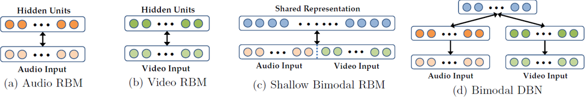

## 多模态学习

[原文连接](https://blog.csdn.net/zhuoqingjoking97298/article/details/122700949)

### 研究背景

多模态学习，就是利用多种模态信息进行机器学习。所谓模态，就是事物发展的方式。
进一步解释，模态是指某种类型的信息，或者信息的表示。
一般人们也下意识将其与我们多渠道的感官（视觉、触觉等）联系起来[1]。
人们通过视觉、触觉、听觉、嗅觉等多种感官认识这个世界，不同的感官可以从不同的侧面去反映同一个事物的内在属性。
这里的“视觉信息、听觉信息、触觉信息”都属于一种模态，人脑可以同时捕捉多种模态的信息并进行加工整合，以完成认知和执行任务。

早期对大脑皮层及其在感知中的作用的研究显示，来自不同感觉方式的信息的汇聚和整合是认知的重要组成部分[2]。
更加值得注意的是，多感觉整合并不都是传统观念中所设想的那样，在“单感觉”处理之后发生。
Ghazanfar 和 Schroeder指出大脑皮层的同一区域似乎可以同时处理多种感官信息[3]。
文中提到猫的视觉皮层能够接受听觉信息，猫的上丘脑能够接受视觉、听觉和触觉信息。

上述生物学的研究发现对人工神经网络的研究具有一定启示：同一个神经网络，是否可以同时很好地处理多种模态信息？
是否可以利用一种模态的信息辅助另一种模态学习？在学习过程当中，如果训练和预测的全阶段多种模态信息都是可用的，则称之为多模态融合；
如果监督学习和预测时只有部分模态可以使用，则称为跨模态学习任务[4]。
多模态和跨模态都是基于多种模态的学习，多数情况下也都是利用多模态的优势提高模型的预测性能，而且在训练时采用的网络和方法也有许多相似之处，因而学者经常同时研究两者。
但是由于场景不同，它们也存在着一定的差异。

### 应用场景

那么，多模态学习的模态来源于哪里，在什么场景之下需要涉及到多种模态的学习呢？通过各种传感器和多媒体，可以得到触觉、视觉、听觉信息，还有文本文字信息。
此外，激光雷达、医疗影像也能够提供一些不同的模态。多种模态的交叉组合带来了多重任务。

人类行为、多媒体信息领域当中，视听语音识别 (ASVR) 是最早的多模态任务之一[8]，受到了McGurk 效应——一种接收讲话信息时听觉与视觉的交互作用——的启发。
当人们听到/ba-ba/并且看到一个说着/ga-ga/的人发言时，他们会将自己听到的/ba-ba/声解读成/da-da/[9]。
早期研究ASVR的目的在于使用视觉模态提高语音识别的准确率，但结果表明视觉模态只有在声音有噪声时才能提高识别效果，换言之，只提升了模型鲁棒性。
另一个任务是多媒体信息索引和检索，通过加入文字以外的模态信息可以提高索引的性能。
第三种多模态任务是对人的社交行为、情绪的识别。SEMAINE语料库为研究讲话者和听话者的人际动态提供了帮助[10]，也是2011年第一场视听情感挑战 (AVEC) 的基础[11]。
近期，媒体描述成为了一个新的挑战，给定一个媒体（视频、图片等），需要产生一段文字对齐进行描述。同时，通过文字生成各种媒体的研究也有所进展[12]，[13]。

医疗也是多模态任务的应用领域。比如医学成像就包含了MRI（核磁共振）、CT（计算机化X线体层照相术）、PET（正电子成像术）、fMRI（功能性核磁共振）、X光、超声波等模态数据。
传统上人们使用人工特征由专家进行解读，但是这些特征设计并非易事。越来越多的研究者尝试使用机器学习的方法处理这些多模态数据[6]。
多模态数据任务还有一个重要的应用领域是自动化系统，包括机器人、自动驾驶等。
通过多种传感器（红外摄像机、激光雷达、全球位置测定系统）收集到的异构数据用于训练并完成一系列复杂任务，包括定位和绘图，场景理解，运动规划，以及驾驶员状态识别[6]。

### 研究进展

#### 早期阶段

早期的研究主要专注在多模态融合，包括数据融合以及决策融合。
所谓数据融合，就是人工利用多模态信息构建新的特征。由于不同模态信息的速率不同，需要进行一些预处理。
比如同一时间内声音和视频的帧数不一致，就需要人为地进行同步[5]。
除了人工提取特征，融合算法也主要是人为的融合（比如线性加总等） 以及传统的机器学习算法（SVM，贝叶斯推断、最大熵模型），还有滤波。
隐马尔可夫模型被广泛地使用并产生了较好的效果。

#### 引入早期深度网络

随着深度学习的发展，人们开始利用深度神经网络到多模态任务当中。
神经网络可以自动地从底层特征中提取高层语义表示。随之模态的表示、协同学习也成为了研究的热点。
在早期，卷积神经网络、深层全连接神经网络以及序列模型还没有大行其道，人们主要使用的是受限玻尔兹曼机、深度信念网络、自编码器等。
Ngiam等人的文章“Multimodal deep learning”[4]和Srivastava等人的“Multimodal learning with deep Boltzmann machines”[14]是早期有代表性的研究工作。

Ngiam等人较早地开始使用DNN进行多模态融合和协同学习[4]。
他们没有人工地提取音素、嘴型特征，而是使用隐层作为模态的表示。
在文章中，他们使用受限玻尔兹曼机、深度信念网络和深度自编码器进行建模，通过其隐层作为共享的语义表示，并以此为特征使用SVM进行监督学习。
在他们的文章中，同时研究了多模态融合、跨模态学习、共享表示学习。
他们主要研究了听觉和视觉模态，并且发现，就语音识别而言，在预训练阶段引入听觉信息可以帮助视觉语言识别提高准确率；
引入视觉信息可以提高听觉语音识别的鲁棒性，但是可能会降低准确率，就如同McGurk 效应当中看到了某些视觉信息会导致听错声音。
他们利用双模态深度自编码器进行模态融合时发现模型中出现了McGurk 效应，而双模态深度信念网络和浅层双模态RBM网络则没有这个效果。
这从某种程度上说名，双模态深度自编码器就如同人脑一样融合了视觉和听觉模态。

图3：深层自动编码器模型。(a)中显示了一个只包含视频的模型，通过视频输入重构出视频与音频。
同时也可以训练一个类似的“音频”模型。(b)是用降噪的方式训练的双模态深度自编码器，使用一个增强的数据集，其中的示例要求网络仅给出一个模型来重建两种模式。
这些模型都经过了系数RBM的预训练（图2）。由于在深度网络中使用了一个sigmoid传递函数，可以使用学习到的RBM的条件概率分布p(h|v)和p(v|h)来初始化网络[4]。

Srivastava等人则使用多模态深度玻尔兹曼机对图像与文本数据建立生成模型。
生成模型可以表示出两个模态的共作用语义表示，该表示可以较好地用于后续的监督学习。
同时作为生产模型，该模型也可以基于一种模态补全另一种模态的数据，并且在随后的分类任务中，预测效果由于另一个模态得到了一定程度的恢复，相较于模态完整时也没有大幅度下降。

图4：多模态受限玻尔兹曼机的结构。左边网络层是图像，右边是文本，中间网络层作为共作用语义表示。

图5：使用不同层作为分类器输入的预测精确度，可以发现居于中间的共作用语义表示的效果最好。

#### 对多模态任务总结分类

对多模态学习的研究越来越多，T. Baltrušaitis等人通过文献调研总结了多模态任务的分类，他们将其分为分为5种任务：表示、翻译、对齐、融合、协同学习[1]。
模态表示研究如何在不同模态数据存在异质性的情况下最好地利用其共性和特性；翻译任务将一种模态转化为另一种模态；
对齐是寻找不同模态元素之间的直接联系，比如，将菜谱中的每个步骤与一个展示该菜制作过程的视频对齐；
融合就是将多模态数据融合起来进行预测；协同学习则是在不同模态、模态的表示预测模型之间传递知识。

|应用场合|表示|翻译|对齐|融合|协同学习|
|:---|---|---|---|---|---:|
|语音识别| | | | | |
|视听语音识别|√	| 	|√	|√	|√|
|事件监测|	 	| 	| 	| 	| |
|动作分类|√	| 	| 	|√	|√|
|多媒体事件监测|√	| 	| 	|√	|√|
|情感 情绪| 	| 	| 	| 	| |
|情感 情绪识别|√	| 	|√	|√	|√|
|情感 情绪合成|√	|√	| 	| 	| |
|媒体描述| 	| 	 	 	| |
|图像描述|√	|√	|√	| 	|√|
|视频描述|√	|√	|√	|√	|√|
|视觉问答|√	| 	|√	|√	|√|
|媒体总结|√	|√	| 	|√	| |
|多媒体检索| 	| 	| 	| 	| |
|跨模态检索|√|	√	|√	| 	|√|
|跨模态哈希|√	| 	| 	| 	|√|
|多媒体生成| | 	| 	| 	| |
|(视觉)语音和声音合成|√	|√	| 	| 	| |
|图像和场景生成|√	|√	| 	| 	| |

#### 模态的表示

模态的表示分为共作用语义表示和协同特征表示。工作用语义表示指融合各单模态的特征表示，以获得包含各模态语义信息的表示。协同特征表示是为每个模态学习单独的特征提取模型，通过一个约束来协同不同的模态，更适合于在测试时只有一种模态数据的任务。基于相似性的方法（例如，余弦距离）； 结构约束（例如，正交性、稀疏性）。

图6：模态共作用语义表示与协同表示。共作用语义表示将多模态投影到共同的空间，而协同表示的模态仍然保持在自己的空间中，但是通过相似性或者结构约束进行协同。

#### 模态翻译

早期在语音合成[15]、视觉语言生产[16]、视频描述[17]、跨模态检索[18]方面产生了大量模态翻译的研究。
近年来计算机视觉和自然语言处理技术的发展推动了模态翻译的研究。
[1]将模态翻译任务分为了基于例子的翻译以及生成式翻译。前者在翻译时使用给定的字典协助翻译，而后者则需要自主生成序列。

图7：基于例子的翻译（左）与生成式翻译（右）

#### 模态对齐

模态对齐从来自同一个实例的两个甚至多个模态中寻找子成份之间的关系和联系。对齐分为显式对齐和隐式对齐，显式对齐任务直接关注两个模态的对齐，而隐式对齐则是其它任务的中间步骤。例如，在图像检索时可以通过输入的文字描述将文字与图片区域对齐。

#### 模态融合

在任何机器学习任务当中，数据都具有多种特征。将多种模态的特征进行简单处理之后就可以进行机器学习。
既然如此，为什么需要研究多模态数据的机器学习和深度学习呢？这是因为，修改多模态数据融合的方式可以帮助模型更好地利用这些模态的信息，大幅度提高模型的准确率。
在P. K. Atrey 等人2010年的综述[5]当中，他们将模态融合的层级划分为早期融合（数据融合）、晚期融合（决策融合），以及两者兼具的混合融合。
随着深度学习的兴起，神经网络可以进行特征的自动提取，利用网络的中间隐层对不同模态的特征进行融合，也具有了可行性。这种融合方式有别于在数据层面和决策层面的融合，因而被称为中期融合。

图4：不同融合模型的图示[6]。(a) 是早期融合，(b) 是晚期融合，© 是中期融合

#### 协同学习

协同学习是指利用其它模型的知识帮助模型训练，尤其是在待训练模型缺少训练数据时。
协同学习可以分为并行、非并行和混合型。并行方法需要一种模态与另一种模态的每个观测都一对一联系，比如视听语言识别中视觉和听觉信息都来源于一个演讲者。
反之，非并行方法不需要，它们一般通过类别重叠实现学习。混合方法中多模态通过共享的模态或者数据集连接。

图5：协同训练的方法 (a)并行 (b) 非并行 © 混合

近年来，随着深度学习在计算机视觉、NLP中的发展，越来越多的概念和模型得到发展。一方面，单模态表示有了极大改进，而单模态可以作为多模态学习的基石，相应地有助于多模态学习的改进。何晓冬等人于2020年的文献综述中，对单模态领域表征进行了梳理，包括AlexNet、VGG、ResNet、R-CNN、Word2Vec、Glove、GPT、BERT、i-vector、d-vector、x-vector等多种常用的视觉、文本和声纹单模态表征提取方法。并且总结了时下最重要的两种中期模态信息融合方式：注意力机制、双线性汇总。

注意力机制就是对输入权重分配的关注，是NLP当中非常重要的概念，它的启发来源于人脑会根据忽略掉不重要的信息，同时吸收到有用的信息。堆叠注意力网络SAN通过多层注意力模型多次对一个图像进行查询，以模拟多阶段推理[20]。通过对动态存储网络进行扩充，使用各自的输入模块对问题和图像编码，并且使用基于注意力的门控单元迭代记忆和检索所需信息[21]。近来，以共注意力机制（Co-attention）为代表的，在图像和文本间形成对称结构的注意力机制变得更为流行，常见的方法包括平行共注意力方法（Parallel Co-attention）、交替共注意力方法等（Alternating Co-attention）。

双线性汇总也是近年来流行的多模态信息融合方法。双线性汇总计算待融合的目标向量的外积，从而对向量间任何元素的组合都分别进行权衡并引入更多的模型参数，以实现更强大的信息融合。双线性汇总面临通过向量外积引入的众多参数造成过拟合等问题，需要使用因式分解。

### 总结

本文结合研究论文以及综述梳理了多模态学习的背景、应用以及研究进展。深度神经网络作为表示学习的有效手段，将底层语义抽象为高层的特质本质上对多模态表示起到了至关重要的作用。在上述研究中，最引起笔者思考的是早期的两篇论文[4] [14]。在[4]当中， 双模态深度自编码器进行模态融合时真的可以产生于人脑一样的McGurk 效应，也就表明人脑的错误理解与机器的错误理解惊人地重合在了一起；多种模态，在高层又可以融合：这似乎表明语义是某种真是存在的东西，可以通过模态的数学变换得到，而不仅仅是人类的发明的一个抽象概念。那么语义究竟是什么呢？有没有可能对其进行更为精准的描述？[14]当中的多模态DBM，使用中间隐层作为模态表示时，模型的预测效果是最为准确的，而越靠近视觉或者靠近文字的隐层，表现效果都逐渐下降，这又是什么原因？未来的研究如果可以深入地描述和刻画语义、语义的表示，对于多模态和单模态而言，是否存在某种意义上的“最有表示”？

受限玻尔兹曼机基于能量最小原理进行学习，可以得到生成式模型，通过一种模态生成另一种模态。各种类型的有监督学习的神经网络则随着隐层参数的增多，表示能力越强，而人们对于泛化的机理却并不能解释透彻。

神经网络本身，可以高维的数据不断压缩到低维，最终作为输出。多种模态的信息，本来就同出于一源，被不同媒介表达时形式各异；经过神经网络的压缩融合，又变得相似而可以融合。不同模态的信息可以抽象出类似的表示，这与隐层不同的神经网络可以对相同的数据集进行训练和预测有异曲同工之妙：信息的承载结构和形式各异，而功能实质相同。这也许是因为神经网络的表达能力非常强大，神经网络只用了很少的一部分能力去执行真正核心的任务，而多于的“冗余表达能力”没有干扰到任务。于是不同隐层的神经网络都能够执行同样的任务，这与多模态学习当中不同模态承载相似的信息是何其类似！

未来如果能够对不同模态的信息、不同结构相同任务的神经网络进行分析，寻找其是否存在某种“不变性”，对于我们揭开深度学习的神秘面纱，相比是大有裨益的。

