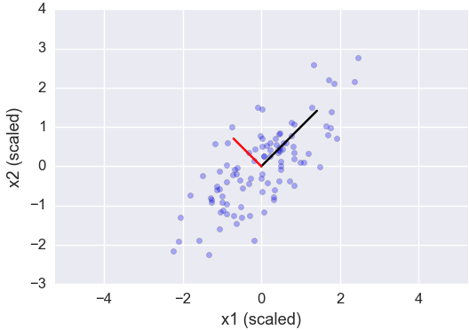
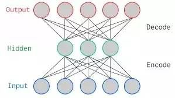

## 机器学习算法优缺点

| 学习任务 | 分类 | 回归 | 聚类 | 降维 |
|:---|:---:|:---:|:---:|---:|
|主要功能|对已有的数据进行分类，将给定的样本放入相应的类别|用函数拟合已知的数据，从而预测未知样本呢|不经过训练，将样本划分若干类别|减少要考虑的随机样本的数量|
|类型|监督学习|监督学习|无监督学习|无监督学习|
|常用算法|K近邻；决策树；支持向量机；朴素贝叶斯|线性回归；逻辑回归；人工神经网络；深度学习|K均值聚类；AP聚类；层次聚类；DBSCAN|主成成分分析PCA；|

当前的「三大」最常见的机器学习任务：
- 回归（Regression）
- 分类（Classification）
- 聚类（Clustering）

两大数据降维（Dimensionality Reduction）问题：
- 特征选取（Feature Selection）
- 特征提取（Feature Extraction）

## 1.回归

回归是一种用于连续型数值变量预测和建模的监督学习算法，使用案例包括房地产价格、股价走势或学生成绩等的预测。

回归任务的特征是具有数值型目标变量的标注数据集。换言之，每一个用以监督算法的观察样本，都有一个数值型真值。

### 1.1（正则化）线性回归

线性回归是回归任务最常用的算法。它最简的形式，是用一个连续的超平面来拟合数据集（比如，当你仅有两个变量时就用一条直线）。

如果数据集内的变量存在线性关系，拟合程度就相当高。 在实践中，简单线性回归通常会被其正则化形式（LASSO、Ridge 及弹性网络）所取代。

正则化是对过多回归系数所采取的一种避免过拟合的惩罚技巧，同时，惩罚的强度需要被平衡好。

- 优点：线性回归的理解和解释都非常直观，还能通过正则化来避免过拟合。此外，线性模型很容易通过随机梯度下降来更新数据模型。
- 缺点：线性回归在处理非线性关系时非常糟糕，在识别复杂的模式上也不够灵活，而添加正确的相互作用项或多项式又极为棘手且耗时。

实现：

Python - http://scikit-learn.org/stable/modules/linear_model.html

R - https://cran.r-project.org/web/packages/glmnet/index.html

### 1.2 回归树（集成方法）

回归树，又名决策树，通过将数据集重复分割成不同的分支来最大化每次分离的信息增益，从而让回归树很自然地学到非线性关系。

集成的方法，如随机森林（RF）或梯度提升树（GBM），则能结合许多独立训练树的预测。

我们在这里不会详述其中的机制，但在实践中，随机森林一般都有很出色的表现，梯度提升树则较难调参，但往往能有更高的性能上限。

- 优点：决策树能学习非线性关系，对异常值也具有很强的稳健性。集成学习在实践中表现优异，经常赢得经典的（非深度学习）机器学习竞赛。
- 缺点：由于无约束，单棵树容易过拟合，这是因为单棵树可保留分支直至记住训练的数据。不够，集成方法可以弱化这一缺点。

实现：随机森林

Python - http://scikit-learn.org/stable/modules/ensemble.html#random-forests

R - https://cran.r-project.org/web/packages/randomForest/index.html

实现：梯度提升树

Python - http://scikitlearn.org/stable/modules/ensemble.html#classification

R - https://cran.r-project.org/web/packages/gbm/index.html

### 1.3 深度学习

深度学习是指能够学习极端复杂模式的多层神经网络。它们在输入层和输出层之间使用隐藏层来对数据的中间表征建模，这一点是其他算法很难做到的。

深度学习还有几个重要的机制，如卷积、漏失等，这使该算法可以有效学习高维数据。

然而，相对于其他算法，深度学习需要更多的数据来进行训练，因为该模型需要估算更大数量级的参数。

- 优点：深度学习是当前特定领域的最先进技术，如计算机视觉与语音识别。深度神经网络在图像、音频和文本数据上表现优异，也很容易通过反向传播算法来更新数据模型。它们的架构（即层级的数量和结构）能适用于多种问题，同时隐藏层还能降低算法对特征工程的依赖。
- 缺点：深度学习算法往往不适合用于通用目的，因为它们需要大量的数据。事实上，对于经典的机器学习问题，深度学习的表现并不比集成方法好。此外，由于训练所需的密集型计算，它们需要更多的专门知识才能进行调参（如设定架构与超参数）。

实现：

Python - https://keras.io/

R - http://mxnet.io/

### 1.4 荣誉奖：最近邻算法

最近邻算法是“基于实例的”，也就意味着它需要保留每一个训练观察值。最近邻算法通过搜寻最相似的训练样本来预测新样本的观察值。

它是内存密集型算法，处理高维数据时的效果并不理想，同时还需要高效的距离函数来计算相似度。

在实践中，使用正则化的回归或树型集成方法通常是更好的选择。

## 2. 分类

分类是一种用于分类变量建模及预测的监督学习算法，使用案例包括员工流失、邮件过滤、金融欺诈等的预测。

正如你所见，许多回归算法都有其对应的分类形式，分类算法往往适用于类别（或其可能性）的预测，而非数值。

逻辑回归

### 2.1 （正则化）逻辑回归

逻辑回归是线性回归所对应的分类方法，基本概念由线性回归推导而出。逻辑回归通过逻辑函数将预测映射到 0 到 1 的区间，因此预测值可被视为某一类别的概率。

该模型依旧是线性的，只有当数据线性可分时（例如，数据可被某决策平面完全分离），这一算法才会有很好的表现。逻辑回归同样能惩罚模型系数以进行正则化。

- 优点：输出结果会有很好的概率解释，而算法也能通过正则化以避免过拟合。逻辑模型很容易通过随机梯度下降来更新数据模型。
- 缺点：逻辑回归在面对多元或非线性决策边界时性能较差。

实现：

Python - http://scikit-learn.org/stable/modules/linear_model.html#logistic-regression

R - https://cran.r-project.org/web/packages/glmnet/index.html

### 2.2 分类树（集成方法）

对应于回归树的分类算法是分类树。通常，它们都是指决策树，更为严谨的说法是“分类回归树（CART）”，也就是非常有名的 CART 算法。

- 优点：跟回归方法一样，分类树的集成方法在实践中的表现同样十分优异。它们在应对异常数据时有着相当的稳健性与可扩展性。由于其层级结构，分类树的集成方法能够很自然地对非线性决策边界建模。
- 缺点：不可约束，单棵树容易过拟合，集成方法可削弱这一影响。

实现：随机森林

Python - http://scikit-learn.org/stable/modules/ensemble.html#regression

R - https://cran.r-project.org/web/packages/randomForest/index.html

实现：梯度提升树

Python - http://scikitlearn.org/stable/modules/ensemble.html#classification

R - https://cran.r-project.org/web/packages/gbm/index.html

### 2.3 深度学习

深度学习同样很容易适应于分类问题。实际上，深度学习应用地更多的是分类任务，如图像分类等。

- 优点：深度学习非常适合于音频、文本与图像数据的分类。
- 缺点：与回归方法一样，深度神经网络需要大量的数据进行训练，所以也不是一个通用目的算法。

实现：

Python - https://keras.io/

R - http://mxnet.io/

### 2.4 支持向量机

支持向量机使用一个名为核函数的技巧，来将非线性问题变换为线性问题，其本质是计算两个观测数据的距离。

支持向量机算法所寻找的是能够最大化样本间隔的决策边界，因此又被称为大间距分类器。

举例来说，使用线性核函数的支持向量机类似于逻辑回归，但更具稳健性。因而在实践中，支持向量机最大用处是用非线性核函数来对非线性决策边界进行建模。

- 优点：支持向量机能对非线性决策边界建模，又有许多可选的核函数。在面对过拟合时，支持向量机有着极强的稳健性，尤其是在高维空间中。
- 缺点：不过，支持向量机是内存密集型算法，选择正确的核函数就需要相当的j技巧，不太适用较大的数据集。在当前的业界应用中，随机森林的表现往往要优于支持向量机。

实现：

Python - http://scikit-learn.org/stable/modules/svm.html#classification

R - https://cran.r-project.org/web/packages/kernlab/index.html

### 2.5 朴素贝叶斯

朴素贝叶斯是一种基于条件概率和计数的简单算法，其本质是一个概率表，通过训练数据来更新其中的概率。

它预测新观察值的过程，就是根据样本的特征值在概率表中来寻找最为可能的类别。

被称为“朴素”原因，是其核心的特征条件独立性假设（例如，每一项输入特征都相互独立），在现实中几乎是不成立的。

- 优点：即便条件独立性假设很难成立，但实践中的朴素贝叶斯算法却能表现得很好。该算法易于实现且能伴随数据集更新。
- 缺点：因为朴素贝叶斯的算法太过简单，所以很容易被上述分类算法所取代。

实现：

Python - http://scikit-learn.org/stable/modules/naive_bayes.html

R - htps://http://cran.r-project.org/web/packages/naivebayes/index.html

## 3. 聚类
聚类是基于数据内部结构来寻找样本自然族群（集群）的无监督学习任务，使用案例包括用户画像、电商物品聚类、社交网络分析等。

由于聚类属于无监督学习，也就不会输出“正确的答案”，评价结果时往往要用到数据可视化。

如果你需要“正确的答案”，亦即训练集中存在预标注的集群，那么用分类算法会更加合适。

### 3.1 K均值

K 均值是基于样本点间的几何距离来度量聚类的通用目的算法。由于集群围绕在聚类中心，结果会接近于球状并具有相似的大小。

我们之所以推荐该算法给初学者，是因为它不仅足够简单，而且足够灵活，对于大多数问题都能给出合理的结果。

- 优点：K均值是最为流行的聚类算法，因为它足够快速、足够简单，如果你的预处理数据和特征工程都做得十分有效，那它将具备令人惊叹的灵活性。
- 缺点：该算法需要指定集群的数量，而 K 值的选择通常都不是那么容易确定的。另外，如果训练数据中的真实集群并不是类球状的，那么 K 均值聚类会得出一些比较差的集群。

实现：

Python - http://scikit-learn.org/stable/modules/clustering.html#k-means

R - https://stat.ethz.ch/R-manual/R-devel/library/stats/html/kmeans.html

### 3.2 仿射传播

仿射传播是一种相对较新的聚类算法，它基于两个样本点之间的图形距离来确定集群，其结果倾向于更小且大小不等的集群。

- 优点：仿射传播不需要指出明确的集群数量，但需要指定“sample preference”和“damping”等超参数。
- 缺点：仿射传播的主要缺点是训练速度较慢，且需要大量内存，因而难于扩展到大数据集。此外，该算法同样在假定潜在的集群要接近于球状。

实现：

Python - http://scikit-learn.org/stable/modules/clustering.html#affinity-propagation

R - https://cran.r-project.org/web/packages/apcluster/index.html

### 3.3 分层 / 层次

分层聚类，又名层次聚类，其算法基于以下概念来实现：

1) 每一个集群都从一个数据点开始；

2) 每一个集群都可基于相同的标准进行合并；

3) 重复这一过程，直至你仅剩下一个集群，这就获得了集群的层次结构。

- 优点：层次聚类的最主要优点，是集群不再假定为类球形。此外，它可以很容易扩展到大数据集。
- 缺点：类似于 K 均值，该算法需要选定集群的数量，即算法完成后所要保留的层次。

实现：

Python - http://scikitlearn.org/stable/modules/clustering.html#hierarchical-clustering

R - https://stat.ethz.ch/R-manual/R-devel/library/stats/html/hclust.html

### 3.4 DBSCAN

DBSCAN 是一种基于密度的聚类算法，它将样本点的密集区域组成集群；其最新进展是HDBSCAN，它允许集群的密度可变。

- 优点：DBSCAN 不需要假定类球形集群，其性能可以扩展。此外，它不需要每个点都被分配到集群中，这就降低了集群的噪音。
- 缺点：用户必须要调整“epsilon”和“min_sample”这两个超参数来定义集群密度。DBSCAN 对此非常敏感。

实现：

Python - http://scikit-learn.org/stable/modules/clustering.html#dbscan

R - https://cran.r-project.org/web/packages/dbscan/index.html

维度灾难

在机器学习领域，“维度(Dimensionality)”通常指数据集中的特征数量（即输入变量的个数）。

当特征的个数特别大的时候（相对于数据集中观测样本的数量来说），训练出一个有效的模型，对算法要求就会特别高(即，用现有的算法训练出一个有效的模型特别困难)。这就是所谓的“维度灾难(Curse of Dimensionality)”，特别是对依赖于距离计算的聚类算法而言。

对于“维度灾难”，有位 Quora 用户给出了一个非常好的类比：

假设有一条100码的直线，而你在该直线的某处掉了一枚硬币。要找回硬币并不难，你只需沿着这条线走就行了，最多花上你2分钟时间。

然后，假设有一个长和宽都是100码的广场，而你是把硬币掉在广场的某个位置。现在再想找回它，可就不容易了，这好比在两个并排的足球场中找针，可能会耗上你几天时间。

再然后，假设是一个长、宽、高都是100码的立方体，那就好比是在30层楼高的大型体育场内找zhen找针……

随着维度的增加，在空间中搜索的难度也会变得愈加困难。

Quora链接：

https://www.quora.com/What-is-the-curse-of-dimensionality/answer/Kevin-Lacker
这就需要数据降维的办法：特征选取和特征提取。

## 4. 特征选取

特征选取是从你的数据集中过滤掉不相关或冗余的特征。特征选取与特征提取的关键区别在于：

特征选取是从原特征集中选取一个子特征集，而特称提取则是在原特征集的基础上重新构造出一些(一个或多个)全新的特征。

需要注意的是，某些监督式机器学习算法已经具备了内在的特征选取机制：

比如正则回归与随机森林。通常，我们是建议一开始优先尝试这些算法，如果它们能匹配上你的问题的话。对此我们已经做过介绍。

作为独立的任务，特征选取既可以是非监督式的(如方差阈值)，又可以是监督式的(比遗传算法)。

有必要的话，你还可以把多种方法以某种合理的方式整合在一起。

### 4.1 方差阈值

方差阈值会摒弃掉观测样本那些观测值改变较小的特征(即，它们的方差小于某个设定的阈值)。这样的特征的价值极小。

举例来说，如果你有一份公共健康数据，其中96%的人都是35岁的男性，那么去掉“年龄”和“性别”的特征也不会损失重要信息。

由于方差阈值依赖于特征值的数量级，你应该对特征值先做归一化处理。

- 优点：使用方差阈值方式进行数据降维只需一个非常可靠的直觉：特征值不怎么改变的特征，不会带来什么有用的信息。这是在你建模初期进行数据降维相对安全的一种方式。
- 缺点：如果你正在解决的问题并不需要进行数据降维，即便使用了方差阈值也几乎没有什么作用。此外，你需要手工设置、调整方差阈值，这个过程相当具有技术含量。我们建议从一个保守(也就是，较低)的阈值开始。

实现：

Python - http://scikit-learn.org/stable/modules/generated/sklearn.feature_selection.VarianceThreshold.html

R - https://www.rdocumentation.org/packages/caret/versions/6.0-76/topics/nearZeroVar

### 4.2 相关性阈值

相关性阈值会去掉那些高度相关的特征(亦即，这些特征的特征值变化与其他特征非常相似)。它们提供的是冗余信息。

举例来说，如果你有一个房地产数据，其中两个特征分别是“房屋面积（单位：平方英尺）”和“房屋面积（单位：平方米）”，那么，你就可以去掉其中的任何一个（这非常安全，也不会给你的模型带来任何负面影响）。

问题是，你该去掉哪一个特征呢？首先，你应该计算所有特征对的相关系数。而后，如果某个特征对的相关系数大于设定的阈值，那你就可以去掉其中平均绝对相关系数较大的那一个。

- 优点：使用相关性阈值同样只需一个可靠的直觉：相似的特征提供了冗余的信息。对于某些含有强相关性特征较多的数据集，有些算法的稳健性并不好，因此，去掉它们可以提升整个模型的性能(计算速度、模型准确度、模型稳健性，等等)。
- 缺点：同样，你还是必须手动去设置、调整相关性阈值，这同样是个棘手且复杂的过程。此外，如果你设置的阈值过低，那么你将会丢失掉一些有用的信息。无论在什么时候，我们都更倾向于使用那些内置了特征选取的算法。对于没有内置特征提取的算法，主成分分析是一个很好的备用方案。

实现：

Python - https://gist.github.com/Swarchal/881976176aaeb21e8e8df486903e99d6

R - https://www.rdocumentation.org/packages/caret/versions/6.0-73/topics/findCorrelation

### 4.3 遗传算法

遗传算法是可用于不同任务的一大类算法的统称。它们受进化生物学与自然选择的启发，结合变异与交叉，在解空间内进行高效的遍历搜索。这里有一篇非常棒的简介：“遗传算法背后的原理引入”。

在机器学习领域，遗传算法主要有两大用处。

其一，用于最优化，比如去找神经网络的最佳权重。

其二，是用于监督式特征提取。这一用例中，“基因”表示单个特征，同时“有机体”表示候选特征集。“种群体”内的每一个有机体都会基于其适应性进行评分，正如在测试数据集上进行模型性能测试。最能适应环境的有机体将会生存下来，并不断繁衍，一直迭代，直至最终收敛于某个最优的解决方案。

- 优点：在穷举搜索不可行的情况下，对高维数据集使用遗传算法会相当有效。当你的算法需要预处理数据却没有内置的特征选取机制(如最近邻分类算法），而你又必须保留最原始的特征(也就是不能用任何主成分分析算法)，遗传算法就成了你最好的选择。这一情况在要求透明、可解释方案的商业环境下时有发生。
- 缺点：遗传算法为你解决方案的实施带来了更高的复杂度，而多数情况下它们都是不必要的麻烦。如果可能的话，主成分分析或其它内置特征选取的算法将会更加高效和简洁。

实现：

Python - https://pypi.python.org/pypi/deap

R - https://cran.r-project.org/web/packages/GA/vignettes/GA.html

### 4.4 荣誉奖：逐步搜索

逐步搜索是一个基于序列式搜索的监督式特征选取算法。它有两种形式：前向搜索和反向搜索。

对于前向逐步搜索，你从没有任何特征开始。接着，从候选特征集中，选择一个特征来训练模型；然后，保存模型性能最好对应的那个特征；再往下，你不断往训练模型的特征集中添加特征，一次添加一个特征，直到你模型的性能不再提升。

反向逐步搜索的过程相同，只不过顺序相反：从把所有的特征都用于训练模型，接着一次性移除一个特征，直到模型的性能骤降。

我们提及这一算法纯粹是源于某些历史原因。尽管很多教科书都把逐步搜索算法作为一个有效的方法，但它所表现出来的性能总是不及其它监督式方法，比如正则化。逐步搜索有很多明显的缺陷，最致命的一点就是它是一个贪心算法，无法面对未来变化的冲击。我们并不推荐这个算法。

## 5. 特征提取
特征提取是用来创造一个新的、较小的特征集，但仍能保留绝大部分有用的信息。

值得再提的是，特征选取是用来保留原始特征集中的一部分子特征集，而特征提取则是创造全新的特征集。

跟特征选取一样，某些算法内部已经具有了特征提取的机制。最好的案例就是深度学习，它可以通过每一层隐神经层，提取出越来越有用的能表征原始数据的特征。

作为独立的任务，特征提取可以是非监督式的(如主成分分析)或监督式的(如线性判别分析)。

### 5.1 主成分分析

主成分分析是一个非监督式算法，它用来创造原始特征的线性组合。新创造出来的特征他们之间都是正交的，也就是没有关联性。具体来说，这些新特征是按它们本身变化程度的大小来进行排列的。第一个主成分代表了你的数据集中变化最为剧烈的特征，第二个主成分代表了变化程度排在第二位的特征，以此类推。

因此，你可以通过限制使用主成分的个数来达到数据降维的目的。例如，你可以仅采用能使累积可解释方差为90%的主成分数量。

你需要在使用主成分分析之前，对数据进行归一化处理。否则，原始数据中特征值数量级最大的那个特征将会主导你新创造出来的主成分特征。

- 优点：主成分分析是一项多用途技术，实用效果非常好。它部署起来快速、简单，也就是说，你可以很方便地测试算法性能，无论使用还是不使用主成分分析。此外，主成分分析还有好几种变体和扩展(如：核主成分分析(kernel PCA)，稀疏主成分分析(sparse PCA))，用以解决特定的问题。
- 缺点：新创造出来的主成分并不具备可解释性，因而在某些情况下，新特征与应用实际场景之间很难建立起联系。此外，你仍然需要手动设置、调整累积可解释方差的阈值。

实现：

Python - http://scikit-learn.org/stable/modules/generated/sklearn.decomposition.PCA.html

R - https://stat.ethz.ch/R-manual/R-devel/library/stats/html/prcomp.html

### 5.2 线性判别分析

线性判别分析不是隐含狄利克雷分布，它同样用来构造原始特征集的线性组合。但与主成分分析不同，线性判别分析不会最大化可解释方差，而是最大化类别间的分离程度。

因此，线性判别分析是一种监督式学习方式，它必须使用有标记的数据集。那么，线性判别分析与主成分分析，到底哪种方法更好呢？这要视具体的情况而定，“没有免费的午餐”原理在这里同样适用。

线性判别分析同样依赖于特征值的数量级，你同样需要先对特征值做归一化处理。

- 优点：线性判别分析是一种监督式学习，基于这种方式获取到的特征可以(但并不总是能)提升模型性能。此外，线性判别分析还有一些变体(如二次线性判别分析)，可用来解决特定的问题。
- 缺点：与主成分分析一样，新创造出来的特征不具有可解释性。而且，你同样要手动设置、调整需要保留的特征数量。线性判别分析需要已经标记好的数据，因此，这也让它更加接地气儿。

实现：

Python - http://scikit-learn.org/stable/modules/generated/sklearn.discriminant_analysis.LinearDiscriminantAnalysis.html#sklearn.discriminant_analysis.LinearDiscriminantAnalysis

R - https://stat.ethz.ch/R-manual/R-devel/library/MASS/html/lda.html

### 5.3 自编码机

自编码机是一种人工神经网络，它是用来重新构建原始输入的。例如，图像自编码机是训练来重新表征原始数据的，而非用以区分图片里面的小猫、小狗。

但这有用吗？这里的关键，是在隐含层搭建比输入层和输出层更少数量的神经元。这样，隐含层就会不断学习如何用更少的特征来表征原始图像。

因为是用输入图像来作为目标输出，自编码机被视为无监督学习。它们可被直接使用（如：图像压缩）或按顺序堆叠使用（如：深度学习）。

- 优点：自编码机是人工神经网络中的一种，这表示它们对某些特定类型的数据表现会非常好，比如图像和语音数据。
- 缺点：自编码机是一种人工神经网络。这就是说，它们的优化需要更多的数据来进行训练。它们并不能作为一般意义上的数据降维算法来用。