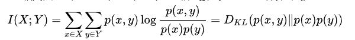
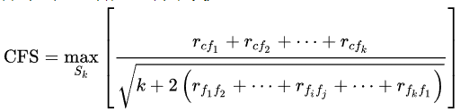

**定义:**  从给定的特征集合中选择出相关特征子集的过程，即“特征选择”(feature selection)

**目的：**

1. 简化模型，使模型更易于理解：去除不相关的特征会降低学习任务的难度。并且可解释性能对模型效果的稳定性有更多的把握
2. 改善性能：节省存储和计算开销
3. 改善通用性、降低过拟合风险：减轻维数灾难，特征的增多会大大增加模型的搜索空间，大多数模型所需要的训练样本随着特征数量的增加而显著增加。特征的增加虽然能更好地拟合训练数据，但也可能增加方差

**前提：**

1. 训练数据包含许多冗余或无用的特征，移除这些特征并不会导致丢失信息。其中冗余是指一个本身很有用的特征与另外一个有用的特征强相关，或它包含的信息能从其它特征推演出来
2. 特征很多但样本相对较少

**步骤：**

1. 产生过程：产生特征或特征子集候选集合
2. 评价函数：衡量特征或特征子集的重要性或者好坏程度，即量化特征变量和目标变量之间的联系以及特征之间的相互联系。为了避免过拟合，可用交叉验证的方式来评估特征的好坏
3. 停止准则：为了减少计算复杂度，需设定一个阈值，当评价函数值达到阈值后搜索停止
4. 验证过程：在验证数据集上验证选出来的特征子集的有效性

**方法：**

- Filter(过滤法)
- Wrapper(包装法)
- Embedded(嵌入法)


## Filter(过滤法)

**定义：**
按照发散性或相关性对各个特征进行评分，设定阈值或者待选择特征的个数进行筛选，分为单变量过滤方法和多变量过滤方法

**分类：**
- 单变量过滤方法：不需要考虑特征之间的相互关系，按照特征变量和目标变量之间的相关性或互信息对特征进行排序，过滤掉最不相关的特征变量。优点是计算效率高、不易过拟合
- 多变量过滤方法：考虑特征之间的相互关系，常用方法有基于相关性和一致性的特征选择

**优点：** 不依赖于任何机器学习方法，且不需要交叉验证，计算效率比较高

**缺点：** 没有考虑机器学习算法的特点


### 常用过滤方法

#### 覆盖率

即特征在训练集中出现的比例。若覆盖率很小，如有10000个样本，但某个特征只出现了5次，则次覆盖率对模型的预测作用不大，可删除

#### 方差选择法

先计算各个特征的方差，然后根据阈值，选择方差大于阈值的特征

```python
  from sklearn.feature_selection import VarianceThreshold
  # 方差选择法，返回值为特征选择后的数据
  # 参数threshold为方差的阈值
  VarianceThreshold(threshold=3).fit_transform(iris.data)
```

#### Pearson(皮尔森)相关系数

用于度量两个变量X和Y之间的线性相关性，结果的取值区间为[-1, 1]， -1表示完全的负相关(这个变量下降，那个就会上升)，+1表示完全的正相关，0表示没有线性相关性

计算方法为两个变量之间的协方差和标准差的商  


  
样本上的相关系数为  


  
```python
from sklearn.feature_selection import SelectKBest
from scipy.stats import pearsonr
# 选择K个最好的特征，返回选择特征后的数据
# 第一个参数为计算评估特征是否好的函数，该函数输入特征矩阵和目标向量，
# 输出二元组（评分，P值）的数组，数组第i项为第i个特征的评分和P值。
# 在此为计算相关系数
# 其中参数k为选择的特征个数
SelectKBest(lambda X, Y: array(map(lambda x:pearsonr(x, Y), X.T)).T, k=2).fit_transform(iris.data, iris.target)
```

####卡方检验:

检验定性自变量对定性因变量的相关性。假设自变量有N种取值，因变量有M种取值，考虑自变量等于i且因变量等于j的样本频数的观察值与期望的差距，构建统计量
    

  
这个统计量的含义即自变量对因变量的相关性

```python
from sklearn.feature_selection import SelectKBest
from sklearn.feature_selection import chi2
#选择K个最好的特征，返回选择特征后的数据
SelectKBest(chi2, k=2).fit_transform(iris.data, iris.target)
```

#### 互信息法(KL散度、相对熵)和最大信息系数 Mutual information and maximal information coefficient (MIC)

评价定性自变量对定性因变量的相关性，评价类别型变量对类别型变量的相关性，互信息越大表明两个变量相关性越高，互信息为0时，两个变量相互独立。互信息的计算公式为



其中，p(x)和p(y)为X和Y的边际概率分布函数，p(x,y)为X和Y的联合概率分布函数。直观上，互信息度量两个随机变量之间共享的信息，也可表示为由于X的引入而使Y的不确定性减少的量，这时互信息与信息增益相同

皮尔逊系数只能衡量线性相关性而互信息系数能够很好地度量各种相关性，但是计算相对复杂一些

互信息不能直接用于特征选择的两个原因
1. 不属于度量方式，不能归一化，在不同数据上的结果不能做比较
2. 对于连续变量的计算不是很方便(X和Y都是集合，xi,y都是离散值)，通常变量需要先离散化，而互信息的结果对离散化的方式很敏感

为了处理定量数据，提出了最大信息系数法，它首先寻找一种最优的离散化方式，然后把互信息取值转换成一种度量方式，取值区间在[0, 1]
  
```
from sklearn.feature_selection import SelectKBest
from minepy import MINE
#由于MINE的设计不是函数式的，定义mic方法将其为函数式的
#返回一个二元组，二元组的第2项设置成固定的P值0.5
def mic(x, y):
    m = MINE()
    m.compute_score(x, y)
    return (m.mic(), 0.5)
#选择K个最好的特征，返回特征选择后的数据
SelectKBest(lambda X, Y: array(map(lambda x:mic(x, Y), X.T)).T, k=2).fit_transform(iris.data, iris.target)
```

#### Fisher得分

对于分类问题，好的特征应该是在同一个类别中的取值比较相似，而在不同类别之间的取值差异比较大。因此特征i的重要性可用Fiser得分Si来表示


其中，uij和pij分别是特征i在类别j中均值和方差，ui为特征i的均值，nj为类别j中的样本数。Fisher得分越高，特征在不同类别之间的差异性越大、在同一类别中的差异性越小，则特征越重要

#### 相关特征选择(Correlation Feature Selection, CFS)

该方法基于的假设是，好的特征集合包含跟目标变量非常相关的特征，但这些特征之间彼此不相关。对于包含k个特征的集合，CFS准则定义为



其中，[公式]和[公式]是特征变量和目标变量之间，以及特征变量和特征变量之间的相关性，这里的相关性不一定是皮尔森相关系数或斯皮尔曼相关系数
最小冗余最大相关性(Minimum Redundancy Maximum Relevance, mRMR)
由于单变量过滤法只考虑了单特征变量和目标变量之间的相关性，因此选择的特征子集可能过于冗余。mRMR在进行特征时考虑到了特征之间的冗余性，具体做法是对跟已选择特征相关性较高的冗余特征进行惩罚
mRMR可以使用多种相关性的度量指标，如互信息、相关系数以及其它距离或相似度分数
以互信息为例，特征集合S和目标变量c之间的相关性可定义为，特征集合中所有单个特征变量[公式]和目标变量c的互信息值[公式]的平均值：
[公式]
S中所有特征的冗余性为所有特征变量之间的互信息[公式]的平均值
[公式]
则mRMR准则为
[公式]
通过求解上述优化问题即可得到特征子集
在一些特定的情况下，mRMR算法可能对特征的重要性估计不足，它没有考虑到特征之间的组合可能与目标变量比较相关。如果单个特征的分类能力都比较弱，但进行组合后分类能力很强，这时mRMR方法效果一般比较差(如目标变量由特征变量之间进行XOR运算得到)
mRMR是一种典型的进行特征选择的增量贪心策略：某个特征一旦被选择了，在后续的步骤不会删除
mRMR可改写为全局的二次规划的优化问题(即特征集合为特征全集的情况)：
[公式]
其中[公式]为特征变量和目标变量相关性向量，[公式]为度量特征变量之间的冗余性的矩阵。QPFS可通过二次规划求解，QPFS偏向于选择熵比较小的特征，这是因为特征自身的冗余性[公式]
另一种全局的基于互信息的方法是基于条件相关性的
[公式]
其中，[公式]。[公式]方法的优点是可以通过求解矩阵Q的主特征向量来求解，而且可以处理二阶的特征组合

### Wrapper(包装法)
**定义**使用机器学习算法评估特征子集的效果，可以检测两个或多个特征之间的交互关系，而且选择的特征子集让模型的效果达到最优。
这是特征子集搜索和评估指标相结合的方法。前者提供候选的新特征子集，后者基于新特征子集训练一个模型，并用验证集进行评估，为每一组特征子集进行打分
最简单的方法是在每一个特征子集上训练并评估模型，从而找出最优的特征子集

**缺点**
1. 需要对每一组特征子集训练一个模型，计算量很大
2. 样本不够充分的情况下容易过拟合
3. 特征变量较多时计算复杂度太高

图示

### 3种常用的特征子集搜索方法
1. 完全搜索  
即穷举法，遍历所有可能的组合达到全局最优，时间复杂度[公式]
2. 启发式搜索  
- 序列向前选择：特征子集从空集开始，每次只加入一个特征，时间复杂度为[公式]
- 序列向后选择：特征子集从全集开始，每次删除一个特征，时间复杂度为[公式]
3. 随机搜索  
执行序列向前或向后选择时，随机选择特征子集
4. 递归特征消除法  
使用一个基模型进行多轮训练，每轮训练后通过学习器返回的coef_或者feature_importances_消除若干权重较低的特征，再基于新的特征集进行下一轮训练
```
from sklearn.feature_selection import RFE
from sklearn.linear_model import LogisticRegression
#递归特征消除法，返回特征选择后的数据
#参数estimator为基模型
#参数n_features_to_select为选择的特征个数
RFE(estimator=LogisticRegression(), 
    n_features_to_select=2).fit_transform(iris.data, 
                                          iris.target)
```

### Embedded(嵌入法)
定义
将特征选择嵌入到模型的构建过程中，具有包装法与机器学习算法相结合的优点，也具有过滤法计算效率高的优点
图示


### LASSO方法
使用LASSO(Least Absolute Shrinkage and Selection Operator)方法
[公式]
通过对回归系数添加[公式]惩罚项来防止过拟合，可以让特定的回归系数变为0，从而可以选择一个不包含那些系数的更简单的模型
实际应用中，[公式]越大，回归系数越稀疏，[公式]一般采用交叉验证的方式来确定
线性回归、逻辑回归、FM/FFM以及神经网络都可以添加[公式]惩罚项
即使用带惩罚项的基模型，除了筛选出特征外，同时也进行了降维
实际上，L1惩罚项降维的原理是，在多个对目标值具有同等相关性的特征中，只保留一个，所以没保留的特征并不代表不重要

```
from sklearn.feature_selection import SelectFromModel
from sklearn.linear_model import LogisticRegression
#带L1惩罚项的逻辑回归作为基模型的特征选择
SelectFromModel(LogisticRegression(penalty="l1", C=0.1)).fit_transform(iris.data,iris.target)
```

### 基于树模型的特征选择方法
在决策树中，深度较浅的节点一般对应的特征分类能力更强(可以将更多的样本区分开)
对于基于决策树的算法，如随机森林，重要的特征更有可能出现在深度较浅的节点，而且出现的次数可能越多
即可基于树模型中特征出现次数等指标对特征进行重要性排序
```
from sklearn.feature_selection import SelectFromModel
from sklearn.ensemble import GradientBoostingClassifier
#GBDT作为基模型的特征选择
SelectFromModel(GradientBoostingClassifier()).fit_transform(iris.data,iris.target)
```

