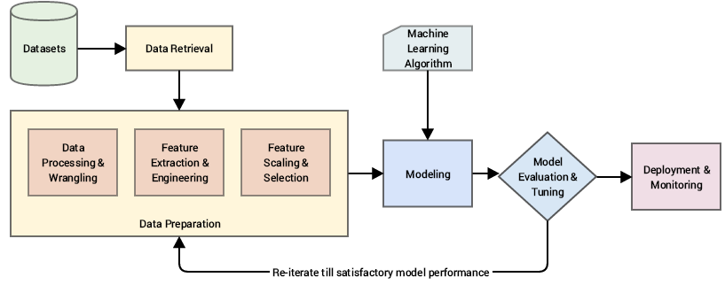

# 特征工程和特征选择的简短指南

特征工程和选择是一门将数据转化为最佳方式的艺术/科学，它融合了领域专业知识、直觉和数学。
本指南是一个简明的参考初学者最简单，但广泛使用的技术，功能工程和选择。任何注释和提交都是最受欢迎的。

## 0. 基本概念

### 0.1 什么是机器学习

> 机器学习是一门让计算机在没有明确编程的情况下行动的科学  - [Arthur Samuel](https://simple.wikipedia.org/wiki/Machine_learning)

> 机器学习是一种数据科学技术，它帮助计算机从现有数据中学习，以预测未来的行为、结果和趋势  - [Microsoft](https://docs.microsoft.com/en-us/azure/machine-learning/service/overview-what-is-azure-ml)

> 机器学习领域试图回答这样一个问题:“我们如何构建能够随着经验自动改进的计算机系统，以及控制所有学习过程的基本定律是什么?”” - [Carnegie Mellon University](http://www.cs.cmu.edu/~tom/pubs/MachineLearning.pdf)

狭义地说，在数据挖掘环境中，机器学习(ML)是让计算机从历史数据中学习，识别数据中的模式/关系，然后做出预测的过程。

### 0.2 方法

典型的ML工作流/管道是这样的:

[img source](https://www.springer.com/us/book/9781484232064) 

有许多方法可以将组成ML工作流的任务划分为多个阶段。但一般来说，基本步骤与上图相似。

### 0.3 典型的任务

| Task              | Definition                                    | Example                              |
| ----------------- | --------------------------------------------- | ------------------------------------ |
| Classification    | 预测新实例属于哪个类别 | 肿瘤是恶性的还是良性的? |
| Regression        | 预测一个连续的数值 | 预测未来的房价/股价 |
| Anomaly Detection | 识别异常值  | 欺诈检测  |
| Clustering        | 将相似的数据点分组 | 客户细分 |

### 0.4 术语

- **Feature**: 也被称为属性/自变量/预测变量/输入变量。它是观察到的现象的一个个体可测量的性质/特征  [[wiki]](https://en.wikipedia.org/wiki/Feature_(machine_learning)).  The age of a person, etc.
- **Target**: 也称为因变量/响应变量/输出变量。它是监督学习中被预测的变量。
- **Algorithm**: 用于实现特定ML技术的特定程序。线性回归等。
- **Model**: 该算法应用于一个数据集，完成其设置(其参数)。4.5 Y = x + 0.8,等等。我们希望模型能够最好地捕捉特征和目标之间的关系。
- **Supervised learning** : 使用标记数据训练模型，生成对新数据响应的合理预测。
- **Unsupervised learning** : 使用未标记的数据训练模型，以找到数据中的内在结构/模式。
- **Reinforcement learning**: 该模型是通过最大化奖励函数从一系列行动中学习的，奖励函数可以通过惩罚坏的行为或奖励好的行为来最大化。自动驾驶等。

## 1. 数据挖掘

### 1.1 变量

**Definition**: 观察到的现象的任何可测量的性质/特征。它们被称为“变量”，因为它们所取的值可能会在总体中变化(通常是这样)。

**Types of Variable**

| Type        | Sub-type   | Definition                                                   | Example                        |
| ----------- | ---------- | ------------------------------------------------------------ | ------------------------------ |
| Categorical | Nominal    | 变量的值从一组类别中选择，但没有任何自然顺序。 [ref](http://www-ist.massey.ac.nz/dstirlin/CAST/CAST/Hstructures/structures_c2.html) | 性别、汽车类型 |
|             | Ordinal    | 一个类别变量，其类别可以被有意义地排序。 [ref](http://www-ist.massey.ac.nz/dstirlin/CAST/CAST/Hstructures/structures_c2.html) | 考试成绩 |
| Numerical   | Discrete   | 值为有限或可数无限的变量。 [wiki](https://en.wikipedia.org/wiki/Continuous_or_discrete_variable) | 一个家庭中孩子的数量 |
|             | Continuous | 可以取无穷多个不可数值的变量。 [wiki](https://en.wikipedia.org/wiki/Continuous_or_discrete_variable) | 房价，时间流逝 |

### 1.2 变量标识

**Definition**: 确定每个变量的数据类型。

**Note**:  
在现实中，由于各种原因，我们可能会使用混合类型的变量。
例如，在信用评分中，“错过付款状态”是一个常见的变量，它可以取值1、2、3，这意味着客户在他们的账户中错过了1-3笔付款。
如果客户在该账户上违约，它也可以取D值。在数据清理的某些步骤之后，我们可能必须转换数据类型。

### 1.3 Univariate Analysis

Descriptive statistics on one single variable.

| Variable    | What to look for                                             |
| ----------- | ------------------------------------------------------------ |
| Categorical | **Shape**: Histogram/ Frequency table...                |
| Numerical   | **Central Tendency**: Mean/ Median/ Mode **Dispersion**: Min/ Max/ Range/ Quantile/ IQR/ MAD/ Variance/ Standard Deviation/  **Shape**: Skewness/ Histogram/ Boxplot... |

Below are some methods that can give us the basic stats on the variable:

- pandas.Dataframe.describe()
- pandas.Dataframe.dtypes
- Barplot
- Countplot
- Boxplot
- Distplot

### 1.4 Bi-variate Analysis

Descriptive statistics between two or more variables.

- Scatter Plot
- Correlation Plot
- Heat Map

**Scatter Plot** is a type of plot or mathematical diagram using Cartesian coordinates to display values for typically two variables for a set of data. If the pattern of dots slopes from lower left to upper right, it indicates a positive correlation between the variables being studied. If the pattern of dots slopes from upper left to lower right, it indicates a negative correlation. [[wiki]](https://en.wikipedia.org/wiki/Scatter_plot)

**Correlation plot** can be used to quickly find insights. It is used to investigate the dependence between multiple variables at the same time and to highlight the most correlated variables in a data table.

**Heat map** (or heatmap) is a graphical representation of data where the individual values contained in a matrix are represented as colors.

## 2. Feature Cleaning

### 2.1 Missing Values

**Definition**: no value is stored in a certain observation within a variable.

#### 2.1.1 Why Missing Data Matters

- certain algorithms cannot work when missing value are present
- even for algorithm that handle missing data, without treatment the model can lead to inaccurate conclusion

A study on the impact of missing data on different ML algorithm can be found [here](http://core.ecu.edu/omgt/krosj/IMDSDataMining2003.pdf).

#### 2.1.2 Missing Mechanisms [1]

It is important to understand the mechanisms by which missing fields are introduced in a dataset. Depending on the mechanism, we may choose to process the missing values differently. The mechanisms were first introduced by Rubin [2].

**Missing Completely at Random**

A variable is missing completely at random (MCAR) if the probability of being missing is the same for all the observations. When data is MCAR, there is absolutely no relationship between the data missing and any other values, observed or missing, within the dataset. In other words, those missing data points are a random subset of the data. There is nothing systematic going on that makes some data more likely to be missing than other.

If values for observations are missing completely at random, then disregarding those cases would not bias the inferences made.

**Missing at Random**

Missing as Random (MAR) occurs when there is a systematic relationship between the propensity of missing values and the observed data. In other words, the probability an observation being missing depends only on available information (other variables in the dataset), but not on the variable itself.

For example, if men are more likely to disclose their weight than women, weight is MAR (on variable gender). The weight information will be missing at random for those men and women that decided not to disclose their weight, but as men are more prone to disclose it, there will be more missing values for women than for men.

In a situation like the above, if we decide to proceed with the variable with missing values, we might benefit from including gender to control the bias in weight for the missing observations.

**Missing Not At Random -  Depends on Unobserved Predictors**

Missingness depends on information that has not been recorded, and this information also predicts the missing values. E.g., if a particular treatment causes discomfort, a patient is more likely to drop out of the study (and 'discomfort' is not measured).

In this situation, data sample is biased if we drop those missing cases.

**Missing Not At Random -  Depends on Missing Value Itself**

Missingness depends on the (potentially missing) variable itself. E.g., people with higher earnings are less likely to reveal them.

#### 2.1.3 How to Assume a Missing Mechanism

- By **business understanding**. In many situations we can assume the mechanism by probing into the business logic behind that variable.
- By **statistical test**.  Divide the dataset into ones with/without missing and perform t-test to see if there's significant differences. If there is, we can assume that missing is not completed at random.

But we should keep in mind that we can hardly 100% be sure that data are MCAR, MAR, or MNAR because unobserved predictors (lurking variables) are unobserved. 

#### 2.1.4 How to Handle Missing Data

| Method                         | Definition                                                   | Pros                                                   | Cons                                                         |
| ------------------------------ | ------------------------------------------------------------ | ------------------------------------------------------ | ----------------------------------------------------------- |
| Listwise Deletion              | excluding all cases (listwise) that have missing values      | preserve distribution if MCAR                          | 1. may discard too much data and hurt the model 2. may yield biased estimates if not MCAR (as we keep a special subsample from the population) |
| Mean/Median/Mode Imputation    | replacing the NA by mean/median/most frequent values (for categorical feature) of that variable | good practice if MCAR                                  | 1. distort distribution 2. distort relationship with other variables |
| End of distribution Imputation | replacing the NA by values that are at the far end of the distribution of that variable, calculated by mean + 3*std | Captures the importance of missingness if there is one | 1. distort distribution 2. may be considered outlier if NA is few or mask true outlier if NA is many. 3. if missingness is not important this may mask the predictive power of the original variable |
| Random Imputation              | replacing the NA by taking a random value from the pool of available observations of that variable | preserve distribution if MCAR                          | not recommended in business settings for its randomness (different result for same input) |
| Arbitrary Value Imputation     | replacing the NA by arbitrary values                         | Captures the importance of missingness if there is one | 1. distort distribution 2. typical used value: -9999/9999. But be aware it may be regarded as outliers. |
| Add a variable to denote NA    | creating an additional variable indicating whether the data was missing for that observation | Captures the importance of missingness if there is one | expand feature space                                         |

In real settings, when it's hard to decide the missing mechanism or there's few time to study deeply about each missing variables, the popular way is to adopt:

- Mean/Median/Mode Imputation (depend on the distribution)
- End of distribution Imputation
- Add a variable to denote NA

simultaneously, so that we both catch the value of missingness and obtain a complete dataset.

**Note**: Some algorithms like XGboost incorporate missing data treatment into its model building process, so you don't need to do the step. However it's important to make sure you understand how the algorithm treat them and explain to the business team.

### 2.2 Outliers

**Definition**:  An outlier is an observation which deviates so much from the other observations as to arouse suspicions that it was generated by a different mechanism. [3]  

**Note**:  Outliers, depending on the context, either deserve special attention or should be completely ignored. For example, an unusual transaction on a credit card is usually a sign of fraudulent activity, while a height of 1600cm of a person is very likely due to measurement error and should be filter out or impute with something else.

#### 2.2.1 Why Outlier Matters

The presence of outliers may:

- make algorithm not work properly
- introduce noises to dataset
- make samples less representative

Some algorithms are very sensitive to outliers, For example, Adaboost may treat outliers as "hard" cases and put tremendous weights on outliers, therefore producing a model with bad generalization. Any algorithms that rely on means/variance are sensitive to outliers as those stats are greatly influenced by extreme values.

On the other hand some algorithm are more robust to outliers. For example, decision trees tend to ignore the presence of outliers when creating the branches of their trees. Typically, trees make splits by asking if variable x >= value t, and therefore the outlier will fall on each side of the branch, but it will be treated equally as the remaining values, regardless of its magnitude.

#### 2.2.2 Outlier Detection

In fact outlier analysis and anomaly detection is a huge field of research. Charu's book "Outlier Analysis" [4] offer a great insight into the topic. PyOD[5] is a comprehensive Python toolkit which contains many of the advanced methods in this field.

All the methods here listed are for univariate outlier detection. Multivariate outlier detection is beyond the scope of this guide.

| Method                                   | Definition                                                   | Pros                                                         | Cons                                                         |
| ---------------------------------------- | ------------------------------------------------------------ | ------------------------------------------------------------ | ------------------------------------------------------------ |
| Detect by arbitrary boundary             | identify outliers based on arbitrary boundaries              | flexiable                                                    | require business understanding                               |
| Mean & Standard Deviation method [6],[7] | outlier detection by Mean & Standard Deviation Method        | good for variable with Gaussian distribution (68-95-99 rule) | sensitive to extreme value itself (as the outlier increase the sd) |
| IQR method [8]                           | outlier detection by Interquartile Ranges Rule               | robust than Mean & SD method as it use quantile & IQR. Resilient to extremes. | can be too aggressive                                        |
| MAD method [6],[7]                       | outlier detection by Median and Median Absolute Deviation Method | robust than Mean & SD method. Resilient to extremes.         | can be too aggressive                                        |

However, beyond these methods, it's more important to keep in mind that the business context should govern how you define and react to these outliers. The meanings of your findings should be dictated by the underlying context, rather than the number itself.

#### 2.2.3 How to Handle Outliers

| Method                          | Definition                                                   | Pros                             | Cons                                        |
| ------------------------------- | ------------------------------------------------------------ | -------------------------------- | ------------------------------------------- |
| Mean/Median/Mode Imputation     | replacing the outlier by mean/median/most frequent values of that variable | preserve distribution            | lose information of outlier if there is one |
| Discretization                  | transform continuous variables into discrete variables       | minimize the impact from outlier | lose information of outlier if there is one |
| Imputation with arbitrary value | impute outliers with arbitrary value.                        | flexiable                        | hard to decide the value                    |
| Windsorization                  | top-coding & bottom coding (capping the maximum of a distribution at an arbitrarily set value, vice versa). | prevent model over-fitting       | distort distribution                        |
| Discard outliers                | drop all the observations that are outliers                  | /                                | lose information of outlier if there is one |

**Note**: A detailed guide of doing windsorization can be found [here](https://www.statisticshowto.datasciencecentral.com/winsorize/).

There are many strategies for dealing with outliers in data, and depending on the context and data set, any could be the right or the wrong way. It’s important to investigate the nature of the outlier before deciding.

### 2.3 Rare Values

**Definition**: Categorical variable with some of its values appear only seldomly.

**Note**:  In some situations rare values, like outliers, may contains valuable information of the dataset and therefore need particular attention. For example, a rare value in transaction may denote fraudulent.

#### 2.3.1 Why Rare Value Matters

- Rare values in categorical variables tend to cause over-fitting, particularly in **tree based** methods.
- A big number of infrequent labels adds noise, with little information, therefore causing over-fitting.
- Rare labels may be present in training set, but not in test set, therefore causing over-fitting to the train set.
- Rare labels may appear in the test set, and not in the train set. Thus, the model will not know how to evaluate it. 

#### 2.3.2 How to Handle Rare Value

| Method                         | Definition                                                   |
| ------------------------------ | ------------------------------------------------------------ |
| Mode Imputation                | Replacing the rare label by most frequent label              |
| Grouping into one new category | Grouping the observations that show rare labels into a unique category |

Depending on the situation, we may use different strategies:

- when **there's one predominant category (over 90%)** in the variable: observe the relationship between that variable and the target, then either discard that variable, or keep it as it was. In this case, variable often is not useful for prediction as it is quasi-constant (as we will later see in Feature Selection part).
- when **there's a small number of categories**: keep it as it was. Because only few categories are unlikely to bring so much noise.
- when **there's high cardinality**: try the 2 methods above. But it does not guarantee better results than original variable.

### 2.4 High Cardinality

**Definition**: The number of labels within a categorical variable is known as  cardinality. A high number of labels within a variable is known as high cardinality. 

#### 2.4.1 Why High Cardinality Matters

- Variables with too many labels tend to dominate over those with only a few labels, particularly in **tree based** algorithms.
- A big number of labels within a variable may introduce noise with little if any information, therefore making the machine learning models  prone to over-fit.
- Some of the labels may only be present in the training data set,  but not in the test set, therefore causing algorithms to over-fit the training set.
- Contrarily, new labels may appear in the test set that were not  present in the training set, therefore leaving algorithm unable to perform a calculation over the new observation.

#### 2.4.2 How to Handle High Cardinality

| Method                                                 |
| ------------------------------------------------------ |
| Grouping labels with business understanding            |
| Grouping labels with rare occurrence into one category |
| Grouping labels with decision tree                     |

All these methods attempt to group some of the labels and reduce cardinality. Grouping labels with decision tree is equivalent to the method introduced in section 3.2.2 Discretization with decision tree, which aims to merge labels into more homogenous groups. Grouping labels with rare occurrence into one category is equivalent to method in section 2.3.2.

## 3. Feature Engineering

### 3.1 Feature Scaling

**Definition**: Feature scaling is a method used to standardize the range of independent variables or features of data. In data processing, it is also known as data normalization and is generally performed during the data preprocessing step.

#### 3.1.1 Why Feature Scaling Matters

- If range of inputs varies, in some algorithms, object functions will not work properly.

- **Gradient descent** converges much faster with feature scaling done. Gradient descent is a common optimization algorithm used in logistic regression, SVMs,  neural networks etc.

- Algorithms that involve **distance calculation** like KNN, Clustering are also affected by the magnitude of the feature. Just consider how Euclidean distance is calculated: taking the square root of the sum of the squared differences between observations. This distance can be greatly affected by differences in scale among the variables. Variables with large variances have a larger effect on this measure than variables with small variances.

**Note**: Tree-based algorithms are almost the only algorithms that are not affected by the magnitude of the input, as we can easily see from how trees are built.  When deciding how to make a split, tree algorithm look for decisions like "whether feature value X>3.0" and compute the purity of the child node after the split, so the scale of the feature does not count.

#### 3.1.2 How to Handle Feature Scaling

| Method                                            | Definition                                                   | Pros                                                         | Cons                                                         |
| ------------------------------------------------- | ------------------------------------------------------------ | ------------------------------------------------------------ | ------------------------------------------------------------ |
| Normalization - Standardization (Z-score scaling) | removes the mean and scales the data to unit variance. z = (X - X.mean) /  std | feature is rescaled to have a standard normal distribution that centered around 0 with SD of 1 | compress the observations in the narrow range if the variable is skewed or has outliers, thus impair the predictive power. |
| Min-Max scaling                                   | transforms features by scaling each feature to a given range. Default to [0,1]. X_scaled = (X - X.min / (X.max - X.min) | /                                                            | compress the observations in the narrow range if the variable is skewed or has outliers, thus impair the predictive power. |
| Robust scaling                                    | removes the median and scales the data according to the quantile range (defaults to IQR) X_scaled = (X - X.median) / IQR | better at preserving the spread of the variable after transformation for skewed variables | /                                                            |

A comparison of three methods when facing outliers:

[img source](https://stackoverflow.com/questions/51841506/data-standardization-vs-normalization-vs-robust-scaler)

As we can see, Normalization - Standardization and Min-Max method will compress most data to a narrow range, while robust scaler does a better job at keeping the spread of the data, although it cannot **remove** the outlier from the processed result. Remember removing/imputing outliers is another topic in data cleaning and should be done beforehand.

Experience on how to choose feature scaling method:

- If your feature is not Gaussian like, say, has a skewed distribution or has outliers, Normalization - Standardization is not a good choice as it will compress most data to a narrow range.
- However, we can transform the feature into Gaussian like and then use Normalization - Standardization. Feature transformation will be discussed in section 3.4
- When performing distance or covariance calculation (algorithm like Clustering, PCA and LDA), it is better to use Normalization - Standardization as it will remove the effect of scales on variance and covariance. Explanation [here](https://blog.csdn.net/zbc1090549839/article/details/44103801).
- Min-Max scaling has the same drawbacks as Normalization - Standardization, and also new data may not be bounded to [0,1] as they can be out of the original range. Some algorithms, for example some deep learning network prefer input on a 0-1 scale so this is a good choice.

Below is some additional resource on this topic:

- A comparison of the three methods when facing skewed variables can be found [here](https://scikit-learn.org/stable/auto_examples/preprocessing/plot_all_scaling.html#sphx-glr-auto-examples-preprocessing-plot-all-scaling-py).
- An in-depth study of feature scaling can be found [here](http://sebastianraschka.com/Articles/2014_about_feature_scaling.html).

### 3.2 Discretize

**Definition**: Discretization is the process of transforming continuous variables into discrete variables by creating a set of contiguous intervals that spans the range of the variable's values.

#### 3.2.1 Why Discretize Matters

- help to improve model performance by grouping of similar attributes with similar predictive strengths
- bring into non-linearity and thus improve fitting power of the model
- enhance interpretability with grouped values
- minimize the impact of **extreme values/seldom reversal patterns**
- prevent overfitting possible with numerical variables
- allow feature interaction between continuous variables (section 3.5.5)

#### 3.2.2 How to Handle Discretization

| Method                              | Definition                                                   | Pros                                                         | Cons                                                         |
| ----------------------------------- | ------------------------------------------------------------ | ------------------------------------------------------------ | ------------------------------------------------------------ |
| Equal width binning                 | divides the scope of possible values into N bins of the same width | /                                                            | sensitive to skewed distribution                             |
| Equal frequency binning             | divides the scope of possible values of the variable into N bins, where each bin carries the same amount of observations | may help boost the algorithm's performance                   | this arbitrary binning may disrupt the relationship with the target |
| K-means binning                     | using k-means to partition values into clusters              | /                                                            | needs hyper-parameter tuning                                 |
| Discretization using decision trees | using a decision tree to identify the optimal splitting points that would determine the bins | observations within each  bin are more similar to themselves than to those of other bins | 1. may cause over-fitting 2. may not get a good performing tree |
| ChiMerge[11]                       | supervised hierarchical bottom-up (merge) method that locally exploits the chi-square criterion to decide whether two adjacent intervals are similar enough to be merged | robust and make use of a priori knowledge                    | cannot handle unlabeled data                                 |

In general there's no best choice of discretization method. It really depends on the dataset and the following learning algorithm. Study carefully about your features and context before deciding. You can also try different methods and compare the model performance.

Some literature reviews on feature discretization can be found [here1](https://pdfs.semanticscholar.org/94c3/d92eccbb66f571153f99b7ae6c6167a00923.pdf), [here2](http://robotics.stanford.edu/users/sahami/papers-dir/disc.pdf), [here3](http://axon.cs.byu.edu/papers/ventura.thesis.ps).

### 3.3 Feature Encoding

#### 3.3.1 Why Feature Encoding Matters

We must transform strings of categorical variables into numbers so that algorithms can handle those values. Even if you see an algorithm can take into categorical inputs, it's most likely that the algorithm incorporate the encoding process within.

#### 3.3.2 How to Handle Feature Encoding

| Method                   | Definition                                                   | Pros                                                         | Cons                                                         |
| ------------------------ | ------------------------------------------------------------ | ------------------------------------------------------------ | ------------------------------------------------------------ |
| One-hot encoding         | replace the categorical variable by different boolean variables (0/1) to indicate whether or not certain label is true for that observation | keep all information of that variable                        | 1. expand feature space dramatically if too many labels in that variable 2. does not add additional value to make the variable more predictive |
| Ordinal-encoding         | replace the labels by some ordinal number if ordinal is meaningful | straightforward                                              | does not add additional value to make the variable more predictive |
| Count/frequency encoding | replace each label of the categorical variable by the count/frequency within that category | /                                                            | 1. may yield same encoding for two different labels (if they appear same times) and lose valuable info. 2. may not add predictive power |
| Mean encoding     | replace the label by the mean of the target for that label. (the target must be 0/1 valued or continuous) | 1. Capture information within the label, therefore rendering more predictive features 2. Create a monotonic relationship between the variable and the target 3. Do not expand the feature space | Prone to cause over-fitting                                  |
| WOE encoding[9]         | replace the label  with Weight of Evidence of each label. WOE is computed from the basic odds ratio: ln( (Proportion of Good Outcomes) / (Proportion of Bad Outcomes)) | 1. Establishes a monotonic relationship to the dependent variable 2. Orders the categories on a "logistic" scale which is natural for logistic regression 3，The transformed variables, can then be compared because they are on the same scale. Therefore, it is possible to determine which one is more predictive. | 1. May incur in loss of information (variation) due to binning to few categories 2. Prone to cause over-fitting |
| Target encoding[10]     | Similar to mean encoding, but use both posterior probability and prior probability of the target | 1. Capture information within the label, therefore rendering more predictive features 2. Create a monotonic relationship between the variable and the target 3. Do not expand the feature space | Prone to cause over-fitting      |

**Note**: if we are using one-hot encoding in linear regression, we should keep k-1 binary variable to avoid multicollinearity. This is true for any algorithms that look at all features at the same time during training. Including SVM, neural network and clustering. Tree-based algorithm, on the other hand, need the entire set of binary variable to select the best split.

**Note**: it is not recommended to use one-hot encoding with tree algorithms. One-hot will cause the split be highly imbalanced (as each label of the original categorical feature will now be a new feature), and the result is that neither of the two child nodes will have a good gain in purity. The prediction power of the one-hot feature will be weaker than the original feature as they have been broken into many pieces.

An in-detail intro to WOE can be found [here](http://documentation.statsoft.com/StatisticaHelp.aspx?path=WeightofEvidence/WeightofEvidenceWoEIntroductoryOverview).

### 3.4 Feature Transformation

#### 3.4.1 Why Feature Transformation Matters

##### 3.4.1.1 Linear Assumption

**Regression**

Linear regression is a straightforward approach for predicting a  quantitative response Y on the basis of a different predictor variable  X1, X2, ... Xn. It assumes that there is a linear relationship between  X(s) and Y. Mathematically, we can write this linear relationship as Y ≈  β0 + β1X1 + β2X2 + ... + βnXn. 

**Classification**

Similarly, for classification, Logistic Regression assumes a linear relationship between the variables and the log of the odds.

Odds = p / (1 - p), where p is the probability of y = 1

log(odds) = β0 + β1X1 + β2X2 + ... + βnXn

**Why it's important to follow linear assumption**

If the machine learning model assumes a linear dependency between the predictors Xs and the outcome Y, when there is not such a linear relationship, the model will have a poor performance. In such cases, we are better off trying another machine learning model that does not make such assumption.

If there is no linear relationship and we have to use the linear/logistic regression models, mathematical transformation/discretization may help create the relationship, though it cannot guarantee a better result.

##### 3.4.1.2 Variable Distribution

**Linear Regression Assumptions**

Linear Regression has the following assumptions over the predictor variables X:

- Linear relationship with the outcome Y

- Multivariate normality
- No or little multicollinearity
- Homoscedasticity

Normality assumption means that every variable X should follow a Gaussian distribution.

Homoscedasticity, also known as homogeneity of variance, describes a situation in which the error term (that is, the “noise” or random disturbance in the relationship between the independent variables (Xs) and the dependent variable (Y)) is the same across all values of the independent variables.

Violations in the assumptions of homoscedasticity and / or normality (assuming a distribution of data is homoscedastic or Gaussian, when in reality it is not) may result in poor model performance.

The remaining machine learning models, including Neural Networks, Support Vector Machines, Tree based methods and PCA do not make any assumption over the distribution of the independent variables. However, in many occasions the model performance may **benefit from a "Gaussian-like" distribution**.

Why may models benefit from a "Gaussian-like" distributions? In variables with a normal distribution, the observations of X available to predict Y vary across a greater range of values, that is, the values of X are "spread" over a greater range.

In the situations above, transformation of the original variable can help give the variable more of a bell-shape of the Gaussian distribution.

#### 3.4.2 How to Handle Feature Transformation

| Method                      | Definition                                               |
| --------------------------- | -------------------------------------------------------- |
| Logarithmic transformation  | log(x+1).  We use (x+1) instead of x to avoid value of 0 |
| Reciprocal transformation   | 1/x. Warning that x should not be 0.                     |
| Square root transformation  | x**(1/2)                                                 |
| Exponential transformation  | X**(m)                                                   |
| Box-cox transformation[12] | (X**λ-1)/λ                                               |
| Quantile transformation     | transform features using quantiles information           |

**Log transformation** is useful when applied to skewed distributions as they tend to expand the values which fall in the range of lower magnitudes and tend to compress or reduce the values which fall in the range of higher magnitudes, which helps to make the skewed distribution as normal-like as possible. **Square root transformation** does a similar thing in this sense.

**Box-Cox transformation** in sklearn [13] is another popular function belonging to the power transform family of functions. This function has a pre-requisite that the numeric values to be transformed must be positive (similar to what log transform expects). In case they are negative, shifting using a constant value helps. Mathematically, the Box-Cox transform function can be denoted as follows.

**Quantile transformation** in sklearn [14] transforms the features to follow a uniform or a normal distribution. Therefore, for a given feature, this transformation tends to spread out the most frequent values. It also reduces the impact of (marginal) outliers: this is therefore a robust preprocessing scheme. However, this transform is non-linear. It may distort linear correlations between variables measured at the same scale but renders variables measured at different scales more directly comparable.

We can use **Q-Q plot** to check if the variable is normally distributed (a 45 degree straight line of the values over the theoretical quantiles) after transformation.

Below is an example showing the effect of sklearn's Box-plot/Yeo-johnson/Quantile transform to map data from various distributions to a normal distribution.

[img source](https://scikit-learn.org/stable/auto_examples/preprocessing/plot_map_data_to_normal.html#sphx-glr-auto-examples-preprocessing-plot-map-data-to-normal-py) 

On “small” datasets (less than a few hundred points), the quantile transformer is prone to overfitting. The use of the power transform is then recommended.

### 3.5 Feature Generation

**Definition**: Creating new features as a combination of existing ones. It's a great way to add domain knowledge to the dataset.

#### 3.5.1 Missing Data Derived Feature

As mentioned in section 2.1, we can create new binary feature denoting whether the observations have missing value on raw feature with value 0/1.

#### 3.5.2 Simple Statistical Derived Feature

通过对原始特性执行简单的统计计算来创建新特性，包括:

- 计数/总和
— 平均/中等/模式
- max/min/stddev/variance/range/IQR/Coefficient of Variation
- 时间跨度/间隔

以呼叫日志为例，我们可以创建新的功能，如:呼叫数、呼入/呼出数、平均呼叫时长、月平均呼叫时长、最大呼叫时长等。

#### 3.5.3 Feature Crossing

在有了一些简单的统计派生特征之后，我们可以将它们交叉在一起。常用的交叉尺寸包括:

— 时间
— 区域
— 业务类型

仍然以呼叫记录为例，我们可以有交叉功能:夜间/白天的呼叫次数，不同业务类型(银行/出租车服务/旅游/接待)下的呼叫次数，过去3个月的呼叫次数，等等。
3.5.2节中提到的许多统计计算可以再次用于创建更多特性。

**Note**: 一个名为**Featuretools**的开源python框架可以帮助自动生成这些特性 [here](https://github.com/Featuretools/featuretools). 

我个人还没有在实践中使用过它。你可以试着发现它是否可以用于工业用途。

#### 3.5.4 比和比例

常见的技术。例如，为了预测一家分行信用卡销售的未来表现，信用卡销售/销售人员或信用卡销售/营销支出的比率将比仅使用该分行售出的信用卡的绝对数量更有效。

#### 3.5.5 分类特征之间的交叉产品

考虑一个分类特征a，有两个可能的值{A1, A2}。设B是一个具有{B1, B2}可能性的特征。
然后，a和B之间的特征交叉会取以下值之一:{(A1, B1)， (A1, B2)， (A2, B1)， (A2, B2)}。
你可以给这些“组合”起任何你喜欢的名字。只要记住，每个组合都表示a和B的相应值所包含的信息之间的协同作用。

这是一种非常有用的技术，当某些特性组合在一起表示一个特性比单独表示它们要好。
从数学上讲，你做的是分类特征的所有可能值之间的交叉乘积。
概念类似于3.5.3节的Feature Crossing，但这个特别指的是两种分类特征之间的交叉。

#### 3.5.6 Polynomial Expansion

The cross product can also be applied to numerical features, which results in a new interaction feature between A and B. This can be done easily be sklearn's  [PolynomialFeatures](https://scikit-learn.org/stable/modules/generated/sklearn.preprocessing.PolynomialFeatures.html#sklearn.preprocessing.PolynomialFeatures), which generate a new feature set consisting of all polynomial combinations of the features with degree less than or equal to the specified degree. For example, three raw features {X1, X2, X3} can generate a feature set of  {1, X1X2, X1X3, X2X3, X1X2X3} with a degree of 2.

#### 3.5.7 Feature Learning by Trees

In tree-based algorithms, each sample will be assigned to a particular leaf node. The decision path to each node can be seen as a new non-linear feature, and we can create N new binary features where n equals to the total number of leaf nodes in a tree or tree ensembles. The features can then be fed into other algorithms such as logistic regression.

The idea of using tree algorithm to generate new features is first introduced by Facebook in this [paper](http://quinonero.net/Publications/predicting-clicks-facebook.pdf).

The good things about this method is that we can get a complex combinations of several features together, which is informative (as is constructed by the tree's learning algorithm). This saves us much time compared to doing feature crossing manually, and is widely used in CTR (click-through rate) of online advertising industry.

#### 3.5.8 Feature Learning by Deep Networks

As we can see from all above, feature generation by manual takes lots of effort and may not guarantee good returns, particular when we have huge amounts of features to work with. Feature learning with trees can be seen as an early attempt in creating features automatically, and with the deep learning methods come into fashion from around 2016, they also have achieved some success in this area, such as **autoencoders** and **restricted Boltzmann machines**. They have been shown to automatically and in a unsupervised or semi-supervised way, learn abstract representations of features (a compressed form), that in turn have supported state-of-the-art results in domains such as speech recognition, image classification, object recognition and other areas. However, such features have limited interpretability and deep learning require much more data to be able to extract high quality result.

## 4. Feature Selection

**Definition**:  Feature Selection is the process of selecting a subset of relevant features for use in machine learning model building. 

It is not always the truth that the more data, the better the result will be. Including irrelevant features (the ones that are just unhelpful to the prediction) and redundant features (irrelevant in the presence of others) will only make the learning process overwhelmed and easy to cause overfitting.

With feature selection, we can have:

- simplification of models to make them easier to interpret
- shorter training times and lesser computational cost
- lesser cost in data collection
- avoid the curse of dimensionality
- enhanced generalization by reducing overfitting 

We should keep in mind that different feature subsets render optimal performance for different algorithms. So it's not a separate process along with the machine learning model training. Therefore, if we are selecting features for a linear model, it is better to use selection procedures targeted to those models, like importance by regression coefficient or Lasso. And if we are selecting features for trees, it is better to use tree derived importance.

### 4.1 Filter Method

Filter methods select features based on a performance measure regardless of the ML algorithm later employed.

Univariate filters evaluate and rank a single feature according to a certain criteria, while multivariate filters evaluate the entire feature space. Filter methods are:

- selecting variable regardless of the model
- less computationally expensive
- usually give lower prediction performance

As a result, filter methods are suited for a first step quick screen and removal of irrelevant features.

| Method                    | Definition                                                   |
| ------------------------- | ------------------------------------------------------------ |
| Variance                  | removing features that show the same value for the majority/all of the observations (constant/quasi-constant features) |
| Correlation               | remove features that are highly correlated with each other   |
| Chi-Square                | Compute chi-squared stats between each non-negative feature and class |
| Mutual Information Filter | Mutual information measures how much information the presence/absence of a feature contributes to making the correct prediction on Y. |
| Univariate ROC-AUC or MSE | builds one decision tree per feature, to predict the target, then make predictions and ranks the features according to the machine learning metric (roc-auc or mse) |
| Information Value (IV)    | a byproduct of WOE.  IV = Σ(Proportion of Good Outcomes - Proportion of Bad Outcomes) * WOE |

WOE encoding (see section 3.3.2) and IV often go hand in hand in scorecard development. The two concepts both derived from logistic regression and is kind of standard practice in credit card industry.  IV is a popular and widely used measure as there are very convenient rules of thumb for variables selection associated with IV as below:

However, all these filtering methods fail to consider the interaction between features and may reduce our predict power. Personally I only use variance and correlation to filter some absolutely unnecessary features.

**Note**: One thing to keep in mind when using chi-square test or univariate selection methods, is that in very big datasets, most of the features will show a small p_value, and therefore look like they are highly predictive. This is in fact an effect of the sample size. So care should be taken when selecting features using these procedures. An ultra tiny p_value does not highlight an ultra-important feature, it rather indicates that the dataset contains too many samples. 

**Note**: Correlated features do not necessarily affect model performance (trees, etc), but high dimensionality does and too many features hurt model interpretability. So it's always better to reduce correlated features.

### 4.2 Wrapper Method

包装器使用一种搜索策略来搜索可能的特征子集的空间，并根据ML算法的性能质量评估每个子集。实际上，搜索策略和算法的任何组合都可以用作包装器。它的特点是:

- 使用ML模型对特征子集进行评分
- 在每个子集上训练一个新模型
- 非常昂贵的计算
- 通常为给定的ML算法提供性能最好的子集，但可能不为其他算法提供
- 需要一个任意定义的停止标准

最常见的搜索策略是顺序搜索，包括前向选择、后向消除和穷举搜索。随机搜索是另一种流行的选择，包括进化计算算法，如遗传算法和模拟退火。

包装器中的另一个关键元素是**停止标准**。什么时候停止搜索?一般来说有三种:

— 性能提升
— 性能降低
— 达到预定义的特性数量

#### 4.2.1 Forward Selection

Step forward特征选择从单独评估所有特征开始，并根据预先设置的评估标准选择生成性能最好的算法的特征。在第二步中，它评估所选特征和第二个特征的所有可能组合，并根据相同的预先设置的标准选择产生最佳性能算法的对。

例如，预先设置的标准可以是用于分类的roc_auc和用于回归的r²。

这个选择过程被称为贪心，因为它评估所有可能的单、双、三等特征组合。因此，它的计算成本相当高，有时，如果特征空间大，甚至是不可行的。

有一个用于python的特殊包，它实现了这种类型的特性选择: [mlxtend](https://github.com/rasbt/mlxtend).

#### 4.2.2 Backward Elimination

退一步特征选择首先使用所有特征拟合模型。然后它删除了一个功能。它将删除对某个评估标准产生最高性能算法(统计意义最小)的那个。
在第二步中，它将删除第二个特征，这个特征再次产生性能最好的算法。然后它继续，移除一个又一个特征，直到满足某个标准。

例如，预先设置的标准可以是用于分类的roc_auc和用于回归的r²。

#### 4.2.3 Exhaustive Feature Selection

在穷举特征选择中，通过优化特定机器学习算法的指定性能指标，在所有可能的特征子集中选择最好的特征子集。例如，如果分类器是一个逻辑回归，数据集由**4**特征组成，算法将对所有**15**特征组合进行如下评估:

- 1个特征的所有可能组合
- 2个特征的所有可能组合
- 3个特征的所有可能组合
- 所有4个特征

并选择逻辑回归分类器性能(如分类精度)最好的一个。

这种穷举搜索在计算上非常昂贵。在实践中，对于这种计算成本，它很少被使用。

#### 4.2.4 Genetic Algorithm

TODO

### 4.3 Embedded Method

嵌入式方法结合了过滤器方法和包装器方法的优点。学习算法利用自己的变量选择过程，同时进行特征选择和分类。常见的嵌入式方法包括Lasso和各种类型的基于树的算法。它的特点是:

- 将特征选择作为模型构建过程的一部分
- 考虑功能之间的交互
- 与Wrappers相比，它只训练模型一次，计算成本更低
- 通常为给定的ML算法提供性能最好的子集，但可能不为其他算法提供

#### 4.3.1 Regularization with Lasso

正则化是在机器学习模型的不同参数中增加一个惩罚，以降低模型的自由度。因此，模型不太可能拟合训练数据的噪声，也就不太可能出现过拟合。

在线性模型正则化中，惩罚被应用在乘上每个预测因子的系数上。对于线性模型，一般有三种正则化类型:

- L1正则化(Lasso)
- L2正则化(Ridge)
- L1/L2(Elastic net)

从不同类型的正则化来看，**Lasso(L1)** 具有能够将一些系数收缩为零的性质。因此，该特征可以从模型中移除。

对于线性回归和逻辑回归，我们都可以使用Lasso正则化来去除不重要的特征。请记住，增加惩罚将增加删除的功能数量。因此，你需要时刻注意，不要设置过高的惩罚，以免删除重要功能，也不要设置过低的惩罚，以免删除不重要功能。

话虽如此，如果代价太大而重要的特征被移除，你应该注意到算法性能的下降，然后意识到你需要减少正则化。

正则化是一个很大的话题。有关资料，你可以参考这里:

- [Least angle and l1 penalised regression: A review](https://projecteuclid.org/download/pdfview_1/euclid.ssu/1211317636)
- [Penalised feature selection and classification in bioinformatics](https://www.ncbi.nlm.nih.gov/pubmed/18562478)
- [Feature selection for classification: A review](https://web.archive.org/web/20160314145552/http://www.public.asu.edu/~jtang20/publication/feature_selection_for_classification.pdf)

- [Machine Learning Explained: Regularization](https://www.r-bloggers.com/machine-learning-explained-regularization/)

#### 4.3.2 Random Forest Importance

随机森林是最受欢迎的机器学习算法之一。它们之所以如此成功，是因为它们提供了良好的预测性能、较低的过拟合和容易解释的能力。
这种可解释性是由这样一个事实给出的:它是直接导出树决策中每个变量的重要性。换句话说，计算每个变量对决策的影响是很容易的。

随机森林是一种bagging算法，由一堆基本估计器(决策树)组成，每个估计器建立在从数据集中随机提取的观测数据和随机提取的特征之上。
并不是每棵树都能看到所有的特征或所有的观察结果，这保证了这些树是去相关的，因此不容易过度拟合

每棵树也是基于单一或组合特征的是-否问题序列。在每一次拆分时，问题将数据集分为两个桶，每个桶中存放的观测数据彼此之间更相似，而与另一个桶中的观测数据不同。
因此，每个特性的重要性取决于每个桶的“**纯**”程度。

对于分类，杂质的度量要么是**基尼杂质**，要么是**信息增益/熵**。对于回归，杂质的度量是**方差**。
因此，当训练一棵树时，可以计算每个特征减少多少杂质。特征越能减少杂质，说明特征越重要。
在随机森林中，每个特征的杂质减少量可以在整个树中平均，以确定变量的最终重要性。

通过使用树衍生的特征重要性来选择特征是一种非常直接、快速和一般准确的方法来为机器学习选择好的特征。特别是，如果您要构建树形方法。

然而，相关联的特征在树中表现出的相似程度和重要性降低，与没有相关联的特征相比，它们的重要性会降低。

**Limitation**

-相关特征显示相似的重要性

-在没有相关特征的情况下构建树时，相关特征的重要性低于实际重要性

-高carinal变量表现出较高的重要性

#### 4.3.3 Gradient Boosted Trees Importance

与使用随机森林衍生的特征重要性来选择特征类似，我们可以基于梯度增强树衍生的重要性来选择特征。
我们可以一次完成，或者以递归的方式完成，这取决于我们有多少时间，数据集中有多少特征，以及它们是否相关。

### 4.4 Feature Shuffling

一种流行的特征选择方法包括随机改变特定变量的值，并确定这种改变如何影响机器学习算法的性能指标。
换句话说，这个想法是对每个特征的值进行一次置换，并测量这种置换对机器学习模型的精度(roc_auc)或mse的降低程度。
如果变量很重要，那么它们的值的随机排列将大大减少这些参数。
相反，非重要/不可预测的变量，应该对我们正在评估的模型性能指标几乎没有影响。

### 4.5 Hybrid Method

#### 4.5.1 Recursive Feature Elimination

该方法包括以下步骤:

1. 根据机器学习算法导出的特征的重要性排序:可以是树的重要性，或LASSO / Ridge，或线性/逻辑回归系数。

2. 去掉一个最不重要的特征，然后利用剩下的特征构建一个机器学习算法。

3.计算你选择的性能指标:roc-auc, mse, rmse，准确性。

4. 如果度量值的下降超过了任意设置的阈值，那么这个特性就很重要，应该保留。否则，我们可以删除该特性。

5. 重复步骤2-4，直到所有特性都被删除(并因此被评估)，性能下降被评估。

该方法结合了像包装器一样的选择过程和像嵌入方法一样从ML模型中提取特征重要性，因此被称为混合方法。

这种方法与退一步特征选择的不同之处在于，它不会为了决定去除哪一个特征而先去除所有特征。
它去除最不重要的一个，基于机器学习模型导出的重要性。然后，它会评估该功能是否应该删除。
因此，它在选择过程中只删除一次特征，而后退步特征选择在选择的每一步都删除所有特征。

因此，该方法比包装器方法更快，通常比嵌入式方法更好。
实际上，它的效果非常好。它还考虑了相关性(取决于您设置的任意性能下降阈值的严格程度)。
缺点是，用于决定是否保留或删除特性的性能下降是任意设置的。落点越小，选择的功能就越多，反之亦然。

**Example: Recursive Feature Elimination with Random Forests Importance**

正如我们在4.3.2节中所讨论的，随机森林赋予高度相关的特征同等或相似的重要性。
此外，当特征是相关的时候，如果没有相关的对应项来构建树，分配的重要性要低于特征本身的重要性。

因此，与其基于重要性**一次性**(从所有初始特征中)去除了特征，不如递归地**去除了一个特征，并重新计算每一轮的重要性，从而得到更好的选择。

在这种情况下，当一个与另一个高度相关的特征被移除时，剩下的特征的重要性就会增加。
这可能会导致更好的子集特征空间选择。缺点是，构建多个随机森林非常耗时，尤其是在数据集包含大量特性的情况下。

#### 4.5.2 Recursive Feature Addition

该方法包括以下步骤:

1. 根据机器学习算法导出的特征的重要性排序:可以是树的重要性，或LASSO / Ridge，或线性/逻辑回归系数。
   
2. 建立一个只有一个特征的机器学习模型，最重要的一个特征，并计算模型的性能度量。

3. 添加一个最重要的特征，并利用添加的特征和前几轮的任何特征构建一个机器学习算法。

4. 计算你选择的性能指标:roc-auc, mse, rmse，accuracy。

5. 如果度量增长超过任意设置的阈值，那么该特性就很重要，应该保留。否则，我们可以删除该特性。
   
6. 重复步骤2-5，直到所有特性都被删除(并因此被评估)，性能下降被评估。

该方法与步进特征选择方法的区别是相似的。它不会首先查找所有特性以确定添加哪一个，因此它比包装器要快。

### 4.6 Dimensionality Reduction 降维

- PCA（主成分分析）

- SVD（奇异值分解）

## 5. 数据泄漏

这一部分是我自己的剩余，因为我犯了巨大的错误，因为没有意识到问题。数据泄漏是指使用来自训练数据集外部的信息创建模型[15]。
其结果是，您可能创建了过于乐观的模型，这些模型实际上是无用的，不能用于生产。
模型在你的训练和测试数据上都显示了很好的结果，但事实上，这并不是因为你的模型真的有很好的泛化性，而是它使用了来自测试数据的信息。

众所周知，在训练和评估模型时使用交叉验证或至少分离一个验证集，但在特征工程和选择过程中，人们很容易忘记这样做。
请记住，测试数据集不能以任何方式用于对模型做出选择，包括特征工程和选择。

------

**Reference**

1. http://www.simonqueenborough.info/R/basic/missing-data

2.  Rubin, D. B. (1976). Inference and missing data. Biometrika 63(3): 581-592.

3. D. Hawkins. Identification of Outliers, Chapman and Hall , 1980. 

4. https://www.springer.com/gp/book/9781461463955

5. https://github.com/yzhao062/pyod

6. https://docs.oracle.com/cd/E40248_01/epm.1112/cb_statistical/frameset.htm?ch07s02s10s01.html

7. https://www.academia.edu/5324493/Detecting_outliers_Do_not_use_standard_deviation_around_the_mean_use_absolute_deviation_around_the_median

8. https://www.purplemath.com/modules/boxwhisk3.htm

9. http://documentation.statsoft.com/StatisticaHelp.aspx?path=WeightofEvidence/WeightofEvidenceWoEIntroductoryOverview

10. A Preprocessing Scheme for High-Cardinality Categorical Attributes in Classification and Prediction Problems.  https://kaggle2.blob.core.windows.net/forum-message-attachments/225952/7441/high%20cardinality%20categoricals.pdf

11. https://www.aaai.org/Papers/AAAI/1992/AAAI92-019.pdf

12. http://onlinestatbook.com/2/transformations/box-cox.html

13. https://scikit-learn.org/stable/modules/generated/sklearn.preprocessing.PowerTransformer.html#sklearn.preprocessing.PowerTransformer

14. https://scikit-learn.org/stable/modules/generated/sklearn.preprocessing.QuantileTransformer.html#sklearn.preprocessing.QuantileTransformer

15. https://machinelearningmastery.com/data-leakage-machine-learning/