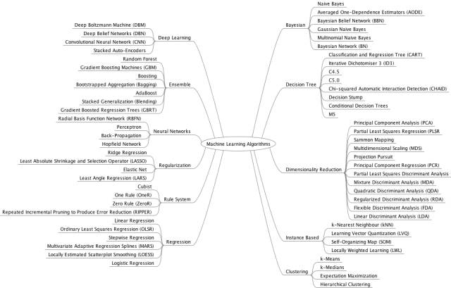

## 1. 神经网络架构（NeuralNetwork Architectures）

来源：http://www.asimovinstitute.org/neural-network-zoo/

## 2. Microsoft Azure算法流程图（Microsoft AzureAlgorithm Flowchart）

来源：https://docs.microsoft.com/en-us/azure/machine-learning/machine-learning-algorithm-cheat-sheet

## 3. SAS算法流程图（SAS Algorithm Flowchart）

来源：http://blogs.sas.com/content/subconsciousmusings/2017/04/12/machine-learning-algorithm-use/

## 4. 算法总结（AlgorithmSummary）

来源：http://machinelearningmastery.com/a-tour-of-machine-learning-algorithms/

来源: http://thinkbigdata.in/best-known-machine-learning-algorithms-infographic/

## 5. 算法优缺点（AlgorithmPro/Con）

来源：https://blog.dataiku.com/machine-learning-explained-algorithms-are-your-friend

## 6. Python

当然Python有很多在线资源。 对于本节只包括所遇到的最好的速查表。

算法（Algorithms）

来源：https://www.analyticsvidhya.com/blog/2015/09/full-cheatsheet-machine-learning-algorithms/

Python基础（Python Basics）

来源：http://datasciencefree.com/python.pdf

来源：https://www.datacamp.com/community/tutorials/python-data-science-cheat-sheet-basics#gs.0x1rxEA

## 7. Numpy

来源：https://www.dataquest.io/blog/numpy-cheat-sheet/

来源：http://datasciencefree.com/numpy.pdf

来源：https://www.datacamp.com/community/blog/python-numpy-cheat-sheet#gs.Nw3V6CE

来源：https://github.com/donnemartin/data-science-ipython-notebooks/blob/master/numpy/numpy.ipynb

## 8. Pandas

来源：http://datasciencefree.com/pandas.pdf

来源：https://www.datacamp.com/community/blog/python-pandas-cheat-sheet#gs.S4P4T=U

来源：https://github.com/donnemartin/data-science-ipython-notebooks/blob/master/pandas/pandas.ipynb

## 9. Matplotlib

来源：https://www.datacamp.com/community/blog/python-matplotlib-cheat-sheet

来源：https://github.com/donnemartin/data-science-ipython-notebooks/blob/master/matplotlib/matplotlib.ipynb

## 10. Scikit Learn

来源：http://peekaboo-vision.blogspot.de/2013/01/machine-learning-cheat-sheet-for-scikit.html

来源：http://peekaboo-vision.blogspot.de/2013/01/machine-learning-cheat-sheet-for-scikit.html

来源：https://github.com/rcompton/ml_cheat_sheet/blob/master/supervised_learning.ipynb

## 11. Tensorflow

来源：https://github.com/aymericdamien/TensorFlow-Examples/blob/master/notebooks/1_Introduction/basic_operations.ipynb

## 12. Pytorch

来源：https://github.com/bfortuner/pytorch-cheatsheet

## 13. 数学（Math）

如果你真的想了解机器学习，那么需要对统计（特别是概率）、线性代数和微积分的理解打下坚实的基础。在本科期间我辅修数学，但是我肯定需要复习这些知识。 这些速查表提供了大多数需要了解最常见的机器学习算法背后的数学。

概率（Probability）

来源：http://www.wzchen.com/s/probability_cheatsheet.pdf

## 14. 线性代数（Linear Algebra）

来源：https://minireference.com/static/tutorials/linear_algebra_in_4_pages.pdf

## 15. 统计学（Statistics）

来源：http://web.mit.edu/~csvoss/Public/usabo/stats_handout.pdf

## 16. 微积分（Calculus）