## 机器学习定义

**Arthur Samuel（1959）**：Machine Learning : Field of study that gives computers the ability to learn without being explicitly programmed. 在没有明确设置的情况下，使计算机具有学习能力的研究领域。

**Tom Mitchell（1998）**：Well-posed Learning Problem：A computer program is said to learn from experience E with respect to some task T and some performance measure P，if its performance on T，as measured by P，improves with experience E. 一个适当的学习问题定义如下：计算机程序从经验 E （程序与自己下上万次跳棋）中学习，解决某一任务 T （玩跳棋），进行某一性能度量 P （与新对手玩跳棋时赢的概率），通过 P 测定在 T 上的表现因经验 E 而提高。

更通俗来说：机器学习是关于在计算机上从数据中产生 “**模型**” 的算法，即 “**学习算法**” 。有了学习算法，我们把经验数据提供给它，它就能基于这些数据产生模型；在面对新的情况时（例如看到一个没剖开的西瓜），模型会给我们提供相应的判断（例如好瓜）。

## 基本术语

- **数据集 data set**：这组记录的集合称为一个数据集

- **样本 sample / 示例 instance / 特征向量 feature vector**：数据集中的每条记录时关于一个事件或对象的描述，称为一个示例 或 样本 或 特征向量

- **属性 attribute / 特征 feature**：反映事件或对象在某方面的表现或性质的事项，例如 “色泽” “根蒂” 等称为 属性 或 特征

- **属性值 attribute value**：属性上的取值称为 属性值。例如 “乌黑”

- **属性空间 attribute space / 样本空间 sample space / 输入空间**：属性张成的空间称为属性空间 或 样本空间 或 输入空间。例如把 “色泽” “根蒂” “敲声” 作为三个坐标轴，则它们张成一个用于描述西瓜的三维空间，每个西瓜都可在这个空间中找到自己的坐标位置。由于空间中的每个点对应一个坐标向量，因此我们也把 样本/示例 称为一个"特征向量"。

- **维数 dimensionality**：每个样本由 d 个属性描述，则 d 称为样本的维数

- **学习 learning / 训练 training**：从数据中学得模型的过程称为"学习"或"训练"，这个过程通过执行某个学习算法来完成

- **训练数据 training data**：训练过程中使用的数据称为训练数据

- **训练样本 training sample**：训练数据中的每个样本称为一个训练样本

- **训练集 training set**：训练样本组成的集合称为 训练集

- **假设 hypothesis**：学得模型对应了关于数据的某种潜在的规律，因此亦称"假设"

- **真相 / 真实 ground-truth**：这种潜在规律自身，则称为"真相"或"真实"。<u>学习过程就是为了找出或逼近真相</u>

- **标签 / 标记 label**：如果希望学得一个能帮助我们判断没剖开的是不是"好瓜"的模型，仅有前面的示例数据显然是不够的。要建立这样的关于 "预测" (prediction)模型，我们需获得训练样本的"结果"信息，例如 "((色泽=青绿; 根蒂=蜷缩; 敲声=浊响)，好瓜)"。这里关于示例结果的信息，例如"好瓜"，称为"标记 / 标签"。

  根据训练数据是否有标签，学习任务可分为监督学习和无监督学习。

- **样例 example**：有了标签信息的示例，则称为样例。一般的，用 $(x_i,y_i)$ 表示第 i 个样例，其中 $y_i$ 时是示例 $x_i$ 的标签

- **泛化能力 generalization**：机器学习的目标是使学得的模型能很好地适用于"新样本"，而不是仅仅在训练样本上工作得很好；即便对聚类这样的无监督学习任务，我们也希望学得的簇划分能适用于没在训练集中出现的样本。学得模型适用于新样本的能力，称为"泛化"能力。

## 算法分类

- **监督学习算法 (Supervised Algorithms）:**

 **Supervised learning**：We give the algorithm a data set，in which the "right answers" were given，and the task of the algorithm was to just produce more of these right answers. **我们给算法一个数据集，其中包含了正确答案，即这些数据是带有标签的，算法的目的就是给出更多的正确答案。**

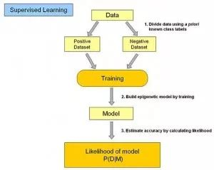
  
在监督式学习下，输入数据被称为`训练数据`，每组训练数据有一个明确的 标识。

如对防垃圾邮件系统中`垃圾邮件\非垃圾邮件`，对手写数字识别中的`1,2,3,4`等。

在监督学习训练过程中，可以由训练数据集学到或建立一个模式（函数 / learning model），并依此模式推测新的实例。

监督式学习建立一个学习过程，将`预测结果`与`训练数据`的实际结果进行比较，不断的调整预测模型，直到模型的预测结果达到一个预期的准确率。

该算法要求特定的`输入/输出`，首先需要决定使用哪种数据作为范例。  

监督式学习的常见应用场景如: 分类问题、回归问题。

1.回归问题(Regression)

回归问题即为预测一系列的连续值。

在房屋价格预测的例子中，给出了一系列的房屋面基数据，根据这些数据来预测任意面积的房屋价格。给出照片-年龄数据集，预测给定照片的年龄。

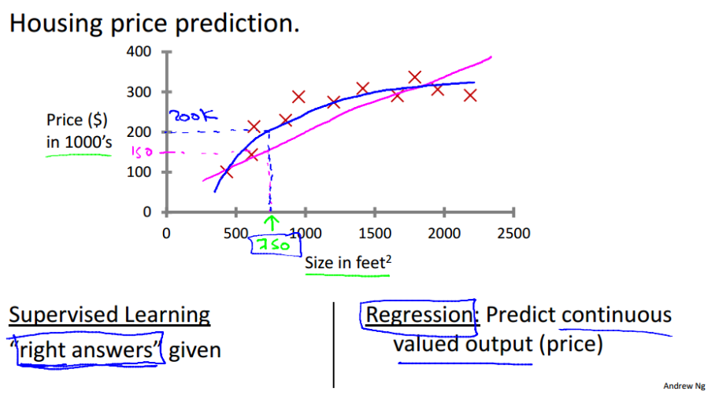

2.分类问题(Classification)

分类问题即为预测一系列的离散值。

即根据数据预测被预测对象属于哪个分类。

视频中举了癌症肿瘤这个例子，针对诊断结果，分别分类为良性或恶性。还例如垃圾邮件分类问题，也同样属于监督学习中的分类问题。

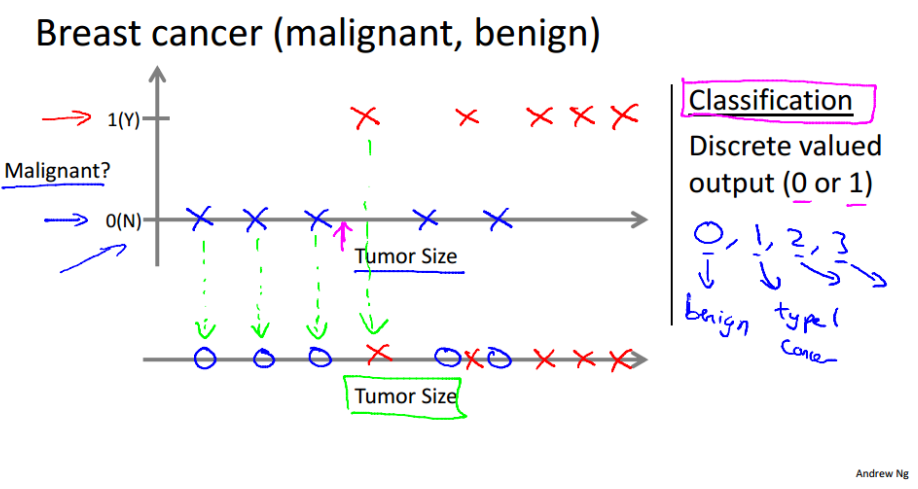

视频中提到支持向量机这个算法，旨在解决当特征量很大的时候(特征即如癌症例子中的肿块大小，颜色，气味等各种特征)，计算机内存一定会不够用的情况。支持向量机能让计算机处理无限多个特征。

常见算法有`逻辑回归（Logistic Regression）`和`反向传递神经网络（Back Propagation Neural Network）`。

主要算法包括：神经网络、支持向量机、最近邻居法、朴素贝叶斯法、决策树等。

- **非监督学习算法 (Unsupervised Algorithms):** 

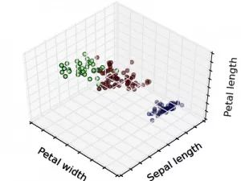

**对于无监督学习来说，我们的数据集没有任何标签**，或者说都具有相同的标签或者没有标签，即我们不知道什么是正确答案。我们拿到这个数据集，不知道要拿它做什么，也不知道每个数据点究竟是什么，我们只被告知这里有一个数据集，你能在其中找到某种结构来适配这些数据吗？

在非监督式学习中，数据并不被特别标识，学习模型是为了推断出数据的一些内在结构。

相对于监督学习，训练集不会有人为标注的结果（无反馈），我们不会给出结果或无法得知训练集的结果是什么样，而是单纯由计算机通过无监督学习算法自行分析，从而“得出结果”。

常见的应用场景包括`关联规则学习`以及`聚类`等。

对于给定的数据集，无监督学习算法可能将该数据集分成两个不同的簇，这就是**聚类算法 clustering algorithm**

1.聚类(Clustering)

  - 新闻聚合
    在例如谷歌新闻这样的网站中，每天后台都会收集成千上万的新闻，然后将这些新闻分组成一个个的新闻专题，这样一个又一个聚类，就是应用了无监督学习的结果。
    
  - DNA 个体聚类
  - 天文数据分析
  - 市场细分
  - 社交网络分析

2.非聚类(Non-clustering)

  - 鸡尾酒问题

常见算法包括`Apriori算法`以及`k-Means算法`。

两者的区别为是否需要人工参与数据结果的标注。这两部分的内容占比很大，并且很重要，掌握好了可以在以后的应用中节省大把大把的时间~

还有一些算法也属于机器学习领域，诸如：

- **半监督式学习:** 介于监督学习于无监督学习之间

输入数据部分被标识，部分没有被标识，这种学习模型可以用来进行预测，但是模型首先需要学习数据的内在结构以便合理组织数据来进行预测。

应用场景包括分类和回归，算法包括一些对常用监督式学习算法的延伸，这些算法首先试图对未标识数据进行建模，在此基础上再对标识的数据进行预测。

如`图论推理算法（Graph Inference）`或者`拉普拉斯支持向量机（Laplacian SVM.）`等。

- **强化学习算法 (Reinforcement Algorithms):** 通过观察来学习如何做出动作，每个动作都会对环境有所影响，而环境的反馈又可以引导该学习算法。

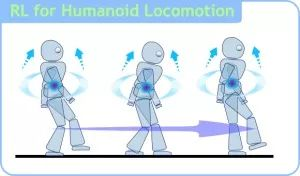

强化学习普适性强，主要`基于决策`进行训练，算法根据输出结果（决策）的成功或错误来训练自己，通过大量经验训练优化后的算法将能够给出较好的预测。

类似有机体在环境给予的奖励或惩罚的刺激下，逐步形成对刺激的预期，产生能获得最大利益的习惯性行为。

在这种学习模式下，输入数据作为对模型的反馈，不像监督模型那样，输入数据仅仅是作为一个检查模型对错的方式，在强化学习下，输入数据直接反馈到模型，模型必须对此立刻作出调整。

常见的应用场景包括动态系统以及机器人控制等。

常见算法包括`Q-Learning`以及`时间差学习（Temporal difference learning）`。

- 推荐算法: 没错，就是那些个买完某商品后还推荐同款的某购物网站所用的算法。

- 迁移学习

## 线性回归算法 - 寻找最佳拟合线

回归算法是试图采用对误差的衡量来探索变量之间的关系的一类算法。

在机器学习领域，人们说起回归，有时候是指一类问题，有时候是指一类算法，这一点常常会使初学者有所困惑。

回归分析是统计学的数据分析方法，目的在于了解两个或多个变量间是否相关、相关方向与强度，并建立数学模型以便观察特定变量来预测其它变量的变化情况。

线性回归算法(Linear Regression) 的建模过程就是`使用数据点来寻找最佳拟合线`。

公式`y = mx + c`，其中 y 是因变量，x 是自变量，利用给定的数据集求 m 和 c 的值。

线性回归又分为两种类型：

- `简单线性回归（simple linear regression)`，只有 1 个自变量；

- `多变量回归（multiple regression)`，至少两组以上自变量。

常见的回归算法包括：最小二乘法（Ordinary Least Square），逻辑回归（Logistic Regression），逐步式回归（Stepwise Regression），多元自适应回归样条（Multivariate Adaptive Regression Splines）以及本地散点平滑估计（Locally Estimated Scatterplot Smoothing）。

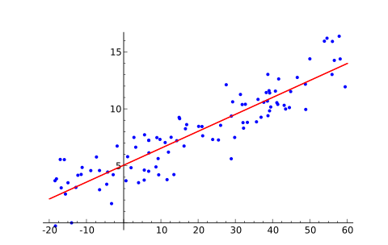

下面是一个线性回归示例：基于 Python scikit-learn 工具包描述。

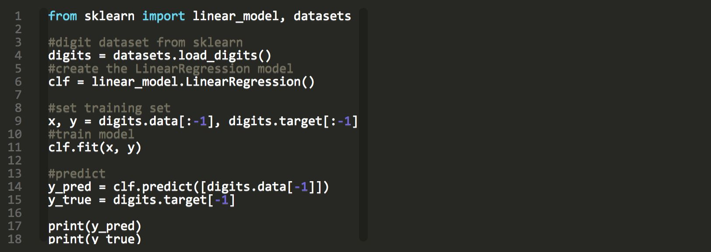

## 正则化方法 - 简单奖励复杂惩罚

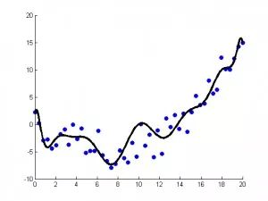

正则化方法是其他算法（通常是回归算法）的延伸，根据算法的复杂度对算法进行调整。

正则化方法通常对`简单模型予以奖励`而对`复杂算法予以惩罚`。

常见的算法包括：Ridge Regression， Least Absolute Shrinkage and Selection Operator（LASSO），以及弹性网络（Elastic Net）。

## 支持向量机算法 - 二元分类

支持向量机/网络算法(Support Vector Machine,SVM) 属于`分类`型算法。

SVM模型将实例表示为空间中的点，将使用一条直线分隔数据点。

需要注意的是，支持向量机需要`对输入数据进行完全标记`，仅直接适用于`两类任务`，应用将多类任务需要减少到几个`二元问题`。

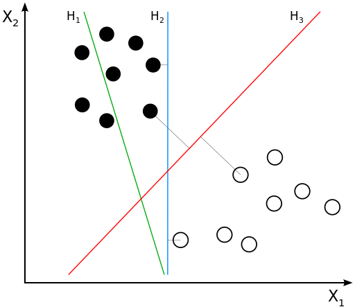

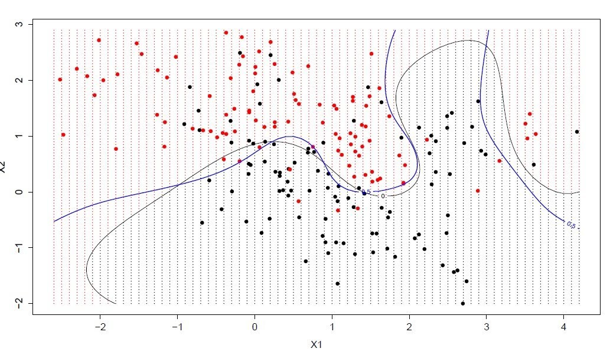

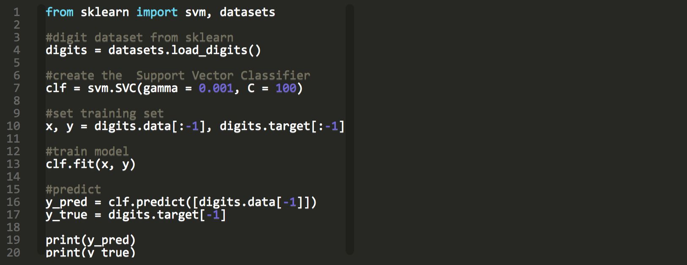

## 基于实例的算法 - 基于记忆学习

基于实例的算法常常用来`对决策问题`建立模型，这样的模型常常先选取`一批样本数据`，然后根据某些近似性把新数据与样本数据进行比较，通过这种方式来寻找最佳的匹配。

`k-Nearest Neighbor(KNN)`是一种基于实例的算法，或者是局部近似和将所有计算推迟到分类之后的惰性学习。

用最近的邻居（k）来`预测未知数据点`。

k 值是预测精度的一个关键因素，无论是分类还是回归，衡量邻居的权重都非常有用，较近邻居的权重 > 较远邻居的权重。

KNN 算法的缺点是对数据的局部结构非常敏感。计算量大，需要对数据进行规范化处理，使每个数据点都在相同的范围。

因此，基于实例的算法常常也被称为`赢家通吃`或者`基于记忆的学习`。

常见的算法包括 k-Nearest Neighbor(KNN), 学习矢量量化（Learning Vector Quantization，LVQ），以及自组织映射算法（Self-Organizing Map，SOM）。

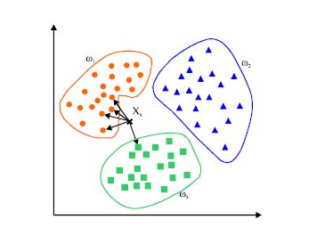

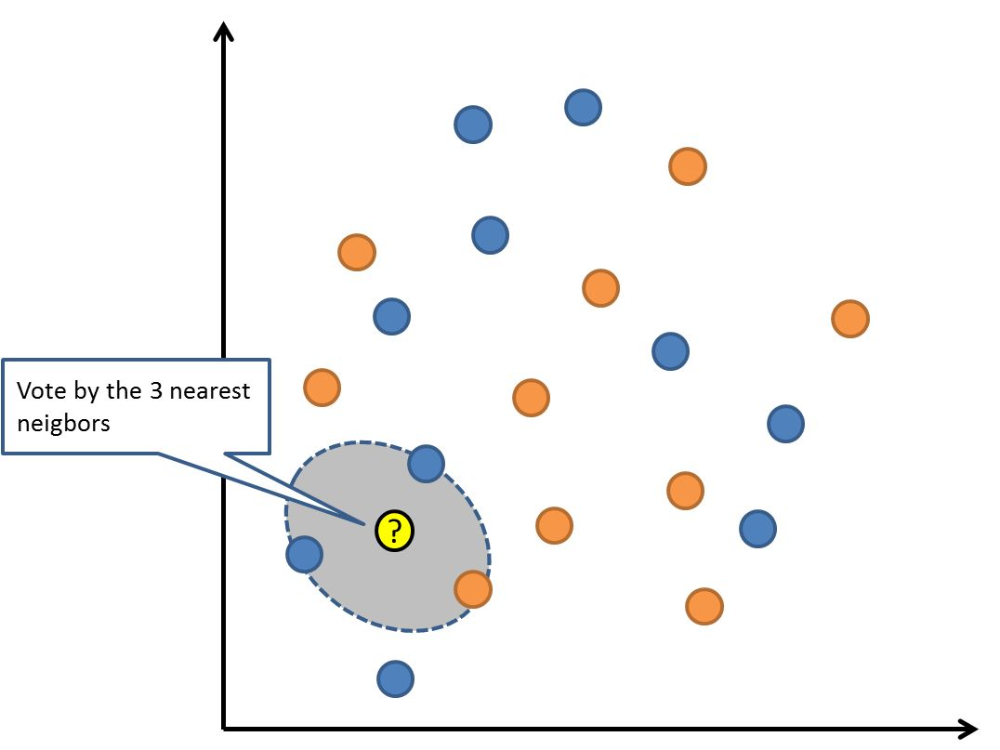

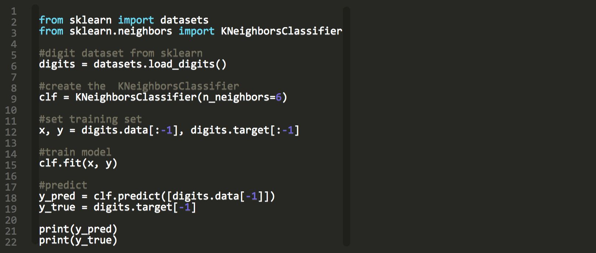

**延伸：**  
- KNN 的一个缺点是依赖于整个训练数据集，LVQ是一种监督学习的神经网络算法，允许你选择训练实例。  
- LVQ 由数据驱动，搜索距离它最近的两个神经元，对于同类神经元采取拉拢，异类神经元采取排斥，最终得到数据的分布模式。  
- 如果基于 KNN 可以获得较好的数据集分类效果，利用 LVQ 可以减少存储训练数据集存储规模。  
- 典型的学习矢量量化算法有LVQ1、LVQ2和LVQ3，尤以LVQ2的应用最为广泛。

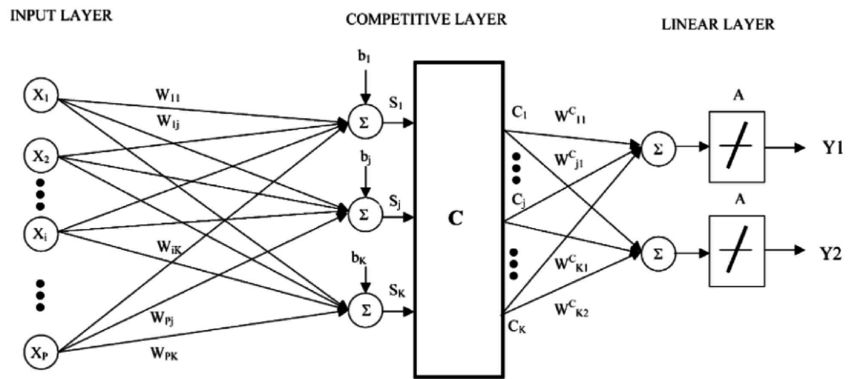

## 逻辑回归算法 - 概率值压缩

逻辑回归算法（Logistic Regression）一般用于需要`明确输出`的场景，如某些事件的发生（预测是否会发生降雨）。

通常逻辑回归使用某种函数将`概率值`压缩到某一特定范围（如：0-1 范围）。

例如，Sigmoid 函数（S 函数）是一种具有 S 形曲线、用于二元分类的函数。它将发生某事件的概率值转换为 0, 1 的范围表示。

`Y = E ^（b0＋b1 x）/（1 + E ^（b0＋b1 x ））`

以上是一个简单的逻辑回归方程，B0，B1是常数。这些常数值将被计算获得，以确保预测值和实际值之间的误差最小。

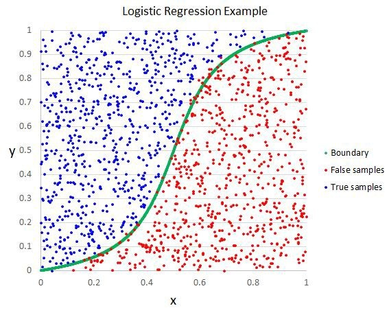

## 决策树算法 - 分类预测

决策树（Decision tree）是一种特殊的树结构，由一`个决策图`和`可能的结果`（例如成本和风险）组成，用来辅助决策。

机器学习中，决策树是一个预测模型，节点表示`某个对象`，分叉路径则代表`某个可能的属性值`，而每个叶节点则对应从根节点到该叶节点所经历的路径所表示的对象的值。

决策树仅有`单一`输出，通常该算法用于解决`分类`问题。

决策树算法根据`数据的属性`采用树状结构建立决策模型， 决策树模型常常用来解决分类和回归问题。

一个决策树包含三种类型的节点：
- 决策节点：通常用矩形框来表示
- 机会节点：通常用圆圈来表示
- 终结点：通常用三角形来表示

简单决策树算法案例，确定人群中谁喜欢使用信用卡。考虑人群的年龄和婚姻状况，如果年龄在30岁或是已婚，人们更倾向于选择信用卡，反之则更少。
通过确定合适的属性来定义更多的类别，可以进一步扩展此决策树。
在这个例子中，如果一个人结婚了，他超过30岁，他们更有可能拥有信用卡（100% 偏好）。测试数据用于生成决策树。

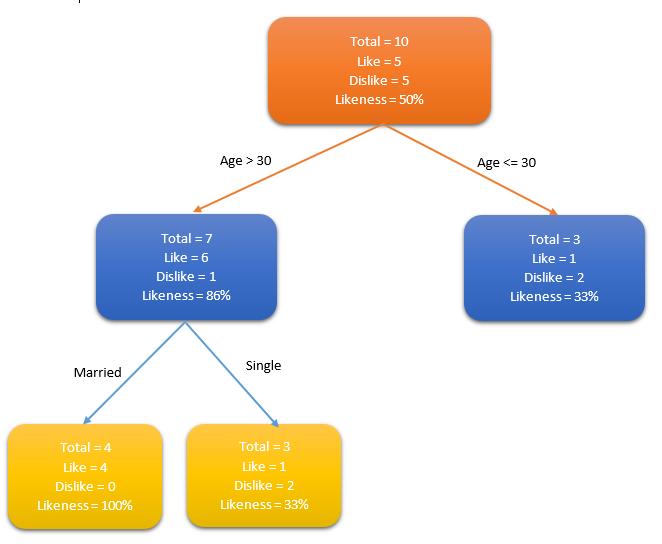

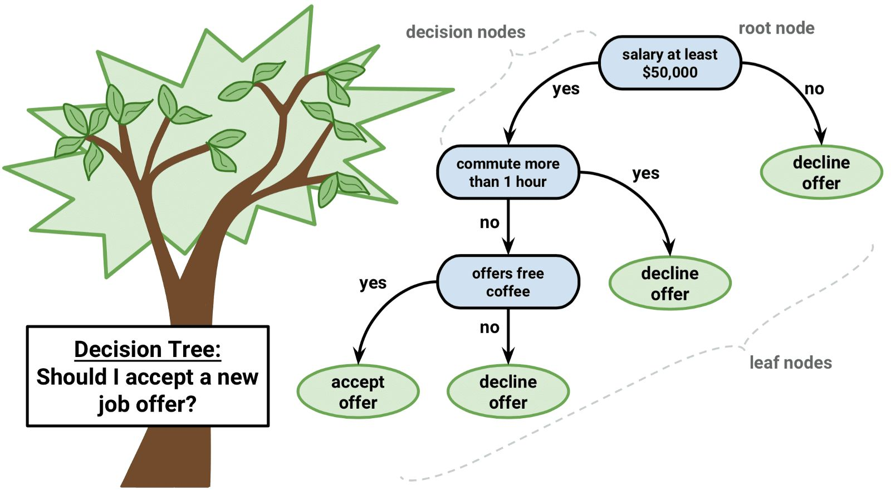

**注意：对于那些各类别样本数量不一致的数据，在决策树当中`信息增益`的结果偏向于那些具有`更多数值`的特征。**

## 聚类算法 - 最大共同点归类

`k-平均算法(K-Means)`是一种无监督学习算法，为聚类问题提供了一种解决方案。

聚类，就像回归一样，有时候人们描述的是一类问题，有时候描述的是一类算法。

聚类算法通常按照`中心点`或者`分层`的方式对输入数据进行归并。所以的聚类算法都试图找到数据的内在结构，以便按照`最大的共同点`将数据进行归类。

常见的聚类算法包括：`k-Means算法`以及期望`最大化算法（Expectation Maximization，EM）`。

K-Means 算法把 n 个点（可以是样本的一次观察或一个实例）划分到 k 个集群（cluster），使得每个点都属于离他最近的均值（即聚类中心，centroid）对应的集群。

重复上述过程一直持续到重心不改变。

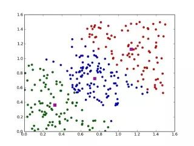

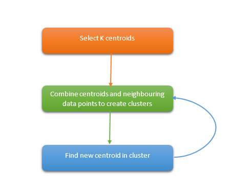

## 随机森林算法 - 投票分类

随机森林算法（Random Forest）的名称由 1995 年由贝尔实验室提出的random decision forests 而来，正如它的名字所说的那样，随机森林可以看作一个决策树的集合。

随机森林中`每棵决策树估计一个分类`，这个过程称为`投票（vote）`。理想情况下，我们根据每棵决策树的每个投票，选择最多投票的分类。

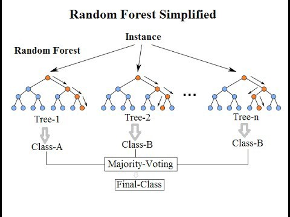

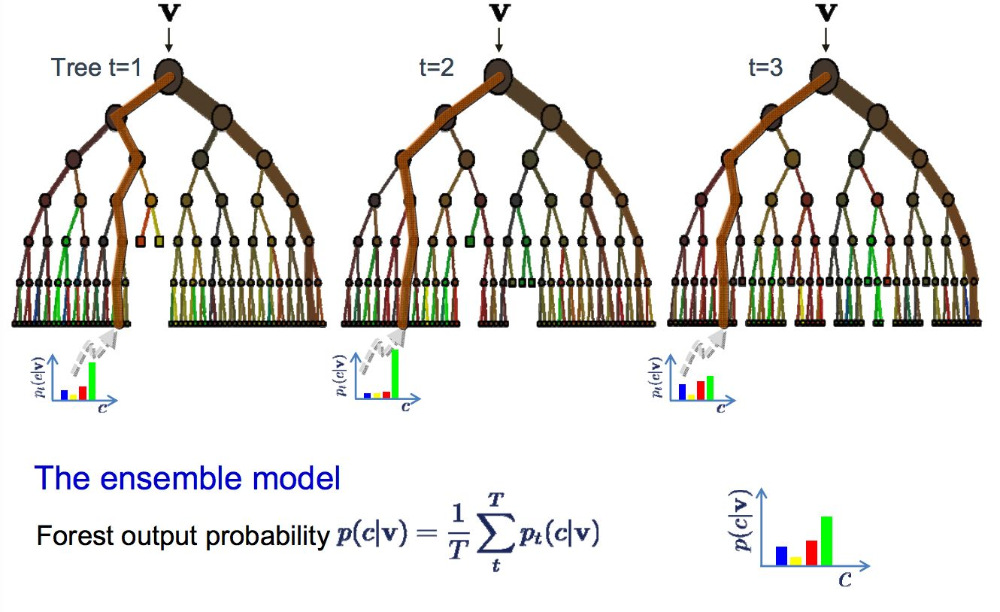

Paper [Random Forest |Leo Breiman | Statistics Department University of California Berkeley](https://www.stat.berkeley.edu/~breiman/randomforest2001.pdf)

## 朴素贝叶斯算法 - 独立特征

`朴素贝叶斯算法（Naive Bayes）`基于概率论的贝叶斯定理，应用广泛，从文本分类、垃圾邮件过滤器、医疗诊断等等，主要用来解决分类和回归问题。

朴素贝叶斯适用于特征之间的相互独立的场景，例如利用花瓣的长度和宽度来预测花的类型。`朴素`的内涵可以理解为特征和特征之间`独立性强`。

与朴素贝叶斯算法密切相关的一个概念是`最大似然估计(Maximum likelihood estimation)`，历史上大部分的最大似然估计理论也都是在贝叶斯统计中得到大发展。

例如：建立人口身高模型，很难有人力与物力去统计全国每个人的身高，但是可以通过采样，获取部分人的身高，然后通过最大似然估计来获取分布的均值与方差。

常见算法包括：朴素贝叶斯算法，平均单依赖估计（Averaged One-Dependence Estimators， AODE），以及Bayesian Belief Network（BBN）。

> Naive Bayes is called naive because it assumes that each input variable is independent.

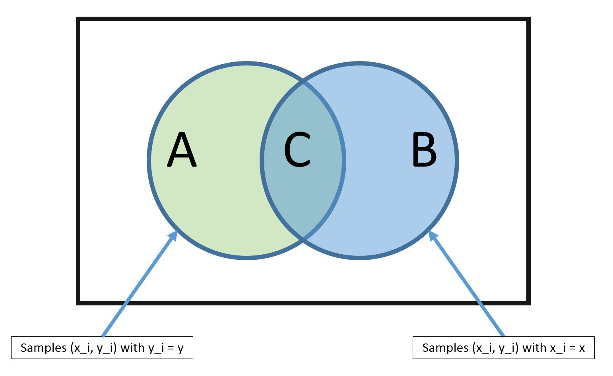

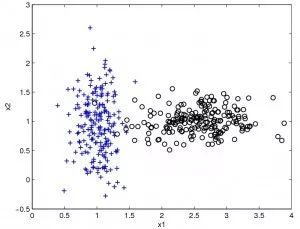

## 降维算法 - 获取影响最大因子

像聚类算法一样，降低维度算法（Dimensional Reduction）试图分析数据的内在结构，不过降低维度算法是以非监督学习的方式试图`利用较少的信息`来`归纳或者解释数据`。

这类算法可以用于`高维数据的可视化`或者用来`简化数据以便监督式学习`使用。

在机器学习和统计学领域，降维是指在限定条件下，降低随机变量个数，得到一组`不相关`主变量的过程，并可进一步细分为`特征选择`和`特征提取`两大方法。

一些数据集可能包含许多难以处理的变量。特别是资源丰富的情况下，系统中的数据将非常详细。在这种情况下，数据集可能包含数千个变量，其中大多数变量也可能是不必要的。

在这种情况下，几乎不可能确定对我们的预测影响最大的变量。此时，我们需要使用降维算法，降维的过程中也可能需要用到其他算法，例如借用`随机森林`，`决策树`来识别`最重要的变量`。

常见的算法包括：主成份分析（Principle Component Analysis，PCA），偏最小二乘回归（Partial Least Square Regression，PLS）， Sammon映射，多维尺度（Multi-Dimensional Scaling, MDS）,  投影追踪（Projection Pursuit）等。

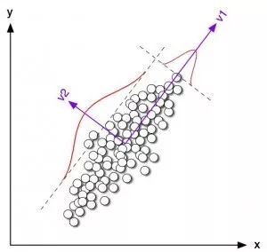

## 梯度增强算法 - 精度增强

梯度提升(Gradient Boosting)，就像随机森林一样，也是由`弱决策树`组成的。

最大的区别在于，在梯度提升中，树木被一个接一个地训练。每个后续树主要使用先前树`错误预测的数据`进行训练。

这使得梯度提升逐渐减少对易于预测的案例的关注，而更多地关注疑难案例。

梯度提升性能非常好，但是训练数据集中的`微小变化`可能会在模型中产生`根本性的变化`，因此它可能不会产生最可解释的结果。

梯度增强算法使用`多个弱算法`来创建更强大的精确算法。它与使用单个估计量不同，而是使用多个估计量创建一个更稳定和更健壮的算法。

梯度增强算法有几种：

- XGBoost: 使用线性和树算法

- LightGBM: 只使用基于树的算法

梯度增强算法的特点是精度较高。此外，LightGBM 算法具有令人难以置信的高性能。

## 遗传算法 - 滤噪，迭代，复杂

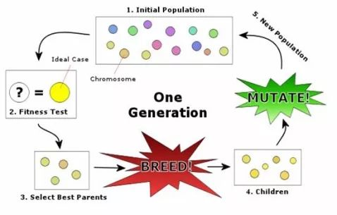

遗传算法（genetic algorithm）模拟生物繁殖的突变、交换和达尔文的自然选择（在每一生态环境中适者生存）。

它把问题可能的解编码为一个向量称为`个体`，向量的每一个元素称为`基因`。

利用目标函数（相应于自然选择标准）对群体（个体的集合）中的每一个个体进行评价，根据评价值（适应度）对个体进行选择、交换、变异等遗传操作，从而得到新的群体。

遗传算法适用于非常复杂和困难的环境。

**比如：带有`大量噪声和无关数据`、`事物不断更新`、`问题目标不能明显和精确地定义`，以及通过`很长的执行过程`才能确定当前行为的价值等。**

## 人工神经网络 - 模式匹配

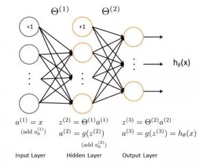

人工神经网络算法模拟生物神经网络，是一类`模式匹配`算法，通常用于解决分类和回归问题。

人工神经网络是机器学习的一个庞大的分支，有几百种不同的算法。（其中深度学习就是其中的一类算法，我们会单独讨论），

重要的人工神经网络算法包括：感知器神经网络（Perceptron Neural Network）, 反向传递（Back Propagation）， Hopfield网络，自组织映射（Self-Organizing Map, SOM）。

## 深度学习 - 存在少量未标识

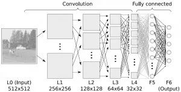

深度学习算法是对人工神经网络的发展。 在近期赢得了很多关注， 特别是百度也开始发力深度学习后， 更是在国内引起了很多关注。

在计算能力变得日益廉价的今天，深度学习试图建立大得多也复杂得多的神经网络。很多深度学习的算法是半监督式学习算法，用来处理`存在少量未标识数据`的大数据集。

常见的深度学习算法包括：

受限波尔兹曼机（Restricted Boltzmann Machine，RBN）， Deep Belief Networks（DBN），卷积网络（Convolutional Network）, 堆栈式自动编码器（Stacked Auto-encoders）。

## 集成算法 - 集成模型 结果整合

集成算法用一些`相对较弱的学习模型`独立地就`同样的样本`进行训练，然后把结果整合起来进行整体预测。

集成算法的主要难点在于**究竟集成哪些独立的较弱的学习模型**以及**如何把学习结果整合起来**。这是一类非常强大的算法，同时也非常流行。

常见的算法包括：

Boosting， Bootstrapped Aggregation（Bagging）， AdaBoost，堆叠泛化（Stacked Generalization， Blending），梯度推进机（Gradient Boosting Machine, GBM），随机森林（Random Forest），GBDT（Gradient Boosting Decision Tree）。

