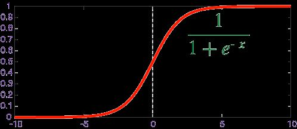

## 算法分类

- **监督学习算法 (Supervised Algorithms）:**

  
在监督式学习下，输入数据被称为“训练数据”，每组训练数据有一个明确的标识或结果，如对防垃圾邮件系统中“垃圾邮件”“非垃圾邮件”，对手写数字识别中的“1“，”2“，”3“，”4“等。

在监督学习训练过程中，可以由训练数据集学到或建立一个模式（函数 / learning model），并依此模式推测新的实例。

在建立预测模型的时候，监督式学习建立一个学习过程，将预测结果与“训练数据”的实际结果进行比较，不断的调整预测模型，直到模型的预测结果达到一个预期的准确率。

该算法要求特定的输入/输出，首先需要决定使用哪种数据作为范例。  

监督式学习的常见应用场景如分类问题和回归问题。常

见算法有逻辑回归（Logistic Regression）和反向传递神经网络（Back Propagation Neural Network）。

主要算法包括神经网络、支持向量机、最近邻居法、朴素贝叶斯法、决策树等。

- **非监督学习算法 (Unsupervised Algorithms):**

在非监督式学习中，数据并不被特别标识，学习模型是为了推断出数据的一些内在结构。

常见的应用场景包括关联规则的学习以及聚类等。常见算法包括Apriori算法以及k-Means算法。

- **半监督式学习:**

在此学习方式下，输入数据部分被标识，部分没有被标识，这种学习模型可以用来进行预测，但是模型首先需要学习数据的内在结构以便合理的组织数据来进行预测。

应用场景包括分类和回归，算法包括一些对常用监督式学习算法的延伸，这些算法首先试图对未标识数据进行建模，在此基础上再对标识的数据进行预测。

如图论推理算法（Graph Inference）或者拉普拉斯支持向量机（Laplacian SVM.）等。

- **强化学习算法 (Reinforcement Algorithms):**

强化学习普适性强，主要基于决策进行训练，算法根据输出结果（决策）的成功或错误来训练自己，通过大量经验训练优化后的算法将能够给出较好的预测。

类似有机体在环境给予的奖励或惩罚的刺激下，逐步形成对刺激的预期，产生能获得最大利益的习惯性行为。

在这种学习模式下，输入数据作为对模型的反馈，不像监督模型那样，输入数据仅仅是作为一个检查模型对错的方式，在强化学习下，输入数据直接反馈到模型，模型必须对此立刻作出调整。

常见的应用场景包括动态系统以及机器人控制等。常见算法包括Q-Learning以及时间差学习（Temporal difference learning）。

> 根据算法的功能和形式的类似性，我们可以把算法分类，比如说基于树的算法，基于神经网络的算法等等。当然，机器学习的范围非常庞大，有些算法很难明确归类到某一类。

## 线性回归算法 Linear Regression

回归算法是试图采用对误差的衡量来探索变量之间的关系的一类算法。在机器学习领域，人们说起回归，有时候是指一类问题，有时候是指一类算法，这一点常常会使初学者有所困惑。

回归分析（Regression Analysis）是统计学的数据分析方法，目的在于了解两个或多个变量间是否相关、相关方向与强度，并建立数学模型以便观察特定变量来预测其它变量的变化情况。

线性回归算法（Linear Regression）的建模过程就是使用数据点来寻找最佳拟合线。

公式，y = mx + c，其中 y 是因变量，x 是自变量，利用给定的数据集求 m 和 c 的值。

线性回归又分为两种类型，即简单线性回归（simple linear regression)，只有 1 个自变量；多变量回归（multiple regression)，至少两组以上自变量。

常见的回归算法包括：最小二乘法（Ordinary Least Square），逻辑回归（Logistic Regression），逐步式回归（Stepwise Regression），多元自适应回归样条（Multivariate Adaptive Regression Splines）以及本地散点平滑估计（Locally Estimated Scatterplot Smoothing）。

下面是一个线性回归示例：基于 Python scikit-learn 工具包描述。

## 正则化方法

正则化方法是其他算法（通常是回归算法）的延伸，根据算法的复杂度对算法进行调整。正则化方法通常对简单模型予以奖励而对复杂算法予以惩罚。

常见的算法包括：Ridge Regression， Least Absolute Shrinkage and Selection Operator（LASSO），以及弹性网络（Elastic Net）。

## 支持向量机算法(Support Vector Machine,SVM)

支持向量机/网络算法(SVM)属于分类型算法。

SVM模型将实例表示为空间中的点，将使用一条直线分隔数据点。

需要注意的是，支持向量机需要对输入数据进行完全标记，仅直接适用于两类任务，应用将多类任务需要减少到几个二元问题。

## 最近邻居/k-近邻算法 (K-Nearest Neighbors,KNN)

KNN算法是一种基于实例的学习，或者是局部近似和将所有计算推迟到分类之后的惰性学习。用最近的邻居（k）来预测未知数据点。k 值是预测精度的一个关键因素，无论是分类还是回归，衡量邻居的权重都非常有用，较近邻居的权重比较远邻居的权重大。

KNN 算法的缺点是对数据的局部结构非常敏感。计算量大，需要对数据进行规范化处理，使每个数据点都在相同的范围。

基于实例的算法常常用来对决策问题建立模型，这样的模型常常先选取一批样本数据，然后根据某些近似性把新数据与样本数据进行比较。通过这种方式来寻找最佳的匹配。

因此，基于实例的算法常常也被称为“赢家通吃”学习或者“基于记忆的学习”。

常见的算法包括 k-Nearest Neighbor(KNN), 学习矢量量化（Learning Vector Quantization， LVQ），以及自组织映射算法（Self-Organizing Map ， SOM）。

延伸：KNN 的一个缺点是依赖于整个训练数据集，学习向量量化（Learning Vector Quantization，LVQ)是一种监督学习的人神经网络算法，允许你选择训练实例。LVQ 由数据驱动，搜索距离它最近的两个神经元，对于同类神经元采取拉拢，异类神经元采取排斥，最终得到数据的分布模式。如果基于 KNN 可以获得较好的数据集分类效果，利用 LVQ 可以减少存储训练数据集存储规模。典型的学习矢量量化算法有LVQ1、LVQ2和LVQ3，尤以LVQ2的应用最为广泛。

## 逻辑回归算法 Logistic Regression

逻辑回归算法（Logistic Regression）一般用于需要明确输出的场景，如某些事件的发生（预测是否会发生降雨）。通常，逻辑回归使用某种函数将概率值压缩到某一特定范围。

例如，Sigmoid 函数（S 函数）是一种具有 S 形曲线、用于二元分类的函数。它将发生某事件的概率值转换为 0, 1 的范围表示。

Y = E ^（b0＋b1 x）/（1 + E ^（b0＋b1 x ））

以上是一个简单的逻辑回归方程，B0，B1是常数。这些常数值将被计算获得，以确保预测值和实际值之间的误差最小。

## 决策树算法 Decision Tree

决策树（Decision tree）是一种特殊的树结构，由一个决策图和可能的结果（例如成本和风险）组成，用来辅助决策。机器学习中，决策树是一个预测模型，树中每个节点表示某个对象，而每个分叉路径则代表某个可能的属性值，而每个叶节点则对应从根节点到该叶节点所经历的路径所表示的对象的值。决策树仅有单一输出，通常该算法用于解决分类问题。

决策树算法根据数据的属性采用树状结构建立决策模型， 决策树模型常常用来解决分类和回归问题。

一个决策树包含三种类型的节点：
- 决策节点：通常用矩形框来表示
- 机会节点：通常用圆圈来表示
- 终结点：通常用三角形来表示

简单决策树算法案例，确定人群中谁喜欢使用信用卡。考虑人群的年龄和婚姻状况，如果年龄在30岁或是已婚，人们更倾向于选择信用卡，反之则更少。
通过确定合适的属性来定义更多的类别，可以进一步扩展此决策树。在这个例子中，如果一个人结婚了，他超过30岁，他们更有可能拥有信用卡（100% 偏好）。测试数据用于生成决策树。

注意：对于那些各类别样本数量不一致的数据，在决策树当中信息增益的结果偏向于那些具有更多数值的特征。

## 聚类算法

k-平均算法(K-Means)是一种无监督学习算法，为聚类问题提供了一种解决方案。

聚类，就像回归一样，有时候人们描述的是一类问题，有时候描述的是一类算法。

聚类算法通常按照中心点或者分层的方式对输入数据进行归并。所以的聚类算法都试图找到数据的内在结构，以便按照最大的共同点将数据进行归类。

常见的聚类算法包括 k-Means算法以及期望最大化算法（Expectation Maximization， EM）。

K-Means 算法把 n 个点（可以是样本的一次观察或一个实例）划分到 k 个集群（cluster），使得每个点都属于离他最近的均值（即聚类中心，centroid）对应的集群。

重复上述过程一直持续到重心不改变。

## 随机森林算法 Random Forest

随机森林算法（Random Forest）的名称由 1995 年由贝尔实验室提出的random decision forests 而来，正如它的名字所说的那样，随机森林可以看作一个决策树的集合。

随机森林中每棵决策树估计一个分类，这个过程称为“投票（vote）”。理想情况下，我们根据每棵决策树的每个投票，选择最多投票的分类。

Paper [Random Forest |Leo Breiman | Statistics Department University of California Berkeley](https://www.stat.berkeley.edu/~breiman/randomforest2001.pdf)

## 朴素贝叶斯算法 Naive Bayes

朴素贝叶斯算法（Naive Bayes）基于概率论的贝叶斯定理，应用非常广泛，从文本分类、垃圾邮件过滤器、医疗诊断等等。

朴素贝叶斯适用于特征之间的相互独立的场景，例如利用花瓣的长度和宽度来预测花的类型。“朴素”的内涵可以理解为特征和特征之间独立性强。

与朴素贝叶斯算法密切相关的一个概念是最大似然估计(Maximum likelihood estimation)，历史上大部分的最大似然估计理论也都是在贝叶斯统计中得到大发展。

例如，建立人口身高模型，很难有人力与物力去统计全国每个人的身高，但是可以通过采样，获取部分人的身高，然后通过最大似然估计来获取分布的均值与方差。

贝叶斯方法算法是基于贝叶斯定理的一类算法，主要用来解决分类和回归问题。

常见算法包括：朴素贝叶斯算法，平均单依赖估计（Averaged One-Dependence Estimators， AODE），以及Bayesian Belief Network（BBN）。

> Naive Bayes is called naive because it assumes that each input variable is independent.

## 降维算法 Dimensional Reduction

像聚类算法一样，降低维度算法试图分析数据的内在结构，不过降低维度算法是以非监督学习的方式试图利用较少的信息来归纳或者解释数据。

这类算法可以用于高维数据的可视化或者用来简化数据以便监督式学习使用。

在机器学习和统计学领域，降维是指在限定条件下，降低随机变量个数，得到一组“不相关”主变量的过程，并可进一步细分为特征选择和特征提取两大方法。

一些数据集可能包含许多难以处理的变量。特别是资源丰富的情况下，系统中的数据将非常详细。在这种情况下，数据集可能包含数千个变量，其中大多数变量也可能是不必要的。

在这种情况下，几乎不可能确定对我们的预测影响最大的变量。此时，我们需要使用降维算法，降维的过程中也可能需要用到其他算法，例如借用随机森林，决策树来识别最重要的变量。

常见的算法包括：主成份分析（Principle Component Analysis， PCA），偏最小二乘回归（Partial Least Square Regression，PLS）， Sammon映射，多维尺度（Multi-Dimensional Scaling, MDS）,  投影追踪（Projection Pursuit）等。

## 梯度增强算法 Gradient Boosting

梯度提升，就像随机森林一样，也是由“弱”决策树组成的。最大的区别在于，在梯度提升中，树木被一个接一个地训练。每个后续树主要使用先前树错误预测的数据进行训练。这使得梯度提升逐渐减少对易于预测的案例的关注，而更多地关注疑难案例。

梯度提升性能非常好。但是，训练数据集中的微小变化可能会在模型中产生根本性的变化，因此它可能不会产生最可解释的结果。

梯度增强算法使用多个弱算法来创建更强大的精确算法。它与使用单个估计量不同，而是使用多个估计量创建一个更稳定和更健壮的算法。梯度增强算法有几种：

XGBoost — 使用线性和树算法

LightGBM — 只使用基于树的算法

梯度增强算法的特点是精度较高。此外，LightGBM 算法具有令人难以置信的高性能。

## 遗传算法（genetic algorithm）

遗传算法模拟生物繁殖的突变、交换和达尔文的自然选择（在每一生态环境中适者生存）。

它把问题可能的解编码为一个向量，称为个体，向量的每一个元素称为基因，并利用目标函数（相应于自然选择标准）对群体（个体的集合）中的每一个个体进行评价，根据评价值（适应度）对个体进行选择、交换、变异等遗传操作，从而得到新的群体。

遗传算法适用于非常复杂和困难的环境，比如，带有大量噪声和无关数据、事物不断更新、问题目标不能明显和精确地定义，以及通过很长的执行过程才能确定当前行为的价值等。

## 人工神经网络

人工神经网络算法模拟生物神经网络，是一类模式匹配算法。

通常用于解决分类和回归问题。人工神经网络是机器学习的一个庞大的分支，有几百种不同的算法。（其中深度学习就是其中的一类算法，我们会单独讨论），

重要的人工神经网络算法包括：感知器神经网络（Perceptron Neural Network）, 反向传递（Back Propagation）， Hopfield网络，自组织映射（Self-Organizing Map, SOM）。

## 深度学习

深度学习算法是对人工神经网络的发展。 在近期赢得了很多关注， 特别是百度也开始发力深度学习后， 更是在国内引起了很多关注。

在计算能力变得日益廉价的今天，深度学习试图建立大得多也复杂得多的神经网络。很多深度学习的算法是半监督式学习算法，用来处理存在少量未标识数据的大数据集。

常见的深度学习算法包括：受限波尔兹曼机（Restricted Boltzmann Machine， RBN）， Deep Belief Networks（DBN），卷积网络（Convolutional Network）, 堆栈式自动编码器（Stacked Auto-encoders）。

## 集成算法

集成算法用一些相对较弱的学习模型独立地就同样的样本进行训练，然后把结果整合起来进行整体预测。

集成算法的主要难点在于究竟集成哪些独立的较弱的学习模型以及如何把学习结果整合起来。这是一类非常强大的算法，同时也非常流行。

常见的算法包括：Boosting， Bootstrapped Aggregation（Bagging）， AdaBoost，堆叠泛化（Stacked Generalization， Blending），梯度推进机（Gradient Boosting Machine, GBM），随机森林（Random Forest），GBDT（Gradient Boosting Decision Tree）。

