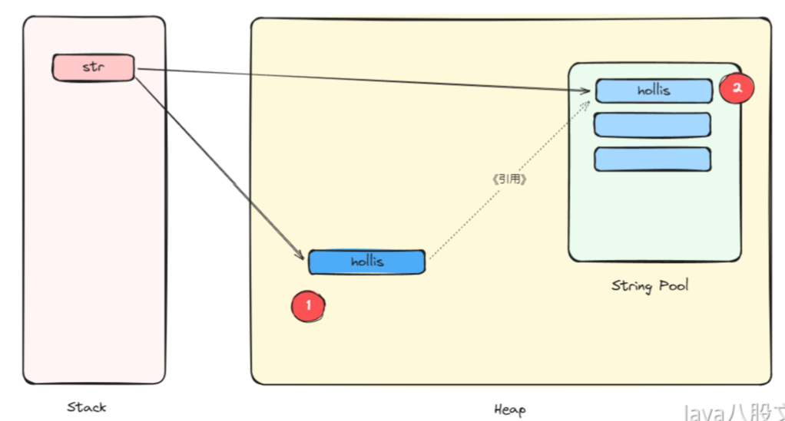
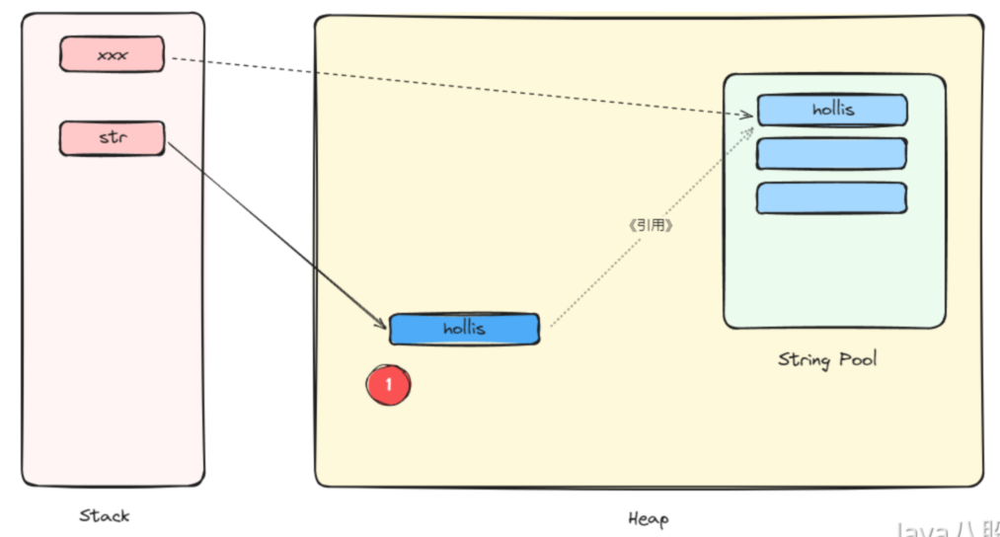

# java基础

## 为什么Java不支持多继承

因为如果要实现多继承，就会像C++中一样，存在菱形继承的问题，C++为了解决菱形继承问题，又引入了虚继承。

除了菱形的问题，支持多继承复杂度也会增加。一个类继承了多个父类，可能会继承大量的属性和方法导致类的接口变得庞大、难以理解和维护。此外，在修改一个父类时，可能会影响到多个子类，增加了代码的耦合度。

Java支持同时实现多个接口，这就相当于通过implements就可以从多个接口中继承到多个方法了，但是，Java8中为了避免萎形继承的问题，在实现的多个接口中如果有相同方法，就会要求该类必须重写这个方法。

Java不支持多继承，但是是支持多实现的，也就是说，同一个类可以同时实现多个接口。

我们知道，在Java 8以前，接口中是不能有方法的实现的。Java 8中支持了默认函数(default method)，即接口中可以定义一个有方法体的方法了。
多实现后，子类必须重写方法，不然编译错误。

## 接口和抽象类的区别，如何选择？

方法定义:
接口和抽象类，最明显的区别就是接口只是定义了一些方法而已，在不考虑Java8中default方法情况下，接口中只有抽象方法，是没有实现的代码的。(
Java8中可以有默认方法)

修饰符:抽象类中的修饰符可以有public、protected和private和<default>
这些修饰符，而接口中默认修饰符是public。不可以使用其它修饰符。(接口中，如果定义了成员变量，还必须要初始化)

构造器:抽象类可以有构造器。接口不能有构造器

继承和实现:接口可以被实现，抽象类可以被继承

单继承，多实现:一个类可以实现多个接口，但只能继承一个抽象类。接口支持多重继承，即一个接口可以继承多个其他接口。

职责不同:接口和抽象类的职责不一样。接口主要用于制定规范，因为我们提倡也经常使用的都是面向接口编程。而抽象类主要目的是为了复用，比较典型的就是模板方法模式。

所以当我们想要定义标准、规范的时候，就使用接口。当我们想要复用代码的时候，就使用抽象类。

## 如何理解Java中的多态？

多态就是同一操作作用于不同的对象，可以有不同的解释，产生不同的执行结果。

如果按照这个概念来定义的话，那么多态应该是一种运行期的状态。为了实现运行期的多态，或者说是动态绑定，需要满足三个条件:

- 有类继承或者接口实现。
- 子类要重写父类的方法。
- 父类的引用指向子类的对象。

## 方法重载和重写

重载是就是函数或者方法有同样的名称，但是参数列表不相同的情形，这样的同名不同参数的函数或者方法之间，互相称之为重载函数或者方法。

重写指的是在Java的子类与父类中有两个名称、参数列表都相同的方法的情况。由于他们具有相同的方法签名，所以子类中的新方法将覆盖父类中原有的方法。

## Java中有了基本类型为什么还需要包装类？

| 分类  | 基本数据类型  |    包装     | 长度  |                   表示范围 |
|:----|:-------:|:---------:|:---:|-----------------------:|
| 布尔型 | boolean |  Boolean  | 1字节 |                      - |
| 整型  |  byte   |   Byte    | 1字节 |               -128到127 |
| 整型  |  short  |   Short   | 2字节 |           -32768到32767 |
| 整型  |   int   |  Integer  | 4字节 | -2147483648到2147483647 |
| 整型  |  long   |   Long    | 8字节 |           -2^32-2^32-1 |
| 字符型 |  char   | Character | 2字节 |        Unicode字符集中任何字符 |
| 浮点型 |  float  |   Float   | 4字节 |         -3.4E38到3.4E38 |
| 浮点型 | double  |  Double   | 8字节 |       -1.7E308到1.7E308 |

因为Java是一种面向对象语言，很多地方都需要使用对象而不是基本数据类型比如，在集合类中，我们是无法将int、double等类型放进去的。因为集合的容器要求元素是Object类型。

基本类型和包装类型的区别
1.默认值不同，基本类型的默认值为0,false或\u0000等，包装类默认为nul
2.初始化方式不同，一个需要new，一个不需要
3.存储方式不同，基本类型保存在栈上，包装类对象保存在堆上(成员变量的话，在不考虑JT优化的栈上分配时，都是随着对象一起保存在堆上的)

在Java SE 5中，为了减少开发人员的工作，Java提供了自动拆箱与自动装箱功能。
自动装箱: 就是将基本数据类型自动转换成对应的包装类，
自动拆箱:就是将包装类自动转换成对应的基本数据类型
自动装箱都是通过包装类的 value0f()方法来实现的.自动拆箱都是通过包装类对象的 xxxValue()来实现的，
如:int的自动装箱都是通过Integer.value0f()方法来实现的，Integer的自动拆箱都是通过 Integer.intValue()来实现的。

**自动拆装箱与缓存**

```java
public static void main(String... strings) {
    Integer i1 = 3;
    Integer i2 = 3;
    Integer i3 = 300;
    Integer i4 = 300;
    
    System.out.println(i1 == i2);//true
    System.out.println(i3 == i4);//false
}
```
我们普遍认为上面的两个判断的结果都是false。
虽然比较的值是相等的，但是由于比较的是对象，而对象的引用不一样，所以会认为两个if判断都是false的。
在Java中，==比较的是对象引用，而equals比较的是值。
所以，在这个例子中不同的对象有不同的引用，所以在进行比较的时候都将返回false。
奇怪的是，这里两个类似的if条件判断返回不同的布尔值。

原因就和Integer中的缓存机制有关。
在Java5中，在Integer的操作上引入了一个新功能来节省内存和提高性能。
整型对象通过使用相同的对象引用实现了缓存和重用。

我们只需要知道，当需要进行自动装箱时，如果数字在-128至127之间时，会直接使用缓存中的对象，而不是重新创建一个对象。

其中的javadoc详细的说明了缓存支持-128到127之间的自动装箱过程。最大值127可以通过-XX:AutoBoxCacheMax=size 修改。

实际上这个功能在Java 5中引入的时候,范围是固定的-128 至 +127。后来在Java 6中，可以通过 java.lang.Integer.IntegerCache.high 设置最大值。

这使我们可以根据应用程序的实际情况灵活地调整来提高性能，到底是什么原因选择这个-128到127范围呢?因为这个范围的数字是最被广泛使用的。在程序中，第一次使用Integer的时候也需要一定的额外时间来初始化这个缓存。


## 为什么不能用浮点数表示金额？

因为不是所有的小数都能用二进制表示(扩展知识中介绍为啥不能表示)，所以，为了解决这个问题，IEEE提出了一种使用近似值表示小数的方式，并且引入了精度的概念。这就是我们所熟知的浮点数

比如0.1+0.2!=0.3，而是等于0.30000000000000004(甚至有一个网站就叫做 https://0.30000000000000004.com/，就是来解释这个现象的)

所以，浮点数只是近似值，并不是精确值，所以不能用来表示金额。否则会有精度丢失。

在Java中，使用float表示单精度浮点数，double表示双精度浮点数，表示的都是近似值。
所以，在Java代码中，千万不要使用float或者double来进行高精度运算，尤其是金额运算，否则就很容易产生资损问题。
为了解决这样的精度问题，Java中提供了BigDecimal来进行精确运算

## 为什么不能用BigDecimal的equals方法做等值比较？

因为BigDecimal的equals方法和compareTo并不一样，equals方法会比较两部分内容，分别是值(value)和标度(scale)，而对于0.1和0.10这两个数字，他们的值虽然一样，但是精度是不一样的，所以在使用equals比较的时候会返回false。

因为BigDecimal是对象，所以不能用 == 来判断两个数字的值是否相等。

```java
BigDecimal b1 = new BigDecimal(1);
BigDecimal b2 = new BigDecimal(1);
BigDecimal b3 = new BigDecimal(1.0);
BigDecimal b4 = new BigDecimal("1");
BigDecimal b5 = new BigDecimal("1.0");
System.out.println(b1.equals(b2));//true
System.out.println(b1.equals(b3));//true
System.out.println(b1.equals(b4));//true
System.out.println(b4.equals(b5));//false
```
首先，最简单的就是BigDecimal(long)和BigDecimal(int)，因为是整数，所以标度就是0;

对于BigDecimal(double)，当我们使用new BigDecimal(0.1)创建一个BigDecimal 的时候，其实创建出来的值并不是整好等于0.1的，而是0.1000000000000000055511151231257827021181583404541015625这是因为double自身表示的只是一个近似值。

而对于BigDecimal(String)当我们使用new BigDecimal("0.1”)创建一个BigDecimal 的时候，其实创建出来的值正好就是等于0.1的。那么他的标度也就是1。
如果使用new BigDecimal("0.10000")，那么创建出来的数就是0.10000，标度也就是5。 
所以，因为BigDecimal("1.0")和BigDecimal("1.00")的标度不一样，所以在使用equals方法比较的时候，得到的结果就是false。

BigDecimal中提供了compareTo方法，这个方法就可以只比较两个数字的值如果两个数相等，则返回0。
```java
BigDecimal b6 = new BigDecimal("1.0");
BigDecimal b7 = new BigDecimal("1.00");
System.out.println(b6.equals(b7));//false
System.out.println(b6.compareTo(b7)); //两个数相等，返回0
```

## 为什么对Java中的负数取绝对值结果不一定是正数？

整型中，每个类型都有一定的表示范围，但是，在程序中有些计算会导致超出表示范围，即溢出。

```java
nti= Integer.MAX VALUE; 
intj= Integer.MAX VALUE; 
int k =i +System.out.println("i(" +i+ ")+j("+j+ ")= k ("+ k + ")");
```
输出结果:i(2147483647)+j(2147483647)=k(-2)

这就是发生了溢出，溢出的时候并不会抛异常，也没有任何提示。
所以，在程序中，使用同类型的数据进行运算的时候，一定要注意数据溢出的问题。

## String、StringBuilder和StringBuffer的区别？

String是不可变的，StringBuilder和StringBuffer是可变的。而StringBuffer是线程安全的，而StringBuilder是非线程安全的。

Java中的+对字符串的拼接，其实现原理是使用StringBuilder.append
不要在for循环中使用+拼接字符串,在 for循环中，每次都是new了一个StringBuilder，然后再把String 转成 StringBuilder ，再进行append。

## String为什么设计成不可变的？

1.缓存：字符串是使用最广泛的数据结构。大量的字符串的创建是非常耗费资源的，所以，Java提供了对字符串的缓存功能，可以大大的节省堆空间。 JVM中专门开辟了一部分空间来存储Java字符串，那就是字符串池。 通过字符串池，两个内容相同的字符串变量，可以从池中指向同一个字符串对象，从而节省了关键的内存资源。
2.安全性：字符串在Java应用程序中广泛用于存储敏感信息，如用户名、密码、连接ur、网络连接等。JVM类加载器在加载类的时也广泛地使用它。 因此，保护String类对于提升整个应用程序的安全性至关重要。 当我们在程序中传递一个字符串的时候，如果这个字符串的内容是不可变的，那么我们就可以相信这个字符串中的内容。 但是，如果是可变的，那么这个字符串内容就可能随时都被修改。那么这个字符串内容就完全不可信了。这样整个系统就没有安全性可言了。
3.线程安全：不可变会自动使字符串成为线程安全的，因为当从多个线程访问它们时，它们不会被更改。 因此，一般来说，不可变对象可以在同时运行的多个线程之间共享。它们也是线程安全的，因为如果线程更改了值，那么将在字符串池中创建一个新的字符串，而不是修改相同的值。因此，字符串对于多线程来说是安全的。
4.hashcode缓存：由于字符串对象被广泛地用作数据结构，它们也被广泛地用于哈希实现，如HashMap、HashTable、HashSet等。在对这些散列实现进行操作时，经常调用hashCode()方法。 不可变性保证了字符串的值不会改变。因此，hashCode()方法在String类中被重写，以方便缓存，这样在第一次hashCode()调用期间计算和缓存散列，并从那时起返回相同的值。

## String str=new String("abc")创建了几个对象？

创建的对象数应该是1个或者2个
首先要清楚什么是对象?
Java是一种面向对象的语言，而Java对象在JVM中的存储也是有一定的结构的在HotSpot虚拟机中，存储的形式就是oop-klass model，即Java对象模型。
我们在Java代码中，使用new创建一个对象的时候，IVM会创建一个instanceOopDesc对象，这个对象中包含了两部分信息，对象头以及元数据。对象头中有一些运行时数据，其中就包括和多线程相关的锁的信息。元数据其实维护的是指针，指向的是对象所属的类的instanceKlass。
这才叫对象。其他的，一概都不叫对象。
那么不管怎么样，一次new的过程，都会在堆上创建一个对象，那么就是起码有一个对象了。至于另外一个对象，到底有没有要看具体情况了。
另外这一个对象就是常量池中的字符串常量，这个字符串其实是类编译阶段就进到Class常量池的，然后在运行期，字符串常量在第一次被调用(准确的说是Idc指令)的时候，进行解析并在字符串池中创建对应的String实例的。

所以，如果是第一次执行，那么就是会同时创建两个对象。一个字符串常量引用指向的对象，一个我们new出来的对象。

如果不是第一次执行，那么就只会创建我们自己new出来的对象，



## intern

当一个 String 实例调用 intern()方法时，Java查找常量池中是否有相同Unicode的字符串常量，如果有，则返回其的引用，如果没有，则在常量池中增加一个Unicode等于str的字符串并返回它的引用

intern()有两个作用，第一个是将字符串字面量放入常量池(如果池没有的话)，第二个是返回这个常量的引用。

不知道，你有没有发现，在Strings3=newString(“Hollis").intern();中，其实 intern 是多余的?
因为就算不用 intern ，Hollis作为一个字面量也会被加载到Class文件的常量池，进而加入到运行时常量池中，为啥还要多此一举呢?到底什么场景下才需要使用 intern 呢?

很多时候，我们在程序中得到的字符串是只有在运行期才能确定的，在编译期是无法确定的，那么也就没办法在编译期被加入到常量池中。
这时候，对于那种可能经常使用的字符串，使用 intern 进行定义，每次JVM运行到这段代码的时候，就会直接把常量池中该字面值的引用返回，这样就可以减少大量字符串对象的创建了.

```java
String s1 = new String("a");
s1.intern();
String s2 = "a";
System.out.println(s1 == s2); // false

String s3 = new String("a") + new String("a");
s3.intern();
String s4 = "aa";
System.out.println(s3 == s4);  //true
```
字面量"a"在第一行就进入了字符串池，所以直接返回原来的引用，s2指向常量池中的"a"
s3并没有进入字符串池，执行了intern后，s3指向引用放入字符串常量池，s4也直接获得引用


