# 第一章  开发前言

## 1.1 Java语言概述

### 什么是Java语言

Java语言是美国Sun公司（Stanford University Network），在1995年推出的高级的编程语言，所谓编程语言就是计算机的语言，人们可以使用编程语言对计算机下达命令，让计算机完成人们需要的功能。

### Java语言发展历史

* 1995年Sun公司发布Java1.0版本
* 1997年发布Java 1.1版本
* 1998年发布Java 1.2版本
* 2000年发布Java 1.3版本
* 2002年发布Java 1.4版本
* 2004年发布Java 1.5版本
* 2006年发布Java 1.6版本
* 2009年Oracle甲骨文公司收购Sun公司，并于2011发布Java 1.7版本
* 2014年发布Java 1.8版本
* 2017年发布Java 9.0版本
* 2018年发布Java 10版本
* 2018年发布Java 11版本

### Java语言能做什么

Java语言主要应用在互联网程序的开发领域。常见的互联网程序比如天猫、京东、物流系统、网银系统等，以及服务器后台处理大数据的存储、查询、数据挖掘等也有很多应用。


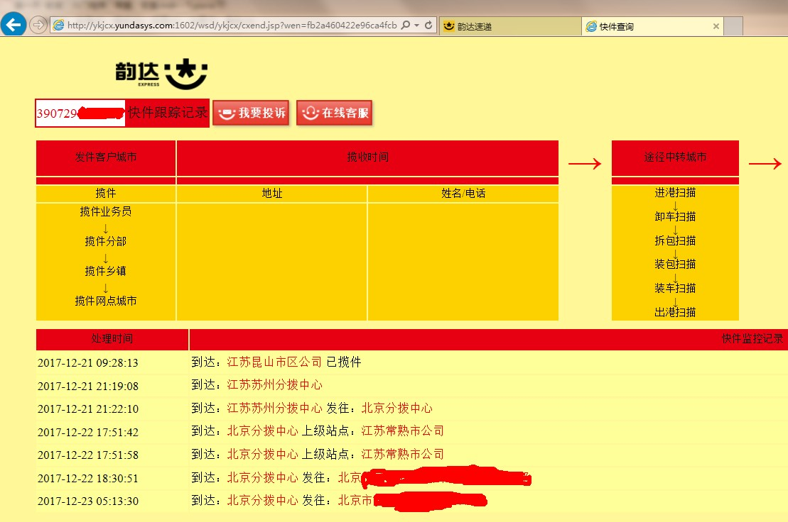


## 1.2 计算机基础知识

### 二进制

**进制**也就是进位计数制。 比如 **十进制**，就每一位置上的数运算时都是逢十进一位。二进制就是**逢二进一**，八进制就是逢八进一，十六进制就是逢十六进一。

在十进制数中只包含**0~9的数字**，逢十进一，1+1=2，1+9=10。

在二进制数中只包含**0~1两个数**，逢二进一，0+1=1，1+1=10。


在计算世界中只认识**二进制.**

* **十进制数据转成二进制数据：**使用除以2 倒取余数的方式	

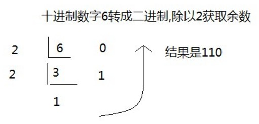 


* **二进制数据转成十进制数据：******使用 8421编码的方式****

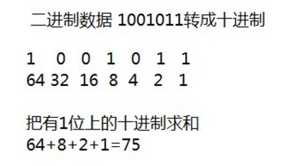      

 

以上十进制和二进制之间的转换，也可以使用计算器进行换算，方便快捷。


为什么要学习二进制呢？

**人们日常生活采用的是十进制数，而计算机中全部数据都采用二进制数表示。** 

小贴士：

> 在二进制数 系统中，每个0或1就是一个位元，叫做bit（比特）是二进制单位。


### 字节(byte)

**字节是我们常见的计算机中最小存储单元。**bit 最小的信息单位

计算机存储任何的数据，都是以字节的形式存储，右键点击文件属性，我们可以查看文件的字节大小。

8个bit（二进制位） 0000-0000表示为1个字节，写成**1 byte**或者**1 B**。

* 8 bit = 1 B(Byte)
* 1024 B =1 KB
* 1024 KB =1 MB
* 1024 MB =1 GB
* 1024 GB = 1 TB


**这里有个概念要搞清楚：计算机最小的存储单元是字节（byte或B），最小的信息单位是位（bit）**


### 常用DOS命令(Disk  Operation System)

Java语言的初学者，学习一些DOS命令，会非常有帮助。DOS是一个早期的操作系统，现在已经被Windows系统取代，对于我们开发人员，目前需要在DOS中完成一些事情，因此就需要掌握一些必要的命令。


* **进入DOS操作窗口**

  * 按下**Windows+R**键盘，打开运行窗口，输入cmd回车，进入到DOS的操作窗口。

    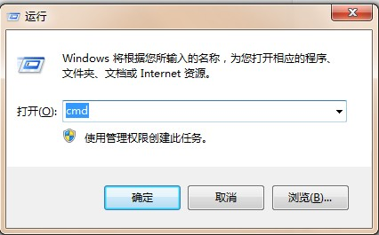    

  * 打开DOS命令行后，看到一个路径 c:\user  就表示我们现在操作的磁盘是c盘。

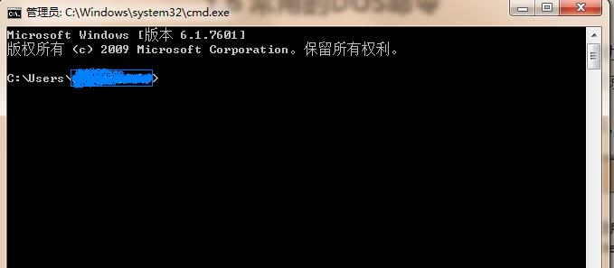

* **常用命令**

  | 命令             | 操作符号                          |
  | ---------------- | --------------------------------- |
  | 盘符切换命令     | `盘符名:`                         |
  | 进入文件夹命令   | `cd 文件夹名` 加上**Tab**自动补全 |
  | 退出文件夹命令   | `cd..` 返回上一级目录             |
  | 退出到磁盘根目录 | `cd\`                             |
  | 查看当前文件夹   | ` dir`                            |
  | 清屏             | `cls`                             |

  exit 退出DOS窗口

  只要操作过的命令可以使用上下方向按键选择历史命令


# 第二章  Java语言开发环境搭建

## 2.1 Java虚拟机——JVM

* **JVM**（Java Virtual Machine ）：Java虚拟机，简称JVM，是运行所有Java程序的假想计算机，是Java程序的运行环境，**是Java 最具吸引力的特性之一**。我们编写的Java代码，都运行在`JVM` 之上。


* **跨平台**：任何软件的运行，都必须要运行在操作系统之上，而我们用Java编写的软件可以运行在任何的操作系统上，这个特性称为**Java语言的跨平台特性**。该特性是由JVM实现的，我们编写的程序运行在JVM上，而JVM运行在操作系统上。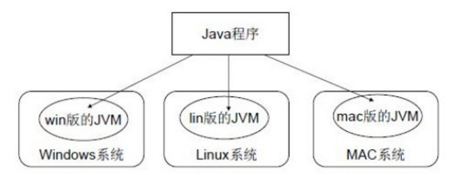

如图所示，**Java的虚拟机本身不具备跨平台功能的，每个操作系统下都有不同版本的虚拟机**。

## 2.2 JRE 和 JDK

* **JRE ** (Java Runtime Environment) ：是Java程序的运行时环境，包含`JVM` 和运行时所需要的`核心类库` 。

* **JDK**  (Java Development Kit)：是Java程序开发工具包，包含`JRE` 和开发人员使用的工具。

  JVM < JRE  < JDK

  

  总结：

  我们想要运行一个已有的Java程序，那么只需安装`JRE` 。

  我们想要开发一个全新的Java程序，那么必须安装`JDK` 。

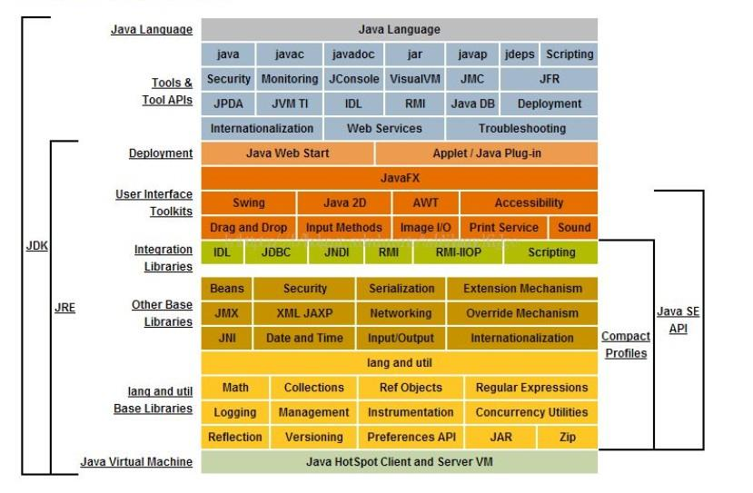

 

> 小贴士：
>
> 三者关系： **JDK > JRE > JVM**

## 2.3 JDK9安装图解

下载链接:http://www.oracle.com/technetwork/java/javase/downloads/java-archive-javase9-3934878.html

------

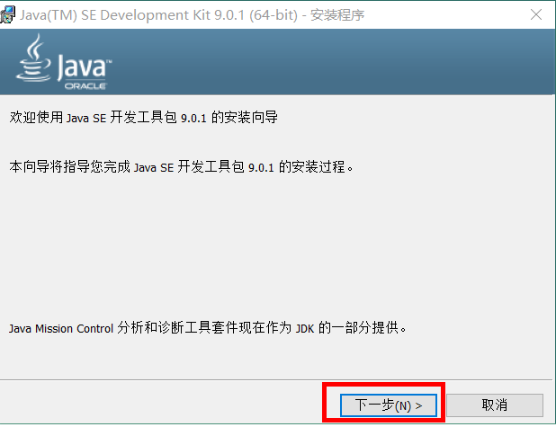   

------

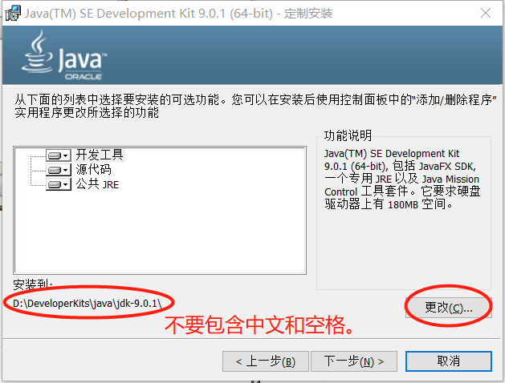   

------

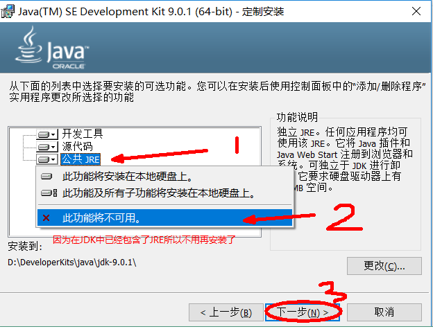  

------

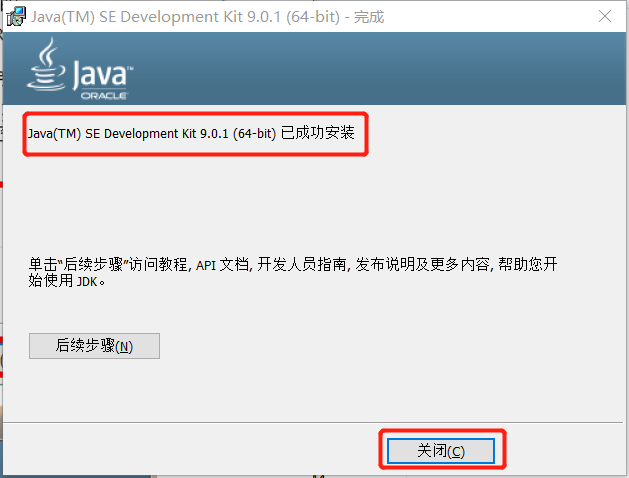   

------


> 小贴士：
>
> 安装路径中，不要包含中文和空格。

## 2.4 JAVA_HOME环境变量的配置

### **配置环境变量作用**

开发Java程序，需要使用JDK中提供的工具，工具在JDK9安装目录的`bin` 目录下。

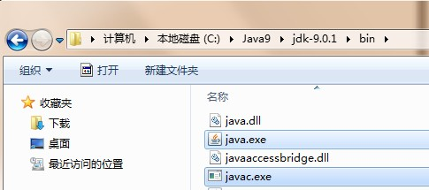   

在DOS命令行下使用这些工具，就要先进入到JDK的bin目录下，这个过程就会非常的麻烦。

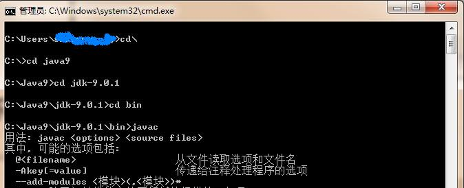

不进入JDK的`bin`目录，这些工具就不能使用，会报错。

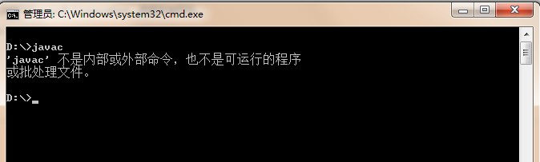

为了开发方便，我们想**在任意的目录下都可以使用JDK的开发工具**，则必须要配置环境变量，配置环境变量的意义在于告诉操作系统，我们使用的JDK开发工具在哪个目录下。


### 配置环境变量步骤

#### Windows 7,8版本

1. 计算机鼠标右键,选择`属性 `   (Win + E -->资源管理器)

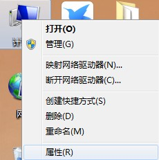

2. 选择`高级系统设置` 

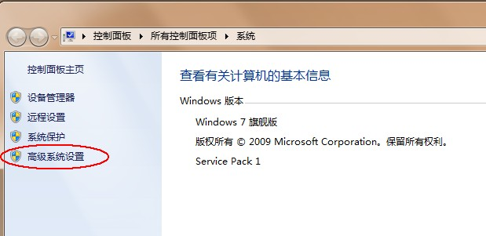

3. `高级` 选项卡，点击`环境变量` 

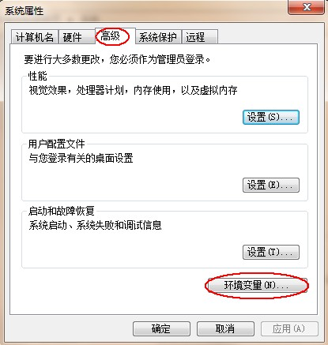

4. 点击`新建` ，创建新的环境变量

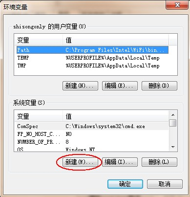

5. 变量名输入`JAVA_HOME`，变量值输入JDK9的安装目录 `c:\Java9\jdk-9.0.1` 

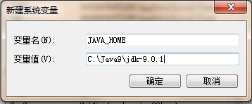

6. 选中`Path` 环境变量，`双击`或者`点击编辑` 

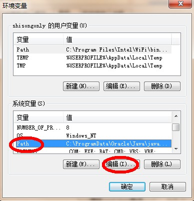

7. 在变量值的最前面，键入`%JAVA_HOME%\bin;`  分号必须要写，必须是英文格式。

   **先把原来的环境变量拷贝到记事本再操作.**

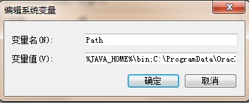

8. 环境变量配置完成，重新开启DOS命令行，在任意目录下输入`javac` 命令，运行成功。

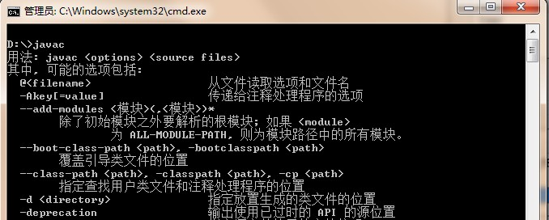

#### Windows 10 版本

1. 文件资源管理器 --> 此电脑鼠标右键 --> 选择`属性 ` 


2. 选择`高级系统设置`  --> 选择  `环境变量`


3. 点击下方系统变量的 `新建` ，创建新的环境变量，变量名输入`JAVA_HOME`，变量值输入JDK9的安装目录 `D:\02_DevelopTools\Java\jdk-9.0.1` 


4. 选中`Path` 环境变量，`双击`或者`点击编辑`


5. 点击` 新建`，键入`%JAVA_HOME%\bin` ，必须是英文格式。选中该行，上移到最上方，点击确定。


6. 环境变量配置完成，重新开启DOS命令行，在任意目录下输入`javac` 命令。


==如果以上配置完成，能够正常使用，那么可以不用配置==

## *2.5 Classpath配置

```
%JAVA_HOME%\lib\tools.jar;%JAVA_HOME%\lib\rt.jar
```


# 第三章 HelloWorld入门程序

## 3.1 程序开发步骤说明

开发环境已经搭建完毕，可以开发我们第一个Java程序了。

Java程序开发三步骤：**编写**、**编译**、**运行**。

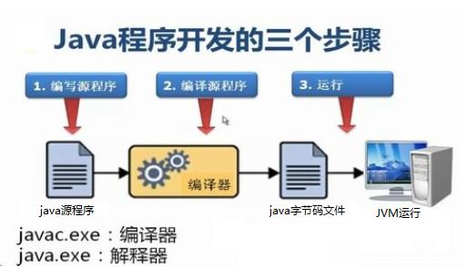


## 3.2 编写Java源程序

1. 在`d:\day01` 目录下新建文本文件，完整的文件名修改为`HelloWorld.java`，其中文件名为`HelloWorld`，后缀名必须为`.java` 。(**设置自己的文件浏览器可以看到后缀，否则无法更改后缀**)
2. 用记事本打开 ==使用资料中提供的notepad++记事本软件。==

3. 在文件中键入文本并保存，代码如下：

```java
public class HelloWorld {
  	public static void main (String[] args) {
    	System.out.println("Hello World!");
  	}
}
```

> 1. 文件名必须是`HelloWorld` ，保证文件名和类的名字是一致的，注意大小写。
>
> 2. 每个字母和符号必须与示例代码一模一样。
>
> 3. 所有的符号必须是英文符号


第一个`HelloWord` 源程序就编写完成了，但是这个文件是程序员编写的，JVM是看不懂的，也就不能运行，因此我们必须将编写好的`Java源文件` 编译成JVM可以看懂的`字节码文件` 。


## 3.3 编译Java源文件

==在DOS命令行中，**进入Java源文件的目录** ，使用`javac` 命令进行编译。==

命令：

```java
javac Java源文件名.java
```

举例：

```
javac HelloWorld.java
```

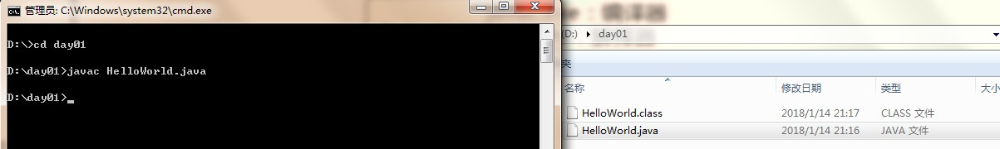


编译成功后，命令行没有任何提示。打开`d:\day01`目录，发现产生了一个新的文件 `HelloWorld.class`，该文件就是编译后的文件，是Java的可运行文件，称为**字节码文件**，有了字节码文件，就可以运行程序了。 


> Java源文件的编译工具`javac.exe`，在JDK安装目录的bin目录下。但是由于配置了环境变量，可以再任意目录下使用。


## 3.4 运行Java程序

在DOS命令行中，**进入Java源文件的目录**，使用`java` 命令进行运行。

命令：

```java
java 类名字(文件名)
```

举例：

```
java HelloWorld
```

java HelloWord  ==不要写 不要写 不要写 .class==

 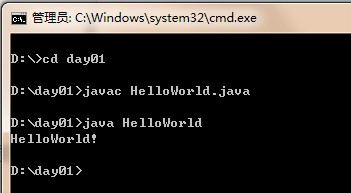

Java程序`.class文件` 的运行工具`java.exe` ，在JDK安装目录的bin目录下。但是由于配置了环境变量，可以再任意目录下使用。

当源代码更改了以后，要重新进行编译，再运行。


## 3.5 入门程序说明

###    编译和运行是两回事

* **编译（javac）**：是指将我们编写的Java源文件翻译成JVM认识的class文件，在这个过程中，`javac` 编译器会检查我们所写的程序是否有错误，有错误就会提示出来，如果没有错误就会编译成功。
* **运行（java）**：java 是指将`class文件` 交给JVM去运行，此时JVM就会去执行我们编写的程序了。

###   关于 main 方法

* **main方法**：称为主方法。写法是**固定格式**不可以更改。main方法是程序的**入口点或起始**点，无论我们编写多少程序，JVM在运行的时候，都会从main方法这里开始执行。


## 3.6 添加注释comment

* **注释**：就是对**代码的解释 和说明**。其目的是让人们能够更加轻松地了解代码。为代码添加注释，是十分必要的，**它不影响程序的编译和运行**。
* Java中有单行注释和多行注释及文档注释
  1. 单行注释以  **//**  开头 换行结束

  2. 多行注释以  **/* ** 开头  以  ***/**  结束

  3. 文档注释以  **/\**** 开始，以  ***/**  结束  (现阶段不做要求)

    > 说明注释允许你在程序中嵌入关于程序的信息。你可以使用 javadoc 工具软件来生成信息，并输出到HTML文件中。
    >
    >  说明注释，使你更加方便的记录你的程序信息。
    >
    > ```java
    > @author 标明开发该类模块的作者
    > @version 标明该类模块的版本
    > ```

    生成文档命令

    ```
    javadoc -d doc HelloWolrd.java
    ```

    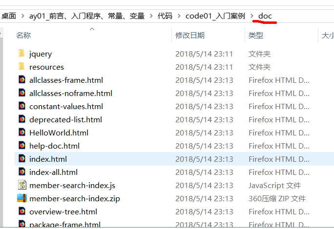


## 3.7 Java关键字keywords

* **关键字**：是指在程序中，Java已经**定义好的单词，具有特殊含义**。
  * HelloWorld案例中，出现的关键字有 `public ` 、`class` 、 `static` 、  `void`  等，这些单词已经被Java定义好，全部都是小写字母，notepad++中颜色特殊。

  * 关键字比较多,有50多个，不能死记硬背，学到哪里记到哪里即可。


## 3.8 标识符

* **标识符**：是指在程序中，我们自己定义内容。比如==类的名字、方法的名字和变量的名字==等等，都是**标识符**。
  * HelloWorld案例中，出现的标识符有类名字`HelloWorld` 。

* **命名规则：`硬性要求`**
  1. 标识符可以包含`英文字母26个(区分大小写)`、`0-9数字` 、`$（美元符号）`和`_（下划线）`。H0$_
  2. 标识符==**不能以数字开头**==。 1HelloWorld(❌)  HelloWorld1（√）
  3. 标识符不能是关键字。（不能是public class  static void  当作类名）

* **命名规范：`软性建议`**  见名知意  
  * 类名规范：首字母大写，后面每个单词首字母大写（**大驼峰式**）。HelloWorld
  * 方法名规范： 首字母小写，后面每个单词首字母大写（**小驼峰式**）。 helloWorld
  * 变量名规范：全部小写，多个单次组成使用**小驼峰**。


# 第四章 常量

## 4.1 概述

**常量：是指在Java程序中固定不变的数据**。  

## 4.2 分类

| 类型       | 含义                                                         | 数据举例                                  |
| :--------- | :----------------------------------------------------------- | :---------------------------------------- |
| 整数常量   | 所有的整数                                                   | 0，1，  567，  -9                         |
| 小数常量   | 所有的小数                                                   | 0.0，  -0.1，  2.55                       |
| 字符常量   | 单引号引起来,只能写一个字符,**必须有内容而且是一个内容**（空格也是字符） | ' ' ，  '好'，'1' ,' ',  **''(不能为空)** |
| 字符串常量 | ==双引号引起来==,可以写多个字符,也可以不写                   | "A" ，"HelloWorld" ，"你好" ，"1"         |
| 布尔常量   | 只有两个值（流程控制中讲解）                                 | true ，  false                            |
| 空常量     | 只有一个值（引用数据类型中讲解）                             | null                                      |

##   4.3 练习

需求：输出各种类型的常量。

```java
public class ConstantDemo {
	public static void main(String[] args){
        //输出整数常量
        System.out.println(123);
        //输出小数常量
        System.out.println(0.125);
        //输出字符常量
        System.out.println('A');
        //输出布尔常量
        System.out.println(true);
        //输出字符串常量
        System.out.println("你好Java");
        //空常量不能打印,编译会发生错误
        // System.out.println(null);//编译会报错
  	}
}

```

# 第五章 变量和数据类型

## 5.1 变量概述

* **变量：常量是固定不变的数据，那么在程序中可以变化的量称为变量。**

数学中，可以使用字母代替数字运算,例如 

~~~java
x = 1+5 
6 = x+5
y = 1.1+1.1
~~~

程序中，可以使用字母保存数字的方式进行运算，提高计算能力，可以解决更多的问题。比如x保存5，x也可以保存6，这样x保存的数据是可以改变的，也就是我们所讲解的**变量**。

java中的变量是有**数据类型**的,

**容器:**

```java
酱油瓶-->酱油
```


**Java中要求一个变量每次只能保存一个数据，必须要明确保存的数据类型。**


## 5.2 数据类型

### 数据类型分类

Java的数据类型分为两大类：

* **基本数据类型**：(四类)包括 `整数`、`浮点数`、`字符`、`布尔`。  

* **引用数据类型**：包括 `类`、`数组`、`接口`。 字符串


### 基本数据类型

**四类八种**基本数据类型：

整数4：字节型（byte）  短整型(short ) 整型(int) 长整型(long)

浮点2：单精度 (float) 双精度(doule)

字符1(char)

布尔1(boolean)

| 数据类型     | 关键字             | 内存占用 | 取值范围                                                  |
| :----------- | :----------------- | :------- | :-------------------------------------------------------- |
| 字节型       | byte               | 1个字节  | [-2^7^~2^7^-1]<br />[-128, 127]                           |
| 短整型       | short              | 2个字节  | [-2^15^,2^15^-1]<br />[-32768,32767]                      |
| 整型         | **int（默认）**    | 4个字节  | [-2^31^,2^31^-1]<br />约正负21亿 (可以使用科学计算器算下) |
| 长整型       | long               | 8个字节  | [-2^63^,2^63^-1]                                          |
| 单精度浮点数 | float              | 4个字节  | 1.4013E-45~3.4028E+38                                     |
| 双精度浮点数 | **double（默认）** | 8个字节  | 4.9E-324~1.7977E+308                                      |
| 字符型       | char  (character)  | 2个字节  | 0-65535                                                   |
| 布尔类型     | boolean            | 1个字节  | true，false                                               |

**Java中的默认类型:**	整数类型是`int` 、浮点类型是`double` .


## 5.3 变量的定义

变量定义的格式包括三个要素：`数据类型` 、 `变量名` 、 `  数据值` 。


### 格式1:	定义并赋值

```java
数据类型 变量名 = 数据值;
int salary = 20000; 
```

给变量赋值的时候, 值不能超过类型对应的范围


### 格式2:	先定义后赋值

```java
//数据类型 变量名;//先定义
//变量名 = 数据值;//后赋值

int score;
score = 100;

String name="朱春醒";

//score; // 格式错误
int i;
//System.out.print(i);//一定要先给i进行赋值，然后再使用

//System.out.println(height);//不能先使用后定义
//int height;//不能先使用后定义

```


变量名取名规则：**见名知意**

### 练习

定义所有基本数据类型的变量 ( **留意float 和 long 类型变量定义 要加float 要加F, long 加上L**)，代码如下：

```java
public class Variable {
	public static void main(String[] args){
        //定义字节型变量
        byte b = 100;
        System.out.println(b);
        //定义短整型变量
        short s = 1000;
        System.out.println(s);
        //定义整型变量
        int i = 123456;
        System.out.println(i);
        //定义长整型变量
        long l = 12345678900L;
        System.out.println(l);
        //定义单精度浮点型变量
        float f = 5.5F;
        System.out.println(f);
        //定义双精度浮点型变量
        double d = 8.5;
        System.out.println(d);
        //定义布尔型变量
        boolean bool = false;
        System.out.println(bool);
        //定义字符型变量
        char c = 'A';
        System.out.println(c);
	}
}
```

> long类型：建议数据后加L表示。
>
> float类型：建议数据后加F表示。

## 5.4 注意事项

变量名称：**在同一个大括号范围内，变量的名字不可以相同。**

变量赋值：**定义的变量，不赋值不能使用。赋值要在其对应类型范围之内**


# day02 【数据类型转换、运算符、方法入门】

## 今日内容

- 数据类型转换
- 算数运算符
- 比较运算符
- 逻辑运算符
- 三元运算符
- 简单方法定义和调用

## 教学目标

-    [ ] 理解数据类型的自动转换	
-    [ ] 理解数据类型的强制转换  ()
-    [ ] 了解ASCII编码表
-    [ ] 理解int类型和char类型的运算原理(char的提升为int类型)
-    [ ] 理解运算符++ --的运算方式( 独立 混合)
-    [ ] 理解 + 符号在字符串中的作用(拼接 连接)
-    [ ] 理解比较运算符
-    [ ] 理解逻辑运算符
-    [ ] 掌握三元运算符的格式和计算结果    数据类型  变量名 =   布尔表达式 ? 真值:假值 ;   double i=  1>2? 1:2;
-    [ ] 了解方法的概念  
-    [ ] 掌握无返回值无参数方法的定义格式   public static void 方法名 （）{ 逻辑代码}
-    [ ] 了解方法定义的注意事项  **类中方法外**  **方法不能嵌套**

# 第一章 数据类型转换（TypeCast）

变量定义赋值的时候, 值得在取值范围之内.  如果超出了接收类型的范围, 需要强转

## 1.1 自动转换 （隐式转换）

### 1）**自动转换概念**

**代码执行过程中`取值范围小的类型`自动转换为`取值范围大的类型` 。**

不同分类的数据类型,不能够论字节大小.

阅读如下代码，说出每个打印语句的打印的值。

```java
System.out.println(1);//默认是一个整型int
System.out.println(1.0);//打印的是double类型

int i1=1; // 左边变量的类型和右边数值的类型是没有问题的。
double d1=1.0;// 左边变量的类型和右边数值的类型是没有问题的。
//把一个int类型的数据赋值给double类型，会有问题么？

double d2= 1;
System.out.println(d2);
```

进行编译 和 运行 没有问题 ,第8行输出的数据并非 `1`而是`1.0`。

运行的过程中，int类型的数据自动转化为double类型的数据了。**也就是类型的自动转化（隐式转换）**


### 2）转换规则

**范围小的类型向范围大的类型转换**，但是注意**`byte、short、char` 运算过程中直接转换为`int`** 。

```java
byte、short、char  <  int  <  long  <  float  <  double
```

练习：代码实践证明**`byte、short、char` 运算时直接提升为`int`** 。

````java
byte b1=1;
byte b2=1;
byte b3=b1+b2; //会报错么？会的话要怎么写？
System.out.println(b3);

short s1=1;
short s2=1;
short s3=s1+s2;//会报错么？会的话要怎么写？
System.out.println(s3);

char c1=1;
char c2=1;
char c3=c1+c2;//会报错么？会的话要怎么写？
System.out.println(c3);
````


## 1.2 强制转换	

我们在上面已经知道了，当int类型的数据赋值给double类型的数据是完全没有问题的。但是现在我们反着干，我们要把double类型的数据赋值给int类型的变量，会发生什么事情呢？做个试验瞧瞧

```java
int i1=2.0;
System.out.printl(i1);
```

报错！！编译失败了！！

```java
int i1=2.0;  // 错误: 不兼容的类型: 从double转换到int可能会有损失
```

道理很好理解，`int`数据类型的取值范围小 其类型 容纳不下`double`类型数据；

一定要这么干！！！！怎么办呢？！！只有通过强制类型转换，将`double`类型强制转换成`int`类型才能赋值。

```java
int i1=(int)2.2;
System.out.printl(i1);
```

完美输出了数据，但是后面的小数是没有了！！


### 1）强制转化的概念

概念理解：**`取值范围大的类型`强制转换成`取值范围小的类型`。**


**转换格式：**

```java
int i1 = (int) 1.0;
数据类型 变量名 = （数据类型）被转数据值；
```

与自动转换的区别，**自动转换时是Java自动执行的不需要我们参与，而强制转换需要我们自己手动执行**。


### 2）转换原理图解

我们再做一个实验说明下转换的原理。

我们知道**byte占有一个字节**，取值范围是 `[-128,127]`,我定义一个byte类型的变量，赋值一个在它范围之外的一个数，比如**257**。来看精彩效果！！

因为超出了byte范围之外，所以要强转。那么计算结果是什么呢？

```java
byte b1=(byte)257;
System.out.println(b1);
```


通过编译运行，我们可以得到的一个结果是 **`1`**，那么怎么来的呢？看下图

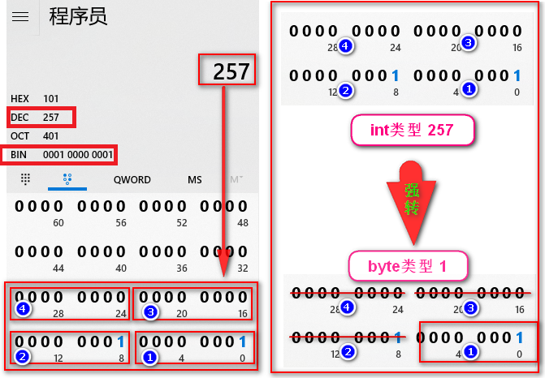


### 3）强转有风险，操作需谨慎！！！

- **精度损失**：浮点转成整数，直接取消小数点，可能造成数据损失精度。
- **数据溢出**：`int` 强制转成`byte` 砍掉3个字节，可能造成数据丢失。

```java
int i=(int)3.9;// i=3	小数点去掉了，精度损失byte b=(byte)257;// b=1 只拿到一个字节的数据，其余三个字节丢失（数据溢出）
```


## 1.3 ASCII编码表 

在计算机的内部都是**二进制的0、1数据**，如何让计算机可以直接识别人类文字的问题呢？就产生出了编码表的概念。

**编码表** 就是将人类的字符和一个十进制数进行对应起来组成一张表格。表中每个文字都对应了一个数值，如下：

| 字符 | 数值 |
| :--: | :--: |
|  0   |  48  |
|  9   |  57  |
|  A   |  65  |
|  Z   |  90  |
|  a   |  97  |
|  z   | 122  |


将所有的**英文字母，数字，符号**都和十**进制进行了对应**，因此产生了世界上第一张编码表**ASCII**
（American Standard Code for Information Interchange 美国标准信息交换码）。


在编码中每个`字符`都对应了一个`数值`。如果要进行数值运算，字符是可以代表其对应的数值的。比如

char 2个字节 的范围 [0,65535]   2^16^ =65536

char c= '0'

char转int：**char类型转换为int类型进行计算。**    

```java
int i1='A'; //类型的自动提升System.out.println(i1);//打印出结果数值：65System.out.println('A'+1);//打印出结果：66
```

int转char：**int的数值也可以强转为char类型的数据**，输出字符。

```java
int i2=97；char c1=(char)i2;  //[0,65535]System.out.println(c1);//打印出结果为字符 a
```

 

**思考:**

1. 如何实现大小写字母的转换 ?

   每个大小写字符的差值是固定

   如果小写转换为大写---->  小写字符 - 32

   如果是大写转换为小写 -->  大写字符 + 32


# 第二章 运算符（Operator）

运算符其实就是操作变量或者是常量的符号


## 2.1 算数运算符

| 算数运算符包括： |                                  |
| ---------------- | -------------------------------- |
| `+`              | 加法运算，字符串连接运算         |
| `-`              | 减法运算                         |
| `*`              | 乘法运算                         |
| `/`              | 除法运算                         |
| `%`              | 取模运算，两个数字相除取**余数** |
| `++` 、  `--`    | 自增自减运算                     |

本身这些加减乘除模跟我们小学时学的运算符功能是一致，但是我们要**注意他们运算时候的一些特点如下：**


### 2.1.1 运算符两侧的类型一致

运算符两侧的类型一致时，运算的结果也是和运算的数据类型一样的但（**byte，short，char类型例外，他们会自动转换为int）**。

```java
int i1=100;int i2=200;int i3=i1+i2;//i1和i2都是int类型。结果可以赋值给int类型的i3int i4=i1*i2;
```

在数据类型自动转换的时候讲过**byte，short，char在运算的时候是直接自动提升为int类型的。**再巩固下：

```java
byte b1=10;byte b2=20;//byte b3=b1+b2;//错误: 不兼容的类型: 从int转换到byte可能会有损失int b3=b1+b2;  //需要用int类型的变量接收，因为运算结果提升为int了。System.out.println(b3);
```

同样，当short，char在混合运算的过程中，也是自动提升为int类型的。课后请实践下,加深印象。


### 2.1.2 运算两侧的类型不一致

当算术运算两侧的类型不一致的时候，**`结果和大类型保持一致`**。

```java
double d1=100;int i1=10;// int i2=d1+i1;//错误: 不兼容的类型: 从double转换到int可能会有损失double i2=d1+i1;
```


### 2.1.3 ++,-- 运算符

`++` 运算，变量自增长1。`--` 运算，变量自减少1。用法一致，效果相反。


#### 1）独立运算

	变量在独立运算时，前++和后++没有区别 ，**都是实现自动加1的功能**。变量前++   ：例如 ++i 变量后++   ：例如 i++ 

````java
int i=1;i++;//可以放在变量的后边		自动加1System.out.println(i);// 输出结果为：2++i;//也可以放在变量的前面	自动加1System.out.println(i);// 输出结果为：3
````


#### 2） 混合运算

和其他变量放在一起，`先++`和`后++`就产生了不同。

- **`先++\--`** ：==**先运算后取值**==

```java
int i1 = 1;int i2 = ++i1;System.out.println(i1);//计算结果是2System.out.println(i2);//计算结果是2
```

变量a自己加1，将加1后的结果赋值给b，也就是说`a`先 `+1` 计算得到`2`，然后复制给`b`,
因此，a和b的结果都是2。


- **`后++\--`** ：==**先取值后运算**==

```java
int a = 1;int b = a++;System.out.println(a);//计算结果是2System.out.println(b);//计算结果是1
```

变量`a`先把自己的值`1`赋值给变量`b`，此时变量`b`的值就是`1`。然后变量`a`再去自己再加`1`。
因此，`a`的结果是`2`，`b`的结果是`1`。


### 2.1.4 `+` 字符串中的拼接操作

`+` 符号在遇到字符串的时候，表示==**连接、拼接**==的含义。

"a"+"b"的结果是“ab”，连接含义

```java
System.out.println("5+5="+5+5);//输出5+5=55
```

注意:当道和加法运算结合在一起的时**候,要注意用()** 提升运算优先级

~~~java
	int i6 =5;	int i7= 6;	System.out.println(i6+"x"+i7+"="+i6*i7);	//当道和加法运算结合在一起的时候,要注意用() 提升运算优先级	System.out.println(i6+"+"+i7+"="+(i6+i7));
~~~


## 2.2 赋值运算符

| 运算符 |  说明  |
| :----: | :----: |
|  `=`   | 等于号 |
|  `+=`  | 加等于 |
|  `-=`  | 减等于 |
|  `*=`  | 乘等于 |
|  `/=`  | 除等于 |
|  `%=`  | 取模等 |

### 1）赋值运算符`=`

将`=`右边的值，赋给左边的变量。其实我们昨天在学习定义变量的时候就接触了。如：

```java
int i1 = 5;		//将整数常量5赋值给i1。int i2 =i1;		//将i1变量的值赋值给i2变量。int i3 =i1+i2; 	//将i1+i2的运算结果赋值给变量i3
```

### 2）+= ,-=,*=,/=,%=

算术运算符和赋值运算符的结合使用。当运算的时候，有时我们会遇到如下运算需求：

```java
int i1=10;i1=i1+100;//变量自身参与运算，结果赋值返回给自身i1+=100;System.out.println(i1);int i2 =10;i2=i2*10;i2*= 10;int i3=10;i3=i3%3;--> i3%=3;
```

可以使用运算符和赋值符号相结合:

```java
int i1=10;i1+=100;// i1=i1+100; 变量自身参与运算，结果赋值返回给自身System.out.println(i1);
```

### 3）+= ,-=,*=,/=,%=：自动类型强转功能

在运算过程中，如果涉及到值强转，会自动操作不需要我们干涩。

```java
byte b1=1;//b1= b1+ 256;//编译报错b1+=256; System.out.println(b1);//值为1，而不是257. int 强转为 byte ，溢出int i1=10;i1*=1.234;	System.out.println(i1);//值为12，而不是12.34 double 强转为 int ，精度损失
```


## 2.3 比较运算符

| 比较运算符 | 说明                                                         |
| :--------: | ------------------------------------------------------------ |
|    `==`    | 比较符号两边数据是否相等，相等结果是true。                   |
|    `<`     | 比较符号左边的数据是否小于右边的数据，如果小于结果是true。   |
|    `>`     | 比较符号左边的数据是否大于右边的数据，如果大于结果是true。   |
|    `<=`    | 比较符号左边的数据是否小于或者等于右边的数据，如果小于结果是true。 |
|    `>=`    | 比较符号左边的数据是否大于或者等于右边的数据，如果大于结果是true。 |
|    `!=`    | 不等于符号 ，如果符号两边的数据不相等，结果是true。          |

比较运算符，是两个数据之间进行比较的运算，==运算结果都是布尔值`true`或者`false`==。

```java
public static void main(String[] args) {    System.out.println(1==1);//true    System.out.println(1<2);//true    System.out.println(3>4);//false    System.out.println(3<=4);//true    System.out.println(3>=4);//false    System.out.println(3!=4);//true}
```

## 2.4 逻辑运算符

**逻辑运算符**其实就是**`与（并且），或（或者），非（不是）`**，用来`连接两个布尔类型结果`的运算符。其运算结果都是==布尔值（`true`或`false`）==

1>2 并且 1<2     false 并且  true -->false

| 逻辑运算符 | 称呼           | 使用说明                                                     |
| :--------- | :------------- | ------------------------------------------------------------ |
| `&&`       | 双与<br>短路与 | 1. 两边都是true，结果是true  <br>2. 一边是false，结果是false    <br>**短路特点：****一假即假**。符号左边是false，右边不再运算，效率比单与高。 |
| `||`       | 短路或<br>双或 | 1. 两边都是false，结果是false  <br />2. 一边是true，结果是true  <br />**短路特点：**一真即真，符号左边是true，右边不再运算，效率比单或高 |
| `！`       | 取反           | 1. ! true 结果是false<br />2. ! false结果是true              |

### **1）**逻辑运算符的普通使用

```java
    //逻辑与（并且） 一假即假    System.out.println(true && true);//true    System.out.println(true && false);//false    System.out.println(false && true);//false，右边不计算      //逻辑或（或者）一真即真    System.out.println(false || false);//falase    System.out.println(false || true);//true    System.out.println(true || false);//true，右边不计算        //逻辑非（不是）    System.out.println(!false);//true
```

### **2）** &&短路测试 **一假即假**

```java
int i1=1;int i2=1;//		    短路    false && true System.out.println(++i1<1 && i2++>1);//false System.out.println(i1);	//2System.out.println(i2);	//1
```

### **3）**|| 短路测试	一真即真  

```java
//	||(短路或) 一真即真int i1=1;int i2=1;//			短路     true || true System.out.println(++i1>1 || ++i2>1);System.out.println(i1);//2System.out.println(i2);//1
```


## 2.5 三元运算符


三元运算符: 操作三个数据进行运算.  


++: 一元运算符

当一个**布尔表达式(条件运算)**的结果( true 或者 false) 需要对应两种不同的结果时,  我们可以使用三元运算符.

**表达式可**: 由`变量`或`常量`和`操作符`组成的式子构成。 


比如:  		成绩>= 60 分	 ?	true  及格   :	false 不及格

在java中		布尔表达式	 ?	真值结果	   :	假值结果

表达式: 我们使用运算符去连接若干个变量或者是常量时     1>2 -->false  

格式如下:

### 1）三元运算符格式：

```java
 数据类型 变量名 = 布尔类型表达式 ？ 真值 : 假值；   int score=80;// 如果大于等于60 及格	否则 不及格   String status = score>=60 ? "及格" : "不及格" ; // 不及格System.out.println(status); // score=80 及格	score=59 不及格
```

String  int double


"Hello" -->字符串常量    String 

1 ----> 		int

### 2）三元运算符执行顺序：

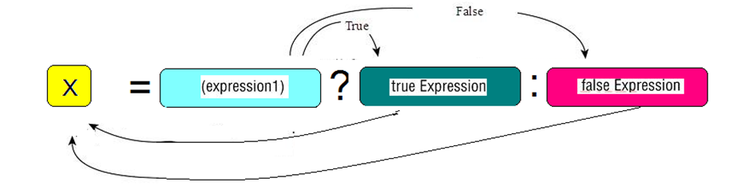

1. 布尔类型表达式结果是true，三元运算符整体结果为`真值`，赋值给变量。
2. 布尔类型表达式结果是false，三元运算符整体结果为`假值`，赋值给变量。

```java
public static void main(String[] args) {    int a=1;    int b=2;        //a>b么?是 c=true,不是 c=false    boolean c= a>b ? true : false;      int i = (1==2 ? 100 : 200);    System.out.println(i);//200    int j = (3<=4 ? 500 : 600);    System.out.println(j);//500}
```


注意: 后面真值和假值的数据类型要和 变量接收的类型要==**匹配**== (一致或者是满足自动类型转换)


# 第三章 方法入门 (Method)

## 3.1 概述

我们在学习运算符的时候，都为每个运算符单独的创建一个新的类和main方法，我们会发现这样编写代码非常的繁琐，而且重复的代码过多。能否避免这些重复的代码呢，就需要使用方法来实现。


**那么什么是方法呢？**

Java方法是**语句的集合**，它们在一起执行一个功能。

1. 方法是解决一类问题步骤的有序组合
2. 方法包含于类或对象中( 面向对象)
3. 方法在程序中被创建，在其他地方被引用

**方法的优点**

1. 使程序变得更简短而清晰。
2. 有利于程序维护。
3. 可以提高程序开发的效率。
4. 提高了代码的重用性。

## 3.2 方法的定义

* 定义格式： 

```java
修饰符  返回值类型 方法名 （参数列表）｛    	代码...	    	代码...	   		代码...	   		return ;//方法的结束  返回对应的值｝public static void main (String[] args) {		逻辑代码		代码}//参照main方法，方法名改下，参数列表删掉
```

- 定义格式解释：
  - 修饰符： 目前固定写法 `public static` 。
  - 返回值类型： 目前固定写法 `void` ，其他返回值类型在后面的课程讲解。
  - 方法名：(**小驼峰**)为我们定义的方法起名，满足标识符的规范，用来调用方法。
  - 参数列表： 目前无参数， 带有参数的方法在后面的课程讲解。
  - return：**方法结束**。因为返回值类型是void，方法大括号内的return可以不写。
- 举例： 

```java
public static void methodName() {  	System.out.println("这是一个方法");}
```

## 3.3 方法的调用

方法在定义完毕后，方法不会自己运行，必须被调用才能执行，我们可以在主方法main中来调用我们自己定义好的方法。在主方法中，直接写要调用的方法名字就可以调用了。

```java
public static void main(String[] args) {    //调用定义的方法method    method();}//定义方法，被main方法调用public static void method() {  	System.out.println("自己定义的方法，需要被main调用运行");}
```

## 3.4 调用练习

将三元运算符代码抽取到自定义的方法中，并调用。

```java
public static void main(String[] args) {    //调用定义的方法operator    operator();}//定义方法，方法中定义三元运算符public static void operator() {    int i = 0;    i = (1==2 ? 100:200);    System.out.println(i);    int j = 0 ;    j = (3<=4 ? 500:600);     System.out.println(j);}
```

## 3.5 注意事项

- 方法定义时`方法的位置`注意事项：

  - 必须定义在**类中方法外**
  - 不能定义在另一个方法的里面即方法**不能嵌套**

```java
public class Demo {    public static void main(String[] args){           }    //正确写法，类中，main方法外面可以定义方法    public static void method(){}}
```

```java
public class Demo {    public static void main(String[] args){        //错误写法，一个方法不能定义在另一方法内部        public static void method(){}    }}
```

# 第四章 JShell脚本工具

### JShell脚本工具是JDK9的新特性

什么时候会用到`JShell`工具呢，当我们编写的代码非常少的时候，而又不愿意编写类，main方法，也不愿意去编译和运行，这个时候可以使用JShell工具。

启动JShell工具，在DOS命令行直接输入`JShell`命令。

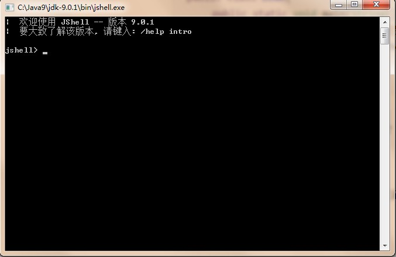

接下来可以编写Java代码，无需写类和方法，直接写方法中的代码即可，同时无需编译和运行，直接回车即可

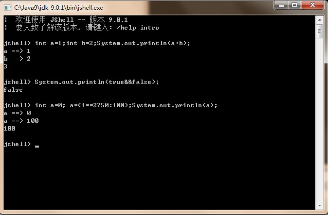

> 小贴士:
>
> JShell工具，只适合片段代码的测试，开发更多内容，建议编写在方法中。

# 第五章 扩展知识点

## 5.1 常量和变量的运算

下面的程序有问题吗？

```java
public static void main(String[] args){
  byte b1=1;
  byte b2=2;
  byte b3=1 + 2;
  byte b4=b1 + b2;
  System.out.println(b3);
  System.out.println(b4);
}
```

分析：`b3 = 1 + 2` ，`1 `和 `2 ` 是常量，为固定不变的数据，在编译的时候（编译器javac），已经确定了`1+2` 的结果并没有超过byte类型的取值范围，可以赋值给变量`b3` ，因此`b3=1 + 2`是正确的。

反之，`b4 = b2 + b3`，`b2` 和 `b3` 是变量，变量的值是可能变化的，在编译的时候，编译器javac不确定b2+b3的结果是什么，因此会将结果以int类型进行处理，所以int类型不能赋值给byte类型，因此编译失败。

在jshell中体现：

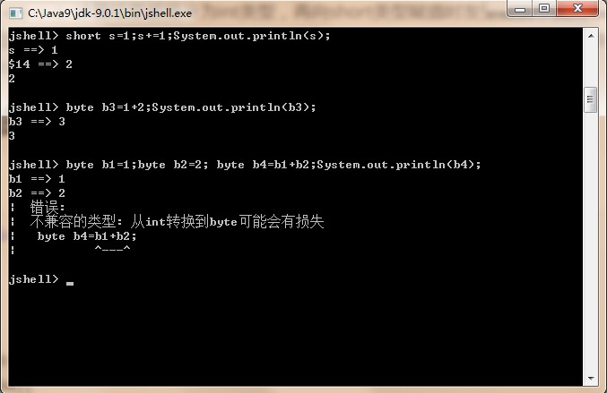 


常量直接运算把结果赋值变量时：

	 编译的是时候，可以直接获取结果，确定是否超过变量类型的范围

变量参与运算的时候：

	编译时不能够直接确定结果，不能确定值范围，编译报错。需要强转


day03【 流程控制语句】

## 今日内容

- if else判断语句
- switch选择语句
- for循环语句
- while循环语句
- do while循环语句
- 跳出语句break，continue

## 教学目标

- [ ] 理解if语句的格式和执行流程
- [ ] 理解if...else语句的格式和执行流程
- [ ] 理解if...else if语句的格式和执行流程
- [ ] 了解if else语句和三元运算符互换
- [ ] 理解switch选择语句的格式和执行流程
- [ ] 了解switch选择语句接收的数据类型
- [ ] 了解case的穿透性
- [ ] 理解while语句的格式和执行流程
- [ ] 理解for语句的格式和执行流程
- [ ] 理解do...while语句的格式和执行流程
- [ ] 了解do...while循环的特点
- [ ] 了解跳出语句break，continue的意义
- [ ] 理解嵌套for循环的执行流程

# 第一章：流程控制概述

## 1.什么是流程控制？

流程是什么呢？比如我们去诊所看病，我们先要去窗口挂号，然后排队就医，医生看完之后会给你处方，然后去窗口排队缴费，最后取药完事，看病这一系列要做的事情完成的过程叫做流程。医院对看病流程步骤的布置和安排我们叫做流程的控制。

`流程控制就是对事物次序的布置和安排 。`

**而程序中的流程控制就是对代码执行次序的安排和控制。**


## 2.程序中的三种流程控制

程序中的流程我们可以通过代码的结构去控制，比如我们只要把一些打印输出的代码按照指定顺序的结构，依次排列，打印的结果就会按照代码的顺序结构执行打印，这就是程序中最简单的`顺序流程`。

程序中出了顺序流程之外，还有选择流程和循环流程

| 序号 | 执行流程 | 代码结构 |
| :--: | :------: | :------: |
|  1   | 顺序流程 | 顺序结构 |
|  2   | 选择流程 | 选择结构 |
|  3   | 循环流程 | 循环结构 |

选择流程：选择结构的代码实现，

循环流程：循环结构的代码实现。

而今天的内容我们将对实现这三种流程的代码结构的代码格式进行一一学习。

# 第二章 顺序结构

## 2.1 概述

顺序结构是一种最容易理解的一种代码结构，其执行的顺序由代码编写的顺序控制，从上到下执行。

## 2.2 顺序结构（Sequence）

```java
public static void main(String[] args){
    //顺序执行，根据编写的顺序，从上到下运行
    System.out.println(1);
    System.out.println(2);
    System.out.println(3);
}
```

# 第三章 选择结构

在生活中经常需要作出一系列的判断然后作出选择，比如**走路到红绿灯路口时**，我们**对灯的颜色进行判断**，我们要对灯的颜色进行判断，选择是否通行。

在Java代码中存在一种特殊的语句，叫做`选择语句`，这种选择语句也需要对一些条件作出判断，从而选择对应执行的代码。这种选择语句组成的代码结构就是**选择结构**。

选择语句分为`if`条件语句和`switch`条件语句。接下来我们对这两种语句进行详细讲解。


## 3.1选择语句 `if`

if语句有三种语法格式，每一种语法格式都有其自身的特点。

### 3.1.1 `if` 语句

**if 语句是指如果满足某种条件就进行某种处理**。比如，如果小明年满18岁就可以去网吧上网。如果使用伪代码（自然语言描述的一种代码实现）去实现如下

```java
如果 小明年满18岁  成立true
	可以去网吧上网
```

上面伪代码中

`如果`相当于Java中的关键字`if`，`小明年满18岁`是判断条件，在Java中需要使用`()`括起来，`可以去网吧上网`是执行语句，放置在`{}`中，修改后代码如下

```
if ( 小明年满18岁 ) {
    可以去网吧上网
    //可以有多条语句
}

if (灯的颜色  是  绿灯){
    通行
}

```

上面的例子就描述了if语句的格式用法。在Java中if语句的具体语法如下：

#### **格式** 


```java
... //其他语句
 // 1>2    1==2
if (布尔表达式) ｛//一段代码声明，它最终只有true（真）和false（假）两个取值
  	语句体;
｝

... //其他语句
```


特点:**对一件事情进行判断, 处理事情正面的结果**


#### **执行流程**

- 首先判断`布尔表达式`看其结果是true还是false

- 如果是true就执行语句体

- 如果是false就不执行语句体 

  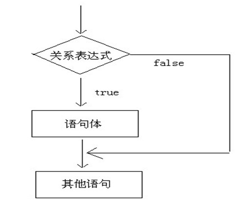

#### **代码实践**

就以开始小明上网的例子来进行代码实践。

定义一个int类型的变量age。如果age大于或等于18，在控制台中打印`小明去上网了`。
分别给age赋值16和20，观察打印结果。

```java
public static void main(String[] args){
    System.out.println("小明出来玩了")
    //int age=16;
	int age=20;//20岁
    
    if(age>=18){
        System.out.println("小明去上网了");
    }
    
    System.out.println("小明回家了")
｝
```

### 3.1.2 `if...else`语句

**if ...else 语句是指如果满足某种条件就进行某种处理，否则就进行另外一种处理。**比如上一讲中的小明，如果年满18岁就可以上网，否则就去电玩城打电动。是一种二选一的选择语句，跟我们前一天学的**三元表达式**是相似的。

#### 格式


```java
...
    
if(布尔表达式) { //如果
  	语句体1; //布尔表达式为true执行
} else {//否则
  	语句体2; //布尔表达式为false执行
}

...
```

特点: 他能对事物的两面结果都作出对应的处理

#### 执行流程

- 首先判断布尔表达式看其结果是true还是false

- 如果是true就执行语句体1

- 如果是false就执行语句体2

  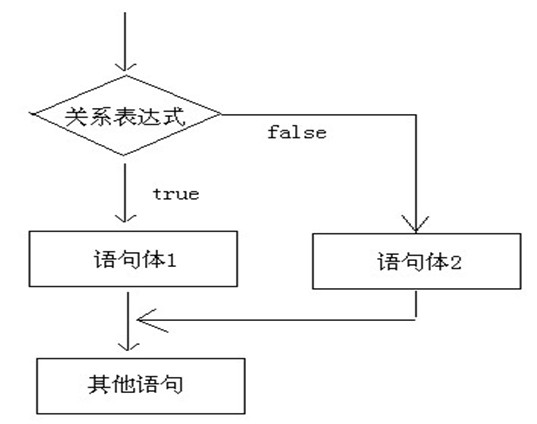

  

  

#### 代码实践

数学中的自然数不是偶数就是奇数。使用的if ... else...判断指定数字的奇偶性。

判定一个数是偶数还是奇数：

先定义一个变量赋值一个整数的值，然后使用if ... else... 进行判断。该数是偶数就打印偶数，否则打印奇数。

```java
public static void main(String[] args){
    // 判断给定的数据是奇数还是偶数
    // 定义变量
    int a = 1;
    if(a % 2 == 0) {
      	System.out.println("a是偶数");
    } else{
      	System.out.println("a是奇数");
    }
    System.out.println("结束");
}
```

#### 与三元运算符的互换

比较亮两个数的大小，输出较大的数，如下：

```java
public static void main(String[] args){
   //使用if...else...
    int i1=10;
    int i2=20;
    if(i1>i2){
        System.out.println(i1);
    }else{
        System.out.println(i2);
    }
    
    //使用三元运算符
   	//格式： 布尔表达式? 真值表达式：假值表达式。
    int max= i1>i2 ? i1 : i2;
    System.out.println(max);
}
```


### 3.1.3 `if..else if...else`语句

`if..else if...else`可以对**多个条件进行判断，进行多种不同的处理**。

比如，一个学生的考试成绩为score可以进行优(score>=80)、良(score<80&&score>=70)、中(score<70&&score>=60)、差(score<60)的划分。那么在代码中要怎么实现呢？

#### 格式


```java
//格式三的完整格式:if (判断条件1) {  	执行语句1;}else if(判断条件2){  	执行语句2}else if(判断条件3){  	执行语句3}***else if(判断条件n){  	执行语句n}else {    //上面的条件都不满足 为false时  	执行语句n+1;}//变种一 :只能针对多个条件的正面作出处理if (判断条件1) {  	执行语句1;}else if (判断条件2) {  	执行语句2;}...}else if (判断条件n) { 	执行语句n;}
```

格式三是格式一和格式二的组合, 功能更强大了


#### **执行流程**

- 首先判断布尔表达式1看其结果是true还是false
- 如果是true就执行语句体1
- 如果是false就继续判断布尔表达式2看其结果是true还是false
- 如果是true就执行语句体2
- 如果是false就继续判断布尔表达式…看其结果是true还是false
- …
- 如果没有任何布尔表达式为true，就执行语句体n+1。

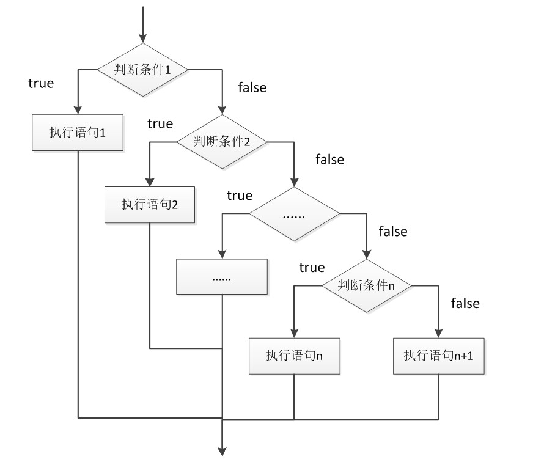

#### 代码实践

判断学生成绩的等级。**[0 , 100]**   -->0<= score <= 100  区间 (0 ,100 ) -->0< score <100

- 90-100      优秀

- 80-89        好

- 70-79        良

- 60-69        及格

- 60以下    不及格

- 如果不在范围内     不合法的数字 

  先定义一个变量去保存学生的成绩，然后使用当前学习的选择语句进行学生成绩等级的划分。

```java
public static void main(String[] args) {	 		int socre=99;//定义变量记录分数    		if(socre>=90&&socre<=100) {			System.out.println("成绩是优秀的！");		} else if(socre>=80&&socre<90) {			System.out.println("成绩很好！");		} else if(socre>=70&&socre<80) {			System.out.println("成绩良好！");		} else if(socre>=60&&socre<70) {			System.out.println("成绩及格！");		} else if(socre>=0&&socre<60) {			System.out.println("成绩不及格！");		} else {			System.out.println("不合法成绩");		}  }
```


## 3.2 选择语句`switch`   

### 3.2.1 switch语句

switch条件语句也是一种比较常用的选择语句，和if条件语句不同的是，switch只能针对**`某个表达式的值`**作出判断，从而决定程序执行那一段代码。

例如，在程序中使用数字1~7来表示星期一到星期日，如果想要根据某个特定的数字判断对应的数字表示中文的星期几。如下，

```java
指定的数字	如果数字为1,则输出星期一	如果数字为2,则输出星期二	如果数字为3,则输出星期三	如果数字为4,则输出星期四	如果数字为5,则输出星期五	如果数字为6,则输出星期六	如果数字为7,则输出星期日
```

对于上面的需求，可能你立马回想到使用 `if ... else if ...else`这种结构来实现。想法是没有错的，也描述确可以实现，但是有弊端，条件判断会很多，不利于阅读。

在switch语句中，switch关键字用来描述一个表达式，使用case关键字来描述和表达式结果比较的目标值，当表达式的值和某个目标值匹配是，会执行对应case下的语句。如下：

```java
如果使用ifint week=6;if(week==1){    system.out.println("周一");}else if(week==2){     system.out.println("周二");}.....else{        }    //----------------int week=1;	switch(week){		case 1:			System.out.println("星期一");			break;            		case 2:			System.out.println("星期二");			break;                    default:		//else			System.out.println("不能识别");			break;	}
```

以上改写后的伪代码便描述了switch语句的基本语法格式，具体如下：

#### **格式**


```java
switch(表达式) {//具体的某个变量        	case 常量值1:		语句体1;		break;	case 常量值2:		语句体2;		break;  	...             default:		语句体n+1;		break;}
```

需要注意的是，表达式中的值需要和case中的常量值类型相匹配。

1~7 :int byte

在switch中的表达式**只能是byte、short、int、char、Enum(枚举值)、String(字符串)**。用其它的类型值编译会报错。

Enum是在JDK1.5 引入的新特性， 

String类型是在JDK1.7引入的新特性。

现在学习的事实9.0的JDK版本，所以上面的类型都是支持的。


#### **执行流程**

- 首先计算出表达式的值
- 其次，和case依次比较，一旦有对应的值，就会执行相应的语句，在执行的过程中，遇到break就会结束。
- 最后，如果所有的case都和表达式的值不匹配，就会执行default语句体部分，然后程序结束掉。

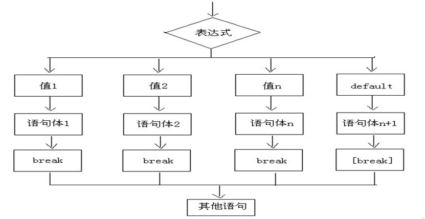

#### 代码实践

下面就用Java代码来实现，根据提供的数字输出对应的中文星期值。

```java
public static void main(String[] args) {    //定义变量，判断是星期几    int weekday = 6;    //switch语句实现选择    switch(weekday) {        case 1:          System.out.println("星期一");          break;        case 2:          System.out.println("星期二");          break;        case 3:          System.out.println("星期三");          break;        case 4:          System.out.println("星期四");          break;        case 5:          System.out.println("星期五");          break;        case 6:          System.out.println("星期六");          break;        case 7:          System.out.println("星期日");          break;        default:          System.out.println("你输入的数字有误");          break;    }	}
```

在书写以上代码的时候：特别要注意要break不能漏写。否则会出现case的穿透，改变逻辑。


### 3.2.2 case的穿透性

在switch语句中，如果case的后面不写break，将出现穿透现象，不再判断下一个case的值，直接向后运行，直到遇到**break**，或者整体switch结束。这种特性我们称为**case的穿透性**。

这不是**switch的一个bug**，既然存在这种现象，必有其存在的价值。也就是说这种case的穿透性，也是能够实现一些需求。

#### 代码实践

例如，使用1~7数字表示星期一到星期日。当指定的数字为1,2,3,4,5时输出`工作日`，当指定的数字为`6,7`时输出`休息日`。如下

```java
public static void main(String[] args) {    int week=1;	switch(week) {		case 1:		case 2:		case 3:		case 4:		case 5:			System.out.println("工作日");			break;		case 6:		case 7:			System.out.println("休息日");			break;		default :			System.out.println("数字不在1~7范围之内，请重新指定");	}}
```

以上代码中，当变量`week`的值为`1,2,3,4,5`任一值时处理的方式都是一样，都会打印`休息日`。当变量`week`的值为`6,7`任一值时打印`休息日`。这是switch语句的一种简写方式。

在实际开发中灵活运用case的穿透性解决相应的需求。


# 第四章 循环结构

## 4.1 循环概述

在运动会田径场上10000米项目，运动员循环的在绕着田径场跑步。钟表上的指针也是在不断的做循环的运动等，这是我们生活中能够理解的循环。

在Java语言中有一种特殊的语句叫做**循环语句**，可以实现将一段代码重复的执行。这种循环语句形成的代码结构就叫做**循环结构**。

比如，我们可以循环打印10遍Hello World，而不需要写10行`System.out.println("Hello World");`代码。

Java中的循环语句结构有三种，分别是：**for**语句、**while**语句、**do...while**语句。


## 4.2 循环语句1`for`

### 4.2.1 格式

```java
...    for ( 初始化语句 ① ; 判断条件语句 ② ; 控制条件语句 ④ ) {			循环体语句 ③         }...
```

刚开始对可能会对上面的①②③④表达式不太理解，我们可以对比下初中时老师罚我们写单词时的场景：


| 步骤 | for循环步骤                    | 抄写单词循环步骤                            | 说明                                 |
| :--: | :----------------------------- | ------------------------------------------- | :----------------------------------- |
|  ①   | 初始化表达式                   | 准备好作业本，此时作业本抄写**次数**为 0 次 | 负责完成`循环变量`初始化             |
|  ②   | 判断条件语句                   | 每次抄写前，想想次数够了么                  | 负责判断是否满足循环条件             |
|  ③   | 循环体语句                     | 开始抄写                                    | 具循环体执行的语句                   |
|  ④   | 控制条件语句<br />(步进表达式) | 每次抄写完，次数加一                        | 循环后，循环条件所涉及变量的变化情况 |

### **4.2.2 执行流程**

- 执行顺序：①②③④>②③④>②③④…②不满足为止。
- ①负责完成循环变量初始化
- ②负责判断是否满足循环条件，不满足则跳出循环
- ③具体执行的语句
- ④循环后，循环条件所涉及变量的变化情况


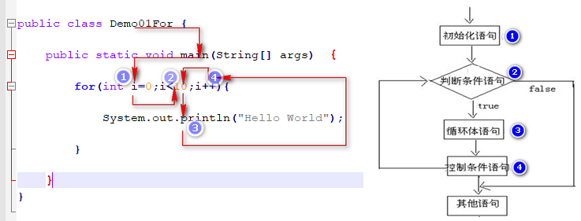 


### 4.2.3 代码实践

- 1）循环打印10遍“Hello World”

```java
public static void main(String[] args) {    //控制台输出10次HelloWorld，不使用循环    System.out.println("HelloWorld");    System.out.println("HelloWorld");    System.out.println("HelloWorld");    System.out.println("HelloWorld");    System.out.println("HelloWorld");    System.out.println("HelloWorld");    System.out.println("HelloWorld");    System.out.println("HelloWorld");    System.out.println("HelloWorld");    System.out.println("HelloWorld");    System.out.println("-------------------------");    //用循环改进，循环10次    //定义变量从0开始，循环条件为<10    for(int x = 0; x < 10; x++) {      	System.out.println("HelloWorld"+x);    }}
```

* 2）循环练习：使用循环，计算1-100之间的**偶数**和

```java
public static void main(String[] args) {  //1.定义一个初始化变量,记录累加求和,初始值为0  int sum = 0;  //2.利用for循环获取1-100之间的数字  for (int i = 1; i <= 100; i++) {      //3.判断获取的数字是奇数还是偶数      if(i % 2==0){        //4.如果是偶数就累加求和        sum += i;      }  }  	//5.循环结束之后,打印累加结果  	System.out.println("sum:"+sum);}
```


### 4.2.3 小结

常规的格式一定要记住：熟练书写for语句

```java
for( int i=0 ; i<10 ; i++ ){     System.out.println("I LOVE U");}for(int i=10;i>0;i--){      }
```

1. 初始化语句中 i 可以使用任何的数字

2. 判断语句，一**定要保证条件有边界，否则就是死循环**了。

   ```java
   for(int i=0;i<10;i++){    System.out.println("我爱你!!");    i--;}
   ```

3. 控制语句可以变通，也可使用 `--` ，目的是让循环变化量起到变化.

4. 这里的循环变量`i` 出了循环结构就不能使用了

5. `i` 也可以定义在外面，那么出了循环结构也可以访问`i`。

   ```java
   int i for( ; i<10 ; i++ ){     System.out.println("I LOVE U");}System.out.println(i);
   ```

6. 控制变量可以放到循环体中

   ```java
   int i=0 ;for(  ; i<10 ;  ){     System.out.println("I LOVE U");     i++;}
   ```

      


## 4.3 循环语句2`while`

### **4.3.1 格式**

```java
初始化语句① while ( 条件判断② ) { //while有当的意思	循环体语句③	条件控制语句(步进表达式)④}
```

和for循环功能一样，只不过关键字不一样，代码结构不一样。和选择结构中的if判断也有点类似，满足条件就执行 {} 内的语句，区别在于while语句会反复地执行，知道条件不成立。


### **4.3.2 流程**

- 执行顺序：①②③④>②③④>②③④…②不满足为止。
- ①负责完成循环变量初始化。
- ②负责判断是否满足循环条件，不满足则跳出循环。
- ③具体执行的语句。
- ④循环后，循环变量的变化情况。

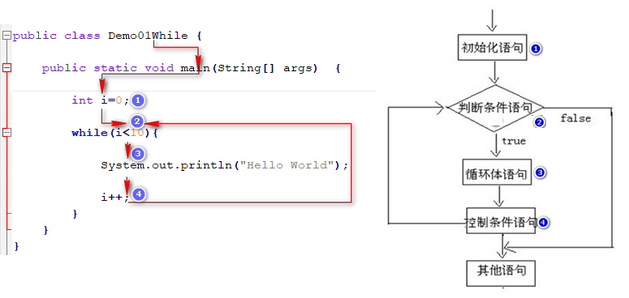


### **4.3.3 代码实践**

- 1）while循环输出10次HelloWorld

```java
public static void main(String[] args) {    //while循环实现打印10次HelloWorld    //定义初始化变量    int i = 1;    //循环条件<=10    while(i<=10){        System.out.println("HelloWorld");        //步进        i++;    }}
```

- 2）while循环计算1-100之间的和


```java
public static void main(String[] args) {    //使用while循环实现    //定义一个变量,记录累加求和    int sum = 0;    //定义初始化表达式    int i = 1;    //使用while循环让初始化表达式的值变化    while(i<=100){        //累加求和        sum += i ;        //步进表达式改变变量的值        i++;    }    //打印求和的变量    System.out.println("1-100的和是："+sum);}
```


### 4.3.4 小结

格式回顾

```java
		int i=0;		while(i<10){ 			System.out.println("Hello World");			i++;		}		System.out.println(i);		
```

注意事项：

1. 不要忘记写控制变量语句，否则会成无限执行的循环


## 4.4 循环语句3`do...while`

###  **4.4.1 格式**


```java
初始化表达式①do{    循环体③    步进表达式条件控制语句④    }while(条件判断语句 ②); //这里有分号结束
```

**☆ while后面有分号结束**

**☆ 无论如何会先执行一次，然后再去做条件判断是否继续执行**

### **4.4.2 执行流程**

- 执行顺序：①③④>②③④>②③④…②不满足为止。
- ①负责完成循环变量初始化。
- ②负责判断是否满足循环条件，不满足则跳出循环。
- ③具体执行的语句
- ④循环后，循环变量的变化情况

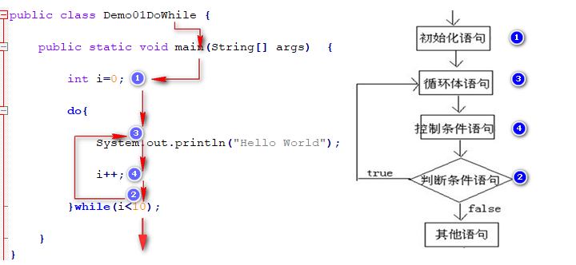


### 4.4.3 代码实践

- 1）输出10次HelloWorld


```java
public static void main(String[] args) {    int x=1;    do {      System.out.println("HelloWorld");      x++;    }while(x<=10);}
```

do...while循环的特点：

无条件执行一次循环体，即使我们将循环条件直接写成false，也依然会循环一次。使用用时一定要注意这个特性。

```java
public static void main(String[] args){    do{      	System.out.println("无条件执行一次");    }while(false);}
```


### 4.4.4 小结

格式回顾：

```java
		int i=0;		do{			System.out.println("Hello World");			i++;		}while(i<10);
```

注意事项：

1. 无条件会先执行一遍
2. while写在后面且`（）`后面有分号，记住！


## 4.5 循环语句的区别

- `for` 和 `while` 的小区别：

  - 代码结构不同是最大的区别

    控制条件语句所控制的那个**变量**：

    ​	在for循环结束后，就不能再被访问到了，while循环结束还可以继续使用，如果你想继续使用，就用while，否则推荐使用for(标准格式而言)。

  - 使用上区别

    - 对于次数敏感的循环，建议使用for循环。 
    - 对于某个条件敏感while
    - 一定要执行一次的循环， do while

- 变量**作用域**  (作用范围)


  作用域（scope），程序设计概念，通常来说，一段程序代码中所用到的名字并不总是有效/可用的，而限定这个名字的可用性的代码范围就是这个名字的作用域。


  - 怎么去找一个变量的作用范围（作用域）？

    1）一般我们只要看下当前这个变量定义的位置在哪儿，找到变量所在的最近一对包裹变量的`{  }`，**从这个变量定义开始到 到右`}`结束，都是这个变量的作用范围**

    在作用域范围之内我们才可以使用.

    2）也有特例，比如像for循环语句中**`（ ）`**内定义的变量，其作用的范围只能在for语句结构中。


#### 代码实践

```java
public class Demo2 {	public static void main(String[] args) {				for(int x=1; x<=5; x++){			System.out.println("爱生活，爱Java");            int z=0;            		}		//这里的x无法继续访问		//System.out.println(x);		System.out.println("-----------------");				int y = 1;		while(y<=10) {			System.out.println("爱生活，爱Java");			y++;		}		System.out.println(y);	}}
```


## 4.6 死循环(无限循环,永真循环)

**死循环：**就是**循环中的条件永远为true**循环，死循环是不会结束循环的。

#### 常见的无限循环：

##### 4.6.1 while死循环

```java
while( true ){	循环体;}do{    }while(true);
```

##### 4.6.2 for的格式：

```java
for(;;){	循环体;}
```

**☆ 在编译过程中若被编译器认定为死限循环，那么在死循环下面不要再写任何的语句,因为无法执行。**即使写了也会报错：`错误: 无法访问的语句`

##### 4.6.3 其他只要满足条件判断始终为true的死循环

```java
int i=0;while(i<10){    System.out.println(i);    //i++;	//如果忘记i++ 了将会永远循环}for(int x=1;x>0;i++) { //条件中  x>0 因为 x++永远等于1 所以该循环也是死循环     System.out.println(i);    i--;}
```


## 4.7 嵌套循环

### 4.7.1 概念

**嵌套循环是指在一个循环语句的循环体中再定义一个循环语句的语法结构。**

**while、do...while、for**循环语句都可以进行嵌套，并且他们之间也是可以进行相互嵌套的。如最常见的在for循环中嵌套for循环。

### 4.7.2 `for`嵌套循环格式

```java
for(初始化表达式①; 循环条件②; 控制条件语句⑦) {         for(初始化表达式③; 循环条件④; 控制条件语句⑥) {	      	执行语句⑤;       }    }
```

### 4.7.3 **嵌套循环执行流程：**

- 假如外层循环执行2次，内循环执行次数2次执行顺序：

  第一次循环：①②>③④⑤⑥>④⑤⑥>④

  第二次循环：⑦②>③④⑤⑥>④⑤⑥>④>⑦②

- 外循环一次，内循环多次。

  在生活中也能随处可见，比如说我们的钟表的指针。时、分、秒指针在周而复始的做运动。我们把秒针和分针拿出来分析。

  在一小时里，分针要走60步。分针没走一分，秒针就走了60秒。把分针看成是外层循环，秒针看成是内层循环就很好理解了。

  ~~~java
  for(int min=0;min<60;min++){ //分针        for(int second=0;second<60;second++){ //秒针                System.out.println(min+":"+second);	//打印时间            }}
  ~~~

  **总共的循环次数=外循环次数*内循环次在数**

### 4.7.4 代码实践

使用for的嵌套循环打印 5行8列的 * 符号。如下图

```
****************************************
```

提示：

`System.out.println();`换行打印   后面有ln
`System.out.print();`不换行打印	后面无ln	

```java
public static void main(String[] args) {    //5*8的矩形，打印5行*号，每行8个    //外循环5次，内循环8次    for(int i = 0; i < 5; i++){        for(int j = 0; j < 8; j++){            //不换行打印星号            System.out.print("*");        }        //内循环打印8个星号后，需要一次换行        System.out.println();    }｝
```

把九九乘法表，嵌套for

## 4.8  跳转语句

### 4.8.1 `break`

- **使用场景：终止switch或者循环**

  1. **在选择结构switch语句中**
     当它出现在switch条件语句中时，作用是终止某个case并跳出switch结构（case中不加break会出现穿透，将switch时讲解过）switch结构后面的代码。

  2. **在循环语句中**
     当出现在循环语句时，作用是终止并跳出循环语句，继续执行循环结构后面的代码。

     - 在while循环中

       ```java
       public static void main(String[] args){    int x=1;		//定义变量x,初始值为1    while(x<=10){	//循环条件              if(x==3){	//跳出循环的条件是当x==3的时候            break;	//跳出循环        }        System.out.println("x="+x);//条件成立，打印x的值                x++;		//x进行自增    }}
       ```

       以上代码如果不加break语句，将会执行10次。当x==3的时候跳出循环。	

     - 在for循环中

       ```java
       public static void main(String[] args){    for(int x=1;x<=10;x++){	        System.out.println("x="+x);//打印x的值        if(x==3){	//跳出循环的条件是当x==3的时候            break;	//跳出循环        }    }}
       ```

       同while循环，如果没有break语句的话将会执行10次。当x==3的候跳出循环。以上代码只会打印3次

  3. **在嵌套循环的使用** (扩展)

     当break语句出现在嵌套循环中的内层循环是，它只能跳出内层循环，**如果想使用break语句跳出到外层循环则需要在外层循环的关键字前添加标记**。如下

     ```java
     	public static void main(String[] args) 	{		int y=1;		itheima: while(y<10) {			for(int x=1; x<=9; x++) { 				 System.out.println("x="+x);//打印x的值				if(y==3) {	//跳出循环的条件是当x==3的时候     					break itheima;	//跳出itheima循环				}  			}   			y++;		}	}
     ```

     在内层循环for中要跳出整个循环终止循环，我们需要在外层循环while前面加上**标记**`itheima`跳出时，只要在break后面加上` itheima;`就可以了。

     **☆ for和while前面都可以加标记**


### 4.8.2 `continue`  (继续)

**使用场景：结束本次循环，继续下一次的循环**

例如：对 [1,100] 区间之内的奇数求和,并打印出来。

```java
public static void main(String[] args) {    int sum=0;        for (int i = 1; i <= 100; i++) {        if(i % 2==0){           	//如果是偶数，结束本次循环          	continue;        }        System.out.println(i);        sum+=i;//不断累加          }    System.out.println(sum);}
```

# day04【 Idea、方法】

## 今日内容

- 集成开发工具IDEA
- 方法的参数和返回值
- 方法的重载

## 教学目标

- [ ] 掌握idea开发工具的安装
- [ ] 能够使用idea创建Java工程
- [ ] 能够使用idea创建包和类
- [ ] 了解idea的Java工程目录
- [ ] 了解idea字体的设置
- [ ] 掌握idea常用开发快捷键
- [ ] 了解项目的导入和删除
- [ ] 掌握方法定义的参数和返回值含义
- [ ] 了解方法的调用过程
- [ ] 了解方法的三种调用形式: 赋值  打印 直接
- [ ] 掌握方法定义的注意事项
- [ ] 掌握方法重载的概念：同名不同参
- [ ] 能够判断出方法的重载

# 第一章 开发工具IntelliJ IDEA 

## 1.1 开发工具概述

IDEA是一个专门针对Java的集成开发工具(IDE)，由Java语言编写。所以，需要有**JRE**运行环境并配置好环境变量。它可以极大地提升我们的开发效率。**可以自动编译，检查错误。**在公司中，使用的就是IDEA进行开发。


## 1.2 IDEA软件安装

此软件集成了32位和64位，双击`ideaIU-2017.3.2.exe` 进入安装。

1. 欢迎界面


2. 选择安装路径


3. 配置安装选项


4. 开始菜单


5. 安装完毕


IDEA开发工具安装完成

## 1.3 IDEA首次驱动

1. 选择不导入任何设置，点击`OK` 


2. 选择 `Create New Project` 


3. 点击`new` 按钮，配置安装的`JDK9` 版本


	选择` JDK9` 目录，点击确定


4. 不使用模板


5. 为工程起名字 `demo` ，并存储到`d:\ideawork\demo` 目录下，如果d盘没有这个目录，会自动创建。

>   首次新建项目时，默认的Project Location路径有问题，如 `c:\\xxx`，正确写法为`c:\xxx`。更改后不会再出现此类问题。


6. 打开一个每日一帖对话框，勾掉每次启动显示，点击`close` 


7. IDEA的工作界面，我们的项目已经创建好了，如果再新建项目，点击`File->new->Project` 


## 1.4 创建包和类

1. 展开创建的工程，在源代码目录`src` 上，鼠标右键，选择`new->package` ，键入包名`com.itheima.demo` ，点击确定。


	右键点击`com.itheima.demo` ，选择 `Show in Explorer` ，会发现创建包的目录结构。


	可见`com.itheima.demo` ，表示创建了多级的文件夹。

> 小贴士：所谓包，就是文件夹，用**来对类文件进行管理**。

2. 在创建好的包上，鼠标右键，选择 `new->class`  创建类，键入类名。


3. 在代码编辑区，键入主方法，并输出`HelloWorld` 。


4. 运行程序，在代码编辑区鼠标右键，选择`Run HelloWorld` 即可，或在菜单中选择`Run->Run HelloWorld ` 。


## 1.5 字体设置

IDEA工具的默认字体非常小，代码编辑器和控制台的输出字体都需要进行调整。

* 点击菜单栏上的`File->Settings->Editor->Font`修改字体。


## 1.6 IDEA的项目目录

- 我们创建的项目，在d:\ideawork目录的demo下

  - `.idea` 目录和`demo.iml` 和我们开发无关，是IDEA工具自己使用的
  - `out`目录是存储编译后的.class文件
  - `src` 目录是存储我们**编写的.java源文件**

  

## 1.7 IDEA常用快捷键

| 快捷键               | 功能                                                         |
| -------------------- | ------------------------------------------------------------ |
| `Alt+Enter`          | 导入包，自动修正代码. 变量: 自动生成变量,自动补全; .         |
| `Ctrl+Y`             | 删除光标所在行                                               |
| `Ctrl+D`             | 复制光标所在行的内容，插入光标位置下面                       |
| `Ctrl+Alt+L`         | 格式化代码                                                   |
| `Ctrl+/`             | 单行注释, 取消注释                                           |
| `Ctrl+Shift+/`       | 选中代码注释，多行注释，再按取消注释                         |
| `Alt+Ins(Insert)`    | 自动生成代码，toString，get，set等方法<br />当在包位置的时候,可以快捷创建包或者类 |
| `Alt+Shift+上下箭头` | 移动当前代码行                                               |

psvm: 快速创建main方法

sout: System.out.println();  或者  需要打印的内容.sout

10.fori  自增for循环

10.forr 自减for循环

布尔表达式.if

万能快捷键: Ctrl + Shift +A

创建java文件:  


创建包


## 1.8 IDEA修改快捷键

在IDEA工具中，`Ctrl+空格`的快捷键，可以帮助我们补全代码，但是这个快捷键和Windows中的输入法切换快捷键冲突，需要修改IDEA中的快捷键。

`File->Settings->keymap->Main menu->code->Completion->Basic`


双击`Basic->remove->Ctrl+空格`


再次双击`Basic->Add Keyboard->键入 Alt+/->点击OK`


## 1.9 IDEA打开和关闭项目

关闭IDEA中已经存在的项目，`File->Close Project`


`File->Close Project `这时IDEA回到了刚启动界面，点击项目上的`X`，IDEA中就没有这个项目了


在IDEA的启动界面上，点击`OPEN` ，选择项目目录即可


> 小贴士：
>
> 课后若想通过IDEA同时开启多个项目，点击OPEN打开项目时，点击New Window按钮


# 第二章 方法

## 2.1 回顾--方法的定义和调用

前面的课程中，使用过嵌套循环输出矩形，控制台打印出矩形就可以了，因此将方法定义为`void`，没有返回值。在主方法`main` 中直接被调用。

==Ctrl +Alt + M==:  抽取方法( 选择要抽取的代码块再按回车, 补充方法名及修饰符就可以了)

```java
public class Method_Demo1 {
    public static void main(String[] args) {
        print();
    }

    private static void print() {
        for (int i = 0; i < 5; i++) {
            for (int j = 0; j < 8; j++) {
                System.out.print("*");
            }
            System.out.println();
        }
    }
}
```

`print`方法被`main`方法调用后直接输出结果，而`main`方法并不需要`print`方法的执行结果，所以被定义为`void`。


## 2.2 定义方法的格式详解

```java
修饰符  返回值类型 方法名 (参数列表) {
    //代码省略...
    return 结果;
}
```

1. 修饰符： public static 固定写法
2. 返回值类型： 表示方法运行的结果的数据类型，方法执行后将结果返回到调用者
3. 参数列表：方法在运算过程中的未知数据，调用者调用方法时传递
4. **return**：将方法执行后的结果带给调用者，方法执行到`return` ，整体方法运行结束
   1. **方法的结束.**
   2. **可以返回方法的结果值**


> 小贴士：return **结果**;  这里的"结果"在开发中，我们正确的叫法成为**方法的返回值**


**有返回值 有参数的方法**


## 2.3 定义方法的两个明确

- **需求：**定义方法实现**两个整数（int）**的求和计算,并在**main方法中测试调用打印求和结果**。


  1. **明确返回值类型**：方法计算的是整数的求和，结果也必然是个整数，返回值类型定义为int类型。

  2. **明确参数列表**：当方法中需要用到数据但是没有明确数据的具体值(未知数) 那就会把这个未知数定义成一个变量放到参数列表中去

     参数的类型  int      参数的个数 2  形参 --> 定义变量:   数据类型  变量名     多个形参(变量)之间使用 , 号分割(逗号)

​     

     方法名:标识符 (见名知意)

```java
public class Method_Demo2 {
    public static void main(String[] args) {
        // 调用方法getSum，传递两个整数，这里传递的实际数据又称为实际参数
        // 并接收方法计算后的结果，返回值     
        int sum = getSum(1, 6);
        System.out.println(sum);
    }

  	/*
    定义计算两个整数和的方法
    返回值类型，计算结果是int
    参数：不确定数据求和，定义int参数.参数又称为形式参数
    */
    public static int getSum(int a, int b) {
        return a + b;
    }
}
```

程序执行，主方法`main` 调用`getSum` 方法，传递了实际数据`5和6` ，两个变量`a和b`接收到的就是实际参数，并将计算后的结果返回，主方法`main`中的变量`sum`接收的就是方法的返回值。

## 2.4 调用方法的流程图解  

 

方法 a,b : 形式参数(形参)    接收调用者传入的数据

		记住: 变量--> 数据类型  变量名1   ,   数据类型  变量名2
	
			变量一定要初始化

调用者中传入的 5, 6: 实际参数 (实参)

			常量或者变量作为实参


## 2.5 定义方法练习

### 练习一：**比较两个int整数是否相同,并在main方法中调用打印结果**  

- 分析：定义方法实现功能，需要有两个明确，即`返回值` 和 `参数列表`。
  - **明确返回值**：比较整数，比较的结果只有两种可能，相同或不同，因此结果是布尔类型，比较的结果相同为true。
  - **明确参数列表**：比较的两个整数不确定，所以默认定义两个int类型的参数。

```java
public class Method_Demo3 {    public static void main(String[] args) {        //调用方法compare，传递两个整数        //并接收方法计算后的结果，布尔值        boolean bool = compare(3, 8);        System.out.println(bool);    }    /*        定义比较两个整数是否相同的方法        返回值类型，比较的结果布尔类型        参数：不确定参与比较的两个整数    */    public static boolean compare(int a, int b) {        if (a == b) {            return true;        } else {            return false;        }    }}
```

### 练习二：**计算1+2+3...+100的和**并在main方法中打印结果

- 分析：定义方法实现功能，需要有两个明确，即`返回值`和`参数`。 
  - **明确返回值**：1~100的求和，计算后必然还是整数，返回值类型是int
  - **明确参数**：需求中已知到计算的数据，没有未知的数据，不定义参数
    **计算1+2+3...+n的和**: 需要 一个整型的参数

```java
public class Method_Demo4 {    public static void main(String[] args) {        //调用方法getSum        //并接收方法计算后的结果，整数        int sum = getSum();        System.out.println(sum);    }    /*        定义计算1~100的求和方法        返回值类型，计算结果整数int        参数：没有不确定数据    */    public static int getSum() {        //定义变量保存求和        int sum = 0;        //从1开始循环，到100结束        for (int i = 1; i <= 100; i++) {            sum = sum + i;        }        return sum;    }}
```

### 练习三：**实现不定次数打印"I LOVE U/Money"**

- 分析：定义方法实现功能，需要有两个明确，即`返回值`和`参数`。 
  - **明确返回值**：方法中打印出`HelloWorld`即可，没有计算结果，返回值类型`void`。 
  - **明确参数**：打印几次不清楚，参数定义一个整型参数

```java
public class Method_Demo5 {    public static void main(String[] args) {        //调用方法printHelloWorld，传递整数        printHelloWorld(9);    }    /*    定义打印HelloWorld方法    返回值类型，计算没有结果 void    参数：不确定打印几次    */    public static void printHelloWorld(int n) {        for (int i = 0; i < n; i++) {            System.out.println("HelloWorld");        }    }}
```

## 2.6 定义方法的注意事项

1. 定义位置，类中方法外面。

2. 返回值类型，必须要和`return`语句返回的类型相同(匹配,==当满足自动类型转换的时候也是可以的==)，否则编译失败 。

   ```java
   // 返回值类型要求是intpublic static int getSum() {    return 5;// 正确，int类型    return 1.2;// 错误，类型不匹配    return true;// 错误，类型不匹配}
   ```

3. 不能在`return` 后面写代码，`return` 意味着方法结束，所有后面的代码永远不会执行，属于无效代码。
   返回值类型要匹配( 范围小的可以返回给范围大的数据类型 ,  不一定一样  比如:  int-->double)

   ```java
   public static int getSum(int a,int b) {  	return a + b;  	System.out.println("Hello");// 错误，return已经结束，这里不会执行，无效代码}
   ```

   return语句可以放在其他结构代码中,但是一定要让编译器直接能够感应到 return语句的存在.  比如当道retur语句放置在if语句的时候,有可能不能执行到return语句,编译器不能直接感应到编译会报错. 应该在方法结束之前加上return语句.

## 2.7 调用方法的三种形式(有没有返回值)

1. #### **直接调用：**直接写方法名调用

   ```java
   public static void main(String[] args) {  	print();}public static void print() { 	System.out.println("方法被调用");}
   ```

2. **赋值调用：**调用方法，在方法前面定义变量，接收方法返回值

   ```java
   public static void main(String[] args) {  	int sum=getSum(5,6);  System.out.println(sum);}public static int getSum(int a,int b) {  	return a + b;}
   ```

3. **输出语句调用(打印调用)：** 有返回值类型的方法

   - 在输出语句中调用方法，`System.out.println(方法名())` 。

     ```java
     public static void main(String[] args) {          	System.out.println(getSum(5,6));}public static int getSum(int a,int b) {  	return a + b;}
     ```

   - 不能用输出语句调用`void` 类型的方法。因为方法执行后没有结果，也就打印不出任何内容。

     ```java
     public static void main(String[] args) {    printHello();  	System.out.println(printHello());// 错误，不能输出语句调用void类型方法}public static void printHello() {  	System.out.println("Hello");}
     ```

**总结：**

**有返回值方法**：赋值调用，输出语句调用,  **可以直接调用但是无法接收返回值**

**无返回值方法**：直接调用


## 2.8 方法重载

- **方法重载**：指在同一个类中，允许存在一个以上的同名方法，只要它们的**参数列表中类型或个数不同即可，与修饰符和返回值类型无关**。
  **(同名不同参) ** 跟形参变量名没有关系
- 参数列表：个数不同，数据类型不同，顺序不同（与形参的名字无关）。
- 重载方法调用：JVM通过方法的参数列表，调用不同的方法。

## 2.9 方法重载练习

### 练习一

比较两个数据是否相等。参数类型分别为两个`byte`类型，两个`short`类型，两个`int`类型，两个`long`类型，并在`main`方法中进行测试。 

```java
public class Method_Demo6 {    public static void main(String[] args) {        //定义不同数据类型的变量        byte a = 10;        byte b = 20;        short c = 10;        short d = 20;        int e = 10;	        int f = 10;        long g = 10;        long h = 20;        // 调用        System.out.println(compare(a, b));        System.out.println(compare(c, d));        System.out.println(compare(e, f));        System.out.println(compare(g, h));    }    // 两个byte类型的    public static boolean compare(byte a, byte b) {        System.out.println("byte");        return a == b;    }    // 两个short类型的    public static boolean compare(short a, short b) {        System.out.println("short");        return a == b;    }    // 两个int类型的    public static boolean compare(int a, int b) {        System.out.println("int");        return a == b;    }    // 两个long类型的    public static boolean compare(long a, long b) {        System.out.println("long");        return a == b;    }}
```

### 练习二

判断哪些方法是重载关系。

// **同名不同参**: 方法名和参数   (跟返回值, 修饰符没有关系，参数名字)

```java
public static void open(){} //public static void open(int a){}// static void open(int a,int b){} // public static void open(double a,int b){} // public static void open(int a,double b){}// public void open(int i,double d){} //  xpublic static void OPEN(){}//  xpublic static void open(int i,int j){} // x
```

### 练习三

模拟输出语句中的`println`方法效果，传递什么类型的数据就输出什么类型的数据，只允许定义一个方法名`println`。 

```java
public class Method_Demo7 {    public static void main(String[] arr){        println(10);        byte b=1;        println(b);    }    	public static void println(byte a) {        System.out.println(a);    }    public static void println(short a) {        System.out.println(a);    }    public static void println(int a)  {        System.out.println(a);    }    public static void println(long a) {        System.out.println(a);    }    public static void println(float a) {        System.out.println(a);    }    public static void println(double a) {        System.out.println(a);    }    public static void println(char a) {        System.out.println(a);    }    public static void println(boolean a) {        System.out.println(a);    }    public static void println(String a) {        System.out.println(a);    }}
```


  
