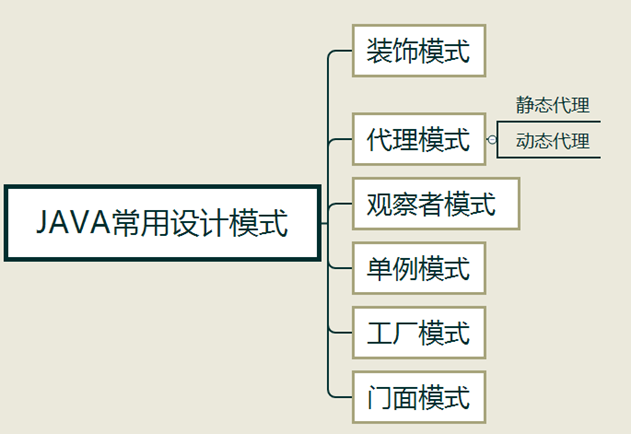

## 设计模式概述

设计模式（Design pattern）代表了最佳的实践，通常被有经验的面向对象的软件开发人员所采用。
设计模式是软件开发人员在软件开发过程中面临的一般问题的解决方案。
这些解决方案是众多软件开发人员经过相当长的一段时间的试验和错误总结出来的。



## 装饰模式

装饰器模式（Decorator Pattern）允许向一个现有的对象添加新的功能，同时又不改变其结构。这种类型的设计模式属于结构型模式，它是作为现有的类的一个包装。
这种模式创建了一个装饰类，用来包装原有的类，并在保持类方法签名完整性的前提下，提供了额外的功能。


1、Component是基类。通常是一个抽象类或者一个接口，定义了属性或者方法，方法的实现可以由子类实现或者自己实现。通常不会直接使用该类，而是通过继承该类来实现特定的功能，它约束了整个继承树的行为。比如说，如果Component代表人，即使通过装饰也不会使人变成别的动物。 
2、ConcreteComponent是Component的子类，实现了相应的方法，它充当了“被装饰者”的角色。 
3、Decorator也是Component的子类，它是装饰者共同实现的抽象类（也可以是接口）。比如说，Decorator代表衣服这一类装饰者，那么它的子类应该是T恤、裙子这样的具体的装饰者。 
4、ConcreteDecorator是Decorator的子类，是具体的装饰者，由于它同时也是Component的子类，因此它能方便地拓展Component的状态（比如添加新的方法）。每个装饰者都应该有一个实例变量用以保存某个Component的引用，这也是利用了组合的特性。在持有Component的引用后，由于其自身也是Component的子类，那么，相当于ConcreteDecorator包裹了Component，不但有Component的特性，同时自身也可以有别的特性，也就是所谓的装饰。

案例

首先，我们假设现在有这样一个需求：你有一家服装店，卖各式各样的衣服，现在需要用一个系统来记录客户所要购买的衣服的总价，以便方便地结算。那么在这个例子里面，我们可以用装饰者模式，把客户当做被装饰者，衣服是装饰者，接着我们来一步步实现需求。

1）创建Component基类

```java
public abstract class Person {
    String description = "Unkonwn";  //对人的描述

    public String getDescription()
    {
        return description;
     }
    public abstract double cost(); //子类应该实现的方法，花费行为
}
```

2）创建被装饰者——ConcreteComponent

客户分为很多种，有儿童、青少年、成年人等，因此我们可以创建不同的被装饰者，这里我们创建青少年的被装饰者，新建Teenager.java。

```java
public class Teenager extends Person {　//青年类

    public Teenager() {
        description = "Shopping List:";
    }

    @Override
    public double cost() {
        return 0; //什么都没买，不用钱
    }
}
```

3)创建Decorator

由于不同的部位有不同的衣物，不能混为一谈，比如说，衣服、帽子、鞋子等，那么这里我们创建的Decorator为衣服和帽子，分别新建ClothingDecorator.java和HatDecorator.java:

```java
public abstract class ClothingDecorator extends Person {

    public abstract String getDescription();
}

public abstract class HatDecorator extends Person {

    public abstract String getDescription();

}
```

4)创建ConcreteDecorator

上面既然已经创建了两种Decorator，那么我们基于它们进行拓展，创建出不同的装饰者，对于Clothing，我们新建Shirt.java，对于Hat，我们新建Casquette，其实可以根据不同类型的衣物创建更多不同的装饰者，这里只是作为演示而创建了两种。代码如下所示：

```java
public class Shirt extends ClothingDecorator { //衬衫类

    //用实例变量保存Person的引用
    Person person;

    public Shirt(Person person)
    {
        this.person = person;
    }

    @Override
    public String getDescription() {
        return person.getDescription() + "a shirt  ";
    }

    @Override
    public double cost() {
        return 100 + person.cost(); //实现了cost()方法，并调用了person的cost()方法，目的是获得所有累加值
    }

}
```

鸭舌帽类
```java
public class Casquette extends HatDecorator {

    Person person;

    public Casquette(Person person) {
        this.person = person;
    }
    @Override
    public String getDescription() {
        return person.getDescription() + "a casquette  "; //鸭舌帽
    }

    @Override
    public double cost() {
        return 75 + person.cost();
    }

}
```

5)测试代码

```java
public class Shopping {

    public static void main(String[] args) {
        Person person = new Teenager();

        person = new Shirt(person);
        person = new Casquette(person);

        System.out.println(person.getDescription() + " ￥ " +person.cost());
    }

}
```

## 代理模式

代理(Proxy)是一种设计模式,提供了对目标对象另外的访问方式;即通过代理对象访问目标对象.这样做的好处是:可以在目标对象实现的基础上,增强额外的功能操作,即扩展目标对象的功能.

1.静态代理

静态代理在使用时,需要定义接口或者父类,被代理对象与代理对象一起实现相同的接口或者是继承相同父类.

案例
模拟保存动作,定义一个保存动作的接口:IUserDao.java,然后目标对象实现这个接口的方法UserDao.java,此时如果使用静态代理方式,就需要在代理对象(UserDaoProxy.java)中也实现IUserDao接口.调用的时候通过调用代理对象的方法来调用目标对象. 
需要注意的是,代理对象与目标对象要实现相同的接口,然后通过调用相同的方法来调用目标对象的方法

1)接口:Inter.java

```java
public interface Inter {
    public abstract void save();
}
```

2) 目标对象:User.java

```java
public class User implements Inter {
    public void save() {
        System.out.println("----已经保存数据!----");
    }
}
```

3) 代理对象:UserProxy.java

```java
public class UserProxy implements Inter{
    //接收保存目标对象
    private Inter target;
    public  UserProxy(Inter target){
        this.target=target;
    }

    public void save() {
        System.out.println("开始事务...");
        target.save();//执行目标对象的方法
        System.out.println("提交事务...");
    }
}
```

4) 测试类:App.java

```java
public class App {
    public static void main(String[] args) {
        //目标对象
        User target = new User();

        //代理对象,把目标对象传给代理对象,建立代理关系
        UserProxy proxy = new UserProxy(target);

        proxy.save();//执行的是代理的方法
    }
}
```

## 动态代理

代理类在程序运行时创建的代理方式被成为动态代理。 也就是说，这种情况下，代理类并不是在Java代码中定义的，而是在运行时根据我们在Java代码中的“指示”动态生成的。相比于静态代理， 动态代理的优势在于可以很方便的对代理类的方法进行统一的处理，而不用修改每个代理类的方法。

案例

原理是（歌手、经纪人做例子）：
- 建立一个公共的接口，比如：歌手public interface Singer；
- 用具体的类实现接口，比如：周杰伦，他是歌手所以实现Singer这个类，class MySinger implements Singer,重写singer方法.
- 建立代理类，这里也就是经纪人，他需要实现InvocationHandler接口，并重写invoke方法
- 这样当有什么事情，要找周杰伦（具体类）唱歌的时候，就必须先到经纪人（代理类）那里处理，代理人在决定要不要与你见面（该方法要不要执行）,找到经纪人方法invoke,经纪人方法invoke来找周杰伦的singer方法.

1)创建一个接口

```java
public interface SingInter {
    public abstract void sing();
}
```

2)创建接口的实现类
```java
public class Singer implements SingInter {
    @Override
    public void sing() {
        System.out.println(“歌手唱歌”);
    }
}
```

3) 自定义类实现InvocationHandler接口

```java
class MyInvocationHandler implements InvocationHandler{

    private SingInter obj;

    public MyInvocationHandler() {
        super();
    }

    public MyInvocationHandler(SingInter obj) {
        this.obj = obj;
    }

    //我们在这个方法中对被代理类中方法进行功能增强
    /*
     * 参1: 代理类对象,和我们无关,不用管
     * 参2: 表示要增强的方法 
     * 参3: 表示增强方法的参数列表 
     */
    @Override                          
    public Object invoke(Object proxy, Method method, Object[] args) throws Throwable {
        
        //增强的原则:不改变原代码
        System.out.println("刷个双节棍");
        //1:调用原方法
        Object result = method.invoke(obj, args);
        System.out.println("跳个霹雳舞");
        
        return result; //原来的方法返回什么,增强后的方法还返回什么
    }
    
}
```

4)测试代码
- 创建被代理类对象(歌手对象)
- 调用代理后的方法
- 调用增强后的方法,系统会自动的调用实现类中invoke方法
```java
public class Demo01Proxy {

    public static void main(String[] args) {
        SingInter singer = new SingInter();
        singer.sing();
        singer= myProxy(singer);
        System.out.println("----------------------------");
        singer.sing(); 
    }

    private static SingInter myProxy(SingInter singer) {
        SingInter proxySinger = (SingInter)Proxy.newProxyInstance(singer.getClass().getClassLoader(),
                               singer.getClass().getInterfaces(),
                                new MyInvocationHandler(singer));
        return proxySinger;
    }
}
```

## 观察者模式

当对象间存在一对多关系时，则使用观察者模式（Observer Pattern）。比如，当一个对象被修改时，则会自动通知它的依赖对象。观察者模式属于行为型模式。

角色

- 抽象被观察者角色：把所有对观察者对象的引用保存在一个集合中，每个被观察者角色都可以有任意数量的观察者。被观察者提供一个接口，可以增加和删除观察者角色。一般用一个抽象类和接口来实现。
- 抽象观察者角色：为所有具体的观察者定义一个接口，在得到主题的通知时更新自己。
- 具体被观察者角色：在被观察者内部状态改变时，给所有登记过的观察者发出通知。具体被观察者角色通常用一个子类实现。
- 具体观察者角色：该角色实现抽象观察者角色所要求的更新接口，以便使本身的状态与主题的状态相协调。通常用一个子类实现。如果需要，具体观察者角色可以保存一个指向具体主题角色的引用。

案例
珠宝商运送一批钻石，有黄金强盗准备抢劫，珠宝商雇佣了私人保镖，警察局也派人护送，于是当运输车上路的时候，强盗保镖警察都要观察运输车一举一动.

1)抽象的观察者
```java
public interface Watcher  
{  
     public void update();  
}
```

2) 抽象的被观察者，在其中声明方法（添加、移除观察者，通知观察者）

```java
public interface Watched  
{  
     public void addWatcher(Watcher watcher);  
  
     public void removeWatcher(Watcher watcher);  
  
     public void notifyWatchers();  
}
```

3) 具体的观察者

```java
public class Security implements Watcher  
{  
     @Override  
     public void update()  
     {  
          System.out.println(“运输车有行动，保安贴身保护");  
     }  
} 

public class Thief implements Watcher  
{  
     @Override  
     public void update()  
     {  
          System.out.println(“运输车有行动，强盗准备动手");  
     }  
}

public class Police implements Watcher  
{  
     @Override  
     public void update()  
     {  
          System.out.println(“运输车有行动，警察护航");  
     }  
}
```

4) 具体的被观察者

```java
public class Security implements Watcher  {  
     @Override  
     public void update()  
     {  
          System.out.println(“运输车有行动，保安贴身保护");  
     }  
} 
``` 
```java
public class Thief implements Watcher  {  
     @Override  
     public void update()  
     {  
          System.out.println(“运输车有行动，强盗准备动手");  
     }  
}
```
```java
public class Police implements Watcher  {  
     @Override  
     public void update()  
     {  
          System.out.println(“运输车有行动，警察护航");  
     }  
}
```


5)测试类
```java
public class Test  
{  
     public static void main(String[] args)  
     {  
          Transporter transporter = new Transporter();  
  
          Police police = new Police();  
          Security security = new Security();  
          Thief thief = new Thief();  
  
          transporter.addWatcher(police);  
          transporter.addWatcher(security);  
          transporter.addWatcher(security);  
  
          transporter.notifyWatchers();  
     }  
}
```

## 单例模式

单例模式有以下特点：
- 单例类只能有一个实例。
- 单例类必须自己创建自己的唯一实例。
- 单例类必须给所有其他对象提供这一实例。

1.饿汉式单例

饿汉式单例类.在类初始化时，已经自行实例化

```java
public class Singleton{  
    private Singleton() {}  
    private static final Singleton single = new Singleton();  
      
    public static Singleton getInstance() {  
        return single;  
    }  
}
```

2. 懒汉式单例

懒汉式单例类.在第一次调用的时候实例化自己 

静态方法,这里必须对方法加锁  

```java
public class Singleton {  
    private Singleton() {}  
    private static Singleton single=null;   
    public static Singleton getInstance() {  
         if (single == null) {    
             single = new Singleton();  
         }    
        return single;  
    }  
}
```

## 工厂模式

这种类型的设计模式属于创建型模式，它提供了一种创建对象的最佳方式。在面向对象编程中, 最通常的方法是一个new操作符产生一个对象实例,new操作符就是用来构造对象实例的。但是在一些情况下, new操作符直接生成对象会带来一些问题。举例来说, 许多类型对象的创造需要一系列的步骤: 你可能需要计算或取得对象的初始设置; 选择生成哪个子对象实例; 或在生成你需要的对象之前必须先生成一些辅助功能的对象。 在这些情况,新对象的建立就是一个 “过程”，不仅是一个操作．

案例分析
- 还没有工厂时代：假如还没有工业革命，如果一个客户要一款宝马车,一般的做法是客户去创建一款宝马车，然后拿来用。
- 简单工厂模式：后来出现工业革命。用户不用去创建宝马车。因为客户有一个工厂来帮他创建宝马.想要什么车，这个工厂就可以建。比如想要320i系列车。工厂就创建这个系列的车。即工厂可以创建产品。
- 工厂方法模式时代：为了满足客户，宝马车系列越来越多，如320i，523i,30li等系列一个工厂无法创建所有的宝马系列。于是由单独分出来多个具体的工厂。每个具体工厂创建一种系列。即具体工厂类只能创建一个具体产品。但是宝马工厂还是个抽象。你需要指定某个具体的工厂才能生产车出来。
- 抽象工厂模式时代：随着客户的要求越来越高，宝马车必须配置空调。于是这个工厂开始生产宝马车和需要的空调。
- 最终是客户只要对宝马的销售员说：我要523i空调车，销售员就直接给他523i空调车了。而不用自己去创建523i空调车宝马车. 这就是工厂模式。

1.代码实现

1)产品类
```java
abstract class BMW {  
    public BMW(){  
          
    }  
}  
public class BMW320 extends BMW {  
    public BMW320() {  
        System.out.println("制造-->BMW320");  
    }  
}  
public class BMW523 extends BMW{  
    public BMW523(){  
        System.out.println("制造-->BMW523");  
    }  
}
```

2) 创建工厂类：
```java
interface FactoryBMW {  
    BMW createBMW();  
}  
  
public class FactoryBMW320 implements FactoryBMW{  
  
    @Override  
    public BMW320 createBMW() {  
  
        return new BMW320();  
    }  
  
}  
public class FactoryBMW523 implements FactoryBMW {  
    @Override  
    public BMW523 createBMW() {  
  
        return new BMW523();  
    }  
} 
```

3) 测试类(客户类)
```java
public class Customer {  
    public static void main(String[] args) {  
        FactoryBMW320 factoryBMW320 = new FactoryBMW320();  
        BMW320 bmw320 = factoryBMW320.createBMW();  
  
        FactoryBMW523 factoryBMW523 = new FactoryBMW523();  
        BMW523 bmw523 = factoryBMW523.createBMW();  
    }  
} 
``` 

## 门面模式

外观模式（Facade）,他隐藏了系统的复杂性，并向客户端提供了一个可以访问系统的接口。这种类型的设计模式属于结构性模式。为子系统中的一组接口提供了一个统一的访问接口，这个接口使得子系统更容易被访问或者使用。

1.举例

现代的软件系统都是比较复杂的，设计师处理复杂系统的一个常见方法便是将其“分而治之”，把一个系统划分为几个较小的子系统。如果把医院作为一个子系统，按照部门职能，这个系统可以划分为挂号、门诊、划价、化验、收费、取药等。看病的病人要与这些部门打交道，就如同一个子系统的客户端与一个子系统的各个类打交道一样，不是一件容易的事情。
首先病人必须先挂号，然后门诊。如果医生要求化验，病人必须首先划价，然后缴费，才可以到化验部门做化验。化验后再回到门诊室。

解决这种不便的方法便是引进门面模式，医院可以设置一个接待员的位置，由接待员负责代为挂号、划价、缴费、取药等。这个接待员就是门面模式的体现，病人只接触接待员，由接待员与各个部门打交道。
 


2.门面模式结构


 
由于门面模式的结构图过于抽象，因此把它稍稍具体点。假设子系统内有三个模块，分别是ModuleA、ModuleB和ModuleC，它们分别有一个示例方法.
- 门面(Facade)角色 ：客户端可以调用这个角色的方法。此角色知晓相关的（一个或者多个）子系统的功能和责任。在正常情况下，本角色会将所有从客户端发来的请求委派到相应的子系统去。
- 子系统(SubSystem)角色 ：可以同时有一个或者多个子系统。每个子系统都不是一个单独的类，而是一个类的集合（如上面的子系统就是由ModuleA、ModuleB、ModuleC三个类组合而成）。每个子系统都可以被客户端直接调用，或者被门面角色调用。子系统并不知道门面的存在，对于子系统而言，门面仅仅是另外一个客户端而已。

3.代码实现

1) 子系统角色中的类：
```java
public class ModuleA {  
    public void testA(){  
        System.out.println("调用ModuleA中的testA方法");  
    }  
}
public class ModuleB {    
    public void testB(){  
        System.out.println("调用ModuleB中的testB方法");  
    }  
} 
```
```java
public class ModuleC {   
    public void testC(){  
        System.out.println("调用ModuleC中的testC方法");  
    }  
}
```

2) 门面角色类：
```java
public class Facade {  
    public void test(){  
        ModuleA a = new ModuleA();  
        a.testA();  
        ModuleB b = new ModuleB();  
        b.testB();  
        ModuleC c = new ModuleC();  
        c.testC();  
    }  
} 
```

3) 客户端角色类：

```java
public class Client {  
    public static void main(String[] args) {  
        Facade facade = new Facade();  
        facade.test();  
    }  
  
} 
```
