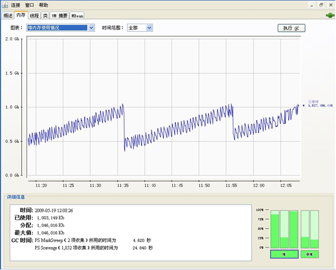

# 1	理论篇
## 1.1	多功能养鱼塘－JVM内存

- 大鱼塘O（可分配内存）： JVM可以调度使用的总的内存数，这个数量受操作系统进程寻址范围、系统虚拟内存总数、系统物理内存总数、其他系统运行所占用的内存资源等因素的制约。  
- 小池塘A（堆内存）：JVM运行时数据区域，它为类实例和数组分配的内存。堆可以是固定大小的也可以是可变大小的。其中 Heap = {Old + NEW = { Eden , from, to } }。  
- 小池塘B（非堆内存）：包括所有线程之间共享的一个方法区域和JVM为优化或内部处理所分配的内存。它存储每一个类的结构，如一个运行时的常量池、字段和方法数据、方法的代码和构造函数。这个方法区是逻辑上堆的一部分，但依赖于实现，一个JVM可以不去回收或者压缩它。像堆一样，方法区可以固定大小的，也可以是大小可变的。方法区不是必须是连续的，它们可以是不连续的。除方法区之外，JVM总是从非堆中分配用于优化和内部处理所需的内存。例如，JIT编译器为高性能的JVM代码转换存储成本地代码而分配的内存。  

1.整个池塘结构图如下：


 
2.查看大池塘O大小的方法为：

在命令行下用 java -XmxXXXXM -version 命令来进行测试，然后逐渐的增大XXXX的值，如果执行正常就表示指定的内存大小可用，否则会打印错误信息，示例如下： 
```shell
java -Xmx3072M -version
```

3.当一个URL被访问时，内存申请过程如下： 

A. JVM会试图为相关Java对象在Eden中初始化一块内存区域 
B. 当Eden空间足够时，内存申请结束。否则到下一步 
C. JVM试图释放在Eden中所有不活跃的对象（这属于1或更高级的垃圾回收）, 释放后若Eden空间仍然不足以放入新对象，则试图将部分Eden中活跃对象放入Survivor区 
D. Survivor区被用来作为Eden及OLD的中间交换区域，当OLD区空间足够时，Survivor区的对象会被移到Old区，否则会被保留在Survivor区 
E. 当OLD区空间不够时，JVM会在OLD区进行完全的垃圾收集（0级）
F. 完全垃圾收集后，若Survivor及OLD区仍然无法存放从Eden复制过来的部分对象，导致JVM无法在Eden区为新对象创建内存区域，则出现”out of memory错误”

## 1.2	池塘中的鱼－程序中的对象

程序中运行的各种类实例称之为对象，每个对象都有不同的生命周期，有的存活时间长点，有的存活时间短点，这就想鱼塘中养的不同生长期的鱼一样，有的三个月就可以上市，有的鱼则需要6个月甚至更长的时间才能上市。JVM内存机制的设置就是为了要满足这种不同生命周期的对象对内存的需求，并使之能达到最大的性能表现。

## 1.3	养殖区域划分－JVM中的代
鱼塘主人为了充分利用现有的条件来赚取更多的利润，他需要喂养各种不同种类的鱼，于是又把鱼塘分割成了几块不同区域：“鱼苗养殖区”、“短中期养殖区”、“长期养殖区”，来养殖不同生长周期的鱼。JVM同样为了对各种不同生命周期的对象进行有效管理也划分了各种不同的区域，这就是“代”的概念，分别叫做：“青年代”、“老年代”、“持久代”，下面逐一介绍每个代的含义和作用。

短中期鱼苗养殖区－年青代(Young Generation)

年青代由一个Eden Space和两个Survivor Spaces组成，虚拟机初始时分配所有的对象到Eden Space，许多对象也是在这里死去。当它执行一个“minor GC”的时候，虚拟机将从Eden Space中移动一些残余的对象到其中的一个Survivor Spaces中。青年代就好像养鱼塘中的“中短期养殖区”一样，主人把鱼先投放到“短期养殖区”喂养，隔一段时间就开始下网捞出已经长成的那些鱼拿到集市去卖，这个过程就是从“Eden Space”中执行垃圾回收的过程。主人接着把捕捞之后剩下的“漏网之鱼”赶到“中期养殖区”继续喂养。这个“中期养殖区”就是“Survivor Spaces”，当然鱼在“中期养殖区”喂养一段时间后也要捞出那些长成的鱼去卖，这就是对“Survivor Spaces” 执行垃圾回收的过程。

Ps Eden Space: 这个内存池在对象初始化时被分配；

Ps Survivor Space: 这个内存池中包含着Eden Space 经过GC之后幸存下来的对象；

年轻代设置策略：对于响应时间优先的应用需尽可能设大，直到接近系统的最低响应时间限制（根据实际情况选择）。在此种情况下，年轻代收集发生的频率也是最小的。同时，减少到达老年代的对象。对于吞吐量优先的应用则尽可能的设置大，可达到Gbit的程度。因为对响应时间没有要求，垃圾收集可以并行进行，一般适合8CPU以上的应用。

长期养殖区－老年代(老年代)：

虚拟机将在Survivor Spaces中生存足够长时间的对象移动到老年代的Tenured Spaces中。当Tenured Generation被填满，则将执行一个完全GC，这个完全GC非常的慢，因为它要处理所有存活着的对象，用的是串行标记收集的方式，并发收集可以减少对于应用的影响。

老年代设置策略：对于响应时间优先的应用，老年代使用并发收集器，所以其大小需要小心设置，一般要考虑并发会话率和会话持续时间等一些参数。如果堆设置小了，可能会造成内存碎片、高回收频率以及应用暂停而使用传统的标记清除方式；如果堆大了，则需要较长的收集时间。

最优化的方案，一般需要参考以下数据获得： 

- 并发垃圾收集信息 
- 持久代并发收集次数
- 传统GC信息 
- 花在年轻代和老年代回收上的时间比例 
- 减少年轻代和老年代花费的时间，一般会提高应用的效率 

对于吞吐量优先的应用，一般吞吐量优先的应用都有一个很大的年轻代和一个较小的老年代。原因是，这样可以尽可能回收掉大部分短期对象，减少中期的对象，而老年代尽存放长期存活对象。 

较小堆引起的碎片问题 ：因为老年代的并发收集器使用标记、清除算法，所以不会对堆进行压缩。当收集器回收时，他会把相邻的空间进行合并，这样可以分配给较大的对象。但是，当堆空间较小时，运行一段时间以后，就会出现“碎片”，如果并发收集器找不到足够的空间，那么并发收集器将会停止，然后使用传统的标记、清除方式进行回收。如果出现“碎片”，可能需要进行如下配置： -XX:+UseCMSCompactAtFullCollection 使用并发收集器时，开启对老年代的压缩；-XX:CMSFullGCsBeforeCompaction=0上面配置开启的情况下，这里设置多少次Full GC后，对老年代进行压缩。

*监控实例*

内存池名称: Tenured Gen  
Java 虚拟机最初向操作系统请求的内存量: 3,538,944 字节  
Java 虚拟机实际能从操作系统获得的内存量: 1,431,699,456 字节  
Java 虚拟机可从操作系统获得的最大内存量: 1,431,699,456 字节。请注意，并不一定能获得该内存量。  
Java 虚拟机此时使用的内存量: 1,408,650,472 字节  

*监控实例*

实例说明：系统能获得的最大Tenured Generation空间大小为1.431G左右，此时使用已经1.408G，基本满了，所以在JVM执行串行标记垃圾收集时，系统响应速度会很慢！

鱼苗养殖区－持久代（Permanent Generation）
控制着所有虚拟机自己映射的数据，如类和对象的方法。在持久代中jvm则存储class和method对象。持久代就像鱼苗养殖区一样，池塘主人一次对该区域投入足够量的鱼苗，已保证其他鱼塘的足够供应。就配置而言，永久域是一个独立域并且不认为是堆的一部分。永久域默认大小为4m.运行程序时，jvm会调整永久域的大小以满足需要。每次调整时，jvm会对堆进行一次完全的垃圾收集。 使用-XX：MaxPerSize标志来增加永久域搭大小。在WebLogic Server应用程序加载较多类时，经常需要增加永久域的最大值。当jvm加载类时，永久域中的对象急剧增加，从而使jvm不断调整永久域大小。为了避免调整，可使用-XX：PerSize标志设置初始值。

## 1.4	主人定期捕鱼－JVM垃圾回收
一个池塘收容积限制，能养殖的鱼的数量是一定的，因此隔一段时间必须捞出部分长成的鱼来使主人能喂养很多的鱼。同样，JVM所管理的有限内存也要实现最优化利用，Garbage Collection（GC）就是用来释放没有被引用的对象所占领的内存,目的在于清除不再使用的对象。GC通过算法和参数的配置可以对性能产生效果显著的影响。
GC就好像把长成的鱼从池塘中捞出来拿到市场上去卖，然后给池塘腾出空间继续养别的鱼赚钱。采用哪种养殖方式能让鱼塘主人赚到更大的利润是鱼塘主人的经营目的，而JVM调优的目的在于如何能是系统表现出更好的响应时间、更大的吞吐量。

- Minor Collections（局部垃圾回收）：当通用内存消耗完被分配的内存时，JVM会在内存池上执行一个局部的GC（总是调用minor collection）去释放被dead的对象所占用的内存。这个局部的GC通常比完全GC要快许多。青年代中的垃圾回收就是采用局部垃圾回收机制，因此，青年代中内存分配和管理效率也是最高。
通常情况下，对于内存的申请优先在青年代中申请，当内存不够时会整理新生代，当整理以后还是不能满足申请的内存，就会向老年代移动一些生命周期较长的对象。这种整理和移动会消耗资源，同时降低系统运行响应能力，因此如果青年代设置的过小，就会频繁的整理和移动，对性能造成影响。那是否把年青代设置的越大越好，其实不然，青年代采用的是复制搜集算法，这种算法必须停止所有应用程序线程，服务器线程切换时间就会成为应用响应的瓶颈。

- Major Collections（完全垃圾回收）：当老年代需要被回收，这就是一个major collection ，它的运行常常非常慢，因为它要涉及所有存活着的类。

*实例*

垃圾收集器的名称: Copy
使用此垃圾收集器收集的数量: 219 字节
垃圾收集时间: 18 秒 630 毫秒
垃圾收集器的名称: MarkSweepCompact
使用此垃圾收集器收集的数量: 47 字节
垃圾收集时间: 36 秒 166 毫秒
实例说明：copy垃圾搜集器的运行时间为18秒回收219字节，回收速度为平均每秒12字节，而MKC垃圾搜集器的时间为36秒回收了47字节，回收速度为平均每秒1.3字节，两者差距几乎达到了10倍，可见完全垃圾回收的速度远不如局部垃圾回收。 

## 1.5	不同的捕鱼方式－垃圾回收器

Sun JVM提供有4垃圾回收器：

- Serial Collector（序列垃圾回收器）：垃圾回收器对Young Gen和Tenured Gen都是使用单线的垃圾回收方式，对Young Gen，会使用拷贝策略避免内存碎片，对Old Gen，会使用压缩策略避免内存碎片。在JVM启动参数中使用-XX:+UseSerialGC启用Serial Collector。串行收集器只适用于小数据量的情况，默认情况下，JDK5.0以前都是使用串行收集器，如果想使用其他收集器需要在启动时加入相应参数。基本上在多内核的服务器上应该避免使用这种方式。JDK5.0以后，JVM会根据当前系统配置进行判断。串行GC适合小型应用和单处理器系统（无需多线程交互，效率比较高）。
- Parallel Collector（并发垃圾回收器）：垃圾回收器对Young Gen和Tenured Gen都是使用多线程并行垃圾回收的方式，对Young Gen，会使用拷贝策略避免内存碎片，对Old Gen，会使用压缩策略避免内存碎片。在JVM启动参数中使用-XX:+UseParallelGC启用Parallel Collector。这是一种吞吐量优先的并行收集器 ，主要以到达一定的吞吐量为目标，适用于科学技术和后台处理等。采用了多线程并行管理和回收垃圾对象，提高了回收效率和服务器的吞吐量，适合于多处理器的服务器。
- Parallel Compacting Collector（并行压缩垃圾回收器)：与Parallel Collector垃圾回收类似，但对Tenured Gen会使用一种更有效的垃圾回收策略，此垃圾回收器在暂停时间上会更短。在JVM启动参数中使用-XX:+UseParallelOldGC启用Parallel Compacting Collector。这是一种响应时间优先的并发收集器 ，主要是保证系统的响应时间，减少垃圾收集时的停顿时间。适用于应用服务器、电信领域等。
- Concurrent Mark-Sweep (CMS) Collector（并发标志清除垃圾回收器)：对Young Gen会使用与Parallel Collector同样的垃圾回收策略，对Tenured Gen垃圾回收的垃圾标志线程与应用线程同时进行，而垃圾清除则需要暂停应用线程，但暂停时间会大大缩减，需要注意的是，由于垃圾回收过程更加复杂，会降低总体的吞吐量。

这里说一下并行和并发的区别，并行指的是多个进程并行执行垃圾回收，那么可以很好的利用多处理器，而并发指的是应用程序不需要暂停可以和垃圾回收线程并发工作。

说明：对于联机处理的应用系统或复杂的3层应用系统，采用Concurrent Mark-Sweep (CMS) Collector进行垃圾搜集，基本上既能保证性能，又能保证稳定性（暂停时间短）。

## 1.6	捕鱼工具选择－JVM参数

### 1.6.1	通用JVM参数
- server
如果不配置该参数，JVM会根据应用服务器硬件配置自动选择不同模式，server模式启动比较慢，但是运行期速度得到了优化，适合于服务器端运行的JVM。

- client 启动比较快，但是运行期响应没有server模式的优化，适合于个人PC的服务开发和测试。
- Xmx 设置java heap的最大值，默认是机器物理内存的1/4。这个值决定了最多可用的Java堆内存：分配过少就会在应用中需要大量内存作缓存或者临时对象时出现OOM（Out Of Memory）的问题；如果分配过大，那么就会因PermSize过小而引起的另外一种Out Of Memory。所以如何配置还是根据运行过程中的分析和计算来确定，如果不能确定还是采用默认的配置。
- Xms 设置Java堆初始化时的大小，默认情况是机器物理内存的1/64。这个主要是根据应用启动时消耗的资源决定，分配少了申请起来会降低运行速度，分配多了也浪费。
- XX:PermSize 初始化永久内存区域大小。永久内存区域全称是Permanent Generation space，是指内存的永久保存区域，程序运行期不对PermGen space进行清理，所以如果你的APP会LOAD很多CLASS的话,就很可能出现PermGen space错误。这种错误常见在web服务器对JSP进行pre compile的时候。 如果你的WEB APP下用了大量的第三方jar，其大小超过了jvm默认的PermSize大小(4M)那么就会产生此错误信息了。 
- XX:MaxPermSize  设置永久内存区域最大大小。
- Xmn 直接设置青年代大小。整个JVM可用内存大小=青年代大小 + 老年代大小 + 持久代大小 。持久代一般固定大小为64m，所以增大年轻代后，将会减小老年代大小。此值对系统性能影响较大，Sun官方推荐配置为整个堆的3/8。 按照Sun的官方设置比例，则上面的例子中年轻代的大小应该为2048*3/8=768M。
- XX:NewRatio 控制默认的Young代的大小，例如，设置-XX:NewRatio=3意味着Young代和老年代的比率是1:3。换句话说，Eden和Survivor空间总和是整个堆大小的1/4。
 


如图中的实际设置，-XX:NewRatio=2，-Xmx=2048，则年轻代和老年代的分配比例为1:2，即年轻代的大小为682M，而老年代的大小为1365M。查看实际系统的jvm监控结果为：

内存池名称: Tenured Gen 

Java 虚拟机最初向操作系统请求的内存量: 3,538,944 字节
Java 虚拟机实际能从操作系统获得的内存量: 1,431,699,456 字节
Java 虚拟机可从操作系统获得的最大内存量: 1,431,699,456 字节。请注意，并不一定能获得该内存量。
Java 虚拟机此时使用的内存量: 1,408,650,472 字节
即：1,408,650,472 字节=1365M，证明了上面的计算是正确的。

-XX:SurvivorRatio

设置年轻代中Eden区与Survivor区的大小比值。设置为4，则两个Survivor区与一个Eden区的比值为2:4，一个Survivor区占整个年轻代的1/6。越大的survivor空间可以允许短期对象尽量在年青代消亡；如果Survivor空间太小，Copying收集将直接将其转移到老年代中，这将加快老年代的空间使用速度，引发频繁的完全垃圾回收。

如下图：
 


SurvivorRatio的值设为3，Xmn为768M，则每个Survivor空间的大小为768M/5=153.6M。

- XX:NewSize 为了实现更好的性能，您应该对包含短期存活对象的池的大小进行设置，以使该池中的对象的存活时间不会超过一个垃圾回收循环。新生成的池的大小由 NewSize 和 MaxNewSize 参数确定。通过这个选项可以设置Java新对象生产堆内存。在通常情况下这个选项的数值为1024的整数倍并且大于1MB。这个值的取值规则为，一般情况下这个值-XX:NewSize是最大堆内存（maximum heap size）的四分之一。增加这个选项值的大小是为了增大较大数量的短生命周期对象。增加Java新对象生产堆内存相当于增加了处理器的数目。并且可以并行地分配内存，但是请注意内存的垃圾回收却是不可以并行处理的。作用跟-XX:NewRatio相似， -XX:NewRatio是设置比例而-XX:NewSize是设置精确的数值。
- XX:MaxNewSize 通过这个选项可以设置最大Java新对象生产堆内存。通常情况下这个选项的数值为1 024的整数倍并且大于1MB，其功用与上面的设置新对象生产堆内存-XX:NewSize相同。一般要将NewSize和MaxNewSize设成一致。
- XX:MaxTenuringThreshold 设置垃圾最大年龄。如果设置为0的话，则年轻代对象不经过Survivor区，直接进入老年代。对于老年代比较多的应用，可以提高效率。如果将此值设置为一个较大值，则年轻代对象会在Survivor区进行多次复制，这样可以增加对象在年轻代的存活时间，增加在年轻代即被回收的概率。

如下图：


 
- XX:MaxTenuringThreshold参数被设置成5，表示对象会在Survivor区进行5次复制后如果还没有被回收才会被复制到老年代。
- XX:GCTimeRatio 设置垃圾回收时间占程序运行时间的百分比。该参数设置为n的话，则垃圾回收时间占程序运行时间百分比的公式为1/(1+n) ，如果n=19表示java可以用5%的时间来做垃圾回收，1/(1+19)=1/20=5%。
- XX:TargetsurvivorRatio 该值是一个百分比，控制允许使用的救助空间的比例，默认值是50。该参数设置较大的话可提高对survivor空间的使用率。当较大的堆栈使用较低的SurvivorRatio时，应增加该值到80至90，以更好利用救助空间。
- Xss 设置每个线程的堆栈大小，根据应用的线程所需内存大小进行调整，在相同物理内存下，减小这个值能生成更多的线程。但是操作系统对一个进程内的线程数还是有限制的，不能无限生成，经验值在3000~5000左右。当这个选项被设置的较大（>2MB）时将会在很大程度上降低系统的性能。因此在设置这个值时应该格外小心，调整后要注意观察系统的性能，不断调整以期达到最优。 JDK5.0以后每个线程堆栈大小为1M，以前每个线程堆栈大小为256K。
- Xnoclassgc 这个选项用来取消系统对特定类的垃圾回收。它可以防止当这个类的所有引用丢失之后，这个类仍被引用时不会再一次被重新装载，因此这个选项将增大系统堆内存的空间。禁用类垃圾回收，性能会高一点；

### 1.6.2	串行收集器参数

-XX:+UseSerialGC:设置串行收集器 。

### 1.6.3	并行收集器参数
- XX:+UseParallelGC:选择垃圾收集器为并行收集器，此配置仅对年轻代有效，即上述配置下，年轻代使用并行收集，而老年代仍旧使用串行收集。采用了多线程并行管理和回收垃圾对象，提高了回收效率，提高了服务器的吞吐量，适合于多处理器的服务器。
- XX:ParallelGCThreads 配置并行收集器的线程数，即：同时多少个线程一起进行垃圾回收。此值最好配置与处理器数目相等。
- XX:+UseParallelOldGC： 采用对于老年代并发收集的策略，可以提高收集效率。JDK6.0支持对老年代并行收集。
- XX:MaxGCPauseMillis 设置每次年轻代并行收集最大暂停时间，如果无法满足此时间，JVM会自动调整年轻代大小以满足此值。
- XX:+UseAdaptiveSizePolicy： 设置此选项后，并行收集器会自动选择年轻代区大小和相应的Survivor区比例，以达到目标系统规定的最低响应时间或者收集频率等，此值建议使用并行收集器时，一直打开。

### 1.6.4	并发收集器参数
- -XX:+UseConcMarkSweepGC 指定在 老年代 使用 concurrent cmark sweep gc。gc thread 和 app thread 并行 ( 在 init-mark 和 remark 时 pause app thread)。app pause 时间较短 , 适合交互性强的系统 , 如 web server。它可以并发执行收集操作，降低应用停止时间，同时它也是并行处理模式，可以有效地利用多处理器的系统的多进程处理。
- -XX:+UseParNewGC 指定在 New Generation 使用 parallel collector, 是 UseParallelGC 的 gc 的升级版本 , 有更好的性能或者优点 , 可以和 CMS gc 一起使用
- -XX:+UseCMSCompactAtFullCollection： 打开对老年代的压缩。可能会影响性能，但是可以消除碎片,在FULL GC的时候， 压缩内存， CMS是不会移动内存的， 因此， 这个非常容易产生碎片， 导致内存不够用， 因此， 内存的压缩这个时候就会被启用。 增加这个参数是个好习惯。
- -XX:+CMSIncrementalMode:设置为增量模式。适用于单CPU情况
- -XX:CMSFullGCsBeforeCompaction 由于并发收集器不对内存空间进行压缩、整理，所以运行一段时间以后会产生“碎片”，使得运行效率降低。此值设置运行多少次GC以后对内存空间进行压缩、整理。
- -XX:+CMSClassUnloadingEnabled 使CMS收集持久代的类，而不是fullgc
- -XX:+CMSPermGenSweepingEnabled 使CMS收集持久代的类，而不是fullgc。
- -XX:-CMSParallelRemarkEnabled 在使用 UseParNewGC 的情况下 , 尽量减少 mark 的时间。
- -XX:CMSInitiatingOccupancyFraction 说明老年代到百分之多少满的时候开始执行对老年代的并发垃圾回收（CMS），这个参数设置有很大技巧，基本上满足公式：
(Xmx-Xmn)*(100-CMSInitiatingOccupancyFraction)/100>=Xmn 时就不会出现promotion failed。在我的应用中Xmx是6000，Xmn是500，那么Xmx-Xmn是5500兆，也就是老年代有5500兆，CMSInitiatingOccupancyFraction=90说明老年代到90%满的时候开始执行对老年代的并发垃圾回收（CMS），这时还剩10%的空间是5500*10%=550兆，所以即使Xmn（也就是年轻代共500兆）里所有对象都搬到老年代里，550兆的空间也足够了，所以只要满足上面的公式，就不会出现垃圾回收时的promotion failed； 如果按照Xmx=2048,Xmn=768的比例计算，则CMSInitiatingOccupancyFraction的值不能超过40，否则就容易出现垃圾回收时的promotion failed。
- -XX:+UseCMSInitiatingOccupancyOnly 指示只有在老年代在使用了初始化的比例后 concurrent collector 启动收集 
- -XX:SoftRefLRUPolicyMSPerMB 相对于客户端模式的虚拟机（-client选项），当使用服务器模式的虚拟机时（-server选项），对于软引用（soft reference）的清理力度要稍微差一些。可以通过增大-XX:SoftRefLRUPolicyMSPerMB来降低收集频率。默认值是 1000，也就是说每秒一兆字节。Soft reference在虚拟机中比在客户集中存活的更长一些。其清除频率可以用命令行参数 -XX:SoftRefLRUPolicyMSPerMB=<N> 来控制，这可以指定每兆堆空闲空间的 soft reference 保持存活（一旦它不强可达了）的毫秒数，这意味着每兆堆中的空闲空间中的 soft reference 会（在最后一个强引用被回收之后）存活1秒钟。注意，这是一个近似的值，因为 soft reference 只会在垃圾回收时才会被清除，而垃圾回收并不总在发生。
- -XX:LargePageSizeInBytes 内存页的大小， 不可设置过大，会影响Perm的大小。 
- -XX:+UseFastAccessorMethods 原始类型的快速优化，get,set 方法转成本地代码。
- -XX:+DisableExplicitGC禁止 java 程序中的 full gc, 如 System.gc() 的调用。 最好加上防止程序在代码里误用了，对性能造成冲击。
- -XX:+AggressiveHeap 特别说明下：(我感觉对于做java cache应用有帮助)试图是使用大量的物理内存 长时间大内存使用的优化，能检查计算资源（内存， 处理器数量） 至少需要256MB内存 大量的CPU／内存， （在1.4.1在4CPU的机器上已经显示有提升） 
- -XX:+AggressiveOpts 加快编译
- -XX:+UseBiasedLocking 锁机制的性能改善。

# 2	实战篇

## 2.1	测试目的
测试被测系统使用不同的垃圾回收方案时的性能表现；  
了解各种JVM参数在性能调优时的实际效果；  
对遴选出的最优方案进行8小时压力测试并记录测试结果；  

## 2.2	测试环境准备
1.被测程序的运行的软硬件环境：
- D630 4G内存＋T7250双核CPU＋160G硬盘；
- 操作系统：windowsXP SP3；
- IP：11.55.15.51；

2.被测程序名称：
- XXX银行采购管理系统V1.1版；

3.程序部署环境：
- Tomcat6.0.18  for windows；
- Sun JDK1.6.13  for windows；
- Oracle10g  for windows（单独运行在另外一台640M笔记本上）

4.性能测试工具运行的软硬件环境：
- 操作系统：windowsxp sp3
- 浏览器版本：IE7
- IP地址：11.55.15.141
- 性能测试工具：loadrunner9.10

5.JVM监控工具：
- 使用Jconsole进行图形化监控；
确定JVM在被测系统的机器上最大可用内存：

通过在命令行下用 java -XmxXXXXM -version 命令反复测试发现在11.55.15.51机器上JVM能使用的最大内存为1592M。
 
## 2.3	录制测试脚本
录制前准备：修改checkcode.java文件，将随机生成的校验码改成一个固定的校验码方便脚本的自动运行，然后将编译好的checkcode.class文件替换发布包中的class文件。

选择典型业务操作进行脚本录制，每个系统的典型业务操作都会不同，需要经过分析统计，选择用户操作频率最高的部分。经过分析后确定的脚本内容为：录制系统登录操作并在登录成功后的主界面上选取一段文字作为验证点。

启动VuGen程序按脚本定义内容进行录制并调试脚本，保证脚本能正常运行。

## 2.4	定义测试场景
- 虚拟用户数：30
- 持续运行时间：8小时 
- 虚拟用户加载和卸载方式：同时
- 性能监控指标：响应时间、吞吐量、成功交易数

## 2.5	执行初步性能测试
使用系统默认的参数执行测试，并记录响应时间、吞吐量已经成功交易数等数据，同时监控JVM的使用情况。

## 2.6	选择调优方案

不同垃圾回收方法测试数据：

|Id	|NewRatio	|SurviorRatio	|TransResponse Time	|Throughput	|Passed Transactions|
|:---|:---:|:---:|:---:|:---:|---:|
|1	|2	|25	|3.139s	|3016230.514	|7528|
|2	|1	|25	|3.161s	|2975581.301	|7452|
|3	|3	|25	|2.814s	|3334717.818	|8383|
|4	|4	|25	|2.659s	|3505592.450	|8846|
|5	|5	|25	|2.860s	|3270596.069	|8232|
|6	|4	|15	|2.499s	|3765121.986	|9426|
|7	|4	|5	|1.986s	|4750776.581	|11843|
|8	|4	|4	|1.968s	|4825608.161	|11947|
|9	|4	|3	|2.507s	|3770420.243	|9388|
|10	|-XX:TargetSurvivorRatio=90	|1|1.924|4945053.874	|12216|
|11	|-Xmx1024M|1|1.903|4974137.908	|12360|

并发收集模式，运行时间十分钟后的对内存使用情况：

 

串行收集模式，运行时间十分钟：
 


并行收集模式，运行时间十分钟：


 
30-60:30个并发用户连续运行60分钟的jvm内存变化截图：



 
在11:36和11:56分发生了两次完全GC（Full GC），因为这时PS Old Gen已经满了，JVM自动对Old Gen中的内存进行了回收。
根据反复的测试并结合被测系统业务特点，最终敲定了使用以下最优方案进行8小时压力测试：
```
JAVA_OPTS=-server
-Xms1024M
-Xmx1024M
-Xmn128M
-XX:NewSize=128M
-XX:MaxNewSize=128M
-XX:SurvivorRatio=20
-XX:MaxTenuringThreshold=10
-XX:GCTimeRatio=19
-XX:+UseParNewGC
-XX:+UseConcMarkSweepGC
-XX:+CMSClassUnloadingEnabled
-XX:+UseCMSCompactAtFullCollection
-XX:CMSFullGCsBeforeCompaction=0
-XX:-CMSParallelRemarkEnabled
-XX:CMSInitiatingOccupancyFraction=70
-XX:SoftRefLRUPolicyMSPerMB=0
–XX:PermSize=256m
-XX:MaxPermSize=256m
-Djava.awt.headless=true
```

## 2.7	调优后JVM监控图
30Vusers运行8小时截图：
 

 
## 2.8	测试结果分析

对于XX银行采购系统的登录操作来说，将jvm的NewRatio 和SurviorRatio设置成4时，性能表现最好！在此基础上在设置-XX:TargetSurvivorRatio=90和-Xmx1024M后性能也有一定程度的提升。

# 3	性能问题举例

## 3.1	性能症状

XX省一个正式上线运行的系统，每运行一段时间后程序进程会莫名其妙地被kill掉，不得不手工启动系统。

## 3.2	监控结果
### 3.2.1	jmap命令查看堆内存分配和使用情况

```
./jmap -heap 31    //31为程序的进程号
Attaching to process ID 31, please wait...
Debugger attached successfully.
Server compiler detected.
JVM version is 11.0-b12   //显示jvm的版本号
using parallel threads in the new generation.  //说明在年轻代使用了并行收集
using thread-local object allocation.
Concurrent Mark-Sweep GC     //启用CMS收集模式
```

```
Heap Configuration:
   MinHeapFreeRatio = 40
   MaxHeapFreeRatio = 70   //这两项说明堆内存的使用比例在30%～60%之间
   MaxHeapSize      = 2147483648 (2048.0MB)  //最大堆大小为2048M
   NewSize          = 805306368 (768.0MB)    
   MaxNewSize       = 805306368 (768.0MB)    //年轻代大小为768M
   OldSize          = 1342177280 (1280.0MB)   //老年代代大小为1280M
   NewRatio         = 8                     //这个有点自相矛盾，1:8
   SurvivorRatio    = 3                       //救助区大小占整个年轻代的五分之一
   PermSize         = 268435456 (256.0MB)    //持久代大小为256M
   MaxPermSize      = 268435456 (256.0MB)   //持久代大小为256M
```

Heap Usage:
```
//年轻代大小，这里只计算了一个救助区，所以少了153M
New Generation (Eden + 1 Survivor Space):   
   capacity = 644284416 (614.4375MB)
   used     = 362446760 (345.65616607666016MB)
   free     = 281837656 (268.78133392333984MB)
   56.25570803810968% used
//Eden Space大小为614.43-153=460.8M
Eden Space:
   capacity = 483262464 (460.875MB)
   used     = 342975440 (327.0868682861328MB)
   free     = 140287024 (133.7881317138672MB)
   70.97084204743864% used
//两个救助区的大小均为153MB， 与前面的SurvivorRatio参数设置值计算结果一致。
From Space:
   capacity = 161021952 (153.5625MB)
   used     = 19471320 (18.569297790527344MB)
   free     = 141550632 (134.99320220947266MB)
   12.092338813530219% used
To Space:
   capacity = 161021952 (153.5625MB)
   used     = 0 (0.0MB)
   free     = 161021952 (153.5625MB)
   0.0% used
//老年代大小为1280M，和根据参数配置计算的结果一致。
concurrent mark-sweep generation:
   capacity = 1342177280 (1280.0MB)
   used     = 763110504 (727.7588882446289MB)
   free     = 579066776 (552.2411117553711MB)
   56.85616314411163% used
//永久代大小为256M，实际使用不到50%。可在系统运行一段时间后稳定该值。
Perm Generation:
   capacity = 268435456 (256.0MB)
   used     = 118994736 (113.48222351074219MB)
   free     = 149440720 (142.5177764892578MB)
   44.32899355888367% used
```

### 3.2.2	Top命令监控结果：
 
通过使用top命令进行持续监控发现此时CPU空闲比例为85.7%，剩余物理内存为3619M，虚拟内存8G未使用。持续的监控结果显示进程29003占用系统内存不断在增加，已经快得到最大值。

### 3.2.3	Jstat命令监控结果：
 
使用jstat命令对PID为29003的进程进行gc回收情况检查，发现由于Old段的内存使用量已经超过了设定的80％的警戒线，导致系统每隔一两秒就进行一次FGC，FGC的次数明显多余YGC的次数，但是每次FGC后old的内存占用比例却没有明显变化—系统尝试进行FGC也不能有效地回收这部分对象所占内存。同时也说明年轻代的参数配置可能有问题，导致大部分对象都不得不放到老年代来进行FGC操作，这个或许跟系统配置的会话失效时间过长有关。

### 3.2.4	Jstack打印出的堆栈内容：
 


在上图中发现大量的的工作流线程锁定。


在上图中发现大量的的cms线程池管理线程锁定。

## 3.3	原因分析
通过对jvm内存进行实时监控后发现导致老年代内存不能有效回收的原因就在于堆栈中存在大量的线程死锁问题。建议开发组认真审查com.zzxy.workflow包的源代码以及com.web.csm包中的源代码，看看是否存在线程死锁的缺陷。

## 3.4	该系统的JVM设置

```xml
<jvm-options>-XX:+PrintGCApplicationConcurrentTime</jvm-options> <jvm-options>-XX:+PrintGCApplicationStoppedTime</jvm-options>
<jvm-options>-XX:+PrintGCTimeStamps</jvm-options>
<jvm-options>-XX:+PrintGCDetails</jvm-options>
<jvm-options>-Xms2048m</jvm-options>
<jvm-options>-Xmx2048m</jvm-options>
<jvm-options>-server</jvm-options>
<jvm-options>-Djava.awt.headless=true</jvm-options>
<jvm-options>-XX:PermSize=256m</jvm-options>
<jvm-options>-XX:MaxPermSize=256m</jvm-options>
<jvm-options>-XX:+DisableExplicitGC</jvm-options>
<jvm-options>-Xmn768M</jvm-options>
<jvm-options>-XX:SurvivorRatio=3</jvm-options>
<jvm-options>-Xss128K</jvm-options>
<jvm-options>-XX:TargetSurvivorRatio=80</jvm-options>
<jvm-options>-XX:MaxTenuringThreshold=5</jvm-options>
<jvm-options>-XX:+UseConcMarkSweepGC</jvm-options>
<jvm-options>-XX:+CMSClassUnloadingEnabled</jvm-options>
<jvm-options>-XX:+UseCMSCompactAtFullCollection</jvm-options>
<jvm-options>-XX:-CMSParallelRemarkEnabled</jvm-options>
```

# 4	后记

- 性能调优要做到有的放矢，根据实际业务系统的特点，以一定时间的JVM日志记录为依据，进行有针对性的调整、比较和观察。
- 性能调优是个无止境的过程，要综合权衡调优成本和更换硬件成本的大小，使用最经济的手段达到最好的效果。
- 性能调优不仅仅包括JVM的调优，还有服务器硬件配置、操作系统参数、中间件线程池、数据库连接池、数据库本身参数以及具体的数据库表、索引、分区等的调整和优化。
- 通过特定工具检查代码中存在的性能问题并加以修正是一种比较经济快捷的调优方法。

# 5	附：舍得网的典型配置

```
$JAVA_ARGS .= " -Dresin.home=$SERVER_ROOT 
-server 
-Xms6000M 
-Xmx6000M 
-Xmn500M 
-XX:PermSize=500M 
-XX:MaxPermSize=500M 
-XX:SurvivorRatio=65536 
-XX:MaxTenuringThreshold=0 
-Xnoclassgc 
-XX:+DisableExplicitGC 
-XX:+UseParNewGC 
-XX:+UseConcMarkSweepGC 
-XX:+UseCMSCompactAtFullCollection 
-XX:CMSFullGCsBeforeCompaction=0 
-XX:+CMSClassUnloadingEnabled 
-XX:-CMSParallelRemarkEnabled 
-XX:CMSInitiatingOccupancyFraction=90 
-XX:SoftRefLRUPolicyMSPerMB=0 
-XX:+PrintClassHistogram 
-XX:+PrintGCDetails 
-XX:+PrintGCTimeStamps 
-XX:+PrintHeapAtGC 
-Xloggc:log/gc.log "; 
```


**说明：**
-  -XX:SurvivorRatio=65536 -XX:MaxTenuringThreshold=0就是去掉了救助空间； 
- -Xnoclassgc禁用类垃圾回收，性能会高一点；
- -XX:+DisableExplicitGC禁止System.gc()，免得程序员误调用gc方法影响性能； 
- -XX:+UseParNewGC，对年轻代采用多线程并行回收，这样收得快；
