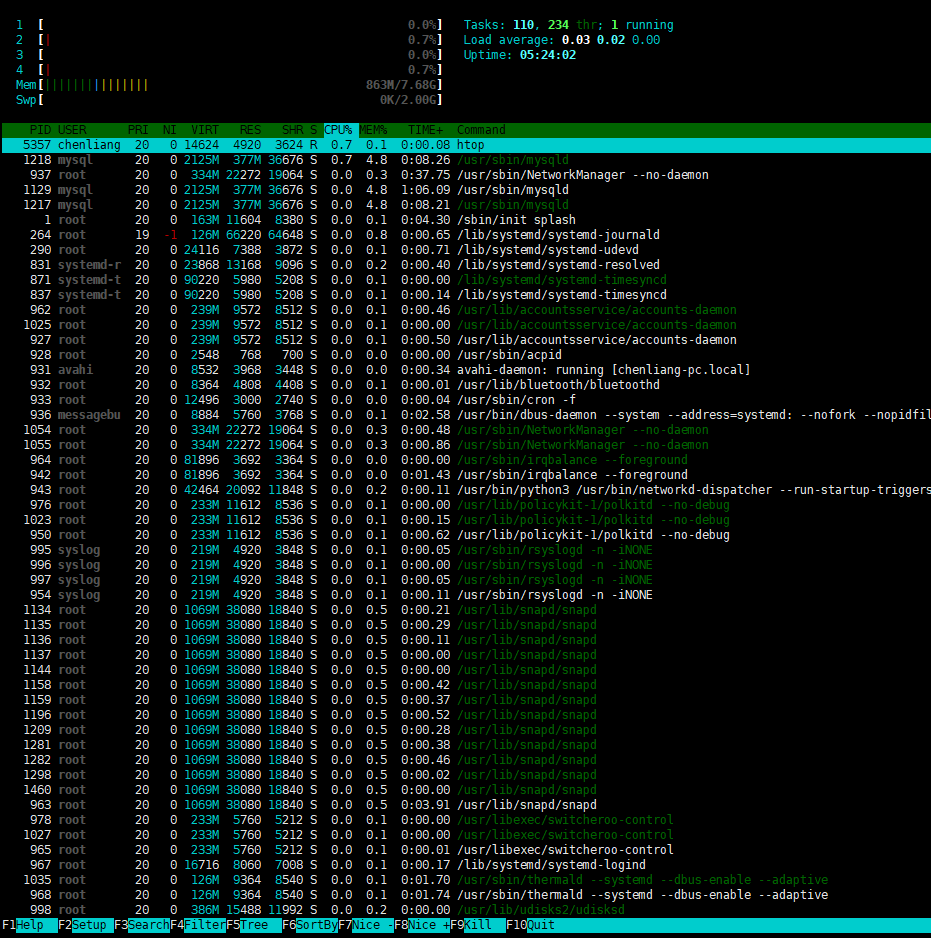

## 闭包
> 在⼀个外函数中定义了⼀个内函数，内函数⾥运⽤了外函数的临时变量，并且外函数的返回值是内函数的引⽤。这样就构成了⼀个闭包。

1.函数概念理引⽤

```python
def test1():
    print("--- in test1 func----")
# 调⽤函数
test1()  # ==> --- in test1 func----
# 引⽤函数
ret = test1
print(id(ret)) # ==> 140212571149040
print(id(test1)) # ==> 140212571149040
#通过引⽤调⽤函数
ret()  # ==> --- in test1 func----
```

2.闭包构成条件
- 必须有⼀个内嵌函数(函数⾥定义的函数）——这对应函数之间的嵌套
- 内嵌函数必须引⽤⼀个定义在闭合范围内(外部函数⾥)的变量——内部函数引⽤外部变量
- 外部函数必须返回内嵌函数——必须返回那个内部函数

3.简单闭包实现

```python
# 定义外层函数 function_out
def function_out(num):
    print("--function_out--,num = ", num)
    # 定义内层函数
    # 在函数内部再定义⼀个函数，并且这个函数⽤到了外边函数的变量，那么将这个函数以及⽤到的⼀些变量称之为闭包
    def function_inner(num_in):
        print("--function_inner--,num = ", num)
        print("--function_inner--,num_in = ", num_in)
    return function_inner # 注意这边是把内部函数return出去的

# 1.调⽤function_out() 把100 传给num
# 2.result 保存的是 function_inner() 函数的地址
result = function_out(100)
#调⽤内层函数 function_inner()
result(88)
```

4.使用外部函数变量

```python
def line_conf(a, b):
    # 内层函数
    def line(x):
        print("a = ", a) # !!!!! 注意此⾏代码，现在运⾏，会打印 a = 1
        # 使⽤了外部函数的 a, b 两个变量
        return x*a + b
    return line
# 调⽤函数
result = line_conf(1, 5)
# 调⽤内层函数
value = result(2)
print("value = ", value)
# 运行结果 a = 1 , value = 7
```
使用外部函数变量关键字：nonlocal
```python
def line_conf(a, b):
    # 内层函数
    def line(x):
        # 告诉解释器，此处使⽤的是 外部变量a
        nonlocal a
        print("a = ", a) # a = 1
        # 在函数内部定义变量 a
        a = 0
        # 使⽤了外部函数的 a, b 两个变量
        return x*a + b
    return line
# 调⽤函数
result = line_conf(1, 5)
# 调⽤内层函数
value = result(2)
print("value = ", value)
```

**总结**
- 函数名只是函数代码空间的引⽤，当函数名赋值给⼀个对象的时候 就是引⽤传递
- 闭包就是⼀个嵌套定义的函数，在外层运⾏时才开始内层函数的定义，然后将内部函数的引⽤传递函数外的对象
- 内部函数和使⽤的外部函数提供的变量构成的整体称为闭包


## 装饰器

> 装饰器：在不改变函数的代码前提下，给函数添加新的功能

1.装饰器引入

```python
#### 第⼀波 ####
def foo():
    print('foo')
foo # 表示是函数
foo() # 表示执⾏foo函数
#### 第⼆波 ####
def foo():
    print('foo')
foo = lambda x: x + 1
foo(5) # 执⾏lambda表达式，⽽不再是原来的foo函数，因为foo这个名字被重新指向了另外⼀个匿名函数
```

函数名仅仅是个变量，只不过指向了定义的函数⽽已，所以才能通过 函数名()调⽤。
如果 函数名=xxx被修改了，那么当在执⾏ 函数名()时，调⽤的就不是之前的那个函数了。

2.装饰器使用前提

    1、存在闭包（⽤于扩展新的功能）
    2、待扩展的普通函数 （⽬的就是不改变该函数，还增加新的功能）


3.装饰器语法格式

```
@闭包外层函数xxx
# 此处的作⽤是使⽤xxx闭包 装饰 func_xxx 函数，给其扩展功能
def func_xxx():
    pass
```

4.简单装饰器

```python
def function_out(func):
    # func = login
    def function_in():
        print("------开始验证-------")
        # func() = login()
        func()

    return function_in


@function_out
# @function_out 装饰了login() 函数
# 底层：login = function_out(login)
def login():
    print("开始登录！")

# 通过闭包调用外层函数
# login = function_out(login)
# login() = function_in();
login()
```
python解释器就会从上到下解释代码，步骤如下：

    1、程序执⾏到 @function_out 且@function_out 下⾯是函数login，表示这是⼀个装饰器
    2、此时相当于 login = function_out(login)


5.装饰器应用场景

    1. 引⼊⽇志
    2. 函数执⾏时间统计
    3. 执⾏函数前预备处理
    4. 执⾏函数后清理功能
    5. 权限校验等场景
    6. 缓存


6.装饰有参数的函数

```python
def function_out(func):
    # func == login

    def function_in(num):
        print("-----开始验证----,num = ",num)
        # 执行待装饰的函数
        # func(num) == login(num)
        func(num)

    return function_in


# 登录函数
@function_out
# login = function_out(login)
def login(num):
    print("开始登录 num = ",num)


# 装饰后，login == function_in
# 调⽤login函数，实际上调⽤了function_in函数
login(10)
```

7.装饰的函数带有返回值

```python
# 闭包函数 function_out 为外层
def function_out(func):
    # inner 为内层函数
    def function_in(a, b):
        print("正在进⾏验证 ....")
        # func ---> login
        return func(a, b)
    return function_in
# 定义login 函数
# login = function_out(login)
@function_out
def login(a, b):
    print("---开始登录---")
    return a + b
# 调⽤login,实际上调⽤function_in函数
s = login(10,20)
print("a + b = ", s)  # a + b = 30
```


## 多重装饰器

1.多个装饰器装饰同⼀个函数

```python
# 模拟实现⽂字加粗的装饰器
def makeBlod(func):
    # 内层函数，实现⽂字加粗
    def wrapped():
        return "<b>" + func() + "</b>"
    return wrapped


# 模拟实现⽂字倾斜的装饰器
def makeItalic(func):
    def wrapped():
        return "<I>" + func() + "</I>"
    return wrapped

# 使⽤makeBlob 装饰器装饰
@makeBlod
def test1():
    return "hello world -1"

# 使⽤makeItalic 装饰器装饰
@makeItalic
def test2():
    return "hello world -2"

# 先使⽤ makeItalic 装饰器，再使⽤ makeBlod 装饰器
@makeBlod
@makeItalic
def test3():
    return "hello world -3"

# 打印输出
print(test1()) # <b>hello world -1</b>
print(test2()) # <I>hello world -2</I>
print(test3()) # <b><I>hello world -3</I></b>
```

## 类装饰器

装饰器函数其实是这样⼀个接⼝约束，它必须接受⼀个callable对象作为参数，然后返回⼀个callable对象。
在Python中⼀般callable对象都是函数，但也有例外。只要某个对象重写了 __call__() ⽅法，那么这个对象就是callable的。

```python
class Test():
    def __call__(self):
        print('call me!')
        
t = Test()
t() # call me
```

类装饰器demo

```python
class Test(object):
    def __init__(self, func):
        print("---初始化---")
        print("func name is %s"%func.__name__)
        self.__func = func
    def __call__(self):
        print("---装饰器中的功能---")
        self.__func()
#说明：
#1. 当⽤Test来装作装饰器对test函数进⾏装饰的时候，⾸先会创建Test的实例对象
# 并且会把test这个函数名当做参数传递到__init__⽅法中
# 即在__init__⽅法中的属性__func指向了test指向的函数
#
#2. test指向了⽤Test创建出来的实例对象
#
#3. 当在使⽤test()进⾏调⽤时，就相当于让这个对象()，因此会调⽤这个对象的__call__⽅法
#
#4. 为了能够在__call__⽅法中调⽤原来test指向的函数体，所以在__init__⽅法中就需要⼀个实例属性来保存这个函数体的引⽤
# 所以才有了self.__func = func这句代码，从⽽在调⽤__call__⽅法中能够调⽤到test之前的函数体
@Test
def test():
    print("----test---")

test()
```
运行结果如下：
```
---初始化---
func name is test
---装饰器中的功能---
----test---
```

**总结:**
- 装饰器函数只有⼀个参数就是被装饰的函数的应⽤
- 装饰器能够将⼀个函数的功能在不修改代码的情况下进⾏扩展
- 在函数定义的上⽅@装饰器函数名 即可直接使⽤装饰器对下⾯的函数进⾏装饰。


## Gil 锁引⼊

要想观察CPU占⽤情况，在ubuntu 中可以使⽤ htop



多进程死循环
```python
#多进程
import multiprocessing

def deadLoop():
    while True:
        pass

#⼦进程死循环 进程2
p1 = multiprocessing.Process(target=deadLoop)
p1.start()

#主进程死循环 进程1
deadLoop()
```

多线程死循环
```python
#多线程
import threading
#⼦线程死循环
def test():
    while True:
        pass
t1 = threading.Thread(target=test)
t1.start()
#主线程死循环
while True:
    pass
```

从上述代码运⾏结果看，程序运⾏后，CPU占⽤率并没有达到 100% 这就是 python中的GIL锁的机制导致的。

虽然有多个线程执⾏，但2个线程并没有让2核全部占⽤率达到 100% , 多任务实际上是⼀种 “伪并发的多线程” 是因为线程执⾏的时候会有⼀个 GIL锁.
Gil锁规定：保证同⼀时刻只有⼀个线程可以⽤到cpu。

1.GIL锁定义

GIL锁：Global Interpreter Lock，⼜称：全局解释器锁

任何Python线程执⾏前，必须先获得GIL锁，然后，每执⾏100条字节码，解释器就⾃动释放GIL锁，让别的线程有机会执⾏。
这个GIL全局锁实际上把所有线程的执⾏代码都给上了锁，所以，多线程在Python中只能交替执⾏，即使100个线程跑在100核CPU上，也只能⽤到1个核。

GIL是Python解释器（Cpython）时引⼊的概念，在JPython、PyPy中没有GIL。
GIL并不是Python的语⾔缺陷。是解释器层级的锁，跟Python语⾔特性⽆关。

全局解释器就是为了锁定整个解释器内部的全局资源，每个线程想要运⾏⾸先获取GIL，⽽GIL本身⼜是⼀把互斥锁，造成所有线程只能⼀个⼀个one-by-one-并发-交替的执⾏。

2. GIL存在的原因

- 早期计算机都是单核设计
- CPython在执⾏多线程的时候并不是线程安全的，所以为了程序的稳定性，加⼀把全局解释锁，能够确保任何时候都只有⼀个Python线程执⾏

GIL产⽣的背景 在CPython解释内部运⾏多个线程的时候，每个线程都需要解释器内部申请相应
的全局资源，由于C语⾔本身⽐较底层造成CPython在管理所有全局资源的时候并不能应对所有
线程同时的资源请求，因此为了防⽌资源竞争⽽发⽣错误，对所有线程申请全局资源增加了限制全局解释器锁。

3. GIL的弊端

- GIL对计算密集型的程序会产⽣影响。因为计算密集型的程序，需要占⽤系统资源。
- GIL的存在，相当于始终在进⾏单线程运算，这样⾃然就慢了。
- IO密集型影响不⼤的原因在于，IO，input/output，这两个词就表明程序的瓶颈在于输⼊所耗费的时间，线程⼤部分时间在等待，所以它们是多个⼀起等（多线程）还是单个等（单线程）⽆所谓的。


4.GIL锁什么时候释放？

- 在当前线程执⾏超时后会⾃动释放
- 在当前线程执⾏阻塞操作时会⾃动释放
- 当前执⾏完成时

5.GIL锁常⻅解决⽅案

- 我们换⼀个解释器执⾏程序就⾏了（jython:⽤JAVA写的python解释器) 不推荐
- 使⽤多进程替换多线程 multiprocessing是⼀个多进程模块，开多个进程，每个进程都带⼀个GIL，就相当于多线程来⽤了。
- 使⽤python语⾔的特性：胶⽔。 我们让⼦线程部分⽤c来写，就ok。（实质上也相当于那部分代码绕过了cython解释器）

第一步，编写子进程程序C语言 test.c 
```
void Loop()
{
    while(1)
    {
        ;
    }
}
```
然后我们把将其编译成 .so ⽂件（share object） 需要执⾏如下命令：
```shell
gcc test.c -shared -o libtest.so
```
    - shared：将其编译成so⽂件
    - o:表示output，⽤来输出的⽂件名
    - 库⽂件是以lib开头

第⼆步，编写python⽂件

```python
import ctypes
import threading
# 加载动态库
my_lib = ctypes.cdll.LoadLibrary("./libtest2.so")
#创建⼦线程
t = threading.Thread(target = my_lib.Loop)
t.start()
#主线程
while True:
    pass
```

第三步,执⾏python⽂件
```shell
python3 04_GIL锁解决⽅案.py
```

**总结:**
- GIL 锁 称为：“全局解释器锁“，是CPython解释器中的锁机制，也是历史遗留问题
- 要提升多线程执⾏效率，解决⽅案：
    - 更换解释器
    - 改为进程替换多线程
    - ⼦线程使⽤C语⾔实现（绕过GIL锁）
- 必须要知道的是：
    - CPU 密集型不太适合多线程
    - I/O 密集型适合多线程（Gil锁会释放）
    
## python中可变与不可变
指的内存中那块值是否可以被改变

- 可变类型，创建后可以继续修改对象的值：字典，列表
- 不可变类型，创建后不可以修改：数字，字符串，元组

```python
l1 = [1,2,3]
print("l1内存地址: %x" % id(l1), "l1内容为：", l1) # l1内存地址: 7fda52d52bc8 l1内容为： [1, 2, 3]
l2 = l1
print("l2内存地址: %x" % id(l2), "l2内容为：", l2) # l2内存地址: 7fda52d52bc8 l1内容为： [1, 2, 3]
# 追加元素
l2.append(88)
print("l2的内容为:", l2) # l2的内容为: [1, 2, 3, 88]
# 此时发现l1 的内容也随之改变
print("l1的内容为:", l1) # l1的内容为: [1, 2, 3, 88]

# 由运⾏结果可知，l1和l2 指向同⼀个地址，通过l2修改列表内容后，发现l1也随之改变，这说明l1和l2代表是同⼀个内存空间。
```

## 可变类型深、浅拷贝

浅拷⻉：引⽤（地址）拷⻉，并没有产⽣新的空间。如果拷⻉的是对象，原对象和copy对象都指向同⼀个内存空间，只拷⻉⽗对象，不会拷⻉对象的内部的⼦对象
  > copy.copy(变量) 会进⾏拷⻉

深拷⻉：会产⽣新的空间。如果拷⻉的是对象，原对象和copy对象都指向不同的内存空间，会拷⻉对象及其⼦对象（会产⽣新的空间）
  > copy.deepcopy(变量名)

*针对可变类型，浅拷⻉、深拷⻉都会产⽣⼀个新的空间*

- copy() 浅拷⻉，产⽣新的空间，能够保证数据的独⽴性
```python
import copy
list1 = [1,2]
print("list1内存地址:%x" % id(list1)) # list1内存地址:7fdd3c212e08
list2 = copy.copy(list1) # 针对可变类型，进⾏的浅拷⻉会创建新的空间
list2.append(88)
print("list2内存地址:%x" % id(list2)) # list2内存地址:7fdd3c1ffc88
print(list2) # 打印结果： [1,2,88]
print(list1) # 打印结果： [1,2]
```

- deepcopy() 深拷⻉，产⽣新的空间，能够保持数据的独⽴性
```python
import copy
list1 = [1,2]
print("list1内存地址:%x" % id(list1))
list2 = copy.deepcopy(list1) # 针对可变类型，进⾏的深拷⻉也会创建新的空间
list2.append(88)
print("list2内存地址:%x" % id(list2))
print(list2) # 打印结果： [1,2,88]
print(list1) # 打印结果： [1,2]
```

- 赋值是将⼀个对象的地址赋值给⼀个变量，让变量指向该地址（旧瓶装旧酒）。
- 浅拷⻉是在另⼀块地址中创建⼀个新的变量或容器，但是容器内的元素的地址均是源对象的元素的地址的拷⻉。也就是说新的容器中指向了旧的元素（新瓶装旧酒）。
- 深拷⻉是在另⼀块地址中创建⼀个新的变量或容器，同时容器内的元素的地址也是新开辟的，仅是值相同⽽已，是完全的副本。也就是说（新瓶装新酒）。


## 不可变类型的深浅拷贝

不可变类型，不管深拷⻉还是浅拷⻉，都不会开辟新的空间，⽽是直接引⽤了被拷⻉的数据的地址

```python
import copy
# 定义元组
a = (1,2,3)
# 对元组进⾏浅拷⻉
a1 = copy.copy(a)
# 查看a、a1的内容
print(a, a1) # (1, 2, 3) (1, 2, 3)
# 查看a, a1 的地址
print("a:%x, a1:%x" % (id(a), id(a1)))  # a:7f08dd1c7e10, a1:7f08dd1c7e10

# 对元组进⾏深拷⻉
a1 = copy.deepcopy(a)
# 查看a, a1 的地址
print("a:%x, a1:%x" % (id(a), id(a1)))  # a:7f08dd1c7e10, a1:7f08dd1c7e10
```

不可变，嵌套类型的，浅拷⻉
- 只关⼼最外层的数据类型是什么，如果是不可变类型，直接引⽤，没有办法保证数据的独⽴性

```python
import copy
# 定义元组
A = [1, 2]
B = [3, 4]
C = (A, B)
# 拷⻉ C
D = copy.copy(C)
# 拷⻉后C、D的内容
print("C=", C, "D=", D) # C= ([1, 2], [3, 4]) D= ([1, 2], [3, 4])
print("C= %x, D= %x" % (id(C), id(D))) # C= 7f61b06882c8, D= 7f61b06882c8
print("D[0]= %x, C[0]= %x, A = %x " % (id(D[0]), id(C[0]), id(A))) # D[0]= 7f61b0688e88, C[0]= 7f61b0688e88, A = 7f61b0688e88
```

不可变，嵌套类型，深拷⻉
- 这个数据是否有可变的数据类型，如果有，他就会开辟多个空间存储数据和地址，能够保持数据独⽴性

```python
import copy
# 定义元组
A = [1, 2]
B = [3, 4]
C = (A, B)
# 拷⻉ C
D = copy.deepcopy(C)
print("C=", C, "D=", D) # C= ([1, 2], [3, 4]) D= ([1, 2], [3, 4])
print("C= %x, D= %x" % (id(C), id(D))) # C= 1f007a13080, D= 1f007be70c0
print("D[0]= %x, C[0]= %x, A = %x " % (id(D[0]), id(C[0]), id(A)))  # D[0]= 1f007c2dac0, C[0]= 1f007c30340, A = 1f007c30340
# 修改D[0] 实际上元组的第⼀个元素，报错
# D[0] = [5,6] # 报错
# D[0][0] 修改的是元组第⼀个元素（列表）的第⼀个值
D[0][0] = 10
print("修改后的D:", D) # 修改后的D: ([10, 2], [3, 4])
print("原来的C:", C) # 原来的C: ([1, 2], [3, 4])
```

## 切片拷贝

切⽚拷⻉，是⼀种浅拷⻉，副本对象和原对象指向同⼀个空间

地址一样，空间一样

```python
import copy
# 定义元组
A = [1, 2]
B = [3, 4]
C = (A, B)
# 拷⻉ C 使⽤切⽚拷⻉实现
# D = copy.copy(C)
D = C[:]
# 拷⻉后C、D的内容
print("C=", C, "D=", D) # C= ([1, 2], [3, 4]) D= ([1, 2], [3, 4])
print("C= %x, D= %x" % (id(C), id(D))) # C= 7fe6a6b772c8, D= 7fe6a6b772c8
print("D[0]= %x, C[0]= %x, A = %x " % (id(D[0]), id(C[0]), id(A))) # D[0]= 7fe6a6b77e88, C[0]= 7fe6a6b77e88, A = 7fe6a6b77e88
```

## 字典拷⻉

拷贝完地址不一样，但是修改了地址1的值，地址2的值也跟着改变，也就是不同地址指向了同一片区域

地址不一样，空间一样

```python
import copy
dict1 = {"age": [1,2]}
# 字典拷⻉, 是通过对象⾃带的copy() ⽅法拷⻉的
dict2 = dict1.copy()
# 查看字典值:
print(dict1, dict2) # {'age': [1, 2]} {'age': [1, 2]}
print("dict1 = %x, dict2 = %x" % (id(dict1), id(dict2))) # dict1 = 7f67d73e48b8, dict2 = 7f67d73e4900
# 修改dict1 字典1的值
dict1["age"][1] = 100
dict1["age"].append(88)
# 查看字典值:
print(dict1, dict2) # {'age': [1, 100, 88]} {'age': [1, 100, 88]}
```

## import导⼊模块

1.import搜索路径

```python
# 查看系统的path 环境变量
# 1) 导入模块 sys
# 2) sys.path 可以查看到环境变量的具体内容
import sys
for p in sys.path:
    print(p)

print('--'*20)
# 把指定的路径加入到环境变量中
# 追加到末尾
# sys.path.append("/home/demo/Desktop/test")
# 追加到开头
sys.path.insert(0, "/home/demo/Desktop/test")

for p in sys.path:
    print(p)
```

2.重新导⼊模块reload

第⼀次 import 模块后，模块被导⼊到当前⽂件，第⼆次再 使⽤import 导⼊同⼀个模块，第⼆次导⼊将不会起作⽤，这是python 解释器的规则，避免重复导⼊⼀个模块带来的其他问题。

解决⽅案的思路是： 想办法重新 加载⼀次 模块就可以了

```python
from imp import reload # 导⼊系统模块
reload(模块名) # 可以重新加载指定的模块
```

3.from…import的私有化问题

```python
# module_1
name = "⼆师兄"
_age = 18 # 私有变量

from module_1 import *
# 使⽤ module_1 模块中的 name 变量
print(name)
print(_age) # 这边会报错，因为私有变量无法访问
```

## 拆包

拆包: 对于函数中的多个返回数据, 去掉元组, 列表 或者字典 直接获取⾥⾯数据的过程.

```python
def func01(*args, **kwargs):
  # 输出参数
  print(args) # ((10, 20, 30), {'age': 18, 'name': 'xxx'})
  print(kwargs) # {}
def func02(*args, **kwargs):
  # 把参数 args 和 kwargs 作为参数，调动 func01
  func01(args, kwargs)
# 调⽤ func02()
func02(10, 20, 30, age=18, name="xxx")
```
如果想要解决上⾯存在的问题，需要使⽤拆包的写法，代码如下:

```python
def func01(*args, **kwargs):
  # 输出参数
  print(args)
  print(kwargs)
def func02(*args, **kwargs):
  # args = (10,20,30) kwargs={"age":18,"name":"xxx"}
  # !!!! 注意下⾯的写法
  # func01(args, kwargs) -- 未拆包写法
  # func01(*args, **kwargs) -- 拆包的写法
  # 拆包前
  # func01(args, kwargs)
  # func01((10,20,30),{"age":18,"name":"xxx"})
  # 拆包后:
  # func01(*args, **kwargs)
  # func01(10, 20, 30, age=18, name="xxx")
  func01(*args, **kwargs)
# 调⽤ func02()
func02(10, 20, 30, age=18, name="xxx")

```

## 多继承以及MRO顺序

1.多继承问题：

什么是多继承 ⼀个⼦类同时继承⾃多个⽗类，⼜称菱形继承、钻⽯继承。

```python
# 定义⽗类Parent
class Parent(object):
  def __init__(self, name):
    print('parent的init开始被调⽤')
    self.name = name
    print('parent的init结束被调⽤')
# 定义⼦类 Son1 --继承--> Parent
class Son1(Parent):
  def __init__(self, name, age):
    print('Son1的init开始被调⽤')
    self.age = age
    Parent.__init__(self, name)
    print('Son1的init结束被调⽤')
# 定义⼦类 Son2 --继承--> Parent
class Son2(Parent):
  def __init__(self, name, gender):
    print('Son2的init开始被调⽤')
    self.gender = gender
    Parent.__init__(self, name)
    print('Son2的init结束被调⽤')
# 定义⼦类 Grandson --继承--> Son1 \ Son2
class Grandson(Son1, Son2):
  def __init__(self, name, age, gender):
    print('Grandson的init开始被调⽤')
    Son1.__init__(self, name, age) # 单独调⽤⽗类的初始化⽅法
    Son2.__init__(self, name, gender)
    print('Grandson的init结束被调⽤')
# 创建对象
gs = Grandson('grandson', 12, '男')
```
运行结果：
```
parent的init被调⽤
Son1的init被调⽤
parent的init被调⽤
Son2的init被调⽤
Grandson的init被调⽤
```

2.使⽤super() 调⽤⽗类⽅法

```python
# 定义⽗类Parent
class Parent(object):
  def __init__(self, name, *args, **kwargs):
    self.name = name
    print('parent的init被调⽤')
# 定义⼦类 Son1 --继承--> Parent
class Son1(Parent):
  def __init__(self, name, age, *args, **kwargs):
    self.age = age
    super().__init__(name, *args, **kwargs)
    print('Son1的init被调⽤')
# 定义⼦类 Son2 --继承--> Parent
class Son2(Parent):
  def __init__(self, name, gender, *args, **kwargs):
    self.gender = gender
    super().__init__(name, *args, **kwargs)
    print('Son2的init被调⽤')
# 定义⼦类 Grandson --继承--> Son1 \ Son2
class Grandson(Son1, Son2):
  def __init__(self, name, age, gender):
    super().__init__(name, age, gender) # 单独调⽤⽗类的初始化⽅法
    # Son2.__init__(self, name, gender)
    print('Grandson的init被调⽤')
# 创建对象
gs = Grandson('grandson', 12, '男')
```
运行结果
```
parent的init被调⽤
Son2的init被调⽤
Son1的init被调⽤
Grandson的init被调⽤
```
结果：为⼀旦使⽤了super() 后，调⽤顺序不是按照继承顺序，⽽是遵守 MRO顺序

3.MRO顺序:

通过上述代码，我们发现由于多继承情况，parent类被的属性被构造了两次，如果在更加复杂的结构下可能更加严重。
为了解决这个问题，Python官⽅采⽤了⼀个算法将复杂结构上所有的类全部都映射到⼀个线性顺序上，⽽根据这个顺序就能 够保证所有的类都会被构造⼀次。这个顺序就是MRO顺序。

4.查看MRO顺序

> 类名.mro()
> 类名.__mro__

**总结**
- MRO保证了多继承情况 每个类只出现⼀次
- super().__init__相对于类名.__init__，在单继承上⽤法基本⽆差
- 但在多继承上有区别，super⽅法能保证每个⽗类的⽅法只会执⾏⼀次，⽽使⽤类名的⽅法会导致⽅法被执⾏多次
- 多继承时，使⽤super⽅法，对⽗类的传参数，应该是由于python中super的算法导致的原因，必须把参数全部传递，否则会报错
- 多继承时，相对于使⽤类名.__init__⽅法，要把每个⽗类全部写⼀遍, ⽽使⽤super⽅法，只需写⼀句话便执⾏了全部⽗类的⽅法，这也是为何多继承需要全部传参的⼀个原因

##  property属性

1.使⽤@property 装饰的⽅法

```python
# 创建类
class Foo:
  # init 初始化⽅法
  def __init__(self):
    self.num = 100
# 创建对象⽅法
@property
def prop(self):
  return self.num
# 调⽤⽅法
f = Foo()
print(f.prop) # p.prop 等价于 p.prop() 作⽤是调⽤对象⽅法
```
property属性的定义和调⽤要注意⼀下⼏点：
- 定义时，在实例⽅法的基础上添加 @property 装饰器；并且仅有⼀个self参数
- 调⽤时，⽆需括号

Python的property属性的功能是：property属性内部进⾏⼀系列的逻辑计算，最终将计算结果返回。

由此可⻅，property的作⽤就是 将⼀个属性的操作⽅法封装为⼀个属性，⽤户⽤起来就和操作普通属性完全⼀致,⾮常简单。

2.property属性的两种⽅式
  - 装饰器 即：在⽅法上应⽤装饰器
  - 类属性 即：在类中定义值为property对象的类属性

装饰器⽅式:在类的实例⽅法上应⽤@property装饰器

```python
#coding=utf-8
# ############### 定义 ###############
class Goods:
  """python3中默认继承object类
  以python2、3执⾏此程序的结果不同，因为只有在python3中才有@xxx.setter @xxx.deleter
  """
  @property
  def price(self):
    print('@property')
  @price.setter
  def price(self, value):
    print('@price.setter')
  @price.deleter
  def price(self):
    print('@price.deleter')
# ############### 调⽤ ###############
obj = Goods()
obj.price # ⾃动执⾏ @property 修饰的 price ⽅法，并获取⽅法的返回值 即获取商品价格
obj.price = 123 # ⾃动执⾏ @price.setter 修饰的 price ⽅法，并将 123 赋值给⽅法的参数 即修改商品价格
del obj.price # ⾃动执⾏ @price.deleter 修饰的 price ⽅法 即删除商品价格
```
由于新式类中具有三种访问⽅式，我们可以根据它们⼏个属性的访问特点，
分别将三个⽅法定义为对同⼀个属性：获取、修改、删除

类属性⽅式：创建值为property对象的类属性

```python
class Foo:
    def get_bar(self):
        return 'laotie'
    BAR = property(get_bar)
obj = Foo()
reuslt = obj.BAR # ⾃动调⽤get_bar⽅法，并获取⽅法的返回值
print(reuslt)
```
property⽅法中有个四个参数
- 第⼀个参数是⽅法名，调⽤ 对象.属性 时⾃动触发执⾏⽅法
- 第⼆个参数是⽅法名，调⽤ 对象.属性 ＝ XXX 时⾃动触发执⾏⽅法
- 第三个参数是⽅法名，调⽤ del 对象.属性 时⾃动触发执⾏⽅法
- 第四个参数是字符串，调⽤ 对象.属性.__doc__ ，此参数是该属性的描述信息

```python
class Goods(object):
    def __init__(self):
      # 原价
      self.original_price = 100
      # 折扣
      self.discount = 0.8
    def get_price(self):
      # 实际价格 = 原价 * 折扣
      new_price = self.original_price * self.discount
      return new_price
    def set_price(self, value):
        self.original_price = value
    def del_price(self):
      del self.original_price
    PRICE = property(get_price, set_price, del_price, '价格属性描述...')
obj = Goods()
obj.PRICE # 获取商品价格
obj.PRICE = 200 # 修改商品原价
del obj.PRICE # 删除商品原价
```

**总结**
- 定义property属性共有两种⽅式，分别是【装饰器】和【类属性】，⽽【装饰器】⽅式针对经典类和新式类⼜有所不同。
- 通过使⽤property属性，能够简化调⽤者在获取数据的流程
- x = property(get_x, set_x, del_x, "doc")

## 魔法属性

⽆论⼈或事物往往都有⼀些含有特殊含义的⽂字，Python的类属性也是如此，存在着⼀些具有特殊含义的属性

1.表示类的描述信息 __doc__
  > 类名.__doc__
  > 对象.test.__doc__

```python
class Foo:
  """ 描述类信息，这是⽤于看⽚的神奇 """
  def start(self):
    """ 开始播放 """
    pass
  
f = Foo()
print(Foo.__doc__) # 描述类信息，这是⽤于看⽚的神奇
print(f.start.__doc__) # 开始播放
```

2. 表示当前操作的对象在哪个模块__module__哪个类 __class__
```python
from test import Person
obj = Person()
print(obj.__module__) # 输出 test 即：输出模块
print(obj.__class__) # 输出 test.Person 即：输出类
```

3. __init__

初始化⽅法，通过类创建对象时，⾃动触发执⾏

```python
class Person:
    def __init__(self, name):
      self.name = name
      self.age = 18
obj = Person('laowang') # ⾃动执⾏类中的 __init__ ⽅法
```

4. __del__

当对象在内存中被释放时，⾃动触发执⾏。
   
此⽅法⼀般⽆须定义，因为Python是⼀⻔⾼级语⾔，程序员在使⽤时⽆需关⼼内存的分配和释放，因为此⼯作都是交给Python解释器来执⾏，
所以，__del__的调⽤是由解释器在进⾏垃圾回收时⾃动触发执⾏的。

5. __call__

 __call__ ⽅法的执⾏是由对象后加括号触发的

```python
class Foo:
    def __init__(self):
        pass
    def __call__(self, *args, **kwargs):
        print('__call__')
obj = Foo() # 执⾏ __init__
obj() # 执⾏ __call__
```

6. __dict__ 类或对象中的所有属性

类的实例属性属于对象；类中的类属性和⽅法等属于类，即：

```python
class Province(object):
    country = 'China'
    def __init__(self, name, count):
        self.name = name
        self.count = count
    def func(self, *args, **kwargs):
        print('func')
# 获取类的属性，即：类属性、⽅法、
print(Province.__dict__)
# 输出：{'__dict__': <attribute '__dict__' of 'Province' objects>, '__module__': '__main__', 'country': 'China', '__doc__': None, '__weakref__': <attribute '__weakref__' of 'Province' objects>, 'func': <function Province.func at 0x101897950>, '__init__': <function Province.__init__ at 0x1018978c8>}
obj1 = Province('⼭东', 10000)
print(obj1.__dict__)
# 获取 对象obj1 的属性
# 输出：{'count': 10000, 'name': '⼭东'}
obj2 = Province('⼭⻄', 20000)
print(obj2.__dict__)
# 获取 对象obj1 的属性
# 输出：{'count': 20000, 'name': '⼭⻄'}
```
   
7. __str__

如果⼀个类中定义了__str__⽅法，那么在打印 对象 时，默认输出该⽅法的返回值。
   
```python
class Foo:
    def __str__(self):
        return 'laotie'
obj = Foo()
print(obj)
# 输出：laotie
```

8. __getitem__、__setitem__、__delitem__

⽤于索引操作，如字典。以上分别表示获取、设置、删除数据

```python
class Foo(object):
    def __getitem__(self, key):
        print('__getitem__', key)
    def __setitem__(self, key, value):
        print('__setitem__', key, value)
    def __delitem__(self, key):
        print('__delitem__', key)
obj = Foo()
result = obj['k1'] # ⾃动触发执⾏ __getitem__
obj['k2'] = 'laotie' # ⾃动触发执⾏ __setitem__
del obj['k1'] # ⾃动触发执⾏ __delitem__
```

## with与“上下⽂管理器”

1.上下文管理器

上下⽂管理器本质就是能够⽀持with操作。

任何实现了 __enter__() 和 __exit__() ⽅法的对象都可称之为上下⽂管理器，上下⽂管理器对象可以使⽤ with 关键字。显然，⽂件（file）对象也实现了上下⽂管理器协议。

```python
class File():
    def __init__(self, filename, mode):
        self.filename = filename
        self.mode = mode
    def __enter__(self):
        print("entering")
        self.f = open(self.filename, self.mode)
        return self.f
    def __exit__(self, *args):
        print("will exit")
        self.f.close()

# __enter__() ⽅法返回资源对象，这⾥就是你将要打开的那个⽂件对象，__exit__() ⽅法处理⼀些清除⼯作。

with File('out.txt', 'w') as f:
    print("writing")
    f.write('hello, python')

# 这样，你就⽆需显示地调⽤ close ⽅法了，由系统⾃动去调⽤，哪怕中间遇到异常 close ⽅法也会被调⽤。
```

2.contextmanager

通过yield 将函数分割成两部分，yield 之前的语句在 __enter__ ⽅法中执⾏，
yield 之后的语句在 __exit__⽅法中执⾏。紧跟在 yield 后⾯的值是函数的返回值。

```python
from contextlib import contextmanager
@contextmanager
def my_open(path, mode):
  f = open(path, mode)
  yield f
  f.close()

with my_open('out.txt', 'w') as f:
    f.write("hello , the simplest context manager")
```

3.with作用

Python引⼊了 with 语句来⾃动帮我们调⽤ close() ⽅法

```python
try:
  # 1、以读的⽅式打开⽂件
  with open("1.txt", "r") as f:
    # 2、读取⽂件内容
    f.write("xxxxx")
except IOError as e:
    print("⽂件操作出错", e)
```

**总结**
- Python 提供了 with 语法⽤于简化资源操作的后续清除操作，实现原理建⽴在上下⽂管理器协议(实现__enter__和__exit__)之上
- with使⽤代码中如果在打开过程中发⽣异常，需要使⽤try-except进⾏捕获
- Python 还提供了⼀个 contextmanager 装饰器，更进⼀步简化上下管理器的实现⽅式。