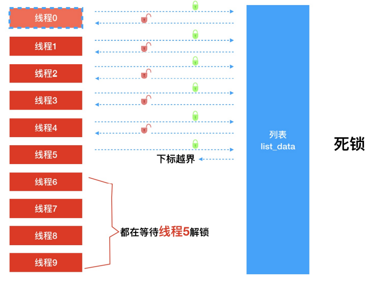
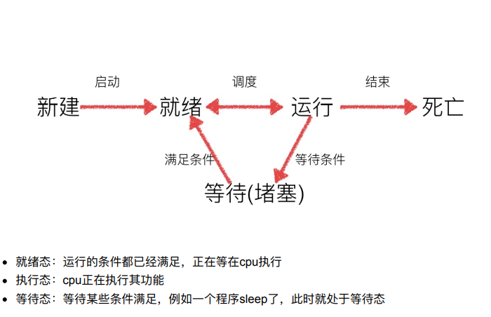
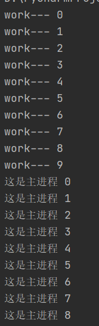

# 系统性能监控 psutil
`
pip3 install psutil
import psutil
psutil.users() 获取⽤户的信息
psutil.boot_time() # 获得开机时间（LINUX格式返回）
datetime.datetime.fromtimestamp(psutil.boot_time()).strftime("%Y-%m-%d %H:%M:%S")
'2017-06-30 17:21:04'
`

# 自动发邮件yagmail
pip3 install yagmail

# 安装虚拟环境
sudo pip install virtualenv
sudo pip install virtualenvwrapper

*安装完虚拟环境后，如果提示找不到mkvirtualenv命令，须配置环境变量：*
`
mkdir
$HOME/.virtualenvs
export WORKON_HOME=$HOME/.virtualenvs
source /usr/local/bin/virtualenvwrapper.sh
source ~/.bashrc
`


创建虚拟环境
提示：如果不指定python版本，默认安装的是python2的虚拟环境
在python2中，创建虚拟环境：mkvirtualenv 虚拟环境名称
例：mkvirtualenv py_flask
在python3中，创建虚拟环境：mkvirtualenv -p python3 虚拟环境名称
例：mkvirtualenv -p python3 py3_flask
注意：
1、创建虚拟环境需要联⽹
2、创建成功后, 会⾃动⼯作在这个虚拟环境上
3、⼯作在虚拟环境上, 提示符最前⾯会出现 “虚拟环境名称”

使⽤虚拟环境
查看虚拟环境命令：workon + 两次tab  或者  lsvirtualenv
启动/切换虚拟环境：workon + 虚拟环境名
退出虚拟环境：deactivate
删除虚拟环境：rmvirtualenv + 环境名
先退出，再删除

在虚拟环境中安装⼯具包
提示 : ⼯具包安装的位置 :
python2版本下：~/.virtualenvs/py_flask/lib/python2.7/site-packages/
python3版本下：~/.virtualenvs/py3_flask/lib/python3.5/site-packages
安装flask-0.10.1的包:pip install flask==0.10.1
查看虚拟环境中安装的包:pip freeze


# ⽹络通信
## 常见端口：
FTP 21, SSH 22, TELNET 23, SMTP 25, DNS 53, HTTP 80, POP3 110, HTTPS 443
netstat －an查看端⼝状态
netstat -ntl （可以查看服务器socket）
sudo lsof -i : 端口号  可以查看端口号被哪个程序占用

## 创建socket
socket即是⼀种特殊的⽂件，⼀些socket类就是对其进⾏的操作（读/写IO、打开、关闭）
import socket
socket.socket(AddressFamily, Type)
AddressFamily(地址簇):socket.AF_INET IPv4（默认）, socket.AF_INET6 IPv6, socket.AF_UNIX
Type(类型):socket.SOCK_STREAM 流式socket for TCP（默认）, socket.SOCK_DGRAM 数据报式socket for UDP

'''
import socket
s = socket.socket(socket.AF_INET, socket.SOCK_STREAM) # 创建tcp的套接字
s = socket.socket(socket.AF_INET, socket.SOCK_DGRAM) # 创建udp的套接字
s.close() # 不⽤的时候，关闭套接字
'''

##socket对象方法
###服务器端套接字：
- s.bind() # 绑定地址（host,port）到套接字， 在AF_INET下,以元组（host,port）的形式表示地址。
- s.listen() # 开始TCP监听。backlog指定在拒绝连接之前，操作系统可以挂起的最⼤连接数量。该值>=1，⼤部分应⽤程序设为5。
- s.accept() # 被动接受TCP客户端连接,(阻塞式)等待连接的到来
###客户端套接字:
- s.connect() # 主动初始化TCP服务器连接。⼀般address的格式为元组（hostname,port）
- s.connect_ex() # connect()函数的扩展版本,出错时返回出错码，不抛出异常。
###公共⽤途的套接字函数：
- s.recv() # 接收TCP数据，数据以字符串形式返回，bufsize指定要接收的最⼤数据量。flag提供有关消息的其他信息，通常可以忽略。
- s.send() # 发送TCP数据，将string中的数据发送到连接的套接字。
- s.sendall() # 完整发送TCP数据。将string中的数据发送到连接的套接字，但在返回之前会尝试发送所有数据。成功返回None，失败则抛出异常。
- s.recvfrom() # 接收UDP数据，与recv()类似，但返回值是（data,address）
- s.sendto() # 发送UDP数据，将数据发送到套接字，address是形式为（ipaddr，port）的元组，指定远程地址。
- s.close() # 关闭套接字
- s.getpeername() # 返回连接套接字的远程地址。返回值通常是元组（ipaddr,port）
- s.getsockname() # 返回套接字⾃⼰的地址。通常是⼀个元组(ipaddr,port)
- s.setsockopt(level,optname,value) # 设置给定套接字选项的值。
- s.getsockopt(level,optname[.buflen]) # 返回套接字选项的值。
- s.settimeout(timeout) # 设置套接字操作的超时期，timeout是⼀个浮点数，单位秒。
- s.gettimeout() # 返回当前超时期的值，单位是秒，如果没有设置超时期，则返回None。
- s.fileno() # 返回套接字的⽂件描述符。
- s.setblocking(flag) # 如果flag为0，则将套接字设为⾮阻塞模式，否则将套接字设为阻塞模式（默认值）。⾮阻塞模式下，如果调⽤recv()没有发现任何数据，或send()调⽤⽆法⽴即发送数据，那么将引起socket.error异常。
- s.makefile() # 创建⼀个与该套接字相关连的⽂件


# udp⽹络程序

## 发送数据:
1.socket.socket —— 建⽴套接字
udp_socket = socket.socket(socket.AF_INET, socket.SOCK_DGRAM)
2. socket.sendto —— 发送数据
udp_socket.sendto("你好".encode(), ("127.0.0.1", 8888))
3. socket.close —— 关闭套接字
udp_socket.close()

##接受数据:
socket.recvfrom(缓冲区⼤⼩) —— 接受UDP套接字的数据
socket.recvfrom(1024) 使⽤udp⽅式接收数据，每次接收1024个字节
decode() —— 解码，把⼆进制数据解码为 字符串 类型
str = data.decode() 把data 解码为字符串并且保存到 str变量中

from socket import *
1. 创建udp套接字
udp_socket = socket(AF_INET, SOCK_DGRAM)
2. 准备接收⽅的地址
dest_addr = ('192.168.236.129', 8080)
3. 发送数据到指定的电脑上
udp_socket.sendto(send_data.encode('utf-8'), dest_addr)
4. 等待接收对⽅发送的数据
recv_data = udp_socket.recvfrom(1024) # 1024表示本次接收的最⼤字节数
5. 显示对⽅发送的数据
接收到的数据recv_data是⼀个元组,第1个元素是对⽅发送的数据,第2个元素是对⽅的ip和端⼝
print(recv_data[0].decode('gbk'))
print(recv_data[1])
6. 关闭套接字
udp_socket.close()
   
##UDP绑定端口
⼀个udp⽹络程序，可以不绑定，此时操作系统会随机进⾏分配⼀个端⼝，如果重新运⾏此程序端⼝可能会发⽣变化
也可以绑定信息（ip地址，端⼝号），如果绑定成功，那么操作系统⽤这个端⼝号来进⾏区别收到的⽹络数据是否是此进程的
udp_socket.bind(address)
address 是一个元组,元组的第一个元素是字符串类型的IP地址，第二个元素 整数端口号。 
udp_socket.bind(("", 8888)) # ip地址可以省略，省略后表示自己的ip地址

# FTP
安装vsftpd服务器: sudo apt-get install vsftpd -y
检查是否启动有端⼝为21的进程: netstat -tnl
ps -ef | grep ftp
配置vsftpd.conf⽂件
sudo gedit /etc/vsftpd.conf
匿名⽤户登录配置anonymous_enable=NO (默认为NO,不⽤修改)
设置本机访问local_enable=YES (默认即为YES，不⽤修改)
安装vsftpd服务器write_enable=YES 此⾏默认被注释了，去除前⾯的“#” 使得此句配置起作⽤
指定上传下载的⽬录local_root=/home/⽤户名/ftp
设置允许登录ftp服务器的⽤户
chroot_list_enable=YES
chroot_list_file=/etc/vsftpd.chroot_list
创建“vsftpd.chroot_list”⽂件 sudo touch /etc/vsftpd.chroot_list
编辑⽂件，加⼊允许登录的⽤户名 直接写用户名
在ftp⽂件夹中建⽴share⽂件夹 mkdir share
减去ftp⽬录⽂件夹 的拥有者（u）权限w权限 chmod u-w ftp
重启 vsftpd 服务 sudo /etc/init.d/vsftpd restart
测试上传功能，登陆ftp服务器
打开linux 终端，输⼊ ftp ftp服务器ip 测试，即可进⼊ ftp 命令⾏模式:ftp IP
上传命令:put somefile
下载命令:get somefile
卸载vsftpd:sudo apt-get remove --purge vsftpd
(--purge 选项表示彻底删除改软件和相关⽂件)

# UDP编程
##服务的步骤
1、创建⼀个socket，⽤函数socket()；
2、设置socket属性，⽤函数setsockopt();* 可选
3、绑定IP地址、端⼝等信息到socket上，⽤函数bind();
4、循环接收数据，⽤函数recvfrom();
5、关闭⽹络连接；

##客户端步骤
1、创建⼀个socket，⽤函数socket()；
2、设置socket属性，⽤函数setsockopt();* 可选
3、绑定IP地址、端⼝等信息到socket上，⽤函数bind();* 可选
4、设置对⽅的IP地址和端⼝等属性;
5、发送数据，⽤函数sendto();
6、关闭⽹络连接；

# TCP简介
⾯向连接,基于字节流的传输层通信协议
过创建连接、数据传送、终⽌连接
这种连接是⼀对⼀的，因此TCP不适⽤于⼴播的应⽤程序，基于⼴播的应⽤程序请使⽤UDP协议。
发送应答机制:TCP发送的每个报⽂段都必须得到接收⽅的应答才认为这个TCP报⽂段传输成功
超时重传:发送端发出⼀个报⽂段之后就启动定时器，如果在定时时间内没有收到应答就重新发送这个报⽂段。
错误校验:TCP⽤⼀个校验和函数来检验数据是否有错误
流量控制和阻塞管理:流量控制⽤来避免主机发送得过快⽽使接收⽅来不及完全收下。

# TCP编程
##服务器端步骤
1、创建⼀个socket，⽤函数socket()；
2、设置socket属性，⽤函数setsockopt(); * 可选
3、绑定IP地址、端⼝等信息到socket上，⽤函数bind();
4、开启监听，⽤函数listen()；
5、接收客户端上来的连接，⽤函数accept()；
6、收发数据，⽤函数send()和recv()，或者read()和write();
7、关闭⽹络连接；
8、关闭监听；

##客户端步骤:
1、创建⼀个socket，⽤函数socket()；
2、设置socket属性，⽤函数setsockopt();* 可选
3、绑定IP地址、端⼝等信息到socket上，⽤函数bind();* 可选
4、设置要连接的对⽅的IP地址和端⼝等属性；
5、连接服务器，⽤函数connect()；
6、收发数据，⽤函数send()和recv()，或者read()和write();
7、关闭⽹络连接；

##TCP客户端发送/接收信息：
import socket # 1、导⼊socket模块
tcp_client_socket = socket.socket(socket.AF_INET, socket.SOCK_STREAM) # 2、创建socket
tcp_client_socket.connect(("192.168.31.247", 7878)) # 3、建⽴tcp连接，这边服务端要启动才能链接成功
recv_data = tcp_client_socket.recv(1024)# 开始接收对⽅回复的数据
tcp_client_socket.send("哈哈哈，打不过我吧！？".encode("utf-8")) # 4、开始发送数据
tcp_client_socket.close() # 5、关闭套接字

##TCP服务端接收/回复信息：
from socket import *
tcp_server_socket = socket(AF_INET, SOCK_STREAM) # 创建socket
tcp_server_socket.bind(('', 7788)) # 绑定
tcp_server_socket.listen(128) # 使⽤socket创建的套接字默认的属性是主动的，使⽤listen将其变为被动的，这样就可以接收别⼈的链接了
client_socket, ip_port = tcp_server_socket.accept() # client_socket⽤来为这个客户端服务 # tcp_server_socket就可以省下来专⻔等待其他新客户端的链接
recv_data = client_socket.recv(1024) # 接收对⽅发送过来的数据 接收1024个字节
client_socket.send("好的，已经收到！～".encode('gbk')) # 发送⼀些数据到客户端
client_socket.close() # 关闭为这个客户端服务的套接字，只要关闭了，就意味着为不能再为这个客户端服务了，如果还需要服务，只能再次重新连接


# ⻓连接和短连接
在HTTP/1.0中, 默认使⽤的是短连接.也就是说, 浏览器和服务器每进⾏⼀次HTTP操作, 就建⽴⼀次连接, 但任务结束就中断连接.如果客户端浏览器访问的某个HTML或其他类型的 Web ⻚中包含有其他的Web资源，如js⽂件、图像⽂件、CSS⽂件等；当浏览器每遇到这样⼀个Web资源，就会建⽴⼀ 个HTTP会话。
但从 HTTP/1.1起，默认使⽤⻓连接，⽤以保持连接特性。使⽤⻓连接的HTTP协议，会在响应头 有加⼊这⾏代码:Connection:keep-alive
1在真正的读写操作之前，server与client之间必须建⽴⼀个连接，
2当读写操作完成后，双⽅不再需要这个连接时它们可以释放这个连接，
3连接的建⽴通过三次握⼿，释放则需要四次握⼿，


# tcp注意点
1. tcp服务器⼀般情况下都需要绑定端⼝和IP，否则客户端找不到这个服务器
2. tcp客户端⼀般不绑定，因为是主动链接服务器，所以只要确定好服务器的ip、port等信息就好，本地客户端可以随机
3. tcp服务器中通过listen可以将socket创建出来的主动套接字变为被动的，这是做tcp服务器时必须要做的
4. 当客户端需要链接服务器时，就需要使⽤connect进⾏链接，udp是不需要链接的⽽是直接发送，但是tcp必须先链接，只有链接成功才能通信
5. 当⼀个tcp客户端连接服务器时，服务器端会有1个新的套接字，这个套接字⽤来标记这个客户端，单独为这个客户端服务
6. listen后的套接字是被动套接字，⽤来接收新的客户端的链接请求的，⽽accept返回的新套接字是标记这个新客户端的
7. 关闭listen后的套接字意味着被动套接字关闭了，会导致新的客户端不能够链接服务器，但是之前已经链接成功的客户端正常通信。
8. 关闭accept返回的套接字意味着这个客户端已经服务完毕
9. 当客户端的套接字调⽤close后，服务器端会recv解堵塞，并且返回的⻓度为0，因此服务器可以通过返回数据的⻓度来区别客户端是否已经下线

# 模拟浏览器请求web过程
`
import socket
tcp_socket = socket.socket()
tcp_socket.connect(("www.itcast.com", 80)) # DNS解析和连接HTTP服务器
request_line = "GET / HTTP/1.1\r\n" # 组包，发送HTTP请求报文
request_header = "Host:www.icoderi.com\r\n" # 4.2 请求头
request_blank = "\r\n" # 4.3 请求空行
request_data = request_line + request_header + request_blank  # 整体拼接
tcp_socket.send(request_data.encode()) # 发送请求报文
response_data = tcp_socket.recv(4096) # 接收响应报文
response_str_data = response_data.decode() # 对响应报文进行解析
index = response_str_data.find("\r\n\r\n") # '\r\n\r\n'之后是响应体数据
html_data = response_str_data[index + 4:]
with open("index.html", "wb") as file:
    file.write(html_data.encode())
tcp_socket.close()
`

# 使用终端启动web服务器
启动格式：python3 webServer.py 8080
## 实现思路
`
1.导入sys模块
2.sys.argv获取参数列表
3.判断列表长度是否为2，如果不等于2给出提示启动失败
4.去除第二个参数，判断是否为一个数字，如果不是一个数组，则给出提示。
5.接受启动参数端口号
6.使用提供的端口号启动web服务器
`
sys.argv[]是⽤来获取命令⾏参数的
sys.argv[0]⽐如在CMD命令⾏输⼊ “python test.py -help”，那么sys.argv[0]就代表“test.py”
sys.startswith() 是⽤来判断⼀个对象是以什么开头的，⽐如在python命令⾏输⼊“'abc'.startswith('ab')”就会返回True。
检测字符串是否只由数字组成：str.isdigit()  ==> True False
```python
import sys
def main():
    if len(sys.argv) != 2:  # 判断参数个数是否合法
        print("启动失败，参数个数错误！正确格式:python xxx.py 8080")
        return
    if not sys.argv[1].isdigit():  # 判断端⼝是否是纯数字
        print("启动失败，端⼝不是数字!")
        return
    port = int(sys.argv[1])  # 保存端⼝
```

# 实现网游服务器
## 实现思路
`
1、定义初始化项⽬的⽅法
2、定义字典保存项⽬路径 字典格式：key=项⽬名称 value=路径
3、循环获取字典中的所有key
4、根据key获取游戏的主⽬录
5、设置实例属性，保存主⽬录
6、修改Web服务器的⽬录为实例属性保存的主⽬录
`

# 线程
⼀个标准的线程由线程ID，当前指令指针(PC），寄存器集合和堆栈组成。
线程是进程中的⼀个实体，是被系统独⽴调度和分派的基本单位，线程⾃⼰不拥有系统资源，只拥有⼀点⼉在运⾏中必不可少的资源，但它可与同属⼀个进程的其它线程共享进程所拥有的全部资源。
## 主线程：
当⼀个程序启动时，就有⼀个进程被操作系统（OS）创建，与此同时⼀个线程也⽴刻运
⾏，该线程通常叫做程序的主线程
主线程的重要性有两⽅⾯：
1）是产⽣其他⼦线程的线程；
2）通常它必须最后完成执⾏⽐如执⾏各种关闭动作。
## 子线程
可以看做是程序执⾏的⼀条分⽀，当⼦线程启动后会和主线程⼀起同时执⾏

## 使⽤threading模块 创建⼦线程
> threading.Thread(target=函数名) threading模块的Thread类 创建⼦线程对象
> 线程对象 .start() 启动⼦线程

```python
import threading # 1、导⼊ threading 模块
import time

def a():
    print("123")
    time.sleep(1)


if __name__ == '__main__':
    for i in range(5):
        # threading.Thread(target=函数名, args=(参数列表，元组))
        t = threading.Thread(target=a()) # 2、使⽤ threading.Tread() ⽅法，创建⼦线程对象
        t.start() # 3、使⽤⼦线程对象调⽤start() ⽅法，可以开启⼦线程（⼦线程将同时执⾏）
        print(t)
```
线程数量 = 主线程 + 子线程数量
threading.Thread创建出来的都是子线程
mainThread和Main函数或者程序入口都是主线程
调用start时候才会真正创建线程，并且开始执行
```python
import threading
from time import sleep, ctime


def sing():
    for i in range(3):
        print("正在唱歌...%d" % i)
        sleep(1)


def dance():
    for i in range(3):
        print("正在跳舞...%d" % i)
        sleep(1)


if __name__ == '__main__':
    print('---开始---:%s' % ctime())
    t1 = threading.Thread(target=sing)
    t2 = threading.Thread(target=dance)
    t1.start()
    t2.start()
    # sleep(5) # 屏蔽此⾏代码，试试看，程序是否会⽴⻢结束？
    print('---结束---:%s' % ctime())
```
## 线程方法
- 查看线程数量 threading.enumerate()

## 线程参数传递
```
t1 = threading.Thread(target=sing, args=(10, 100, 100))
t1 = threading.Thread(target=sing, kwargs={"a": 10, "b": 100, "c": 100})
t1 = threading.Thread(target=sing, args=(10, ), kwargs={"b": 100, "c": 100})
# args = (10, ) 表示 传递⼀个元组
```
当执⾏到sleep语句时，线程将被阻塞（Blocked），到sleep结束后，线程进⼊就绪（Runnable）状态，等待调度。
⽽线程调度将⾃⾏选择⼀个线程执⾏。上⾯的代码中只能保证每个线程都运⾏完整个run函数，但是线程的启动顺序、run函数中每次循环的执⾏顺序都不能确定。

## 总结
1. 每个线程默认有⼀个名字，尽管上⾯的例⼦中没有指定线程对象的name，但是python会⾃动为线程指定⼀个名字。
2. 当线程的run()⽅法结束时该线程完成。
3. ⽆法控制线程调度程序，但可以通过别的⽅式来影响线程调度的⽅式。

## 守护线程
守护线程：如果在程序中将⼦线程设置为守护线程，则该⼦线程会在主线程结束时⾃动退出，设置⽅式为thread.setDaemon(True)，
要在thread.start()之前设置，默认是false的，也就是主线程结束时，⼦线程依然在执⾏。

```python
import threading
import time

def work1():
    for i in range(10):
        print("正在执⾏...", i)
        time.sleep(0.5)

if __name__ == '__main__':
    t1 = threading.Thread(target=work1) # 创建⼦线程
    t1.setDaemon(True) # 设置⼦线程 t1 为守护线程
    t1.start() # 启动⼦线程
    time.sleep(2) # 睡2秒
    print("Game Over")
    # 让程序退出
    # 当主线程睡眠2秒，开始结束字节的时候，但是⼦线程还没有结束，默认情况下，⼦线程继续执⾏
    # exit() 退出⽆效
    exit() # 如果想让主线程结束的时候，没有执⾏完成的⼦线程也⼀起结束，这就是 线程守护
```

## 并行和并发
并发：指的是任务数多于cpu核数，通过操作系统的各种任务调度算法，实现⽤多个任务“⼀起”执⾏（实际上总有⼀些任务不在执⾏，因为切换任务的速度相当快，看上去⼀起执⾏⽽已）
并⾏：指的是任务数⼩于等于cpu核数，即任务真的是⼀起执⾏的

自定义线程类
```python
import threading
import time

class MyThread(threading.Thread):
    # 定义构造⽅法
    def __init__(self, num):
        # 调⽤⽗类的init⽅法
        super(MyThread, self).__init__()
        # 定义属性保存 num 值
        self.num = num

    # 重写⽗类的run⽅法
    def run(self):
        for i in range(5):
            # self.name 是继承⾃⽗类Thread 的，⽤于保存线程的名称
            print("正在执⾏run⽅法...", self.name)
            time.sleep(0.5)
            
    def test(self):
        pass

if __name__ == '__main__':
    # mythread 对象是 MyThread 类的实例对象
    # MyThread 是⼀个线程类，mythread 是线程对象（t1.start()）
    mythread = MyThread(10)
    # 启动线程
    mythread.start()
```
说明：
- python的threading.Thread类有⼀个run⽅法，⽤于定义线程的功能函数，可以在⾃⼰的线程类中覆盖该⽅法。⽽创建⾃⼰的线程实例后，通过Thread类的start⽅法，可以启动该线程，交给python虚拟机进⾏调度，当该线程获得执⾏的机会时，就会调⽤run⽅法执⾏线程。
- 在run⽅法中 使⽤ self.name 可以获取当前正在运⾏的 线程的名称
- 如果⾃定义类重写了 __init__() ⽅法 ，注意要在初始化⽅法中 先调⽤⽗类的__init()__⽅法,完成⽗类Thread 的必要的初始化

## 多线程-共享全局变量
1.多个线程公用全局变量
```python
import threading
import time
# 定义全局变量
num = 0
def work1():
    # 使⽤ global 声明全局变量，表示后续的操作，都是操作去全局变量num
    global num
    for i in range(10):
        num += 1
        print("work1 num = %d" % num)
        
def work2():
    print("work2 num = %d" % num)
    
if __name__ == '__main__':
    # 创建⼦线程
    t1 = threading.Thread(target=work1)
    t2 = threading.Thread(target=work2)
    # 启动⼦线程
    t1.start()
    t2.start()
    # while 循环的作⽤是：能保证⼦线程运⾏完毕，再去输出 num
    while len(threading.enumerate()) != 1:
        time.sleep(1)
    print("num=",  num)
```
2.列表当作实参传递
```python
from threading import Thread
import time


def work1(nums):
    nums.append(44)
    print("----in work1---", nums)


def work2(nums):
    # 延时⼀会，保证t1线程中的事情做完
    time.sleep(1)
    print("----in work2---", nums)


g_nums = [11, 22, 33]

t1 = Thread(target=work1, args=(g_nums,))
t1.start()
t2 = Thread(target=work2, args=(g_nums,))
t2.start()
```
----in work1--- [11, 22, 33, 44]
----in work2--- [11, 22, 33, 44]
### 总结
- 在⼀个进程内的所有线程共享全局变量，很⽅便在多个线程间共享数据
- 缺点就是，线程是对全局变量随意遂改可能造成多线程之间对全局变量的混乱（即线程⾮安全）
- 如果多个线程同时对同⼀个全局变量操作，会出现资源竞争问题，从⽽数据结果会不正确

## join()方法
假如有A、B两个线程同时执⾏，如果想要让A线程执⾏完成后，再执⾏线程B，那么A线程可以调⽤join()⽅法来完成
> 线程名.join()

同步：多个任务之间执⾏的时候要求有先后顺序，必须⼀个先执⾏完成之后，另⼀个才能继续执⾏，只有⼀个主线。
异步，多个任务之间执⾏没有先后顺序，可以同时运⾏，执⾏的先后顺序不会有什么影响，存在的多条运⾏主线。

互斥锁:某个线程要更改共享数据时，先将其锁定，此时资源的状态为“锁定”，其他线程不能更改；直到该线程释放资源，将资源的状态变成“⾮锁定”，其他的线程才能再次锁定该资源。互斥锁保证了每次只有⼀个线程进⾏写⼊操作，从⽽保证了多线程情况下数据的正确性。
```python
import threading
# 创建锁
mutex = threading.Lock()

# 锁定
mutex.acquire()

# 释放
mutex.release()
```
注意：
- 如果这个锁之前是没有上锁的，那么acquire不会堵塞
- 如果在调⽤acquire对这个锁上锁之前 它已经被 其他线程上了锁，那么此时acquire会堵塞，直到这个锁被解锁为⽌
- 互斥锁，所谓互斥就是竞争资源的多⽅必须：都加锁、加同⼀把锁 才有意义
- ⼀般情况下，只针对最紧迫的资源加锁（范围越⼩越好）

当⼀个线程调⽤锁的acquire()⽅法获得锁时，锁就进⼊“locked”状态。
每次只有⼀个线程可以获得锁。如果此时另⼀个线程试图获得这个锁，该线程就会变为“blocked”状态，称为“阻塞”，直到拥有锁的线程调⽤锁的release()⽅法释放锁之后，锁进⼊“unlocked”状态。
线程调度程序从处于同步阻塞状态的线程中选择⼀个来获得锁，并使得该线程进⼊运⾏（running）状态。

锁的好处：确保了某段关键代码只能由⼀个线程从头到尾完整地执⾏
锁的坏处：1.阻⽌了多线程并发执⾏，包含锁的某段代码实际上只能以单线程模式执⾏，效率就⼤⼤地下降了。2.死锁的出现

## 死锁

```python
import threading
# 创建锁
lock = threading.Lock()

# 定义获取列表值得函数，参数为索引值
def get_value(index):
    # 定义列表
    data_list = [1, 3, 5, 7, 9]
    # 上锁
    lock.acquire()
    # 输出内容
    if index >= len(data_list):
        print("%d 下标越界" % index)
        return
    print(data_list[index])
    # 解锁
    lock.release()

if __name__ == '__main__':
    # 循环创建⼦线程访问列表
    for i in range(10):
        t1 = threading.Thread(target=get_value, args=(i, ))
        t1.start()
```
我们发现，从index=5开始，就不再执⾏了，⽽正常情况下是index=5、6、7、8、9的时候都是输出下
标越界，为什么没有执⾏呢？


解决办法：
在return 之前释放锁
```
# 输出内容
if index >= len(data_list):
    print("%d 下标越界" % index)
    # 解锁
    lock.release()
    return
print(data_list[index])
```

# 进程
进程是资源分配的最⼩单位，程序隔离的边界。
任务数往往⼤于cpu的核数，即⼀定有⼀些任务正在执⾏，⽽另外⼀些任务在等待cpu进⾏执⾏，因此导致了有了不同的状态

## 进程的创建：multiprocessing
> multiprocess.Process创建进程，target指定进程执行的任务函数

```python
import multiprocessing
import time


def work():
    for i in range(10):
        print("work---", i)
        time.sleep(0.5)


if __name__ == '__main__':
    p1 = multiprocessing.Process(group=None, target=work())
    p1.start()

    for i in range(10):
        print("这是主进程", i)
        time.sleep(0.5)
```
输出结果

- 创建⼦进程跟创建线程⼗分类似，只需要传⼊⼀个执⾏函数和函数的参数
- Process([group [, target [, name [, args [, kwargs]]]]]
    - target：如果传递了函数的引⽤，这个⼦进程就执⾏这⾥(函数)的代码
    - args：给target指定的函数传递的参数，以元组的⽅式传递
    - kwargs：给target指定的函数传递命名参数
    - name：给进程设定⼀个名字，可以不设定
    - group：指定进程组，⼤多数情况下⽤不到
    
- Process创建的实例对象的常⽤⽅法：
    - start()：启动⼦进程实例（创建⼦进程）
    - is_alive()：判断进程⼦进程是否还在活着
    - join([timeout])：是否等待⼦进程执⾏结束，或等待多少秒
    - terminate()：不管任务是否完成，⽴即终⽌⼦进程

## 进程号：Pid
进程名称获取：multiprocessing.current_process()
pid获取：
1.multiprocessing.current_process().pid
2.import os模块的getpid()
父进程pid获取：os.getppid()
杀掉进程：kill -9 进程编号

## 参数
- 多进程之间不能共享全局变量
- 能够给子进程指定的函数传递参数
- 子进程传递参数方法和子线程传递参数方法一致

## 守护进程
```python
import multiprocessing
if __name__ == '__main__':
    p1 = multiprocessing.Process(group=None, target=work())
    p1.start()
    # 设置守护主进程
    # p1.daemon = True # 第⼀种⽅式:
    # p1.terminate() # 第⼆种⽅式(最好在退出exit()前⼀句使⽤):
    p1.terminate()
    exit()
```

## 进程和线程对比
- 进程是系统进⾏资源分配和调度的⼀个独⽴单位.
- 线程是进程的⼀个实体,是CPU调度和分派的基本单位,它是⽐进程更⼩的能独⽴运⾏的基本单位
- 线程⾃⼰基本上不拥有系统资源,只拥有⼀点在运⾏中必不可少的资源(如程序计数器,⼀组寄存器和栈),但是它可与同属⼀个进程的其他的线程共享进程所拥有的全部资源.
- ⼀个程序⾄少有⼀个进程,⼀个进程⾄少有⼀个线程.
- 线程的划分尺度⼩于进程(资源⽐进程少)，使得多线程程序的并发性⾼。
- 进程在执⾏过程中拥有独⽴的内存单元，⽽多个线程共享内存，从⽽极⼤地提⾼了程序的运⾏效率
- 线程不能够独⽴执⾏，必须依存在进程中

## 进程和线程得选择
- 需要频繁创建销毁的优先使⽤线程；因为对进程来说创建和销毁⼀个进程代价是很⼤的。
- 线程的切换速度快，所以在需要⼤量计算，切换频繁时⽤线程，还有耗时的操作使⽤线程可提⾼应⽤程序的响应
- 因为对CPU系统的效率使⽤上线程更占优，所以可能要发展到多机分布的⽤进程，多核分布⽤线程；
- 并⾏操作时使⽤线程，如C/S架构的服务器端并发线程响应⽤户的请求；
- 需要更稳定安全时，适合选择进程；需要速度时，选择线程更好。

## 消息队列
> queue = multiprocessing.Queue(3)

如果不指定队列⻓度，则默认为最⼤，如果指定了消息队列的⼤⼩，则消息队列就有上限控制
此处的 Queue(3) 指的是放⼊3条消息
存数据put(),取数据get(), put的值⼏乎可以是任意类型

初始化Queue()对象时（例如：q=Queue()），若括号中没有指定最⼤可接收的消息数量，或数量为负值，那么就代表可接受的消息数量没有上限（直到内存的尽头）；
方法：
  - Queue.qsize()：返回当前队列包含的消息数量；
    - 消息数量 qsize(),注意队列每get() ⼀次，数量就会 - 1
  - Queue.empty()：如果队列为空，返回True，反之False ；
  - Queue.full()：如果队列满了，返回True,反之False；
    - 达到设定上线就无法放入值
  - Queue.get([block[, timeout]])：获取队列中的⼀条消息，然后将其从列队中移除，block默认值为True；
    - 如果设置了timeout，则会等待timeout秒，若还没读取到任何消息，则抛出"Queue.Empty"异常
    - 如果block值为False，消息列队如果为空，则会⽴刻抛出"Queue.Empty"异常；
  - Queue.get_nowait()：相当Queue.get(False)；
  - Queue.put(item,[block[, timeout]])：将item消息写⼊队列，block默认值为True；
    - 如果设置了timeout，则会等待timeout秒，若还没空间，则抛出"Queue.Full"异常；
    - 如果block值为False，消息列队如果没有空间可写⼊，则会⽴刻抛出"Queue.Full"异常；
  - Queue.put_nowait(item)：相当Queue.put(item, False)；
    - 不管满不满，直接放，如果队列满了，就报错

使用put和empty有一个坑
```python
import multiprocessing
import time
# 创建队列
queue = multiprocessing.Queue(3)
queue.put(1)
queue.put(1)
queue.put(1)

time.sleep(0.00001) # 刚put完就使用empty方法，会将两进程同时执行，这样判断肯定是空得。需要加个时间
# 判断队列是否为空
isEmpty = queue.empty()
print("isEmtpy = ", isEmpty)
```

## 用Queue实现进程间通信
我们以Queue为例，在⽗进程中创建两个⼦进程，⼀个往Queue⾥写数据，⼀个从Queue⾥读数据：
```python
import multiprocessing
if __name__ == '__main__':
  # 创建消息队列
  queue = multiprocessing.Queue(3)
  # 创建⼦进程
  p1 = multiprocessing.Process(target=write_queue, args=(queue,))
  p1.start()
  # 等待p1写数据进程执⾏结束后，再往下执⾏
  p1.join()
  p1 = multiprocessing.Process(target=read_queue, args=(queue,))
  p1.start()
```

## 进程池Pool
初始化Pool时，可以指定⼀个最⼤进程数，
当有新的请求提交到Pool中时，如果池还没有满，那么就会创建⼀个新的进程⽤来执⾏该请求；
但如果池中的进程数已经达到指定的最⼤值，那么该请求就会等待，直到池中有进程结束，才会⽤之前的进程来执⾏新的任务。

> 同步⽅式：pool.apply()
> 异步⽅式 pool.apply_async()

```python
import multiprocessing
import time

def work():
    print("进程执行", multiprocessing.current_process().pid)
    time.sleep(0.3)

if __name__ == '__main__':
    pool = multiprocessing.Pool(3)  # Pool(3) 表示创建容量为3个进程的进程池
    for i in range(10):
        # 进程池中的进程会必须等上⼀个进程退出才能执⾏下⼀个进程
        # pool.apply(copy_work)
        pool.apply_async(work)

    pool.close()  # 关闭Pool，使其不再接受新的任务；
    # 注意：如果使⽤异步⽅式执⾏work任务，主线程不再等待⼦线程执⾏完毕再退出！
    pool.join()  # 等待进程池中的所有进程执⾏完毕再退出， 必须在close或terminate之后使⽤；
```
进程池里的进程通讯：queue = multiprocessing.Manager().Queue(3)
⽽不是multiprocessing.Queue()，否则会得到⼀条如下的错误信息：
> RuntimeError: Queue objects should only be shared between processes through inheritance.
```python
import multiprocessing
# 把queue传进来，就实现了通讯
def read_queue(queue):
  pass

def write_queue(queue):
    pass

if __name__ == '__main__':
    pool = multiprocessing.Pool(2)
    queue = multiprocessing.Manager().Queue(5)
    # 同步方式
    # pool.apply(write_queue, (queue, ))
    # pool.apply(read_queue, (queue, ))
    #  异步方式
    result = pool.apply_async(write_queue, (queue, )) # 异步有个返回值，为了调用wait方法
    result.wait() # wait() 方法类似join() 表示先让当前进程执行完毕，后续进程才能启动
    pool.apply_async(read_queue, (queue, ))
    pool.close()  # close()表示不再接收新的任务
    pool.join()  # 主进程会等待进程池执行结束后再退出
```


# 可迭代对象
迭代是访问集合元素的⼀种⽅式。迭代器是⼀个可以记住遍历的位置的对象。
迭代器对象从集合的第⼀个元素开始访问，直到所有的元素被访问完结束。迭代器只能往前不会后退。

for循环可迭代的对象有： list tuple str dict set range
判断⼀个对象是否是 Iterable 对象：isinstance() 
```python
from collections import Iterable
# 使⽤isinstance() 函数检测某个对象是否是⼀个可迭代的对象

# 列表是可迭代对象
result = isinstance([1,2], Iterable)
print(result)

# 定义类
class MyClass(object):
    pass
# 创建对象
c1 = MyClass()
# 对象c1不是可迭代对象
result = isinstance(c1, Iterable)
print(result)
```
## 可迭代对象的本质
> ⼀个对象所属的类中含有 __iter__() ⽅法，该对象就是⼀个可迭代对象。

```python
from collections import Iterable
# 使⽤isinstance() 函数检测某个对象是否是⼀个可迭代的对象
class MyClass(object):
    # 可迭代对象的本质是，类中是否定义了 __iter__() ⽅法
    def __iter__(self):
        return self

c1 = MyClass()
# 对象c1不是可迭代对象
result = isinstance(c1, Iterable)
print(result)
```
## 迭代器(Iterator)
我们在迭代⼀个可迭代对象的时候，实际上就是先获取该对象提供的⼀个迭代器，然后通过这个迭代器来依次获取对象中的每⼀个数据.
### iter()函数与next()函数
我们可以通过iter()函数获取这些可迭代对象的迭代器,iter()函数实际上就是调⽤了可迭代对象的 __iter__ ⽅法。
然后我们可以对获取到的迭代器不断使⽤next()函数来获取下⼀条数据
```python
li = [1, 2, 3, 4]
li_iter = iter(li)
print(next(li_iter)) #  ==> 1
print(next(li_iter)) #  ==> 2
print(next(li_iter)) #  ==> 3
print(next(li_iter)) #  ==> 4
```
再次调用next就报StopIteration异常，不能再执行next函数了

### 自定义迭代器
⼀个类实现了 __iter__ ⽅法和 __next__ ⽅法的对象，就是⾃定义迭代器。
- 当调⽤iter(迭代器对象)时，会调⽤对象的 __iter__() ⽅法
- 当调⽤next(迭代器对象)时，会调⽤对象的 __next__() ⽅法
- 迭代器⾃身正是⼀个迭代器，所以迭代器的 __iter__ ⽅法返回⾃身即可。

```python
from collections import Iterable


# 自定义迭代器类
class MyListIterator():
    def __init__(self, item):
        self.item = item
        self.current_index = 0

    # 必须含有⽅法⼀： __iter__()
    def __iter__(self):
        pass

    # 必须含有⽅法⼆：__next__()
    def __next__(self):
        if self.current_index < len(self.item):
            data = self.item[self.current_index]
            self.current_index += 1
            return data
        else:
            raise StopIteration


# 自定义列表类
class MyList:
    def __init__(self):
        # 定义实例属性item，并初始化为空列表
        self.item = list()

    def addItem(self, data):
        self.item.append(data)

    def __iter__(self):
        return MyListIterator(self.item)


if __name__ == '__main__':
    l = MyList()
    l.addItem("123")
    l.addItem("asd")
    l.addItem("!!!")

    r = isinstance(l, Iterable)
    print(r)

    for i in l:
        print(i)
```
