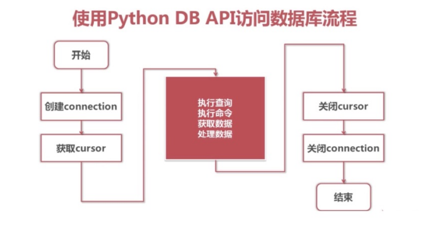

## python操作mysql步骤


## pymysql的使⽤

```python
from pymysql import connect
```

1.Connection 对象

⽤于建⽴与数据库的连接 调⽤pymysql模块中的connect()⽅法

```
conn=connect(参数列表)
* 参数host：连接的mysql主机，如果本机是'localhost'
* 参数port：连接的mysql主机的端⼝，默认是3306
* 参数database：数据库的名称
* 参数user：连接的⽤户名
* 参数password：连接的密码
* 参数charset：通信采⽤的编码⽅式，推荐使⽤utf8
```

- 关闭连接 conn.close()
- 提交数据 conn.commit()
- 撤销数据 conn.rollback()
- 通过连接获取游标 cur = conn.cursor() 返回Cursor对象，⽤于执⾏sql语句并获得结果

2.Cursor游标对象

> 使⽤游标执⾏SQL语句  execute(operation [, parameters ]) 

```python
conn=connect("127.0.0.1")
# 调⽤Connection对象的cursor()⽅法
cur =conn.cursor()
# 关闭游标
cur.close()
# 获取结果集中的⼀条
cur.fetchone() # 返回⼀个元组 形如 (1,'妲⼰',18)
# 获取结果集中的所有
cur.fetchall()
# 执⾏查询时，获取结果集的所有⾏，⼀⾏构成⼀个元组，再将这些元组装⼊⼀
# 个元组返回 形如((1,'公孙离',20),(2,'妲⼰',18))
```

## 数据查询

```python
import pymysql
# 创建和数据库服务器的连接 服务器地址 端⼝ ⽤户名 密码 数据库名 通信使⽤字符和数据库字符集⼀致
conn = pymysql.connect(host='localhost', port=3306, user='root', password='mysql',database='test')
# 获取游标
cursor = conn.cursor()
# 执⾏ＳＱＬ语句 返回值就是ＳＱＬ语句在执⾏过程中影响的⾏数
sql = """select * from hero;"""
row_count = cursor.execute(sql)
print("ＳＱＬ语句执⾏影响的⾏数%d" % row_count)
# 取出结果集中⼀⾏ 返回的结果是⼀⾏ (1, '妲⼰', 2)
# print(cursor.fetchone())
# 取出结果集中的所有数据 返回 ((⼀⾏数据),(),())
# ((1, '妲⼰', 2), (2, '李⽩', 1), (3, '程咬⾦', 3), (4, '亚瑟', 5), (5, '荆轲', 99))
for line in cursor.fetchall():
    print(line)
# 关闭游标
cursor.close()
# 关闭连接
conn.close()
```

## 增删改

```python
import pymysql
conn = pymysql.connect(host='127.0.0.1',port=3306,user='root',password='mysql',db='python_test_1')
# 通过连接获取游标
cursor = conn.cursor()
# sql = "delete from hero where id = 5;"
# sql = insert into hero (name) values ('⻄部⼤坏蛋孙悟空');
sql = "update hero set kongfuid=444 where id = 4;"
row_count = cursor.execute(sql)
print("ＳＱＬ语句执⾏影响的⾏数%d" % row_count)
# 提交数据到数据库
# conn.commit()
# 回滚数据到什么都不做的状态 即撤销刚刚的修改
conn.rollback()
# 关闭游标和连接
cursor.close()
conn.close()
```

## 防止sql注入

sql语句的参数化, 将SQL语句的所有数据参数存在⼀个列表中传递给execute函数的第⼆个参数

* 此处不同于python的字符串格式化，必须全部使⽤%s占位
* 所有参数所需占位符外不需要加引号

```python
from pymysql import connect
def main():
    find_name = input("请输⼊物品名称：")
    # 创建Connection连接
    conn = connect(host='localhost',port=3306,user='root',password='mysql',database='jing_dong')
    cs1 = conn.cursor() # 获得Cursor对象
    # # ⾮安全的⽅式
    # # 输⼊ " or 1=1 or " (双引号也要输⼊)
    # sql = 'select * from goods where name="%s"' % find_name
    # print("""sql===>%s<====""" % sql)
    # # 执⾏select语句，并返回受影响的⾏数：查询所有数据
    # count = cs1.execute(sql)
    # 安全的⽅式
    # 构造参数列表
    params = [find_name]
    # 执⾏select语句，并返回受影响的⾏数：查询所有数据
    count = cs1.execute('select * from goods where name=%s', params)
    # 注意：
    # 如果要是有多个参数，需要进⾏参数化
    # 那么params = [数值1, 数值2....]，此时sql语句中有多个%s即可
    # 打印受影响的⾏数
    print(count)
    # 获取查询的结果
    # result = cs1.fetchone()
    result = cs1.fetchall()
    # 打印查询的结果
    print(result)
    # 关闭Cursor对象
    cs1.close()
    # 关闭Connection对象
    conn.close()
if __name__ == '__main__':
    main()
```

## 视图
视图就是⼀个能够把复杂SQL语句的功能封装起来的⼀个虚表,所以我们在创建视图的时候，主要的⼯作就落在创建这条SQL查询语句上。
视图是对若⼲张基本表的引⽤，⼀张虚表，只查询语句执⾏结果的字段类型和约束，不存储具体的数据（基本表数据发⽣了改变，视图也会跟着改变）；


1.定义视图

建议以v_开头

```sql
create view 视图名称 as select语句;
-- 同基本表的表结构⼀直 视图在保存基本表字段信息的时候字段不能重复
-- 因此需要对select结果集中的字段进⾏重命名
create view v_goods_info
as
    select goods.name gname,goods_cates.name gcname ,goods_brands.name gbname
    from goods
        join goods_cates on goods.cate_id = goods_cates.id
        join goods_brands on goods.brand_id = goods_brands.id;
```

2. 查看视图

查看表会将所有的视图也列出来

```sql
show tables;
```

3.使⽤视图

视图的⽤途就是查询
```sql
select * from v_goods_info;
select * from v_goods_info where name='xxx'
```

4.删除视图

```sql
drop view 视图名称;
drop view v_stu_sco;
```

**总结：**
- 视图封装了对多张基本表的复杂操作，简化⽤户操作
- 视图只是⼀个虚表,并不存储任何基本表的表数据,当⽤户使⽤视图的时候 视图会从基本表中取出
- 通过视图可以对⽤户展示指定字段从⽽屏蔽其他字段数据，更加安全

## 事务

1.特性ACID：
- 原⼦性(Atomicity)
  > ⼀个事务必须被视为⼀个不可分割的最⼩⼯作单元，整个事务中的所有操作要么全部提交成功，要么全部失败回滚，对于⼀个事务来说，不可能只执⾏其中的⼀部分操作，这就是事务的原⼦性
- ⼀致性(Consistency)
  > 数据库总是从⼀个⼀致性的状态转换到另⼀个⼀致性的状态。
- 隔离性(Isolation)
  > 通常来说，⼀个事务所做的修改在最终提交以前，对其他事务是不可⻅的。
- 持久性(Durability)
  > ⼀旦事务提交，则其所做的修改会永久保存到数据库。
  
数据库存储引擎是数据库底层软件组织，不同的存储引擎提供不同的存储机制、索引技巧、锁定⽔平等功能，使⽤不同的存储引擎，还可以 获得特定的功能。

```sql
show engines; 
-- 查看数据库服务器⽀持的表存储引擎
```
**注意：**
表的引擎类型必须是innodb类型才可以使⽤事务，这是ubuntu 中 mysql表的默认引擎

2. 开启事务

```sql
begin;
-- 或者
start transaction;
```

3.提交事务

```sql
commit;
```

4.回滚事务

```sql
rollback;
```

5.验证事务
```sql
-- 查询商品分类信息
select * from goods_cates;
-- 开启事务，插⼊数据
begin;
insert into goods_cates(name) values('⼩霸王游戏机');
-- 查询数据，此时有新增的数据
select * from goods_cates;
-- 完成提交
commit;
--再查询，有数据

-- commit换成rollback即回滚
```

6.关于事务几个问题
- 修改数据的命令会⾃动的触发事务，包括insert、update、delete
- 在mysql命令⾏中会⾃动提交事务，所以当我insert语句执⾏完成后没有commit数据库也看到了提交的数据。
- 当我们不需要mysql命令⾏⾃动提交的时候 键⼊ set autocommit=0 即可
- SQL语句中有⼿动开启事务的原因是：可以进⾏多次数据的修改，如果成功⼀起成功，否则⼀起会滚到之前的数据
- 不可撤销的操作（隐式提交）: 除了对表数据insert/update/delete语句之外的绝⼤多数语句都是不能撤销的，⽐如数据库、表结构的操作，⼤家可以动⼿验证。

