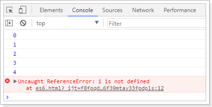

# ES6 语法指南

后端项目搭建完毕，接下来就是前端页面了。不过在这之前需要一些准备工作。我们需要学习ES6的语法标准。

什么是ES6？就是ECMAScript第6版标准。

## 什么是ECMAScript？

来看下前端的发展历程：

> web1.0时代：

- 最初的网页以HTML为主，是纯静态的网页。网页是只读的，信息流只能从服务的到客户端单向流通。**开发人员也只关心页面的样式和内容**即可。

> web2.0时代：

- 1995年，网景工程师Brendan Eich 花了10天时间设计了JavaScript语言。
- 1996年，微软发布了JScript，其实是JavaScript的逆向工程实现。
- 1997年，为了统一各种不同script脚本语言，ECMA（欧洲计算机制造商协会）以JavaScript为基础，制定了`ECMAscript`标准规范。JavaScript和JScript都是`ECMAScript`的标准实现者，随后各大浏览器厂商纷纷实现了`ECMAScript`标准。

所以，ECMAScript是浏览器脚本语言的规范，而各种我们熟知的js语言，如JavaScript则是规范的具体实现。

## ECMAScript的快速发展

而后，ECMAScript就进入了快速发展期。

- 1998年6月，ECMAScript 2.0 发布。

- 1999年12月，ECMAScript 3.0 发布。这时，ECMAScript 规范本身也相对比较完善和稳定了，但是接下来的事情，就比较悲剧了。

- 2007年10月。。。。ECMAScript 4.0 草案发布。

  这次的新规范，历时颇久，规范的新内容也有了很多争议。在制定ES4的时候，是分成了两个工作组同时工作的。

  - 一边是以 Adobe, Mozilla, Opera 和 Google为主的 ECMAScript 4 工作组。
  - 一边是以 Microsoft 和 Yahoo 为主的 ECMAScript 3.1 工作组。

  ECMAScript 4 的很多主张比较激进，改动较大。而 ECMAScript 3.1 则主张小幅更新。最终经过 TC39 的会议，决定将一部分不那么激进的改动保留发布为 ECMAScript 3.1，而ES4的内容，则延续到了后来的ECMAScript5和6版本中

- 2009年12月，ECMAScript 5 发布。

- 2011年6月，ECMAScript 5.1 发布。

- 2015年6月，ECMAScript 6，也就是 ECMAScript 2015 发布了。 并且从 ECMAScript 6 开始，开始采用年号来做版本。即 ECMAScript 2015，就是ECMAScript6。 


## ES5和6的一些新特性

我们这里只把一些常用的进行学习，更详细的大家参考：[阮一峰的ES6教程](http://es6.ruanyifeng.com/?search=reduce&x=0&y=0#README)

### let 和 const 命令

> var

之前，js定义变量只有一个关键字：`var`

`var`有一个问题，就是定义的变量有时会莫名奇妙的成为全局变量。

例如这样的一段代码：

```js
for(var i = 0; i < 5; i++){
    console.log(i);
}
console.log("循环外：" + i)
```

你猜下打印的结果是什么？

 


> let

`let`所声明的变量，只在`let`命令所在的代码块内有效。

我们把刚才的`var`改成`let`试试：

```js
for(let i = 0; i < 5; i++){
    console.log(i);
}
console.log("循环外：" + i)
```

结果：

 

> const

`const`声明的变量是常量，不能被修改

 


### 字符串扩展

> 新的API

ES6为字符串扩展了几个新的API：

- `includes()`：返回布尔值，表示是否找到了参数字符串。
- `startsWith()`：返回布尔值，表示参数字符串是否在原字符串的头部。
- `endsWith()`：返回布尔值，表示参数字符串是否在原字符串的尾部。

实验一下：

 


> 字符串模板

ES6中提供了`来作为字符串模板标记。我们可以这么玩：

 

在两个`之间的部分都会被作为字符串的值，不管你任意换行，甚至加入js脚本

按键位置在键盘是1的左侧，tab的上侧，esc的正下方

### 解构表达式

> 数组解构

比如有一个数组：

```js
let arr = [1,2,3]
```

我想获取其中的值，只能通过角标。ES6可以这样：

```js
const [x,y,z] = arr;// x，y，z将与arr中的每个位置对应来取值
// 然后打印
console.log(x,y,z);
```

结果：

 


> 对象解构

例如有个person对象：

```js
const person = {
    name:"jack",
    age:21,
    language: ['java','js','css']
}
```

我们可以这么做：

```js
// 解构表达式获取值
const {name,age,language} = person;
// 打印
console.log(name);
console.log(age);
console.log(language);
```

结果：

 


如过想要用其它变量接收，需要额外指定别名：

 

- `{name:n}`：name是person中的属性名，冒号后面的n是解构后要赋值给的变量。


### 函数优化

> 函数参数默认值

在ES6以前，我们无法给一个函数参数设置默认值，只能采用变通写法：

```js
    function add(a , b) {
        // 判断b是否为空，为空就给默认值1
        b = b || 1;
        return a + b;
    }
    // 传一个参数
    console.log(add(10));
```

现在可以这么写：

```js
function add(a , b = 1) {
    return a + b;
}
// 传一个参数
console.log(add(10));
```


> 箭头函数

ES6中定义函数的简写方式：

一个参数时：

```js
let print = function (obj) {
    console.log(obj);
}
// 简写为：
let print2 = obj => console.log(obj);
```

多个参数：

```js
// 两个参数的情况：
let sum = function (a , b) {
    return a + b;
}
// 简写为：
let sum2 = (a,b) => a+b;
```

代码不止一行，可以用`{}`括起来

```js
let sum3 = (a,b) => {
    return a + b;
}
```


> 对象的函数属性简写

比如一个Person对象，里面有eat方法：

```js
let person = {
    name: "jack",
    // 以前：
    eat: function (food) {
        console.log(this.name + "在吃" + food);
    },
    // 箭头函数版：
    eat2: food => console.log(person.name + "在吃" + food),// 这里拿不到this
    // 简写版：
    eat3(food){
        console.log(this.name + "在吃" + food);
    }
}
```


> 箭头函数结合解构表达式

比如有一个函数：

```js
const person = {
    name:"jack",
    age:21,
    language: ['java','js','css']
}

function hello(person) {
    console.log("hello," + person.name)
}
```

如果用箭头函数和解构表达式也可以实现同样的打印名称的功能，***PS:调用hi方法时传入的 对象 一定要有name属性**

```js
let hi = ({name}) =>  console.log("hello," + name);
```

### map和reduce

**数组**中新增了map和reduce方法。

> map


`map()`：接收一个函数，将原数组中的所有元素用这个函数处理后放入新数组返回。

举例：有一个字符串数组，我们希望转为int数组

```js
let arr = ['1','20','-5','3'];
console.log(arr)

arr = arr.map(s => parseInt(s));

console.log(arr)
```

  


> reduce

`reduce()`：接收一个函数（必须）和一个初始值（可选），该函数接收两个参数：

- 第一个参数是上一次reduce处理的结果
- 第二个参数是数组中要处理的下一个元素

`reduce()`会从左到右依次把数组中的元素用reduce处理，并把处理的结果作为下次reduce的第一个参数。如果是第一次，会把前两个元素作为计算参数，或者把用户指定的初始值作为起始参数

举例：

```js
const arr = [1,20,-5,3];
```

没有初始值：

 

指定初始值：

 

### promise

所谓Promise，简单说就是一个容器，里面保存着某个未来才会结束的事件（通常是一个异步操作）的结果。从语法上说，Promise 是一个对象，从它可以获取异步操作的消息。Promise 提供统一的 API，各种异步操作都可以用同样的方法进行处理。

感觉跟java的Future类很像啊，有木有！

我们可以通过Promise的构造函数来创建Promise对象，并在内部封装一个异步执行的结果。

语法：

```js
const promise = new Promise(function(resolve, reject) {
  // ... 执行异步操作

  if (/* 异步操作成功 */){
    resolve(value);// 调用resolve，代表Promise将返回成功的结果
  } else {
    reject(error);// 调用reject，代表Promise会返回失败结果
  }
});
```

这样，在promise中就封装了一段异步执行的结果。


如果我们想要等待异步执行完成，做一些事情，我们可以通过promise的then方法来实现,语法：

```js
promise.then(function(value){
    // 异步执行成功后的回调
});
```

如果想要处理promise异步执行失败的事件，还可以跟上catch：

```js
promise.then(function(value){
    // 异步执行成功后的回调
}).catch(function(error){
    // 异步执行失败后的回调
})
```

示例：

```js
const p = new Promise(function (resolve, reject) {
    // 这里我们用定时任务模拟异步
    setTimeout(() => {
        const num = Math.random();
        // 随机返回成功或失败
        if (num < 0.5) {
            resolve("成功！num:" + num)
        } else {
            reject("出错了！num:" + num)
        }
    }, 300)
})

// 调用promise
p.then(function (msg) {
    console.log(msg);
}).catch(function (msg) {
    console.log(msg);
})
```

结果：

 

 

### set和map（了解）

ES6提供了Set和Map的数据结构。

Set，本质与数组类似。不同在于Set中只能保存不同元素，如果元素相同会被忽略。跟java很像吧。

构造函数：

```js
// Set构造函数可以接收一个数组或空
let set = new Set();
set.add(1);// [1]
// 接收数组
let set2 = new Set([2,3,4,5,5]);// 得到[2,3,4,5]
```

普通方法：

```js
set.add(1);// 添加
set.clear();// 清空
set.delete(2);// 删除指定元素
set.has(2); // 判断是否存在
set.keys();// 返回所有key
set.values();// 返回所有值
set.entries();// 返回键值对集合
// 因为set没有键值对，所有其keys、values、entries方法返回值一样的。
set.size; // 元素个数。是属性，不是方法。
```


map，本质是与Object类似的结构。不同在于，Object强制规定key只能是字符串。而Map结构的key可以是任意对象。即：

- object是 <string,object>集合
- map是<object,object>集合

构造函数：

```js
// map接收一个数组，数组中的元素是键值对数组
const map = new Map([
    ['key1','value1'],
    ['key2','value2'],
])
// 或者接收一个set
const set = new Set([
    ['key1','value1'],
    ['key2','value2'],
])
const map2 = new Map(set)
// 或者其它map
const map3 = new Map(map);
```

方法：

 

### 模块化

#### 什么是模块化

模块化就是把代码进行拆分，方便重复利用。类似java中的导包：要使用一个包，必须先导包。

而JS中没有包的概念，换来的是 模块。

模块功能主要由两个命令构成：`export`和`import`。

- `export`命令用于规定模块的对外接口，
- `import`命令用于导入其他模块提供的功能。


#### export

比如我定义一个js文件:hello.js，里面有一个对象：

```js
const util = {
    sum(a,b){
        return a + b;
    }
}
```

我可以使用export将这个对象声明：

```js
const util = {
    sum(a,b){
        return a + b;
    }
}
export util;
```

当然，也可以简写为：

```js
export const util = {
    sum(a,b){
        return a + b;
    }
}
```

`export`不仅可以声明对象，一切JS变量都可以声明。比如：基本类型变量、函数、数组、对象。

当要声明多个值时，还可以简写。比如我有一个文件：user.js：

```js
var name = "jack"
var age = 21
export {name,age}
```


> 省略名称

上面的导出代码中，都明确指定了导出的变量名，这样其它人在导入使用时就必须准确写出变量名，否则就会出错。

因此js提供了`default`关键字，可以对导出的变量名进行省略

例如：

```js
// 无需声明对象的名字
export default {
	sum(a,b){
        return a + b;
    }
}
```

这样，当使用者导入时，可以任意起名字


#### import

使用`export`命令定义了模块的对外接口以后，其他 JS 文件就可以通过`import`命令加载这个模块。

例如我要使用上面导出的util：

```js
// 导入util
import util from 'hello.js'
// 调用util中的属性
util.sum(1,2)
```


要批量导入前面导出的name和age： 

```js
import {name, age} from 'user.js'

console.log(name + " , 今年"+ age +"岁了")
```


但是上面的代码暂时无法测试，因为浏览器目前还不支持ES6 的导入和导出功能。除非借助于工具，把ES6 的语法进行编译降级到ES5，比如`Babel-cli`工具

 我们暂时不做测试，大家了解即可。


### 对象扩展

ES6给Object拓展了许多新的方法，如：

- keys(obj)：获取对象的所有key形成的数组
- values(obj)：获取对象的所有value形成的数组
- entries(obj)：获取对象的所有key和value形成的二维数组。格式：`[[k1,v1],[k2,v2],...]`
- assian(dest, ...src) ：将多个src对象的值 拷贝到 dest中（浅拷贝）。

 


### 数组扩展

ES6给数组新增了许多方法：

- find(callback)：把数组中的元素逐个传递给函数callback执行，如果返回true，则返回该元素
- findIndex(callback)：与find类似，不过返回的是品牌到的元素的索引
- includes（callback）：与find类似，如果匹配到元素，则返回true，代表找到了。

