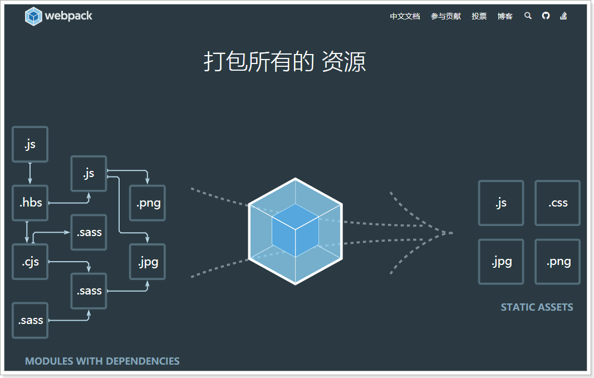
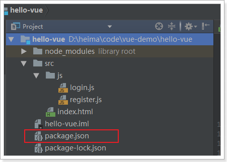
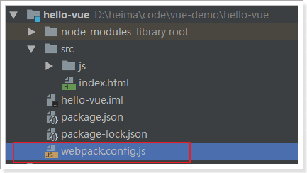
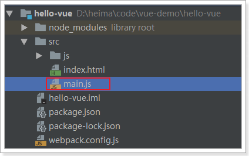
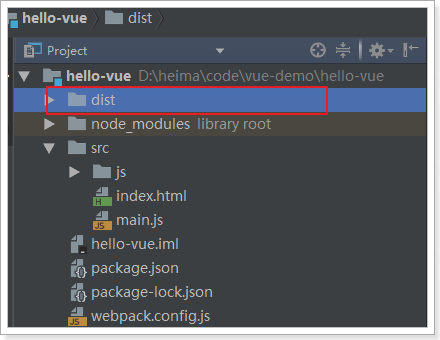
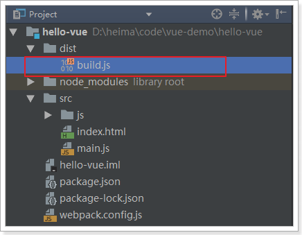
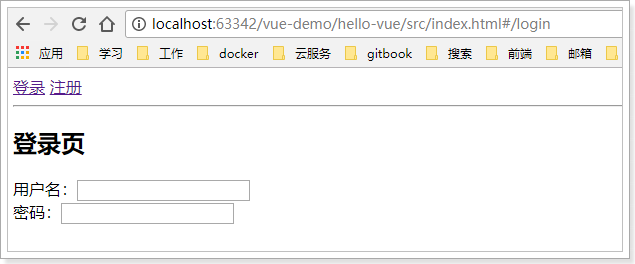
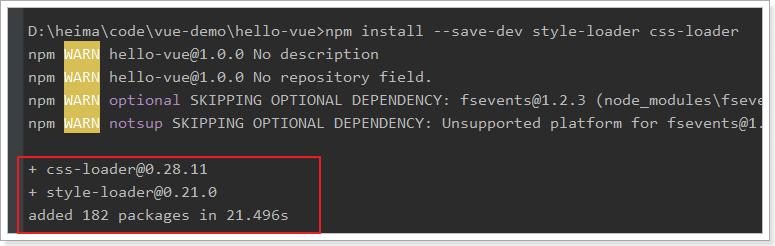
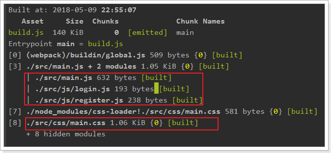
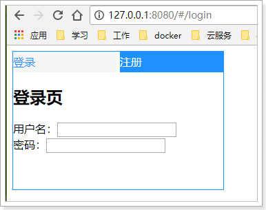

# webpack

## 认识webpack

Webpack 是一个前端资源的打包工具，它可以将js、image、css等资源当成一个模块进行打包。

中文官方网站：https://www.webpackjs.com/



官网给出的解释：


为什么需要打包？

- 将许多碎小文件打包成一个整体，减少单页面内的衍生请求次数，提高网站效率。
- 将ES6的高级语法进行转换编译，以**兼容老版本的浏览器**。
- 将代码打包的同时进行**混淆**，提高代码的安全性。

## 四个核心概念

学习Webpack，你需要先理解四个**核心概念**：

- 入口(entry) 

  webpack打包的启点，可以有一个或多个，一般是js文件。webpack会从启点文件开始，寻找启点直接或间接依赖的其它所有的依赖，包括JS、CSS、图片资源等，作为将来打包的原始数据

- 输出(output)

  出口一般包含两个属性：path和filename。用来告诉webpack打包的目标文件夹，以及文件的名称。目的地也可以有多个。

- 加载器（loader）

  webpack本身只识别Js文件，如果要加载非JS文件，必须指定一些额外的加载器（loader），例如css-loader。然后将这些文件转为webpack能处理的有效模块，最后利用webpack的打包能力去处理。

- 插件(plugins)

  插件可以扩展webpack的功能，让webpack不仅仅是完成打包，甚至各种更复杂的功能，或者是对打包功能进行优化、压缩，提高效率。


## 安装

webpack支持全局安装和本地安装，官方推荐是本地安装，我们按照官方的来。

输入命令：

```
npm install webpack webpack-cli --save-dev
```

 

此时，我们注意下项目中文件夹下，会有一个package.json文件。（其实早就有了）

 

打开文件，可以看到我们之前用npm安装过的文件都会出现在这里：

 


## 编写webpack配置

接下来，我们编写一个webpack的配置，来指定一些打包的配置项。配置文件的名称，默认就是webpack.config.js，我们放到hello-vue的根目录：

 

配置文件中就是要指定上面说的四个核心概念，入口、出口、加载器、插件。

不过，加载器和插件是可选的。我们先编写入口和出口


### 入口entry

webpack打包的启点，可以有一个或多个，一般是js文件。现在思考一下我们有没有一个入口？貌似没有，我们所有的东西都集中在index.html，不是一个js，那怎么办？

我们新建一个js，把index.html中的部分内容进行集中，然后在index.html中引用这个js不就OK了！

 

然后把原来index.html中的js代码全部移动到main.js中

```js
// 使用es6的语法导入js模块import Vue from '../node_modules/vue/dist/vue';import VueRouter from '../node_modules/vue-router/dist/vue-router'import loginForm from './js/login'import registerForm from './js/register'Vue.use(VueRouter)// 创建VueRouter对象const router = new VueRouter({    routes:[ // 编写多个路由规则        {            path:"/login", // 请求路径            component:loginForm // 组件名称        },        {            path:"/register",            component:registerForm        },    ]})var vm = new Vue({    el:"#app",    components:{// 引用登录和注册组件        loginForm,        registerForm    },    router})
```

- 原来的index.html中引入了很多其它js，在这里我们使用es6的import语法进行导入。

  注意，要使用import，就需要在login.js和register.js中添加export导出语句：

  ```js
  const loginForm = {    template:`    <div>     <h2>登录页</h2>     用户名：<input type="text"><br/>    密码：<input type="password"><br/>    </div>    `}export default loginForm;
  ```

  register.js:

  ```js
  const registerForm = {    template:`    <div>    <h2>注册页</h2>     用户名：<input type="text"><br/>    密码：<input type="password"><br/>    确认密码：<input type="password"><br/>    </div>    `}export default registerForm;
  ```

- **vue-router使用模块话加载后，必须增加一句：Vue.use(VueRouter)**

这样，main.js就成了我们整个配置的入口了。


我们在webpack.config.js中添加以下内容：

```js
module.exports={    entry:'./src/main.js',  //指定打包的入口文件}
```

### 出口output

出口，就是输出的目的地。一般我们会用一个dist目录，作为打包输出的文件夹：

 

然后，编写webpack.config.js，添加出口配置：

```js
module.exports={    entry:'./src/main.js',  //指定打包的入口文件    output:{        // path: 输出的目录，__dirname是相对于webpack.config.js配置文件的绝对路径        path : __dirname+'/dist',          filename:'build.js'	 //输出的js文件名    }}
```


## 执行打包

在控制台输入以下命令：

```
npx webpack --config webpack.config.js
```


随后，查看dist目录：

 

尝试打开build.js，你根本看不懂：


所有的js合并为1个，并且对变量名进行了随机打乱，这样就起到了 压缩、混淆的作用。


## 测试运行

在index.html中引入刚刚生成的build.js文件，

```html
<!DOCTYPE html><html lang="en"><head>    <meta charset="UTF-8">    <title>Title</title></head><body>    <div id="app">        <!--router-link来指定跳转的路径-->        <span><router-link to="/login">登录</router-link></span>        <span><router-link to="/register">注册</router-link></span>        <hr/>        <div>            <!--vue-router的锚点-->            <router-view></router-view>        </div>    </div>    <script src="../dist/build.js"></script></body></html>
```


然后运行：

 


## 打包CSS

### 编写css文件

我们来编写一段CSS代码，对index的样式做一些美化：

 

内容：

```css
#app a{    display: inline-block;    width: 150px;    line-height: 30px;    background-color: dodgerblue;    color: white;    font-size: 16px;    text-decoration: none;}#app a:hover{    background-color: whitesmoke;    color: dodgerblue;}#app div{    width: 300px;    height: 150px;}#app{    width: 305px;    border: 1px solid dodgerblue;}
```

### 安装加载器

前面说过，webpack默认只支持js加载。要加载CSS文件，必须安装加载器：

命令：

```
npm install style-loader css-loader --save-dev
```




此时，在package.json中能看到新安装的：

 


### 在main.js引入css文件

因为入口在main.js，因此css文件也要在这里引入。依然使用ES6 的模块语法：

```js
import './css/main.css'
```

### 在webpack.config.js添加加载器

```js
module.exports = {    entry: './src/main.js',  //指定打包的入口文件    output: {        path: __dirname + '/dist', // 注意：__dirname表示webpack.config.js所在目录的绝对路径        filename: 'build.js'  //输出文件    },    module: {        rules: [            {                test: /\.css$/, // 通过正则表达式匹配所有以.css后缀的文件                use: [ // 要使用的加载器，这两个顺序一定不要乱                    'style-loader',                    'css-loader'                ]            }        ]    }}
```

### 重新打包

再次输入打包指令：`npx webpack --config webpack.config.js`

 

效果：

 


## script脚本

我们每次使用npm安装，都会在package.json中留下痕迹，事实上，package.json中不仅可以记录安装的内容，还可编写脚本，让我们运行命令更加快捷。

我们可以把webpack的命令编入其中：

 

以后，如果要打包，就可以直接输入：`npm run build`即可。

- `npm run` ：执行npm脚本，后面跟的是脚本的名称`build`

 

## 打包HTML

之前的打包过程中，除了HTML文件外的其它文件都被打包了，当在线上部署时，我们还得自己复制HTML到dist，然后手动添加生成的js到HTML中，这非常不友好。

webpack中的一个插件：html-webpack-plugin，可以解决这个问题。

1）安装插件：

```
npm install html-webpack-plugin --save-dev 
```


需要在webpack.config.js中添加插件：

**一定要在首行声明HtmlWebpackPlugin的引用**

```js
const HtmlWebpackPlugin = require('html-webpack-plugin');module.exports = {    entry: './src/main.js',  //指定打包的入口文件    output: {        path: __dirname + '/dist',  // 注意：__dirname表示webpack.config.js所在目录的绝对路径        filename: 'build.js'		   //输出文件    },    module: {        rules: [            {                test: /\.css$/, // 通过正则表达式匹配所有以.css后缀的文件                use: [ // 要使用的加载器，这两个顺序一定不要乱                    'style-loader',                    'css-loader'                ]            }        ]    },    plugins:[        new HtmlWebpackPlugin({            title: '首页',  //生成的页面标题<head><title>首页</title></head>            filename: 'index.html', // dist目录下生成的文件名            template: './src/index.html' // 我们原来的index.html，作为模板        })    ]}
```


2）将原来HTML中的引入js代码删除：

  

3）再次打包：`npm run build`


4）查看dist目录：

 

打开index.html，发现已经自动添加了当前目录下的build.js

```html
<!DOCTYPE html><html lang="en"><head>    <meta charset="UTF-8">    <title>Title</title></head><body>    <div id="app">        <!--router-link来指定跳转的路径-->        <span><router-link to="/login">登录</router-link></span>        <span><router-link to="/register">注册</router-link></span>        <div>            <!--vue-router的锚点-->            <router-view></router-view>        </div>    </div><script type="text/javascript" src="build.js"></script></body></html>
```


## 热更新的web服务

刚才的案例中，每次修改任何js或css内容，都必须重新打包，非常麻烦。


webpack给我们提供了一个插件，可以帮我们运行一个web服务，加载页面内容，并且修改js后不需要重新加载就能看到最新结果：

1）安装插件：

```
npm install webpack-dev-server --save-dev
```

2）添加启动脚本

在package.json中配置script

```js
  "scripts": {    "dev": "webpack-dev-server --inline --hot --open --port 8080 --host 127.0.0.1"  },
```

--inline：自动刷新

--hot：热加载

--port：指定端口

--open：自动在默认浏览器打开

--host：可以指定服务器的 ip，不指定则为127.0.0.1


3）运行脚本：

```
npm run dev
```


 

4）效果：

 